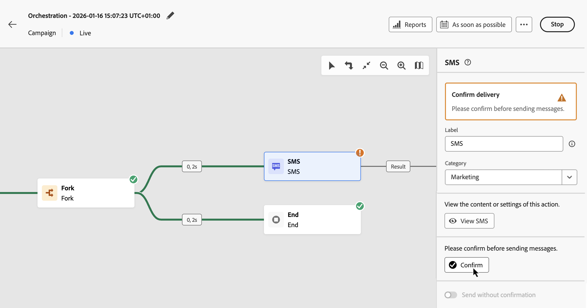
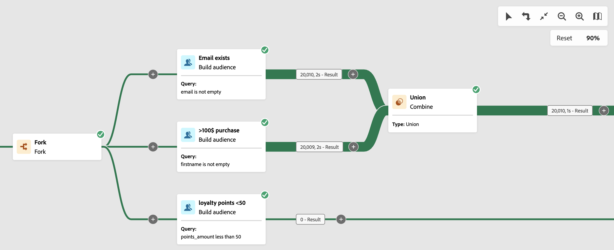
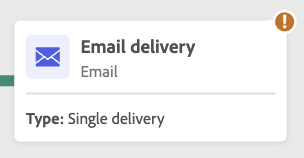

# Iniciar y monitorizar campañas orquestadas {#start-monitor}

>[!CONTEXTUALHELP]
>id="ajo_campaign_publication"
>title="Publicación de la campaña orquestada"
>abstract="Para iniciar su campaña, debe publicarla. Asegúrese de que se borran todos los errores antes de la publicación."

Una vez creada la campaña orquestada y diseñadas las tareas que se realizan en el lienzo, puede publicarla y monitorizar cómo se ejecuta. También puede ejecutar la campaña en modo de prueba para comprobar su ejecución y el resultado de las diferentes actividades.

## Resumen del ciclo vital de Campaign {#lifecycle}

Las campañas organizadas se mueven a través de un conjunto definido de estados. Las fases clave del flujo de trabajo de publicación son:

| Estado | Lo que significa |
|---|---|
| **Borrador** | La campaña se está creando y probando; aún no está activa. |
| **Activo** | La campaña se ha publicado y se está ejecutando. |
| **Cerrado** | La campaña recurrente está cerrada a nuevas entradas, pero los perfiles activos continúan hasta que se completan todas las actividades. |
| **Completado** | La ejecución de la campaña ha finalizado. |

>[!NOTE]
>
>Para todos los estados (incluidos Programado, Detenido, Archivado) y las acciones disponibles en cada fase, consulte [Explicación de los estados de campaña](../campaigns/manage-campaigns.md#statuses).

## Prueba de la campaña antes de publicarla {#test}

[!DNL Journey Optimizer] le permite probar campañas orquestadas antes de lanzarse. Cuando se crea una campaña, entra al estado **Borrador** de forma predeterminada. En este estado, puede ejecutar la campaña manualmente para probar el flujo.

>[!IMPORTANT]
>
>Todas las actividades del lienzo se ejecutan excepto las actividades de **[!UICONTROL Guardar audiencia]** y las actividades del canal. No hay ningún impacto funcional en los datos o en el público.

Para probar una campaña orquestada, abra la campaña y seleccione **[!UICONTROL Start]**. Cada actividad de la campaña se ejecuta secuencialmente hasta que se llega al final del lienzo.

{zoomable="yes"}

Para **campañas orquestadas desencadenadas**, el sistema espera una llamada de API para iniciar la campaña. Debe enviar la señal para continuar con la prueba. [Aprenda a probar campañas activadas por señales](trigger-orchestrated-campaign.md#complete-and-test).

Durante la prueba, puede controlar la ejecución de la campaña mediante la barra de acciones del lienzo. A partir de ahí, puede realizar lo siguiente:

* **Detenga** la ejecución en cualquier momento.
* **Inicie** la ejecución de nuevo.
* **Reiniciar** la ejecución para restablecer y volver a ejecutar el flujo de trabajo en una sola acción. Esto resulta especialmente útil cuando desea volver a probar rápidamente el flujo de campaña después de realizar modificaciones.
* **Reanudar** la ejecución si se había pausado anteriormente.

El icono **[!UICONTROL Alertas]** / **[!UICONTROL Advertencia]** de la barra de herramientas de lienzo le notifica de los problemas, incluidas las advertencias que pueden aparecer de forma proactiva antes de la ejecución y los errores que se producen durante o después de la ejecución.

{zoomable="yes"}

También puede identificar rápidamente las actividades fallidas mediante los [indicadores visuales de estado](#activities) que se muestran directamente en cada actividad. Para obtener información detallada sobre la resolución de problemas, abra los [registros de la campaña](#logs-tasks), que proporcionan información detallada sobre el error y su contexto.

Si ha agregado actividades de canal en el lienzo, puede obtener una vista previa y probar el contenido de sus mensajes con el botón **[!UICONTROL Simular contenido]**. [Aprenda a trabajar con actividades de canal y a simular contenido](activities/channels.md#simulate-content-test-profiles).

>[!TIP]
>
>Antes de hacer clic en **[!UICONTROL Publicar]**, confirme lo siguiente:
>* La campaña se ejecutó correctamente en modo de prueba sin errores en [los registros](#logs-tasks).
>* Se obtuvo una vista previa del contenido del mensaje con **[!UICONTROL Simular contenido]**.
>* La programación [se ha configurado](create-orchestrated-campaign.md#schedule) si se trata de una campaña programada.
>* Ha revisado el comportamiento [confirmación de envío](#confirm-sending); para las campañas no recurrentes, no se envía ningún mensaje hasta que apruebe explícitamente el envío después de la publicación.

## Publicación de la campaña {#publish}

Una vez que la campaña se haya probado y esté lista, haga clic en **[!UICONTROL Publicar]** para activarla.

{zoomable="yes"}

>[!NOTE]
>
>Si el botón **[!UICONTROL Publicar]** está deshabilitado (atenuado), acceda a los registros de la barra de acciones y compruebe los mensajes de error. Todos los errores deben corregirse antes de poder publicar una campaña.

El flujo visual se reinicia y los perfiles reales comienzan a fluir a través del recorrido en tiempo real.

Si la acción de publicación falla (por ejemplo, debido a la falta de contenido de mensaje), se le alerta y debe corregir el problema antes de volver a intentarlo. Si la publicación se realiza correctamente, la campaña comenzará a ejecutarse (inmediatamente o según lo programado), pasará del estado **Borrador** al estado **Activo** y pasará a ser de &quot;Solo lectura&quot;.

>[!IMPORTANT]
>
>En el caso de las campañas no recurrentes, la entrega de mensajes se pausa después de la publicación hasta que se confirme explícitamente el envío desde el panel de propiedades de la actividad del canal. La campaña se mostrará como **Activa**, pero no se enviarán mensajes hasta que se confirme. [Más información](#confirm-sending)

### Secuencia de ejecución de tiempo de publicación {#publication-sequence}

Al hacer clic en **[!UICONTROL Publicar]**, se produce internamente la siguiente secuencia:

1. **Activación del programador**: si la campaña tiene [configurada la programación](create-orchestrated-campaign.md#schedule), el programador inicia y déclencheur la ejecución a la hora definida.
1. **Guardar actividades de audiencia ejecutadas primero** — Cualquier actividad [Guardar audiencia](activities/save-audience.md) del flujo de trabajo se ejecuta antes que las actividades de mensajes. El shell de audiencia se crea en [Audience Portal](../audience/about-audiences.md#browse) y los perfiles cualificados comienzan a realizar la ingesta.
1. **Comienza la ejecución del mensaje** — [Las actividades de canal](activities/channels.md) comienzan a procesarse para la primera actividad de mensaje en el flujo de trabajo.
1. **Búsqueda de instantáneas de perfil**: los datos de perfil se resuelven con una instantánea tomada en el momento de la publicación, no con el perfil en tiempo real. Esto garantiza la coherencia en toda la ejecución.
1. **Evaluación del consentimiento**: para perfiles coincidentes, el consentimiento se respeta directamente desde el registro de perfil. El consentimiento no se vuelve a evaluar en el momento del envío. [Más información sobre la administración de consentimiento](../action/consent.md)
1. **Creación de perfiles sobre la marcha**: los perfiles que no coinciden con un registro existente se crean sobre la marcha durante la ejecución.
1. **Creación del registro de envío**: los eventos de envío se registran en el conjunto de datos [`ajo_message_feedback_event`](../data/datasets-query-examples.md#message-feedback-event-dataset), que es el origen principal para los registros de envío y la validación posterior al envío.

Para validar los resultados después de la ejecución, utilice las funciones de informes de Journey Optimizer. [Más información sobre los informes de campañas organizadas](reporting-campaigns.md)

## Revertir una campaña al borrador {#back-to-draft}

La función **[!UICONTROL Volver al borrador]** le permite cancelar la publicación y revertir una campaña orquestada al estado de borrador en situaciones específicas. Se ha diseñado como mecanismo de recuperación para solucionar problemas antes de que se envíe cualquier mensaje, manteniendo al mismo tiempo la integridad del ciclo de vida de la campaña.

Esta opción está disponible en dos situaciones:

* **Campañas programadas a la espera de ejecución**: cuando una campaña está programada para ejecutarse a una hora específica y esa hora aún no se ha alcanzado, puede volver a utilizarla como borrador para revisar y modificar la campaña antes de que comience a ejecutarse. Sin embargo, si la campaña es recurrente (como una campaña programada diaria) y ya se ha producido al menos una ejecución, la opción ya no está disponible. En ese caso, debería [duplicar la campaña](../campaigns/manage-campaigns.md#duplicate-a-campaign).

* **Campañas en directo con errores de ejecución**: cuando una campaña ha encontrado un error durante la ejecución y está en pausa, y aún no se han completado ejecuciones de campaña, puede volver a utilizarla como borrador para corregir el error y volver a publicar la campaña.

Para volver a cambiar una campaña al estado de borrador, abra la campaña organizada y haga clic en el botón **[!UICONTROL Volver al borrador]** de la barra de herramientas del lienzo de la campaña.

Se cancela la publicación de la campaña y se detiene el flujo de trabajo. La campaña vuelve al estado **Borrador**. Ahora puede corregir los problemas identificados, [probar la campaña](#test) y [publicarla](#publish) de nuevo cuando esté lista.

## Confirmar envío de mensajes {#confirm-sending}

De forma predeterminada, para las campañas orquestadas no recurrentes, la entrega de mensajes se pausa hasta que se apruebe explícitamente la entrega. Después de publicar la campaña, confirme la solicitud de envío desde el panel de propiedades de la actividad del canal. Hasta que se confirme, la actividad del canal permanece pendiente y no se envía ningún mensaje.

Antes de publicar, puede deshabilitar el envío de confirmación desde el panel de propiedades de actividad del canal. Para obtener más información, consulte [Confirmar el envío de mensajes](activities/channels.md#confirm-message-sending).

## Monitorizar la ejecución de campañas {#monitor}

### Monitorización del flujo visual {#flow}

Mientras se ejecuta (en modo de prueba o en directo), el flujo visual muestra cómo se mueven los perfiles por el recorrido en tiempo real. Se muestra el número de perfiles que pasan de una tarea a otra.

{zoomable="yes"}

Los datos que pasan de una actividad a otra se almacenan en una tabla de trabajo temporal. Estos datos se pueden mostrar para cada transición. Para inspeccionar los datos transferidos entre actividades:

1. Seleccione una transición.
1. En el panel de propiedades, haga clic en **[!UICONTROL Esquema de vista previa]** para ver el esquema de la tabla de trabajo. Seleccione **[!UICONTROL Vista previa de resultados]** para ver los datos transportados.

   {zoomable="yes"}

Ahora puede inspeccionar los datos pasados entre actividades para validar el flujo de campaña y confirmar que cada actividad está procesando los perfiles esperados.

### Indicadores de ejecución de la actividad {#activities}

Los indicadores visuales de estado le ayudan a comprender el rendimiento de cada actividad:

| Indicador visual | Descripción |
|-----|------------|
| {zoomable="yes"}{width="70%"} | La actividad se está ejecutando actualmente. |
| {zoomable="yes"}{width="70%"} | La actividad requiere su atención. Esto puede implicar confirmar el envío de una entrega o tomar las medidas necesarias. |
| {zoomable="yes"}{width="70%"} | La actividad ha encontrado un error. Para resolver el problema, abra los registros de la campaña orquestada para obtener más información. |
| {zoomable="yes"}{width="70%"} | La actividad se ha ejecutado correctamente. |

### Registros y tareas {#logs-tasks}

>[!CONTEXTUALHELP]
>id="ajo_campaign_logs"
>title="Registros y tareas"
>abstract="La pantalla **Registros y tareas** proporciona un historial de la ejecución de la campaña orquestada, registrando todas las acciones del usuario y los errores encontrados."

La monitorización de registros y tareas es un paso clave para analizar las campañas orquestadas y asegurarse de que se ejecutan correctamente. Se puede acceder a los registros y tareas desde el botón **[!UICONTROL Registros]**, que está disponible en los modos de prueba y en directo en la barra de herramientas del lienzo.

{zoomable="yes"}

La pantalla **[!UICONTROL Registros y tareas]** proporciona un historial de la ejecución de la campaña organizada, registrando todas las acciones del usuario y los errores encontrados.

{zoomable="yes"}

Hay dos tipos de información disponibles:

* La pestaña **[!UICONTROL Registro]** contiene el historial cronológico de todas las operaciones y errores.
* La pestaña **[!UICONTROL Tareas]** detalla la secuencia de ejecución paso a paso de las actividades.

En ambas pestañas, puede elegir las columnas mostradas y su orden, aplicar filtros y utilizar el campo de búsqueda para encontrar rápidamente la información deseada.

## Próximos pasos {#next}

Después de iniciar el lienzo de la campaña orquestada, puede utilizar las funcionalidades de creación de informes de Journey Optimizer para obtener perspectivas, como comprender el comportamiento de la audiencia y medir el rendimiento de cada paso en el recorrido del cliente. [Más información sobre los informes de campañas organizadas](../orchestrated/reporting-campaigns.md)

¿Tiene preguntas sobre campañas organizadas? Consulte las [Preguntas frecuentes sobre campañas orquestadas](orchestrated-campaigns-faq.md) para obtener respuestas a las preguntas más comunes de los profesionales.
