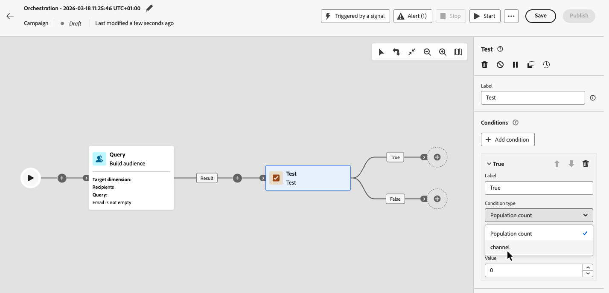

# Déclencheur Orquestación de campañas mediante una señal {#trigger-signal}

Puede almacenar en déclencheur una campaña orquestada enviándole una señal en lugar de ejecutarla en una programación. La señal se envía mediante una llamada de API desde un sistema o aplicación externos. Al utilizar una señal, puede pasar parámetros. A continuación, están disponibles en la campaña orquestada como variables de evento en el contexto de ejecución para su uso en objetivos, condiciones o expresiones.

Proceso completo para almacenar en déclencheur una campaña orquestada con una señal:

1. [Programe la campaña para que se active por una señal](#set-an-orchestrated-campaign-to-wait-for-a-signal-configure-signal)
1. [Agregar parámetros para la carga útil de señal](#add-parameters-for-the-signal-payload-optional-parameters) (opcional)
1. [Creación y prueba de la campaña](#build-and-test-the-campaign-build-and-test)
1. [Publicación y déclencheur de la campaña](#publish-and-trigger-the-campaign-publish)

>[!NOTE]
>
>Para almacenar en déclencheur una campaña organizada mediante una señal, necesita el permiso **[!DNL Publish orchestrated campaigns]** (`orchestrated-campaign.publish`). Consulte [Permisos integrados](../administration/ootb-permissions.md).

## Programe la campaña para que se active por una señal {#configure-signal}

Para configurar una campaña orquestada para que se inicie en una señal en lugar de en una programación, siga estos pasos:

1. Abra la campaña orquestada en la que desee almacenar el déclencheur mediante una señal.

1. Abra la configuración de programación. [Aprenda a programar una campaña organizada](create-orchestrated-campaign.md#schedule).

1. Seleccione **[!UICONTROL Activado por una señal]** para que la campaña espere una señal en lugar de ejecutarse según una programación.

   {zoomable="yes"}

## Añadir parámetros para la carga útil de señal (opcional) {#parameters}

Puede pasar parámetros en la señal de déclencheur y utilizarlos en la campaña en el contexto de ejecución como, por ejemplo, en objetivos, condiciones o expresiones. Defina primero cada parámetro en la configuración de programación y, a continuación, pase su valor cuando llame a la API de déclencheur.

1. Abra el programador de campañas y seleccione **[!UICONTROL Agregar parámetro]**.

1. Defina el nombre y el tipo de datos de cada parámetro para enviar en la carga útil de señal. También puede proporcionar **Valores de prueba** que se utilizarán cuando almacene en déclencheur la campaña en modo de prueba. [Aprenda a probar una campaña desencadenada](#build-and-test).

   {zoomable="yes"}

>[!NOTE]
>
>Si pasa un parámetro en la llamada de API que no se ha definido en el programador, la llamada de API se realiza correctamente y el parámetro se propaga, y puede utilizarlo en expresiones. Sin embargo, la interfaz de campaña orquestada no le ayudará a utilizarla; por ejemplo, la actividad Test no muestra ni enumera parámetros que no se hayan definido en el planificador.

## Creación y prueba de la campaña {#build-and-test}

Cree la campaña en el lienzo y, opcionalmente, pruébela en borrador activando la señal a través de la API antes de publicar.

1. Añada y conecte actividades (audiencia, segmentación, envíos) en el lienzo. [Obtenga información sobre cómo organizar actividades de campaña](orchestrate-activities.md)

1. Si ha definido parámetros en la señal, puede conectarlos a la lógica del lienzo (por ejemplo, en condiciones o segmentación). En este ejemplo, el parámetro &quot;channel&quot; se usa como condición en una actividad **[!UICONTROL Test]**.

   

   Para usar un parámetro de señal en el editor de expresiones (por ejemplo, para generar una consulta en una actividad **[!UICONTROL Generar audiencia]**), escriba `$(vars/@<parameterName>)` en el campo de expresión. Reemplace `<parameterName>` con el nombre del parámetro definido en el programador, por ejemplo, `$(vars/@channel)`. [Aprenda a trabajar con el editor de expresiones](edit-expressions.md).

1. Abra el programador de campañas, seleccione **[!UICONTROL Copiar solicitud de API]** y elija el formato (cURL o petición HTTP).

   La información copiada incluye el ID de campaña orquestada, el nombre de la zona protegida, el ID de organización y los valores de prueba de los parámetros, si ha añadido alguno.

   

   +++Solicitud cURL de ejemplo con un parámetro y un valor de prueba

   ```bash
   POST https://platform.adobe.io/ajo/campaign-orchestration/orchestratedCampaigns/1c7529c7-7a8c-491a-a2c6-3d8131d2e17d/trigger
   
   Headers:
   Authorization: Bearer ## Access token ##
   Content-Type: application/json
   x-api-key: ## Provide API Key here ##
   x-api-version: 1
   x-gw-ims-org-id: 123456ABCDEFG@LumaOrg
   x-sandbox-name: prod
   
   Body:
   {
   "variables": {
      "channel": "sms"
   }
   }
   ```

   +++

1. Haga clic en **[!UICONTROL Iniciar]** para iniciar la campaña.

1. Envíe la llamada de API de déclencheur mediante la solicitud de ejemplo que ha copiado del planificador. <!--For the complete API reference, refer to the [Journey Optimizer API documentation](https://developer.adobe.com/journey-optimizer-apis/){target="_blank"}.-->

Cuando esté satisfecho con los resultados de la prueba, [publique la campaña](#publish).

## Publicación y déclencheur de la campaña {#publish}

Después de haber [creado y probado la campaña](#build-and-test), publique la campaña para que se pueda activar desde su aplicación.

1. Haga clic en **[!UICONTROL Publicar]** en el lienzo de la campaña. La campaña debe publicarse para poder activarse desde un sistema externo. [Más información sobre cómo iniciar y supervisar la campaña](start-monitor-campaigns.md#publish).

1. Abra el programador de campañas, seleccione **[!UICONTROL Copiar solicitud de API]** y elija el formato (cURL o petición HTTP).

   La información copiada incluye el ID de campaña orquestada, el nombre de la zona protegida, el ID de organización y parámetros, si ha añadido alguno.

   

1. Llame a la API de déclencheur desde el sistema.

   >[!IMPORTANT]
   >
   >Para una campaña orquestada en vivo, una protección de aceleración impone un **intervalo mínimo de una hora** entre dos ejecuciones de déclencheur de API. Si vuelve a llamar a la API antes de que transcurra ese intervalo, la API devuelve el error **HTTP 429** (Demasiadas solicitudes). Esta protección no se aplica al almacenar en déclencheur una versión de borrador para probarla.

   Si ha añadido parámetros a la carga útil de señal, los valores que pasa en la llamada de API se exponen como variables de evento de campaña cuando se ejecuta la campaña. Para inspeccionarlos, abra los registros de campaña desde la barra de herramientas del lienzo de la campaña. En la ficha **[!UICONTROL Tareas]**, identifique la tarea correspondiente a la señal y haga clic en el icono de lápiz para acceder a las variables de evento relacionadas. [Obtenga información sobre cómo acceder a los registros y tareas](start-monitor-campaigns.md#logs-tasks).

   {zoomable="yes"}
