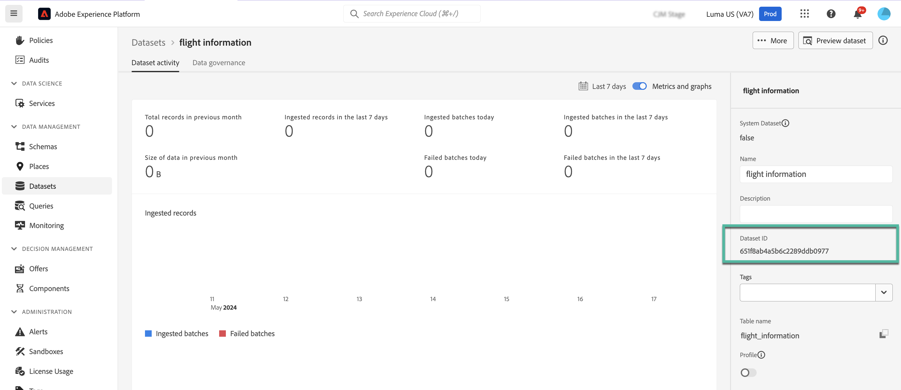
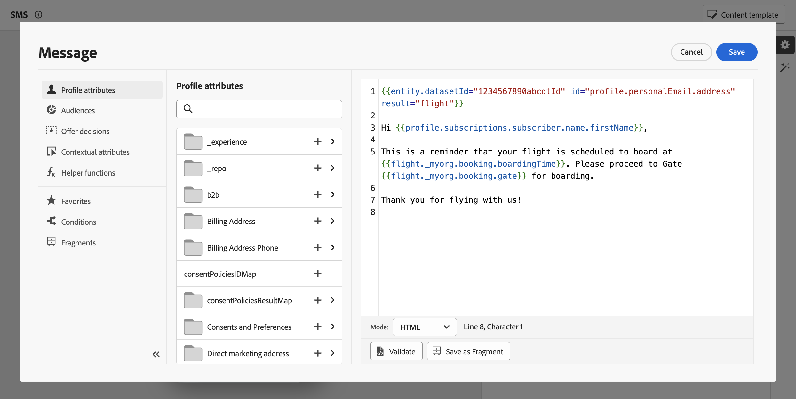

# Uso de datos de Adobe Experience Platform para la personalización {#aep-data}

>[!BEGINSHADEBOX]

**En esta página:** Aprenda a utilizar la función de ayuda datasetLookup en el editor de personalización para recuperar campos de conjuntos de datos de registros de Adobe Experience Platform y personalizar su contenido.

>[!ENDSHADEBOX]

>[!AVAILABILITY]
>
>Actualmente, esta función está disponible para todos los clientes como una versión de disponibilidad limitada.
>
>Por ahora, la función de ayuda &quot;datasetLookup&quot; se puede utilizar dentro de fragmentos de expresión para un conjunto limitado de clientes. Para obtener acceso, póngase en contacto con su representante de Adobe.

Journey Optimizer permite aprovechar los datos de los conjuntos de datos de registros de Adobe Experience Platform en el editor de personalización para [personalizar el contenido](../personalization/personalize.md). Antes de empezar, los conjuntos de datos necesarios para la personalización de la búsqueda deben habilitarse primero para la búsqueda. Encontrará información detallada en esta sección: [Usar datos de Adobe Experience Platform](../data/lookup-aep-data.md).

Una vez que un conjunto de datos se haya habilitado para la personalización de la búsqueda, puede utilizar sus datos para personalizar el contenido en [!DNL Journey Optimizer].

1. Abra el editor de personalización, que está disponible en todos los contextos en los que puede definir la personalización, como los mensajes. [Aprenda a trabajar con el editor de personalización](../personalization/personalization-build-expressions.md)

1. Vaya a la lista de funciones de ayuda y agregue la función de ayuda **datasetLookup** al panel de código.

   

1. Esta función proporciona una sintaxis predefinida que le permite llamar a campos de sus conjuntos de datos de Adobe Experience Platform. La sintaxis es la siguiente:

   ```
   {{datasetLookup datasetId="datasetId" id="key" result="store" required=false}}
   ```

   * **datasetId** es el ID del conjunto de datos con el que está trabajando.
   * **id** es el ID de la columna de origen que debe unirse con la identidad principal del conjunto de datos de búsqueda.

     >[!NOTE]
     >
     >El valor especificado para este campo puede ser un identificador de campo (`profile.packages.packageSKU`), un campo pasado en un evento de recorrido (`context.journey.events.event_ID.productSKU`) o un valor estático (`sku007653`). En cualquier caso, el sistema utilizará el valor y buscará en el conjunto de datos para comprobar si coincide con una clave.
     >
     >Si utiliza un valor de cadena literal para la clave, mantenga el texto entre comillas. P. Ej.: `{{datasetLookup datasetId="datasetId" id="SKU1234" result="store" required=false}}`. Si utiliza un valor de atributo como clave dinámica, elimine las comillas. P. ej.: `{{datasetLookup datasetId="datasetId" id=category.product.SKU result="SKU" required=false}}`

   * **result** es un nombre arbitrario que debe proporcionar para hacer referencia a todos los valores de campo que va a recuperar del conjunto de datos. Este valor se utiliza en el código para llamar a cada campo.

   * **required=false**: si se requiere se establece en TRUE, el mensaje solo se enviará si se encuentra una clave coincidente. Si se establece en false, no se requiere una clave coincidente y el mensaje se puede enviar de todos modos. Tenga en cuenta que, si se establece en false, se recomienda tener en cuenta los valores de reserva o predeterminados en el contenido del mensaje.

   +++¿Dónde se recupera un ID de conjunto de datos?

   Los ID de conjuntos de datos se pueden recuperar en la interfaz de usuario de Adobe Experience Platform. Aprenda a trabajar con conjuntos de datos en la [documentación de Adobe Experience Platform](https://experienceleague.adobe.com/en/docs/experience-platform/catalog/datasets/user-guide#view-datasets){target="_blank"}.

   

   +++

1. Adapte la sintaxis para adaptarla a sus necesidades. En este ejemplo, queremos recuperar datos relacionados con los vuelos de los pasajeros. La sintaxis es la siguiente:

   ```
   {{datasetLookup datasetId="1234567890abcdtId" id=profile.upcomingFlightId result="flight"}}
   ```

   * Estamos trabajando en el conjunto de datos cuyo ID es &quot;1234567890abcdtId&quot;,
   * El campo que queremos usar para unir con el conjunto de datos de búsqueda es *profile.nextFlightId*,
   * Queremos incluir todos los valores de campo en la referencia &quot;vuelo&quot;.

1. Una vez configurada la sintaxis a la que se va a llamar en el conjunto de datos de Adobe Experience Platform, puede especificar qué campos desea recuperar. La sintaxis es la siguiente:

   ```
   {{result.fieldId}}
   ```

   >[!NOTE]
   >
   >Al hacer referencia a un campo del conjunto de datos, asegúrese de hacer coincidir la ruta del campo completo tal como se define dentro del esquema.
   >
   >No existen límites estrictos en el número de campos que se pueden extraer mediante la función de ayuda. Sin embargo, para obtener el mejor rendimiento, se recomienda mantener el número de campos por debajo de 50 para evitar afectar al rendimiento.

   * **result** es el valor que ha asignado al parámetro **result** en la función de ayuda **datasetLookup**. En este ejemplo, &quot;vuelo&quot;.
   * **fieldID** es el identificador del campo que desea recuperar. Este identificador es visible en la interfaz de usuario [!DNL Adobe Experience Platform] al examinar el esquema de registros relacionado con el conjunto de datos:

     +++¿Dónde se recupera un ID de campo?

     Los ID de campos se pueden recuperar al previsualizar un conjunto de datos en la interfaz de usuario de Adobe Experience Platform. Obtenga información sobre cómo obtener una vista previa de los conjuntos de datos en [Adobe Experience Platform documentation](https://experienceleague.adobe.com/en/docs/experience-platform/catalog/datasets/user-guide#preview){target="_blank"}.

     

     +++

   En este ejemplo, queremos utilizar información relacionada con la hora de embarque y la puerta de embarque de los pasajeros. Por lo tanto, añadimos estas dos líneas:

   * `{{flight._myorg.booking.boardingTime}}`
   * `{{flight._myorg.booking.gate}}`

1. Ahora que el código está listo, puede completar el contenido como de costumbre y probarlo con cualquiera de los métodos de simulación: haga clic en **[!UICONTROL Simular contenido]** para probar las variaciones de contenido con datos de entrada de muestra o generación automática de IA, o haga clic en **[!UICONTROL Simular contenido]** y luego seleccione **[!UICONTROL Simular contenido (perfiles de AEP)]** del menú desplegable para previsualizarlo con perfiles de prueba. [Obtenga información sobre cómo obtener una vista previa y probar contenido](../content-management/preview-test.md)


   

## Referencia rápida {#quick-reference}

Esta sección contiene conocimientos estructurados destinados a apoyar la interpretación, la recuperación y la respuesta a preguntas relacionadas con este tema.

Para una comprensión completa, esta información debe combinarse con la documentación de esta página. Ninguna de las fuentes pretende ser independiente; la página describe la función, mientras que esta sección proporciona contexto adicional que ayuda a desambiguar la terminología, la intención, la aplicabilidad y las restricciones.

>[!BEGINTABS]

>[!TAB Información general]

**TL;DR**

Esta página muestra cómo utilizar la función de ayuda `datasetLookup` en el editor de personalización de Journey Optimizer para recuperar campos de conjuntos de datos de registros de Adobe Experience Platform e incorporarlos en la personalización de mensajes.

**Intenciones**

* Habilitar un conjunto de datos de registros de AEP para la personalización de búsqueda
* Agregar la función de ayuda `datasetLookup` a una expresión personalizada
* Configure la función con un ID de conjunto de datos, una clave de unión, un alias de resultado y un indicador requerido
* Hacer referencia a campos de conjuntos de datos recuperados en expresiones de personalización mediante el alias de resultado
* Prueba de contenido personalizado con el flujo Simular contenido

>[!TAB Glosario]

* **datasetLookup**: función de ayuda en el editor de personalización que recupera valores de campo de un conjunto de datos de registro de AEP al unirse a una clave especificada. *(específico del producto)*
* **Conjunto de datos de registros**: un tipo de conjunto de datos de Adobe Experience Platform que contiene datos de nivel de registro que se pueden habilitar para la personalización de búsquedas. *(específico del producto)*
* **Personalización de búsqueda**: Proceso de recuperar campos de un conjunto de datos de registros de AEP en el momento de envío para personalizar el contenido del mensaje. *(específico del producto)*
* **parámetro result**: Un alias arbitrario asignado en la llamada `datasetLookup`; se usa para hacer referencia a todos los valores de campo recuperados en expresiones posteriores (por ejemplo, `{{result.fieldId}}`).
* **parámetro obligatorio**: Un indicador booleano en `datasetLookup` que controla si el envío de mensajes requiere que se encuentre una clave coincidente en el conjunto de datos.

>[!TAB Terminología]

* **Nombre canónico:** datasetLookup — variantes: búsqueda de conjuntos de datos, asistente de búsqueda de conjuntos de datos, función de ayuda de búsqueda de conjuntos de datos
* **Sinónimos:** &quot;datasetLookup&quot; = &quot;función de ayuda de búsqueda de conjuntos de datos&quot;
* **No confunda:** &quot;datasetId&quot; (identificador del conjunto de datos de AEP) ≠ &quot;id&quot; (la columna de origen utilizada para unirse con la identidad principal del conjunto de datos) ≠ &quot;result&quot; (el alias para hacer referencia a los valores de campo recuperados)

>[!TAB Protecciones y limitaciones]

* La función está en disponibilidad limitada; aún no está disponible de forma general para todos los clientes.
* La función de ayuda `datasetLookup` en los fragmentos de expresiones solo está disponible para un conjunto limitado de clientes; póngase en contacto con su representante de Adobe para obtener acceso.
* Los conjuntos de datos deben habilitarse explícitamente para la personalización de la búsqueda antes de poder utilizarse con `datasetLookup`.
* Mantenga el número de campos recuperados por llamada de `datasetLookup` por debajo de 50 para evitar afectar al rendimiento (límite recomendado: no se establece un límite estricto en la página).

>[!TAB Preguntas más frecuentes]

**Q: ¿Cuál es la función de ayuda de `datasetLookup`?**

Se trata de una función de ayuda en el editor de personalización que recupera valores de campo de conjuntos de datos de registros de Adobe Experience Platform, lo que le permite incorporar esos datos en la personalización de mensajes.

**Q: ¿Qué sucede si `required=false` y no se encuentra ninguna clave coincidente en el conjunto de datos?**

El mensaje aún se puede enviar. Se recomienda tener en cuenta los valores predeterminados o de reserva en el contenido del mensaje al utilizar `required=false`.

**Q: ¿Qué sucede si `required=true` y no se encuentra ninguna clave coincidente?**

El mensaje solo se enviará si se encuentra una clave coincidente en el conjunto de datos.

**Q: ¿Dónde encuentro el ID del conjunto de datos y los ID de campo necesarios para la sintaxis?**

Los ID de conjuntos de datos se pueden recuperar en la IU de Adobe Experience Platform en Conjuntos de datos. Los ID de campo están visibles al obtener una vista previa de un conjunto de datos y explorar el esquema de registros en la interfaz de usuario de AEP.

**Q: ¿Cómo pruebo el contenido que usa `datasetLookup`?**

Utilice el botón **Simular contenido** para realizar pruebas con datos de entrada de muestra o generación automática de IA, o bien seleccione **Simular contenido (perfiles de AEP)** del menú desplegable para previsualizarlo con perfiles de prueba.

>[!ENDTABS]

<!-- ai-section-version: 1 | source-hash: 89d99e47 -->
