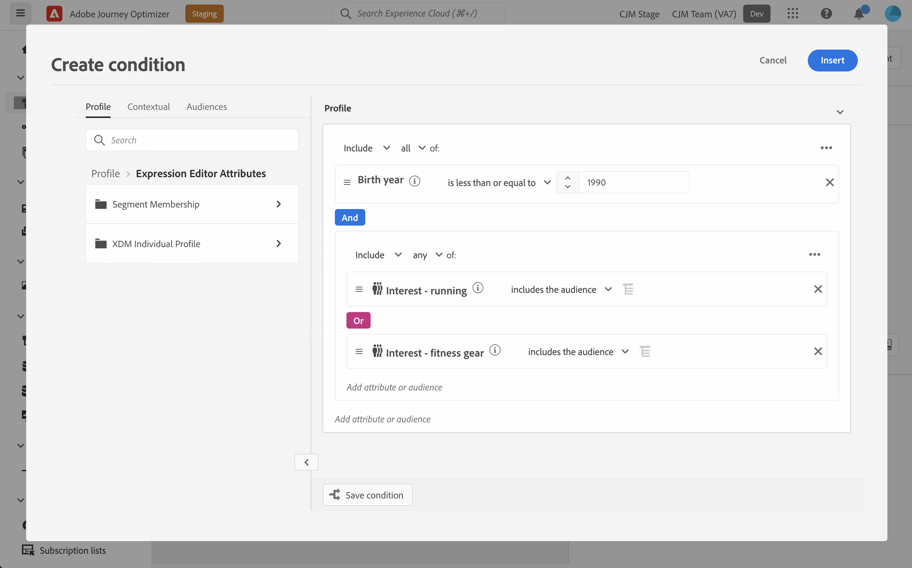
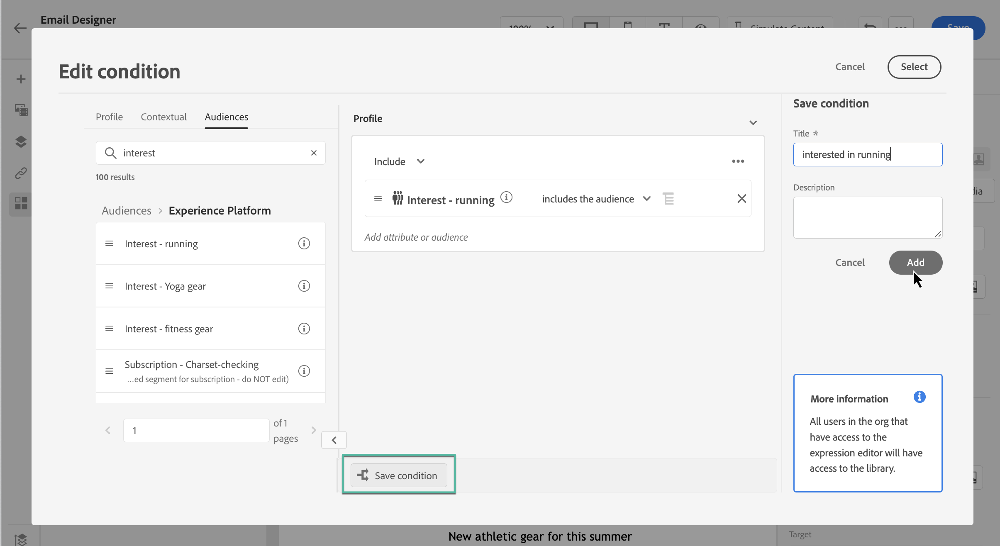

# Trabajo con reglas condicionales {#conditions}

>[!BEGINSHADEBOX]

**En esta página:** Aprenda a crear reglas condicionales a partir de atributos de perfil, eventos contextuales y audiencias en el editor de personalización y guárdelas en la biblioteca para reutilizarlas en el contenido.

>[!ENDSHADEBOX]

Las reglas condicionales son conjuntos de reglas que definen qué contenido debe mostrarse en los mensajes, según varios criterios como atributos de perfiles, pertenencia a audiencias o eventos contextuales.

Las reglas condicionales se crean mediante el editor de personalización y se pueden almacenar si desea reutilizarlas en el contenido. [Aprenda a guardar una regla condicional en la biblioteca](#save)

>[!NOTE]
>
>Las personas necesitarán el permiso [Administrar elementos de biblioteca](../administration/ootb-product-profiles.md) para guardar o eliminar reglas condicionales. Las condiciones guardadas están disponibles para su uso por parte de todos los usuarios de una organización.

## Acceso al generador de reglas condicionales {#access}

Las reglas condicionales se crean desde el menú **[!UICONTROL Conditions]** dentro del editor de personalización, al que se puede acceder desde:

* Desde Email Designer, al habilitar contenido dinámico para un componente en el cuerpo del correo electrónico. [Aprenda a agregar contenido dinámico a los correos electrónicos](dynamic-content.md#emails)

  

* En cualquier campo donde pueda agregar personalización con el [editor de personalización](personalization-build-expressions.md).

  

## Creación de una regla condicional {#create-condition}

>[!CONTEXTUALHELP]
>id="ajo_expression_editor_conditions_create"
>title="Crear condición"
>abstract="Combine atributos de perfil, eventos contextuales o públicos para crear reglas que definan qué contenido debe mostrarse en los mensajes."

>[!CONTEXTUALHELP]
>id="ajo_expression_editor_conditions"
>title="Crear condición"
>abstract="Combine atributos de perfil, eventos contextuales o públicos para crear reglas que definan qué contenido debe mostrarse en los mensajes."

Los pasos para crear una regla condicional son los siguientes:

1. Acceda al menú **[!UICONTROL Condiciones]** desde el editor de personalización o desde el Designer de correo electrónico y, a continuación, haga clic en **[!UICONTROL Crear nuevo]**.

1. Genere la regla condicional según sus necesidades. Para ello, arrastre y suelte y organice los atributos deseados del menú de la izquierda al lienzo.

   Los pasos para combinar atributos en el lienzo son similares a la experiencia de creación de segmentos. Para obtener más información sobre cómo trabajar con el lienzo del generador de reglas, consulte [esta documentación](https://experienceleague.adobe.com/docs/experience-platform/segmentation/ui/segment-builder.html#rule-builder-canvas).

   

   Los atributos se organizan en tres pestañas:

   * **[!UICONTROL Perfil]**:
      * **[!UICONTROL Audiencias]** enumera todos los atributos de audiencia (por ejemplo: estado, versión, etc.) para [servicio de segmentación Adobe Experience Platform](https://experienceleague.adobe.com/docs/experience-platform/segmentation/home.html?lang=es){target="_blank"},
      * **[!UICONTROL Perfiles individuales XDM]** enumera todos los atributos de perfil asociados al esquema [Experience Data Model (XDM)](https://experienceleague.adobe.com/docs/experience-platform/xdm/home.html?lang=es){target="_blank"} definido en Adobe Experience Platform.
   * **[!UICONTROL Contextual]**: cuando el mensaje se utiliza en un recorrido, los campos de recorrido contextual están disponibles a través de esta pestaña.
   * **[!UICONTROL Audiencias]**: enumera todas las audiencias generadas a partir de las definiciones de segmento creadas en [Servicio de segmentación de Adobe Experience Platform](https://experienceleague.adobe.com/docs/experience-platform/segmentation/home.html?lang=es){target="_blank"}.

1. Una vez que la regla condicional esté lista, puede agregarla al mensaje para crear contenido dinámico. [Aprenda a agregar contenido dinámico](dynamic-content.md)

   También puede guardar la regla para permitir una mayor reutilización. [Aprenda a guardar una condición](#save)

## Guardar una regla condicional {#save}

Si hay reglas de condición que reutilizará con frecuencia, puede guardarlas en la biblioteca de condiciones. Todas las reglas guardadas se comparten y las personas de su organización pueden acceder y utilizar.

>[!NOTE]
>
>Las reglas condicionales que aprovechan los recorridos y los atributos contextuales no se pueden guardar en la biblioteca.

1. En la pantalla de edición de condición, haga clic en el botón **[!UICONTROL Guardar condición]**.

1. Asigne un nombre y una descripción (opcional) a la regla y luego haga clic en **[!UICONTROL Agregar]**.

   

1. La regla condicional se guardará en la biblioteca. Ahora puede utilizarlo para crear contenido dinámico en los mensajes. [Aprenda a agregar contenido dinámico](dynamic-content.md)

>[!CAUTION]
>
>Al nombrar variantes de contenido condicional, utilice solo caracteres alfanuméricos (A-Z, a-z, 0-9). El uso de caracteres especiales (como `<`, `>`, `=`, `{`, `}`, etc.) en los nombres de variante puede hacer que el editor de plantillas rompa u oculte componentes.

## Editar y eliminar reglas condicionales guardadas {#edit-delete}

Puede eliminar una regla condicional en cualquier momento mediante el botón de puntos suspensivos.

No se pueden modificar las reglas condicionales guardadas en la biblioteca. Sin embargo, aún puede utilizarlas para crear nuevas reglas. Para ello, abra la regla condicional, realice los cambios deseados y guárdela en la biblioteca. [Obtenga información sobre cómo guardar una condición en la biblioteca](#save)

## Referencia rápida {#quick-reference}

Esta sección contiene conocimientos estructurados destinados a apoyar la interpretación, la recuperación y la respuesta a preguntas relacionadas con este tema.

Para una comprensión completa, esta información debe combinarse con la documentación de esta página. Ninguna de las fuentes pretende ser independiente; la página describe la función, mientras que esta sección proporciona contexto adicional que ayuda a desambiguar la terminología, la intención, la aplicabilidad y las restricciones.

>[!BEGINTABS]

>[!TAB Información general]

**TL;DR**

En esta página se explica cómo crear reglas condicionales a partir de atributos de perfil, eventos contextuales y audiencias en el editor de personalización, y cómo guardarlas en la biblioteca para reutilizarlas en el contenido del mensaje.

**Intenciones**

* Acceda al generador de reglas condicionales desde el editor de personalización o desde Email Designer
* Cree una regla condicional combinando atributos de perfil, pertenencia a audiencias y campos de recorrido contextual
* Añadir una regla condicional a un mensaje para crear contenido dinámico
* Guarde una regla condicional en la biblioteca de condiciones para reutilizarla en toda la organización
* Editar o eliminar una regla condicional guardada

>[!TAB Glosario]

* **Regla condicional**: conjunto de reglas que define qué contenido se debe mostrar en los mensajes, según criterios como atributos de perfil, pertenencia a audiencias o eventos contextuales. *(específico del producto)*
* **Biblioteca de condiciones**: Repositorio compartido dentro de una organización donde las reglas condicionales guardadas se almacenan y todos los usuarios tienen acceso a ellas. *(específico del producto)*
* **Contenido dinámico**: contenido de mensaje cuya visualización está regida por reglas condicionales. *(específico del producto)*
* **Campos contextuales**: los campos específicos del Recorrido están disponibles en el generador de reglas cuando se utiliza un mensaje en un recorrido; las reglas que utilizan estos campos no se pueden guardar en la biblioteca.
* **Perfiles individuales XDM**: atributos de perfil asociados al esquema del Modelo de datos de experiencia (XDM) definido en Adobe Experience Platform, disponibles como criterios de regla.

>[!TAB Terminología]

* **Nombre canónico:** regla condicional — variantes: condición, condiciones, regla de contenido condicional
* **Sinónimos:** &quot;regla condicional&quot; = &quot;condición&quot; (como se etiqueta en la interfaz de usuario)
* **No confunda:** pestaña &quot;Perfil&quot; (contiene subsecciones de atributos de audiencias y perfiles individuales de XDM) ≠ pestaña &quot;Audiencias&quot; (enumera todas las audiencias generadas a partir de definiciones de segmento en el servicio de segmentación de AEP)
* **No confunda:** &quot;guardar una condición&quot; (almacenar una regla en la biblioteca compartida) ≠ &quot;crear una condición&quot; (generar una nueva regla en el editor)

>[!TAB Protecciones y limitaciones]

* Las reglas condicionales que aprovechan los atributos contextuales de recorrido no se pueden guardar en la biblioteca de condiciones.
* Solo los usuarios con el permiso **Administrar elementos de biblioteca** pueden guardar o eliminar reglas condicionales de la biblioteca.
* Las condiciones guardadas se comparten y son accesibles para todos los usuarios de la organización.
* Las reglas condicionales guardadas en la biblioteca no se pueden modificar directamente; abra la regla, realice los cambios deseados y guárdela en la biblioteca.
* Los nombres de variante solo deben utilizar caracteres alfanuméricos (A-Z, a-z, 0-9); los caracteres especiales como `<`, `>`, `=`, `{`, `}` pueden hacer que el editor de plantillas rompa u oculte componentes.

>[!TAB Preguntas más frecuentes]

**Q: ¿Qué criterios puedo usar para generar una regla condicional?**

Atributos de perfil, pertenencia a audiencias y campos de recorrido contextual (cuando el mensaje se utiliza en un recorrido).

**Q: ¿Puedo guardar una regla condicional que usa atributos contextuales de recorrido?**

No. Las reglas condicionales que aprovechan los atributos contextuales de recorrido no se pueden guardar en la biblioteca de condiciones.

**Q: ¿Quién puede guardar o eliminar reglas condicionales en la biblioteca?**

Solo los usuarios con el permiso **Administrar elementos de biblioteca** pueden guardar o eliminar reglas condicionales.

**Q: ¿Puedo modificar una regla condicional que ya se ha guardado en la biblioteca?**

Las reglas condicionales guardadas en la biblioteca no se pueden modificar directamente. Puede abrir una regla guardada, realizar los cambios deseados y guardarla en la biblioteca.

**Q: ¿Hay restricciones en la asignación de nombres a variantes de contenido condicional?**

Sí. Los nombres de variante sólo deben contener caracteres alfanuméricos (A-Z, a-z, 0-9). Los caracteres especiales como `<`, `>`, `=`, `{`, `}` pueden hacer que el editor de plantillas rompa u oculte componentes.

>[!ENDTABS]

<!-- ai-section-version: 1 | source-hash: f375658d -->
