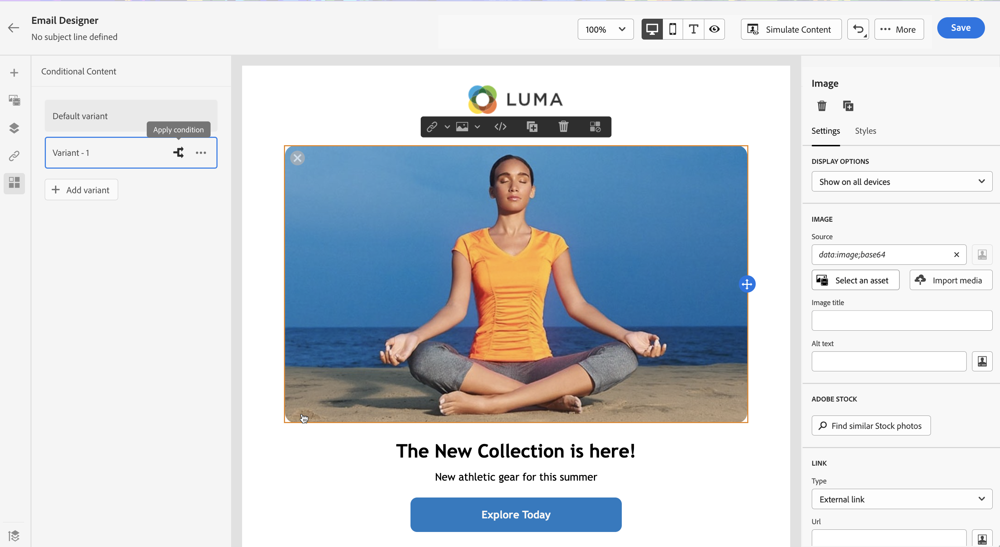

# Trabajo con reglas condicionales {#conditions}

Las reglas condicionales son conjuntos de reglas que definen qué contenido debe mostrarse en los mensajes, según diversos criterios como los atributos de los perfiles, la pertenencia a segmentos o los eventos contextuales.

Las reglas condicionales se crean mediante el editor de expresiones y se pueden almacenar si desea reutilizarlas en su contenido. [Obtenga información sobre cómo guardar una regla condicional en la biblioteca](#save)

>[!NOTE]
>
>Los individuos necesitarán el [Administrar elementos de biblioteca](../administration/ootb-product-profiles.md) permiso para guardar o eliminar reglas condicionales. Las condiciones guardadas están disponibles para su uso por parte de todos los usuarios de una organización.

## Acceso al generador de reglas condicional {#access}

Las reglas condicionales se crean a partir de la variable **[!UICONTROL Condiciones]** dentro del editor de expresiones, al que se puede acceder desde:

* Desde el Diseñador de correo electrónico, al habilitar contenido dinámico para un componente en el cuerpo del correo electrónico. [Aprenda a añadir contenido dinámico a los correos electrónicos](dynamic-content.md#emails)

   

* En cualquier campo en el que se puede añadir una personalización mediante la variable [Editor de expresiones](personalization-build-expressions.md).

   

## Crear una regla condicional {#create-condition}

>[!CONTEXTUALHELP]
>id="ajo_expression_editor_conditions_create"
>title="Crear condición"
>abstract="Combine atributos de perfil, eventos contextuales o audiencias para crear reglas que definan qué contenido debe mostrarse en los mensajes."

>[!CONTEXTUALHELP]
>id="ajo_expression_editor_conditions"
>title="Crear condición"
>abstract="Combine atributos de perfil, eventos contextuales o audiencias para crear reglas que definan qué contenido debe mostrarse en los mensajes."

Los pasos para crear una regla condicional son los siguientes:

1. Acceda a la **[!UICONTROL Condiciones]** del Editor de expresiones o del Diseñador de correo electrónico y, a continuación, haga clic en **[!UICONTROL Crear nuevo]**.

1. Cree la regla condicional según sus necesidades. Para ello, arrastre y suelte y organice los atributos deseados desde el menú de la izquierda en el lienzo.

   Los pasos para combinar atributos en el lienzo son similares a la experiencia de creación de segmentos. Para obtener más información sobre cómo trabajar con el lienzo del generador de reglas, consulte [esta documentación](https://experienceleague.adobe.com/docs/experience-platform/segmentation/ui/segment-builder.html?lang=en#rule-builder-canvas).

   

   Los atributos se organizan en tres pestañas:

   * **[!UICONTROL Perfil]**:
      * **[!UICONTROL Pertenencia a segmentos]** enumera todos los atributos del segmento (por ejemplo, estado, versión, etc.) para [Servicio de segmentación de Adobe Experience Platform](https://experienceleague.adobe.com/docs/experience-platform/segmentation/home.html),
      * **[!UICONTROL Perfiles individuales XDM]** enumera todos los atributos de perfil asociados al [Esquema del Modelo de datos de experiencia (XDM)](https://experienceleague.adobe.com/docs/experience-platform/xdm/home.html?lang=es) definida en Adobe Experience Platform.
   * **[!UICONTROL Contextual]**: cuando el mensaje se utiliza en un recorrido, los campos de recorrido contextual están disponibles en esta pestaña.
   * **[!UICONTROL Audiencias]**: enumera todas las audiencias generadas a partir de segmentos creados en [Servicio de segmentación de Adobe Experience Platform](https://experienceleague.adobe.com/docs/experience-platform/segmentation/home.html).

1. Una vez que la regla condicional esté lista, puede agregarla al mensaje para crear contenido dinámico. [Aprenda a añadir contenido dinámico](dynamic-content.md)

   También puede guardar la regla para permitir su reutilización. [Obtenga información sobre cómo guardar una condición](#save)

## Guardar una regla condicional {#save}

Si hay reglas de condición que va a reutilizar con frecuencia, puede guardarlas en la biblioteca de condiciones. Todas las reglas guardadas se comparten y las personas de su organización pueden acceder a ellas y usarlas.

>[!NOTE]
>
>Las reglas condicionales que aprovechan los atributos contextuales de recorrido no se pueden guardar en la biblioteca .

1. En la pantalla de edición de condición, haga clic en el botón **[!UICONTROL Guardar condición]** botón.

1. Asigne un nombre y una descripción (opcional) a la regla y haga clic en **[!UICONTROL Agregar]**.

   

1. La regla condicional se guarda en la biblioteca . Ahora puede usarlo para crear contenido dinámico en los mensajes. [Aprenda a añadir contenido dinámico](dynamic-content.md)

## Editar y eliminar reglas condicionales guardadas {#edit-delete}

Puede eliminar una regla condicional en cualquier momento mediante el botón de elipse.

Las reglas condicionales guardadas en la biblioteca no se pueden modificar. Sin embargo, aún puede utilizarlos para crear nuevas reglas. Para ello, abra la regla condicional, realice los cambios que desee y guárdela en la biblioteca . [Obtenga información sobre cómo guardar una condición en la biblioteca](#save)
