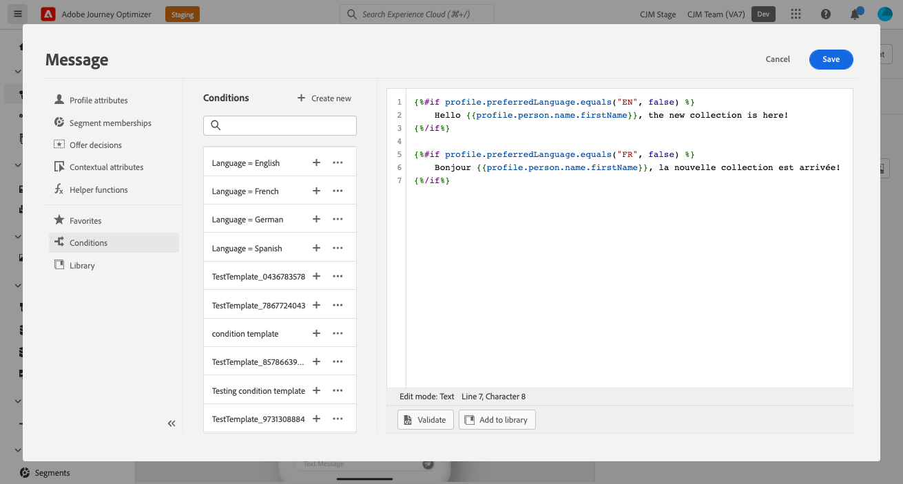
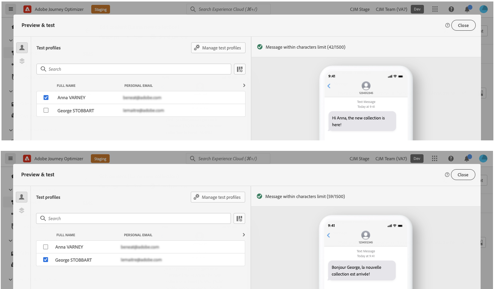

# Crear contenido dinámico {#dynamic-content}

>[!BEGINSHADEBOX]

**En esta página:** Aprenda a utilizar reglas condicionales para agregar contenido dinámico a sus mensajes, tanto en expresiones de personalización como en variantes de componentes de contenido en el Designer de correo electrónico.

>[!ENDSHADEBOX]

Adobe Journey Optimizer le permite aprovechar las reglas condicionales creadas en la biblioteca para añadir contenido dinámico a los mensajes.

Se puede crear contenido dinámico en cualquier campo donde se pueda añadir personalización mediante el editor de personalización. Esto incluye la línea de asunto, los vínculos, el contenido de notificaciones push o las representaciones de ofertas de tipo texto. [Más información sobre personalización](personalize.md)

Además, puede utilizar reglas condicionales en el Designer de correo electrónico para crear varias variantes de un componente de contenido.

## Añadir contenido dinámico en expresiones {#perso-expressions}

Los pasos para agregar contenido dinámico en expresiones son los siguientes:

1. Vaya al campo donde desea añadir contenido dinámico y, a continuación, abra el editor de personalización.

1. Seleccione el menú **[!UICONTROL Condiciones]** para mostrar la lista de reglas condicionales disponibles. Haga clic en el botón + situado junto a una regla para añadirla a la expresión actual.

   También puede crear una regla nueva seleccionando **[!UICONTROL Crear nuevo]**. [Aprenda a crear condiciones](create-conditions.md)

   

1. Agregue entre las etiquetas `{%if}` y `{%/if}` el contenido que desea mostrar si se cumple la regla de condición. Puede agregar tantas reglas como sea necesario para crear varias variantes de una expresión.

   En el ejemplo siguiente, se han creado dos variantes para un contenido SMS, según el idioma preferido del destinatario.

   

1. Una vez que el contenido esté listo, puede obtener una vista previa de diferentes variantes mediante cualquiera de los métodos de simulación: haga clic en **[!UICONTROL Simular contenido]** para probar las variaciones de contenido con datos de entrada de muestra o generación automática de IA, o haga clic en **[!UICONTROL Simular contenido]** y, a continuación, seleccione **[!UICONTROL Simular contenido (perfiles de AEP)]** en el menú desplegable para obtener una vista previa con perfiles de prueba. [Obtenga información sobre cómo probar y obtener una vista previa de los mensajes](../content-management/preview-test.md)

   

>[!CAUTION]
>
>Si el Designer de correo electrónico no se representa correctamente después de agregar bloques condicionales, compruebe que la sintaxis de cada nueva condición sea correcta y que no existan instrucciones duplicadas o en conflicto. Si los problemas persisten, considere la posibilidad de volver a crear secciones problemáticas en una plantilla nueva y pruebe cada bloque condicional gradualmente.

## Añadir contenido dinámico a correos electrónicos {#emails}

>[!CONTEXTUALHELP]
>id="ac_conditional_content"
>title="Contenido condicional"
>abstract="Utilice reglas condicionales para crear varias variantes de un componente de contenido. Si no se cumple ninguna de las condiciones al enviar el mensaje, se muestra el contenido de la variante predeterminada."

>[!CONTEXTUALHELP]
>id="ac_conditional_content_select"
>title="Contenido condicional"
>abstract="Utilice una regla condicional guardada en la biblioteca o cree una nueva."

Los pasos para crear variantes de un componente de contenido en el Designer de correo electrónico son los siguientes:

1. En [Email Designer](../email/content-from-scratch.md), seleccione un componente de contenido y haga clic en **[!UICONTROL Habilitar contenido condicional]**.

   

1. El panel **[!UICONTROL Contenido condicional]** se muestra a la izquierda. En este panel, puede crear varias variantes del componente de contenido seleccionado mediante condiciones.

   Configure su primera variante seleccionando el botón **[!UICONTROL Seleccionar condición]**.

   

1. Se muestra la biblioteca de condiciones. Seleccione la regla condicional que se asociará a la variante y luego haga clic en **[!UICONTROL Seleccionar]**. En este ejemplo, se desea adaptar el texto del componente en función del idioma preferido del destinatario.

   

   También puede crear una regla nueva si hace clic en **[!UICONTROL Crear nuevo]**. [Aprenda a crear condiciones](create-conditions.md)

1. La regla condicional está asociada a la variante. Para mejorar la legibilidad, cambie el nombre de la variante seleccionando la acción **[!UICONTROL Cambiar nombre]** del icono Más acciones.

   

1. Configure cómo debe mostrarse el componente si se cumple la regla al enviar el mensaje. En este ejemplo, deseamos mostrar el texto en francés si es el idioma preferido del destinatario.

   

1. Añada tantas variantes como sea necesario para el componente de contenido. Puede cambiar en cualquier momento entre las distintas variantes para comprobar cómo se mostrará el componente de contenido en función de las reglas condicionales.

   >[!NOTE]
   >
   >* Si ninguna de las reglas definidas en las variantes se cumple al enviar el mensaje, el componente de contenido mostrará el contenido definido en la **[!UICONTROL variante predeterminada]**.
   >
   >* El contenido condicional se evaluará según las reglas asociadas en el orden en que se muestran las variantes. La variante predeterminada siempre se muestra si no se cumplen otras condiciones.
   >
   >* Al simular o procesar pruebas de correos electrónicos que contienen varias variantes condicionales, Journey Optimizer puede precisar de más tiempo de procesamiento. Si experimenta tiempos de espera o mensajes de error, considere la posibilidad de reducir la cantidad total de variantes o simplificar las reglas condicionales. Más información sobre cómo probar el contenido en [esta página](../content-management/preview-test.md).

1. Para eliminar una variante, haga clic en el icono Más acciones que está junto a la variante deseada y seleccione **[!UICONTROL Eliminar]**.

   

## Referencia rápida {#quick-reference}

Esta sección contiene conocimientos estructurados destinados a apoyar la interpretación, la recuperación y la respuesta a preguntas relacionadas con este tema.

Para una comprensión completa, esta información debe combinarse con la documentación de esta página. Ninguna de las fuentes pretende ser independiente; la página describe la función, mientras que esta sección proporciona contexto adicional que ayuda a desambiguar la terminología, la intención, la aplicabilidad y las restricciones.

>[!BEGINTABS]

>[!TAB Información general]

**TL;DR**

En esta página se explica cómo utilizar reglas condicionales para añadir contenido dinámico a los mensajes, ya sea mediante etiquetas de expresión en el editor de personalización o como variantes de componente de contenido en el Designer de correo electrónico.

**Intenciones**

* Agregar contenido dinámico a expresiones de personalización utilizando etiquetas condicionales `` / ``
* Vista previa de varias variantes de contenido dinámico mediante simulación
* Habilitar contenido condicional en un componente de contenido de Designer de correo electrónico
* Cree varias variantes de componentes, cada una vinculada a una regla condicional
* Administrar la variante predeterminada que se muestra cuando no se cumple ninguna condición en el momento del envío

>[!TAB Glosario]

* **Contenido dinámico**: contenido de mensaje que varía según las reglas condicionales; se muestra contenido diferente en función de si se cumplen las condiciones definidas en el momento de la entrega. *(específico del producto)*
* **Contenido condicional**: función de Designer de correo electrónico que aplica reglas condicionales a un componente de contenido y crea varias variantes de visualización. *(específico del producto)*
* **Variante predeterminada**: el contenido mostrado para un componente cuando no se cumple ninguna de las reglas condicionales definidas al enviar el mensaje. *(específico del producto)*
* **``/ `` tags**: sintaxis de expresión del editor de Personalization utilizada para ajustar bloques de contenido que solo se muestran cuando se cumple una regla condicional.

>[!TAB Terminología]

* **Nombre canónico:** contenido dinámico — variantes: contenido condicional, contenido personalizado
* **Sinónimos:** &quot;contenido condicional&quot; (etiqueta de la interfaz de usuario de Designer de correo electrónico) = &quot;contenido dinámico&quot; (término general utilizado en todo)
* **No confunda:** agregar contenido dinámico en expresiones (mediante etiquetas `` en el editor de personalización) ≠ agregar contenido dinámico en correos electrónicos (creando variantes de componente en el Designer de correo electrónico: dos flujos de trabajo distintos)
* **No confunda:** &quot;variante predeterminada&quot; (se muestra cuando no se cumplen las reglas condicionales) ≠ una variante con nombre (cada una asociada a una regla condicional específica)

>[!TAB Protecciones y limitaciones]

* Las variantes de contenido condicional se evalúan según sus reglas asociadas en el orden en que se muestran; la variante predeterminada siempre se muestra si no se cumplen otras condiciones.
* Al simular o procesar pruebas para correos electrónicos con varias variantes condicionales, Journey Optimizer puede requerir más tiempo de procesamiento; considere la posibilidad de reducir el número de variantes o simplificar las reglas condicionales si se producen errores o tiempos de espera.
* Si el Designer de correo electrónico no se representa correctamente después de agregar bloques condicionales, compruebe que la sintaxis de cada condición sea correcta y que no existan instrucciones duplicadas o en conflicto.

>[!TAB Preguntas más frecuentes]

**Q: ¿Qué sucede si no se cumple ninguna de las condiciones definidas cuando se envía el mensaje?**

El componente de contenido muestra el contenido definido en la variante predeterminada.

**Q: ¿En qué orden se evalúan las variantes de contenido condicional?**

Las variantes se evalúan según sus reglas asociadas en el orden en que se muestran. La variante predeterminada siempre se muestra si no se cumplen otras condiciones.

**Q: ¿Dónde se puede agregar contenido dinámico en Journey Optimizer?**

En cualquier campo donde se pueda añadir personalización, incluidas las líneas de asunto, los vínculos, el contenido de las notificaciones push y las representaciones de ofertas de tipo texto, a través del editor de personalización y en los componentes de contenido de Designer de correo electrónico a través de variantes condicionales.

**Q: ¿Qué debo hacer si el Designer de correo electrónico no se puede procesar después de agregar bloques condicionales?**

Compruebe que la sintaxis de cada condición sea correcta y que no existan instrucciones duplicadas o en conflicto. Si los problemas persisten, vuelva a generar las secciones problemáticas en una plantilla nueva y pruebe cada bloque condicional gradualmente.

>[!ENDTABS]

<!-- ai-section-version: 1 | source-hash: e6005d80 -->
