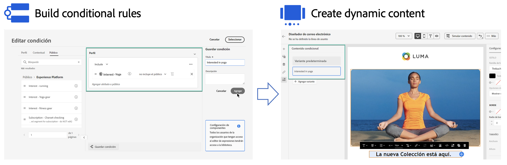

# Introducción al contenido dinámico {#start-dynamic-content}

>[!CONTEXTUALHELP]
>id="ajo_conditions_list"
>title="Condiciones"
>abstract="Las reglas condicionales permiten mostrar numerosas variantes de contenido en sus mensajes en función de atributos de perfil, eventos contextuales o públicos."

El contenido dinámico le permite adaptar el contenido de sus mensajes en función de las **reglas condicionales** que pueden estar formadas por atributos de perfil, eventos contextuales o públicos. Las reglas condicionales se crean mediante un generador de reglas visual dentro del editor de personalización, donde puede almacenarlas para su reutilización en los recorridos y campañas.

Las reglas condicionales se pueden aprovechar en el Designer de correo electrónico y en el editor de personalización para **crear contenido dinámico** que se adaptará a los perfiles objetivo en sus mensajes.

* [Información sobre cómo trabajar con reglas condicionales](create-conditions.md)
* [Información sobre cómo crear contenido dinámico](dynamic-content.md)

## Vídeo explicativo {#video}

Información sobre cómo crear contenido dinámico con el generador de reglas de condición.

>[!VIDEO](https://video.tv.adobe.com/v/3409815?quality=12)
