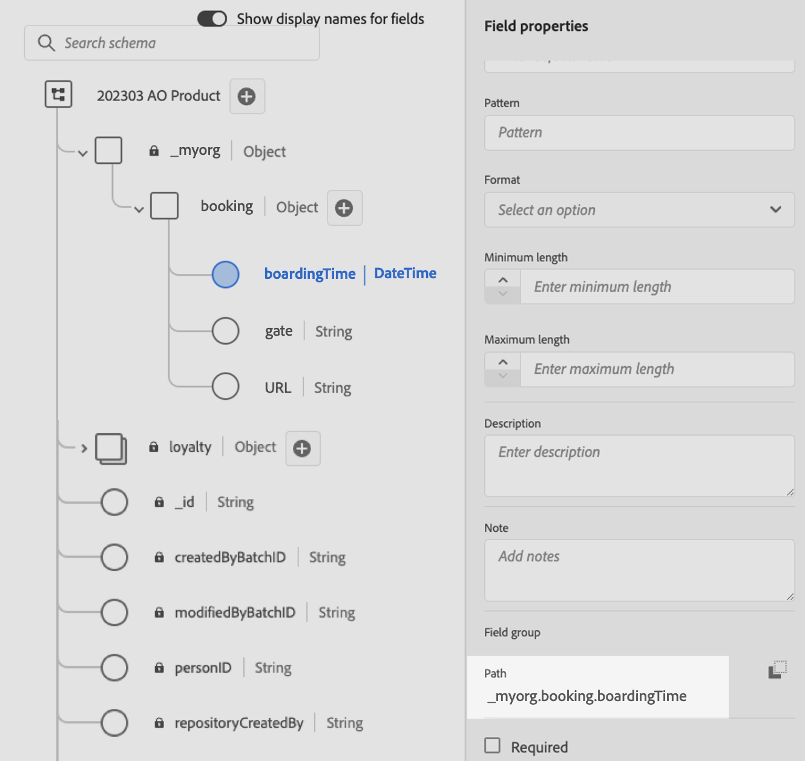

# Uso de datos de Adobe Experience Platform para la personalización{#aep-data}

>[!AVAILABILITY]
>
>Actualmente, esta función está disponible para todos los clientes como una versión beta pública.
>
>Para utilizar esta capacidad, primero debe aceptar los términos beta para su organización que se muestran al agregar las nuevas funciones de ayuda &quot;datasetLookup&quot; en el editor de personalización.

Journey Optimizer permite aprovechar datos de Adobe Experience Platform en el editor de personalización para [personalizar el contenido](../personalization/personalize.md). Para ello, los conjuntos de datos necesarios para la personalización de la búsqueda deben habilitarse primero mediante una llamada de API como se describe a continuación. Cuando haya terminado, puede usar sus datos para personalizar su contenido en [!DNL Journey Optimizer].

## Restricciones y directrices de Beta {#guidelines}

Antes de empezar, revise las siguientes restricciones y directrices:

### Habilitación de conjuntos de datos {#enablement}

* **El tamaño del conjunto de datos** está limitado a 5 GB para conjuntos de datos de producción y a 1 GB para conjuntos de datos de zonas protegidas para desarrollo
* **Se puede habilitar un máximo de 50 conjuntos de datos** para la búsqueda por organización en cualquier momento.
* **Número de registros** está restringido a 5 millones en conjuntos de datos de producción y a 1 millones en conjuntos de datos de zonas protegidas de desarrollo.
* **Etiquetado y aplicación del uso de datos** no se impone en este momento para los conjuntos de datos habilitados para la búsqueda.
* **Los conjuntos de datos habilitados para la búsqueda y utilizados en la personalización no están protegidos de la eliminación**. Depende de usted realizar un seguimiento de qué conjuntos de datos se están utilizando para la personalización a fin de asegurarse de que no se eliminen ni se eliminen.

### Personalization con datos de [!DNL Adobe Experience Platform] {#perso}

* **Canales compatibles**: Por ahora, esta capacidad solo está disponible para su uso en canales de correo electrónico, SMS y correo directo.
* **Etiquetado y aplicación del uso de datos** no se impone en este momento para los conjuntos de datos habilitados para la búsqueda.
* **Fragmentos**: la personalización de la búsqueda de conjuntos de datos no se puede colocar en fragmentos visuales o de expresión en este momento.

### Toma de decisiones {#decisioning}

La capacidad de aprovechar [!DNL Adobe Experience Platform] conjuntos de datos en reglas y fórmulas de clasificación de Experience Decisioning estará disponible pronto.

Mientras tanto, por favor revise las barreras actuales que se describen a continuación:

* Una política de decisión está limitada a 3 conjuntos de datos,
* Una regla de decisión puede utilizar 3 conjuntos de datos,
* Una fórmula de clasificación puede utilizar 3 conjuntos de datos,
* Una política de decisión está limitada a 1000 consultas de registro.

>[!NOTE]
>
>Póngase en contacto con el representante de su cuenta si desea acceder a esta funcionalidad

## Habilitar un conjunto de datos para la búsqueda de datos {#enable}

Para aprovechar los datos del conjunto de datos para la personalización, debe utilizar una llamada de API para recuperar su estado y habilitar el servicio de búsqueda.

### Requisitos previos {#prerequisites-enable}

* Siga las instrucciones detalladas en [esta documentación](https://developer.adobe.com/journey-optimizer-apis/references/authentication/) para configurar su entorno y enviar comandos de API.
* El proyecto de desarrollador debe tener las API de Adobe Journey Optimizer y Adobe Experience Platform añadidas a su proyecto.

  

* Debe tener permiso para administrar conjuntos de datos como parte de la función.
* El esquema en el que se basa el conjunto de datos debe contener una **identidad principal** que pueda actuar como clave de búsqueda.

### Estructura de llamadas API {#call}

```
curl -s -XPATCH "https://platform.adobe.io/data/core/entity/lookup/dataSets/${DATASET_ID}/${ACTION}" \ -H "Authorization: Bearer ${ACCESS_TOKEN}" \ -H "x-api-key: ${API_KEY}" \ -H "x-gw-ims-org-id: ${IMS_ORG}" \ -H "x-sandbox-name: ${SANDBOX_NAME}"
```

Donde:

* **URL** es `https://platform.adobe.io/data/core/entity/lookup/dataSets/${DATASET_ID}/${ACTION}`
* **ID del conjunto de datos** es el conjunto de datos para el que desea habilitar.
* **Acción** está habilitada O deshabilitada.
* **Se puede recuperar el token de acceso** de Developer Console.
* **La clave de API** se puede recuperar de Developer Console.
* **ID de organización de IMS** es su organización de Adobe.
* **Nombre de zona protegida** es el nombre de la zona protegida en la que se encuentra el conjunto de datos (por ejemplo: prod, dev, etc.).

>[!NOTE]
>
>Si aparece el siguiente error al intentar realizar una llamada a una API para habilitar conjuntos de datos, intente eliminar las API de Adobe Journey Optimizer de su proyecto de consola del desarrollador y, a continuación, vuelva a agregarlas.
>
>```
>
>"error_code": "403003", 
>"message": "Api Key is invalid"
>
>```

## Aprovechamiento de un conjunto de datos para la personalización {#leverage}

Una vez que se ha habilitado un conjunto de datos para la personalización de búsquedas mediante una llamada de API, puede utilizar sus datos para personalizar el contenido en [!DNL Journey Optimizer].

1. Abra el editor de personalización, que está disponible en todos los contextos en los que puede definir la personalización, como los mensajes. [Aprenda a trabajar con el editor de personalización](../personalization/personalization-build-expressions.md)

1. Vaya a la lista de funciones de ayuda y agregue la función de ayuda **datasetLookup** al panel de código.

   

1. Esta función proporciona una sintaxis predefinida que le permite llamar a campos de sus conjuntos de datos de Adobe Experience Platform. La sintaxis es la siguiente:

   ```
   {{datasetLookup datasetId="datasetId" id="key" result="store" required=false}}
   ```

   * **datasetId** es el ID del conjunto de datos con el que está trabajando.
   * **id** es el ID de la columna de origen que debe unirse con la identidad principal del conjunto de datos de búsqueda.

     >[!NOTE]
     >
     >El valor especificado para este campo puede ser un identificador de campo (*profile.packages.packageSKU*), un campo pasado en un evento de recorrido (*context.recorrido.events.event_ID.productSKU*) o un valor estático (*sku007653*). En cualquier caso, el sistema utilizará el valor y buscará en el conjunto de datos para comprobar si coincide con una clave.
     >
     >Si utiliza un valor de cadena literal para la clave, mantenga el texto entre comillas. P. Ej.: `{{datasetLookup datasetId="datasetId" id="SKU1234" result="store" required=false}}`. Si utiliza un valor de atributo como clave dinámica, elimine las comillas. P. ej.: `{{datasetLookup datasetId="datasetId" id=category.product.SKU result="SKU" required=false}}`

   * **result** es un nombre arbitrario que debe proporcionar para hacer referencia a todos los valores de campo que va a recuperar del conjunto de datos. Este valor se utiliza en el código para llamar a cada campo.

   * **required=false**: si se requiere se establece en TRUE, el mensaje solo se enviará si se encuentra una clave coincidente. Si se establece en false, no se requiere una clave coincidente y el mensaje se puede enviar de todos modos. Tenga en cuenta que, si se establece en false, se recomienda tener en cuenta los valores de reserva o predeterminados en el contenido del mensaje.

   +++¿Dónde recuperar un ID de conjunto de datos?

   Los ID de conjuntos de datos se pueden recuperar en la interfaz de usuario de Adobe Experience Platform. Aprenda a trabajar con conjuntos de datos en la [documentación de Adobe Experience Platform](https://experienceleague.adobe.com/en/docs/experience-platform/catalog/datasets/user-guide#view-datasets){target="_blank"}.

   

   +++

1. Adapte la sintaxis para adaptarla a sus necesidades. En este ejemplo, queremos recuperar datos relacionados con los vuelos de los pasajeros. La sintaxis es la siguiente:

   ```
   {{datasetLookup datasetId="1234567890abcdtId" id=profile.upcomingFlightId result="flight"}}
   ```

   * Estamos trabajando en el conjunto de datos cuyo ID es &quot;1234567890abcdtId&quot;,
   * El campo que queremos usar para unir con el conjunto de datos de búsqueda es *profile.nextFlightId*,
   * Queremos incluir todos los valores de campo en la referencia &quot;vuelo&quot;.

1. Una vez configurada la sintaxis a la que se va a llamar en el conjunto de datos de Adobe Experience Platform, puede especificar qué campos desea recuperar. La sintaxis es la siguiente:

   ```
   {{result.fieldId}}
   ```

   >[!NOTE]
   >
   >Al hacer referencia a un campo del conjunto de datos, asegúrese de hacer coincidir la ruta del campo completo tal como se define dentro del esquema.

   * **result** es el valor que ha asignado al parámetro **result** en la función de ayuda de **MultiEntity**. En este ejemplo, &quot;vuelo&quot;.
   * **fieldID** es el identificador del campo que desea recuperar. Este identificador es visible en la interfaz de usuario [!DNL Adobe Experience Platform] al examinar el esquema de registros relacionado con el conjunto de datos:

     +++¿Dónde se recupera un ID de campo?

     Los ID de campos se pueden recuperar al previsualizar un conjunto de datos en la interfaz de usuario de Adobe Experience Platform. Obtenga información sobre cómo obtener una vista previa de los conjuntos de datos en [Adobe Experience Platform documentation](https://experienceleague.adobe.com/en/docs/experience-platform/catalog/datasets/user-guide#preview){target="_blank"}.

     

     +++

   En este ejemplo, queremos utilizar información relacionada con la hora de embarque y la puerta de embarque de los pasajeros. Por lo tanto, añadimos estas dos líneas:

   * `{{flight._myorg.booking.boardingTime}}`
   * `{{flight._myorg.booking.gate}}`

1. Ahora que el código está listo, puede completar el contenido como de costumbre y probarlo con el botón **Simular contenido** para comprobar la personalización. [Obtenga información sobre cómo obtener una vista previa y probar contenido](../content-management/preview-test.md)


   
