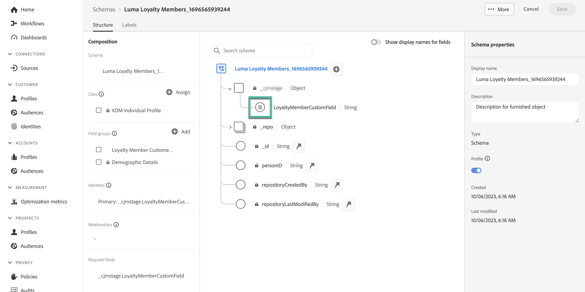

# Uso de datos de Adobe Experience Platform para la personalización (beta) {#aep-data}

>[!AVAILABILITY]
>
>Actualmente, esta función solo está disponible como una versión beta privada.
>
>Por ahora, solo está disponible para fines de prueba en la zona protegida que no sea de producción que ha proporcionado al Adobe y para los conjuntos de datos solicitados para la versión beta.

Journey Optimizer le permite aprovechar los datos de Adobe Experience Platform en el editor de expresiones para [personalizar el contenido](../personalization/personalize.md). Los pasos son los siguientes:

1. Abra el editor de expresiones, que está disponible en todos los contextos en los que puede definir la personalización, como los mensajes. [Aprenda a trabajar con el editor de expresiones](../personalization/personalization-build-expressions.md)

1. Vaya a la lista de funciones de ayuda y añada la variable **datasetLookup** función de ayuda al panel de código.

   

1. Esta función proporciona una sintaxis predefinida que le permite llamar a campos de sus conjuntos de datos de Adobe Experience Platform. La sintaxis es la siguiente:

   ```
   {{entity.datasetId="datasetId" id="key" result="store"}}
   ```

   * **entity.datasetId** es el ID del conjunto de datos con el que está trabajando,
   * **id** es el campo utilizado como identidad principal en el conjunto de datos,

     >[!NOTE]
     >
     >El valor introducido para este campo puede ser el ID de campo (*profile.couponValue*), un campo que se pasa en un evento de recorrido (*context.recorrido.events.event_ID.couponValue*) o un valor estático (*couponAbcd*). En cualquier caso, el sistema utilizará el valor y buscará en el conjunto de datos para comprobar si coincide con una clave).

   * **resultado** es un nombre arbitrario que debe proporcionar para hacer referencia a todos los valores de campo que va a recuperar del conjunto de datos. Este valor se utiliza en el código para llamar a cada campo.

   +++¿Dónde recuperar un ID de conjunto de datos?

   Los ID de conjuntos de datos se pueden recuperar en la interfaz de usuario de Adobe Experience Platform. Aprenda a trabajar con conjuntos de datos en [Documentación de Adobe Experience Platform](https://experienceleague.adobe.com/en/docs/experience-platform/catalog/datasets/user-guide#view-datasets){target="_blank"}.

   

+++

   +++¿Cómo identificar un campo de identidad principal en un conjunto de datos?

   El campo que se ha definido como la identidad principal para un conjunto de datos determinado se puede encontrar en el esquema vinculado al conjunto de datos. Aprenda a trabajar con campos de identidad en [Documentación de Adobe Experience Platform](https://experienceleague.adobe.com/en/docs/experience-platform/xdm/ui/fields/identity){target="_blank"}.

   

+++

1. Adapte la sintaxis para adaptarla a sus necesidades. En este ejemplo, queremos recuperar datos relacionados con los vuelos de los pasajeros. La sintaxis es la siguiente:

   ```
   {{entity.datasetId="1234567890abcdtId" id="profile.personalEmail.address" result="flight"}}
   ```

   * Estamos trabajando en el conjunto de datos cuyo ID es &quot;1234567890abcdtId&quot;,
   * El campo utilizado como clave principal en este conjunto de datos es la dirección de correo electrónico,
   * Queremos incluir todos los valores de campo en la referencia &quot;vuelo&quot;.

1. Una vez configurada la sintaxis a la que se va a llamar en el conjunto de datos de Adobe Experience Platform, puede especificar qué campos desea recuperar. La sintaxis es la siguiente:

   ```
   {{result.fieldId}}
   ```

   * **resultado** es el valor que ha asignado al **resultado** en el campo **MultiEntity** función de ayuda. En este ejemplo, &quot;vuelo&quot;.
   * **fieldID** es el ID del campo que desea recuperar. Este ID es visible en la interfaz de usuario de Adobe Experience Platform al examinar el conjunto de datos. Expanda la sección siguiente para mostrar un ejemplo:

     +++¿Dónde se recupera un ID de campo?

     Los ID de campos se pueden recuperar al previsualizar un conjunto de datos en la interfaz de usuario de Adobe Experience Platform. Obtenga información sobre cómo obtener una vista previa de conjuntos de datos en [Documentación de Adobe Experience Platform](https://experienceleague.adobe.com/en/docs/experience-platform/catalog/datasets/user-guide#preview){target="_blank"}.

     

+++

   En este ejemplo, queremos utilizar información relacionada con la hora de embarque y la puerta de embarque de los pasajeros. Por lo tanto, añadimos estas dos líneas:

   * `{{flight._myorg.booking.boardingTime}}`
   * `{{flight._myorg.booking.gate}}`

1. Ahora que el código está listo, puede completar el contenido como de costumbre y probarlo con el **Simular contenido** para comprobar la personalización. [Obtenga información sobre cómo previsualizar y probar contenido](../content-management/preview-test.md)


   
