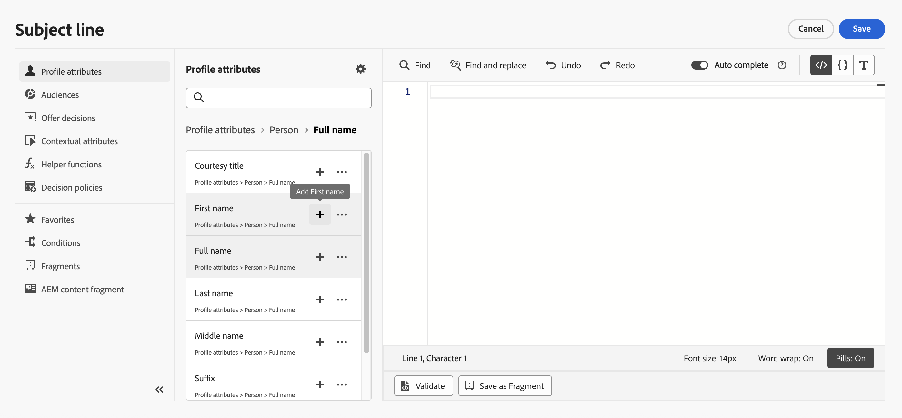
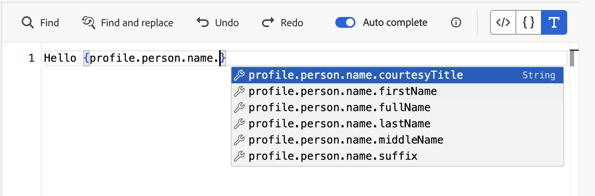

# Adición de personalización {#build-personalization-expressions}

>[!BEGINSHADEBOX]

**En esta página:** Aprenda a utilizar el editor de personalización para agregar, personalizar y validar expresiones de personalización de fuentes como atributos de perfil, audiencias, decisiones de oferta y atributos contextuales.

>[!ENDSHADEBOX]

>[!CONTEXTUALHELP]
>id="ajo_perso_editor"
>title="Acerca del editor de personalización"
>abstract="El editor de personalización permite seleccionar, organizar, personalizar y validar todos los datos para crear una personalización ajustada del contenido."

El editor de personalización es la pieza central de la personalización en [!DNL Journey Optimizer]. Está disponible en todos los contextos en los que necesita definir la personalización, como correos electrónicos, notificaciones push y ofertas.

En la interfaz del editor de personalización, puede seleccionar, organizar, personalizar y validar todos los datos para crear una personalización personalizada para el contenido.


## ¿Dónde puedo añadir la personalización? {#where}

Puede agregar personalización en **[!DNL Journey Optimizer]** en todos los campos con el icono . Expanda las secciones siguientes para obtener más detalles.

+++Mensajes

En los mensajes, la personalización se puede agregar en diferentes ubicaciones de los mensajes, como en el campo **[!UICONTROL Línea de asunto]**.


También se puede añadir en otras secciones del contenido. Por ejemplo, para [notificaciones push](../push/push-gs.md), se puede agregar personalización en los campos **Título**, **Cuerpo**, **Sonido personalizado**, **Insignias** y **Datos personalizados**.

+++

+++Diseñador de correo electrónico

Al editar el contenido del correo electrónico en [Email Designer](../email/get-started-email-design.md), puede añadir personalización en la mayoría de los elementos de texto mediante el icono de la barra de herramientas contextual.


+++

+++URL

Journey Optimizer también le permite personalizar **direcciones URL** en sus mensajes. Las direcciones URL personalizadas llevan a los destinatarios a páginas específicas de un sitio web o a un micrositio personalizado, según los atributos del perfil. [Más información](../email/url-personalization.md)

{width="50%"}

>[!NOTE]
>
>La personalización de URL está disponible para estos tipos de vínculos: **Vínculo externo**, **Vínculo de baja** y **Exclusión**.

+++

+++Configuración de correo electrónico

Al crear una configuración de canal de correo electrónico, puede definir valores personalizados para subdominios, encabezados y parámetros de seguimiento de URL. [Más información](../email/surface-personalization.md)

+++

+++Ofertas

Puede agregar personalización al usar contenido de tipo texto en las representaciones de **ofertas**. [Aprenda a crear ofertas personalizadas](../offers/offer-library/creating-personalized-offers.md)

+++

## Fuentes de Personalization {#sources}

El panel de navegación permite seleccionar el origen de la personalización. Los orígenes disponibles son:

* **[!UICONTROL Atributos de perfil]** : enumera todas las referencias asociadas al esquema de perfil que se describen en [Documentación del Modelo de datos de Adobe Experience Platform (XDM)](https://experienceleague.adobe.com/docs/experience-platform/xdm/home.html?lang=es){target="_blank"}.
* **[!UICONTROL Atributos de destino]**: esta carpeta es específica para campañas orquestadas. Contiene atributos calculados directamente dentro del lienzo de la campaña. [Aprenda a agregar personalización en campañas organizadas](../orchestrated/add-personalization.md)
* **[!UICONTROL Audiencias]** : enumera todas las audiencias creadas en el servicio de segmentación de Adobe Experience Platform. Obtenga más información en la [documentación de segmentación de Adobe Experience Platform](https://experienceleague.adobe.com/docs/experience-platform/segmentation/home.html?lang=es){target="_blank"}.
* **[!UICONTROL Decisiones de oferta]** : enumera todas las ofertas asociadas a una ubicación específica. Seleccione la ubicación e inserte las ofertas en el contenido. Para obtener una documentación completa sobre cómo administrar ofertas, consulte [esta sección](../offers/get-started/starting-offer-decisioning.md).
* **[!UICONTROL Atributos contextuales]**: cuando se utiliza una actividad de acción del canal (correo electrónico, push, SMS) en un recorrido o una campaña, los atributos contextuales relacionados con eventos y propiedades están disponibles para personalización. En [esta sección](personalization-use-case.md) se presenta un ejemplo de personalización que aprovecha atributos contextuales. Además, se pueden utilizar respuestas de acción personalizadas para la personalización. [Aprenda a utilizar respuestas de acción personalizadas en canales nativos](../action/action-response.md#response-in-channels).

>[!NOTE]
>
>Si va a segmentar una audiencia con atributos de enriquecimiento generados mediante un flujo de trabajo de composición, puede aprovechar estos atributos de enriquecimiento para personalizar el mensaje. [Aprenda a utilizar los atributos de enriquecimiento de audiencias](../audience/about-audiences.md#enrichment)

## Adición de personalización {#add}

>[!CONTEXTUALHELP]
>id="ajo_perso_editor_autocomplete"
>title="Autocompletar"
>abstract="Al activar esta opción el sistema sugiere y completa automáticamente el código mientras se escribe. Esta función solo está disponible en los formatos HTML y texto, y admite atributos de perfil y contexto. Si se desactiva mediante el conmutador, el editor proporcionará el autocompletado de código HTML nativo en su lugar."

En el espacio de trabajo central se crea la sintaxis de personalización. Para utilizar un atributo para personalizar el mensaje, localícelo en el panel de navegación izquierdo y haga clic en el botón `+` para agregarlo a la expresión.



El menú de los tres puntos situado junto al icono `+` le permite obtener más información sobre cada atributo y agregar a los favoritos los atributos utilizados con más frecuencia. Se puede acceder a los atributos agregados a favoritos desde el menú **[!UICONTROL Favoritos]** del panel de navegación.

>[!NOTE]
>
>De forma predeterminada, el panel Atributos solo muestra los atributos rellenados. Para mostrar todos los atributos, seleccione el botón  situado encima del campo de búsqueda y desactive la opción **[!UICONTROL Mostrar solo atributos rellenados]**.

Además, puede definir el texto de reserva predeterminado que se mostrará si un atributo de perfil de tipo cadena está vacío. Para ello, haga clic en el botón de puntos suspensivos situado junto al atributo y seleccione **[!UICONTROL Insertar con texto de reserva]**. Escriba el texto que debería mostrarse de forma predeterminada si el valor del atributo está vacío para un perfil y, a continuación, haga clic en **[!UICONTROL Agregar]**.


En el siguiente ejemplo, el editor de personalización le permite seleccionar los perfiles que tienen su cumpleaños hoy y luego completar la personalización insertando una oferta específica correspondiente a este día.


## Opciones para la edición de expresiones {#options}

El espacio de trabajo central proporciona varias herramientas para ayudarle a escribir su expresión de personalización.


Entre las opciones disponibles se encuentran:

1. **[!UICONTROL Buscar]** / **[!UICONTROL Buscar y reemplazar]**: Busca a través de tu expresión y reemplaza automáticamente partes de código.
1. **[!UICONTROL Deshacer]** / **[!UICONTROL Rehacer]**: Deshacer / Rehacer la última operación.
1. **[!UICONTROL Completar automáticamente]**: sugiere y completa automáticamente el código mientras escribe. Esta función solo está disponible en los formatos HTML y texto, y admite atributos de perfil y contexto. Si se desactiva mediante el conmutador, el editor proporcionará el autocompletado de código HTML nativo en su lugar.

   {width="70%" align="center" zoomable="yes"}

1. **[!UICONTROL HTML]** / **[!UICONTROL JSON]** / **[!UICONTROL Text]**: identifique el formato de su código. Esto permite al sistema adaptar la función de validación y autocompletar en función del idioma seleccionado.
1. **[!UICONTROL Validar]**: compruebe la sintaxis de su expresión. Obtenga más información en [esta sección](../personalization/personalization-build-expressions.md).
1. **[!UICONTROL Guardar como fragmento]**: guarde la expresión como un fragmento de expresión. Obtenga más información en [esta sección](../content-management/save-fragments.md#save-as-expression-fragment)
1. **[!UICONTROL Tamaño de fuente]**: Ajusta el tamaño de fuente del contenido dentro del editor para mejorar la legibilidad.
1. **[!UICONTROL Ajuste de palabras]**: habilita o deshabilita el ajuste de palabras, lo que permite que las expresiones largas se muestren en una sola línea o se ajusten dentro del editor. Las opciones incluyen:
   * **Desactivado** (Predeterminado) - Sin ajuste de palabras. Las líneas largas se extienden más allá de la vista del editor y requieren un desplazamiento horizontal.
   * **Activado**: ajusta líneas en la anchura del editor.
   * **Columna de ajuste de línea**: ajusta las líneas cuando los caracteres de una línea alcanzan los 80 caracteres.
   * **Redondeado**: ajusta las líneas en la anchura del editor o en 80 caracteres, el valor que sea menor.
1. **[!UICONTROL Pills]**: muestra los atributos como &quot;píldoras&quot; compactas para mejorar la legibilidad al ocultar rutas de atributos largas. Haga clic en un atributo para mostrar su ruta completa.

   >[!NOTE]
   >
   >Esta opción solo está disponible para atributos de perfil, atributos contextuales y medios dinámicos.

En el panel de navegación, hay disponibles funciones adicionales que le ayudarán a crear su expresión de personalización.


* **[!UICONTROL Funciones de ayuda]**: las funciones de ayuda le permiten realizar operaciones en los datos, como cálculos, conversiones o formato de datos, condiciones y manipularlos en el contexto de la personalización. [Más información sobre las funciones de ayuda disponibles](functions/functions.md)

* **[!UICONTROL Favoritos]**: los atributos que agregó a los favoritos se muestran en esta lista. Esto le permite acceder rápidamente a los elementos utilizados con más frecuencia. Para agregar un atributo a tus favoritos, haz clic en el menú de los tres puntos y elige **[!UICONTROL Agregar a favoritos]**.

* **[!UICONTROL Condiciones]**: aproveche las reglas condicionales creadas en la biblioteca para agregar contenido dinámico a los mensajes. Esto le permite crear varias variantes del mensaje en función de las condiciones. [Aprenda a crear contenido dinámico](../personalization/get-started-dynamic-content.md)

* **[!UICONTROL Fragmentos]**: aproveche los fragmentos de expresiones que se han creado o guardado en la zona protegida actual. Un fragmento es un componente reutilizable al que se puede hacer referencia en [!DNL Journey Optimizer] campañas y recorridos. Esta funcionalidad permite generar previamente varios bloques de contenido personalizados que los usuarios de marketing pueden utilizar para ensamblar contenido rápidamente en un proceso de diseño mejorado. [Aprenda a utilizar fragmentos de expresiones para la personalización](../personalization/use-expression-fragments.md)

>[!TIP]
>
>¿Busca expresiones listas para usar? La página **[Fórmulas de Personalization](personalization-recipes.md)** proporciona patrones de copiar y pegar para los casos de uso más comunes: formato de fecha, temporizadores de cuenta atrás, reserva condicional, visualización de solo tiempo y más.

Una vez que la expresión personalizada está lista, el editor de personalización debe validarla. Obtenga más información en [esta sección](../personalization/personalization-build-expressions.md).

## Mecanismos de validación {#validation-mechanisms}

La validación de la expresión se ejecuta automáticamente al hacer clic en el botón **Agregar** para cerrar la ventana del editor. También puede usar el botón **Validar** para comprobar la sintaxis de personalización.


Expanda la sección siguiente para ver los errores comunes que pueden producirse al validar la personalización.

+++Errores comunes

* **No se encontró la ruta &quot;XYZ&quot;**

Al intentar hacer referencia a un campo que no está definido en el esquema.

En este caso **firstName1** no está definido como atributo en el esquema de perfil:

```
{{profile.person.name.firstName1}}
```

* **No coinciden los tipos para la variable &quot;XYZ&quot;. Matriz esperada. Se encontró la cadena.**

Al intentar repetir una cadena en lugar de una matriz.

En este caso **product** no es una matriz:

```
{{each profile.person.name.firstName as |product|}}
 {{product.productName}}
{{/each}}
```

* **Sintaxis de handlebars no válida. Se encontró`'[XYZ}}'`**

Cuando se utiliza sintaxis de handlebars no válida.

Las expresiones Handlebars están rodeadas por **{{expression}}**

```
   {{[profile.person.name.firstName}}
```

* **Definición de segmento no válida**

```
No segment definition found for 988afe9f0-d4ae-42c8-a0be-8d90e66e151
```

+++

En el caso de las ofertas, pueden producirse errores específicos. Expanda la sección siguiente para obtener más detalles:

+++ Errores específicos relacionados con las ofertas

Los errores relacionados con la integración de ofertas en un mensaje de correo electrónico o push tienen el siguiente patrón:

```
Offer.<offerType>.[PlacementID].[ActivityID].<offer-attribute>
```

La validación se realiza durante la validación del contenido de personalización en el editor de personalización.

<table> 
 <thead> 
  <tr> 
   <th> Título del error <br /> </th> 
   <th> Validación/resolución <br /> </th> 
  </tr> 
 </thead> 
 <tbody> 
  <tr> 
   <td>No se ha encontrado el recurso con ID de colocación y tipo OfferPlacement <br/>
No se ha encontrado el recurso con ID de actividad y tipo de actividad de oferta<br/></td> 
   <td>Comprobar si ActivityID o PlacementID están disponibles</td> 
  </tr> 
   <tr> 
   <td>No se ha podido validar el recurso.</td> 
   <td>El componentType de Placement debe coincidir con la oferta de offerType</td> 
  </tr> 
   <tr> 
   <td>La URL pública no está presente en offerId.</td> 
   <td>Las ofertas de imágenes (todas personalizadas y de reserva asociadas con el par de decisión y ubicación) deben tener rellenada una URL pública (deliveryURL no debe estar vacío).</td> 
  </tr> 
  <tr> 
   <td>La decisión contiene atributos que no son de perfil.</td> 
   <td>El uso del modelo de ofertas debe contener solo los atributos de perfil.</td> 
  </tr> 
  <tr> 
   <td>Error al recuperar el uso de decisión.</td> 
   <td>Este error se puede producir cuando la API intenta recuperar el modelo de oferta.</td> 
  </tr>
  <tr> 
   <td>Offer Attribute offer-attribute no es válido.</td> 
   <td>Compruebe si el atributo de oferta al que se hace referencia en la colocación de oferta es válido. A continuación se muestran los atributos válidos: <br/>
Imagen: deliveryURL, linkURL<br/>
Texto: content<br/>
HTML: content<br/></td> 
  </tr> 
 </tbody> 
</table>

+++
