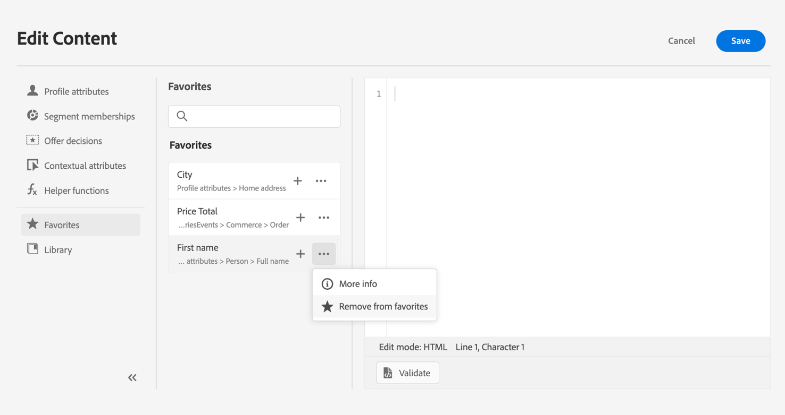

# Añadir atributos a favoritos {#fav}

Añadir atributos diferentes al menú de favoritos permite acceder rápidamente a los elementos utilizados con más frecuencia. Para agregar un atributo a tus favoritos, haz clic en el menú de elipse y elige **[!UICONTROL Agregar a favoritos]**.

<!--

-->

Para tener acceso a los elementos que ha marcado como favoritos, use el menú **[!UICONTROL Favoritos]** del panel izquierdo.

Desde esta lista puede añadir rápidamente el objeto de personalización a la expresión actual.

<!--

-->

Si deseas dejar de ver un artículo en tu lista de favoritos, puedes eliminarlo de Favoritos.

<!--

-->
