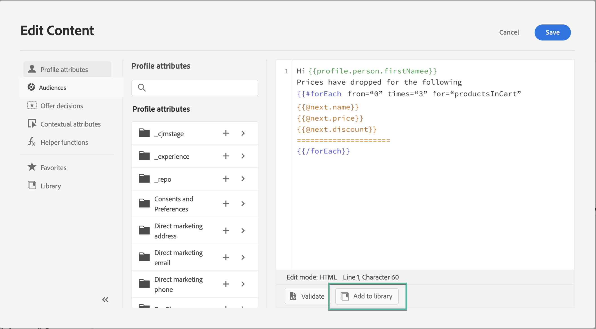

# Trabajar con expresiones guardadas {#expression-library}

>[!CONTEXTUALHELP]
>id="ajo_perso_library"
>title="Acerca de la biblioteca de expresiones"
>abstract="[!DNL Journey Optimizer] proporciona una biblioteca en la que puede acceder a las expresiones de personalización guardadas que han configurado los usuarios administradores. "

[!DNL Journey Optimizer] proporciona una biblioteca en la que puede acceder a las expresiones de personalización guardadas anteriormente que han agregado los usuarios administradores.

1. Para acceder a las expresiones guardadas, haga clic en el botón **[!UICONTROL Library]** en el panel izquierdo. La lista muestra todas las expresiones que los usuarios administradores han guardado (consulte [Guardar expresiones en la biblioteca](#save-expressions)).

   >[!NOTE]
   >
   >Puede utilizar el botón info para obtener más información sobre el contenido de una expresión guardada. Si tiene los permisos adecuados para administrar los elementos de la biblioteca, el botón de información aparecerá en el menú elipse.

   

1. Haga clic en + para insertar la expresión en el editor. A continuación, puede personalizar y validar el contenido de personalización como de costumbre. [Más información](../personalization/personalization-build-expressions.md)

   

## Guardar una expresión en la biblioteca {#save-expressions}

[!DNL Journey Optimizer] permite a los usuarios administradores guardar expresiones de personalización en la biblioteca. Estas expresiones estarán disponibles para todos los usuarios para crear contenido de personalización.

Para guardar una expresión en la biblioteca, siga estos pasos:

1. En la interfaz del editor, cree la expresión y haga clic en **[!UICONTROL Add to library]**.

   >[!NOTE]
   >
   >Si el botón no está visible, compruebe en el Admin Console que dispone de los permisos necesarios (consulte [Niveles de permisos](../administration/high-low-permissions.md)).

   

1. En el panel derecho, introduzca un título y una descripción para la expresión para ayudar a los usuarios a encontrarla más fácilmente y, a continuación, haga clic en **[!UICONTROL Add]**.

   

1. La expresión se agrega a la biblioteca . Los usuarios ahora pueden usarlo para crear su contenido personalizado.

>[!NOTE]
>
>* Se guardan hasta 40 expresiones en la biblioteca.
>
>* Las expresiones no pueden superar los 200 KB.
>
>* Las expresiones guardadas se ordenan por fecha de creación: la expresión agregada recientemente se mostrará primero en la lista.

Para editar una expresión existente, agréguela al editor y luego modifíquela según sus necesidades. Haga clic en **[!UICONTROL Add to library]** para validar la sintaxis y guardar la expresión.

Para eliminar una expresión, haga clic en el botón elipse y luego en **[!UICONTROL Delete]**.
