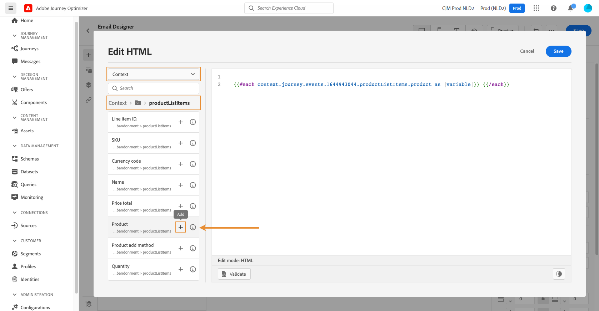
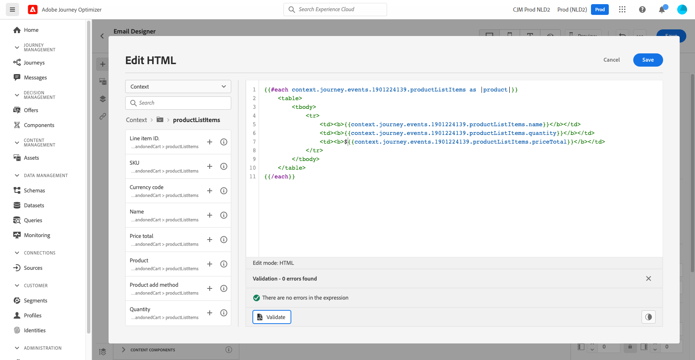

# Caso de uso de personalización: correo electrónico de abandono del carro de compras {#personalization-use-case-helper-functions}

En este ejemplo, personalizará el cuerpo de un mensaje de correo electrónico. Este mensaje está dirigido a los clientes que han dejado artículos en el carro de compras, pero no han completado su compra.

Utilizará estos tipos de funciones de ayuda:

* La variable `upperCase` función de cadena, para insertar el nombre del cliente en mayúsculas. [Más información](functions/string.md#upper).
* La variable `each` ayuda, para enumerar los elementos que están en el carro de compras. [Más información](functions/helpers.md#each).
* La variable `if` para insertar una nota específica del producto si el producto relacionado está en el carro de compras. [Más información](functions/helpers.md#if-function).

<!-- **Context**: personalization based on contextual data from the journey -->

Antes de comenzar, asegúrese de que sabe cómo configurar estos elementos:
* Un mensaje de correo electrónico. [Más información](../messages/create-message.md)
* El cuerpo de un correo electrónico. [Más información](../messages/create-email-content.md).
* Un evento unitario. [Más información](../event/about-events.md).
* Recorrido que comienza con un evento. [Más información](../building-journeys/using-the-journey-designer.md).

Siga estos pasos:
1. [Creación de un mensaje de correo electrónico](#configure-email).
1. [Inserte el nombre del cliente en mayúsculas](#uppercase-function).
1. [Crear el evento inicial y el recorrido](#create-context).
1. [Añadir el contenido del carro de compras al correo electrónico](#each-helper).
1. [Insertar una nota específica del producto](#if-helper).
1. [Prueba y publicación del recorrido](#test-and-publish).

## Paso 1: Creación del correo electrónico{#configure-email}

1. Cree o modifique un mensaje de correo electrónico y, a continuación, haga clic en **[!UICONTROL Email Designer]**.
   

1. En la paleta izquierda de la página principal del Diseñador de correo electrónico, arrastre y suelte tres componentes de estructura en el cuerpo del mensaje.

1. Arrastre y suelte un componente de contenido de HTML en cada componente de estructura nuevo.

   

## Paso 2: Inserte el nombre del cliente en mayúsculas {#uppercase-function}

1. En la página de inicio del Diseñador de correo electrónico, haga clic en el componente HTML en el que desea agregar el nombre del cliente.
1. En la barra de herramientas contextual, haga clic en **[!UICONTROL Show the source code]**.

   

1. En el **[!UICONTROL Edit HTML]** , añada la variable `upperCase` función de cadena:
   1. En la lista, seleccione **[!UICONTROL Helper functions]**.
   1. Utilice el campo de búsqueda para buscar &quot;mayúsculas&quot;.
   1. En los resultados de la búsqueda, añada la variable `upperCase` función. Para ello, haga clic en el signo más (+) situado junto a `: string`.

      El editor de expresiones muestra esta expresión:

      ```handlebars
      
      ```

      

1. Elimine el marcador de posición &quot;cadena&quot; de la expresión.
1. Añada el token de nombre:
   1. En la lista, seleccione **[!UICONTROL Profile]**.
   1. Seleccione **[!UICONTROL Profile]** > **[!UICONTROL Person]** > **[!UICONTROL Full name]**.
   1. Agregue la variable **[!UICONTROL First name]** token a la expresión.

      El editor de expresiones muestra esta expresión:

      ```handlebars
      
      ```

      

      Obtenga más información sobre el tipo de datos de nombre de persona [Documentación de Adobe Experience Platform](https://experienceleague.adobe.com/docs/experience-platform/xdm/data-types/person-name.html){target=&quot;_blank&quot;}.

1. Haga clic en **[!UICONTROL Validate]**, luego en **[!UICONTROL Save]**.

   
1. Guarde el mensaje.

## Paso 3: Crear el evento inicial y el recorrido relacionado {#create-context}

El contenido del carro de compras es información contextual del recorrido. Por lo tanto, debe añadir un evento inicial y el correo electrónico a un recorrido para poder añadir al correo electrónico información específica del carro de compras.

1. Cree un evento cuyo esquema incluya la variable `productListItems` matriz.
1. Defina todos los campos de esta matriz como campos de carga útil para este evento.

   Obtenga más información sobre el tipo de datos del elemento de la lista de productos [Documentación de Adobe Experience Platform](https://experienceleague.adobe.com/docs/experience-platform/xdm/data-types/product-list-item.html){target=&quot;_blank&quot;}.

1. Cree un recorrido que comience con este evento.
1. Añada el mensaje al recorrido.
1. Finalice el recorrido con una actividad final.

   Como aún no ha publicado el mensaje, no puede probar ni publicar el recorrido.

   

1. Haga clic en **[!UICONTROL OK]**.

   Un mensaje le informa de que el contexto del recorrido se ha pasado al mensaje.

   

## Paso 4: Inserte la lista de elementos del carro de compras {#each-helper}

1. Vuelva a abrir el mensaje.

   

1. En la página de inicio del Diseñador de correo electrónico, haga clic en el componente HTML en el que desea enumerar el contenido del carro de compras.
1. En la barra de herramientas contextual, haga clic en **[!UICONTROL Show the source code]**.

   

1. En el **[!UICONTROL Edit HTML]** , añada la variable `each` ayuda:
   1. En la lista, seleccione **[!UICONTROL Helper functions]**.
   1. Utilice el campo de búsqueda para encontrar &quot;cada uno&quot;.
   1. En los resultados de la búsqueda, añada la variable `each` ayuda.

      El editor de expresiones muestra esta expresión:

      ```handlebars
      {{#each someArray as |variable|}} {{/each}}
      ```

      

1. Agregue la variable `productListItems` a la expresión:

   1. Elimine el marcador de posición &quot;someArray&quot; de la expresión.
   1. En la lista, seleccione **[!UICONTROL Context]**.

      La variable **[!UICONTROL Context]** solo está disponible una vez que el contexto de recorrido se ha pasado al mensaje.

   1. Select **[!UICONTROL Journey Orchestration]** > **[!UICONTROL Events]** > ***[!UICONTROL event_name]*** y, a continuación, expanda la variable **[!UICONTROL productListItems]** nodo .

      En este ejemplo, *event_name* representa el nombre del evento.

   1. Agregue la variable **[!UICONTROL Product]** token a la expresión.

      El editor de expresiones muestra esta expresión:

      ```handlebars
      {{#each context.journey.events.event_ID.productListItems.product as |variable|}} {{/each}}
      ```
      En este ejemplo, *event_ID* representa el ID del evento.

      

   1. Modifique la expresión:
      1. Elimine la cadena &quot;.product&quot;.
      1. Reemplace el marcador de posición &quot;variable&quot; por &quot;product&quot;.

      Este ejemplo muestra la expresión modificada:

      ```handlebars
      {{#each context.journey.events.event_ID.productListItems as |product|}}
      ```
1. Pegue este código entre la etiqueta de apertura `{{#each}}` y la `{/each}}` etiqueta:

   ```html
   <table>
      <tbody>
         <tr>
            <td><b>#name</b></td>
            <td><b>#quantity</b></td>
            <td><b>$#priceTotal</b></td>
         </tr>
      </tbody>
   </table>
   ```

1. Agregue los tokens de personalización para el nombre del artículo, la cantidad y el precio:

   1. Elimine el marcador de posición &quot;#name&quot; de la tabla HTML.
   1. A partir de los resultados de búsqueda anteriores, añada la variable **[!UICONTROL Name]** token a la expresión.

   Repita estos pasos dos veces:
   * Sustituya el marcador de posición &quot;#quantity&quot; por el **[!UICONTROL Quantity]** token.
   * Sustituya el marcador de posición &quot;#priceTotal&quot; por el **[!UICONTROL Total price]** token.

   Este ejemplo muestra la expresión modificada:

   ```handlebars
   {{#each context.journey.events.event_ID.productListItems as |product|}}
      <table>
         <tbody>
            <tr>
               <td><b>{{context.journey.events.event_ID.productListItems.name}}</b></td>
               <td><b>{{context.journey.events.event_ID.productListItems.quantity}}</b></td>
               <td><b>${{context.journey.events.event_ID.productListItems.priceTotal}}</b></td>
            </tr>
         </tbody>
      </table>
   {{/each}}
   ```
1. Haga clic en **[!UICONTROL Validate]**, luego en **[!UICONTROL Save]**.
   

## Paso 5: Insertar una nota específica del producto {#if-helper}

1. En la página de inicio del Diseñador de correo electrónico, haga clic en el componente HTML en el que desea insertar la nota.
1. En la barra de herramientas contextual, haga clic en **[!UICONTROL Show the source code]**.

   

1. En el **[!UICONTROL Edit HTML]** , añada la variable `if` ayuda:
   1. En la lista, seleccione **[!UICONTROL Helper functions]**.
   1. Utilice el campo de búsqueda para encontrar &quot;if&quot;.
   1. En los resultados de la búsqueda, añada la variable `if` ayuda.

      El editor de expresiones muestra esta expresión:

      ```handlebars
       render_1
          render_2
          default_render
      
      ```
      

1. Elimine esta condición de la expresión:

   ```handlebars
    render_2
   ```

   Este ejemplo muestra la expresión modificada:

   ```handlebars
    render_1
       default_render
   
   ```

1. Agregue el token del nombre del producto a la condición:
   1. Elimine el marcador de posición &quot;condición1&quot; de la expresión.
   1. En la lista, seleccione **[!UICONTROL Context]**.
   1. Select **[!UICONTROL Journey Orchestration]** > **[!UICONTROL Events]** > ***[!UICONTROL event_name]*** y, a continuación, expanda la variable **[!UICONTROL productListItems]** nodo .

      En este ejemplo, *event_name* representa el nombre del evento.

   1. Agregue la variable **[!UICONTROL Name]** token a la expresión.

      El editor de expresiones muestra esta expresión:

      ```handlebars
      
         render_1
          default_render
      
      ```
      

1. Modifique la expresión:
   1. En el editor de expresiones, especifique el nombre del producto después de la variable `name` token.

      Utilice esta sintaxis, donde *product_name* representa el nombre del producto:

      ```javascript
      = "product_name"
      ```

      En este ejemplo, el nombre del producto es &quot;Juno Jacket&quot;:

      ```handlebars
      
         render_1
          default_render
      
      ```

   1. Reemplace el marcador de posición &quot;render_1&quot; por el texto de la nota.

      Ejemplo:

      ```handlebars
      
         Due to longer than usual lead times on the Juno Jacket, please expect item to ship two weeks after purchase.
          default_render
      
      ```
   1. Elimine el marcador de posición &quot;default_render&quot; de la expresión.
1. Haga clic en **[!UICONTROL Validate]**, luego en **[!UICONTROL Save]**.

   

1. Guarde y publique el mensaje.

## Paso 6: Prueba y publicación del recorrido {#test-and-publish}

1. Abra el recorrido. Si el recorrido ya está abierto, actualice la página.
1. Active la **[!UICONTROL Test]** alterne y haga clic en **[!UICONTROL Trigger an event]**.

   Solo puede activar el modo de prueba después de publicar el mensaje.

   

1. En el **[!UICONTROL Event configuration]** , introduzca los valores de entrada y, a continuación, haga clic en **[!UICONTROL Send]**.

   El modo de prueba solo funciona con perfiles de prueba.

   

   El correo electrónico se envía a la dirección del perfil de prueba.

   En este ejemplo, el correo electrónico contiene la nota sobre la Chaqueta Juno porque este producto está en el carro de compras:

   

1. Compruebe que no haya error y, a continuación, publique el recorrido.


## Temas relacionados {#related-topics}

### Funciones de Handlebars {#handlebars}

* [Ayudantes](functions/helpers.md)

* [Funciones de cadena](functions/string.md)

### Casos de uso {#use-case}

* [Personalización con información de perfil, contexto y oferta](personalization-use-case.md)

* [Personalización con oferta basada en decisiones](../offers/offers-e2e.md)

## Tutorial en vídeo{#helper-functions-video}

>[!VIDEO](https://video.tv.adobe.com/v/334244?quality=12)
