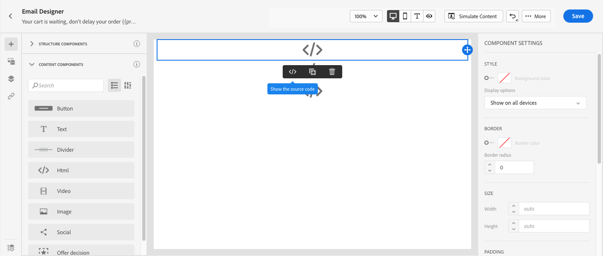
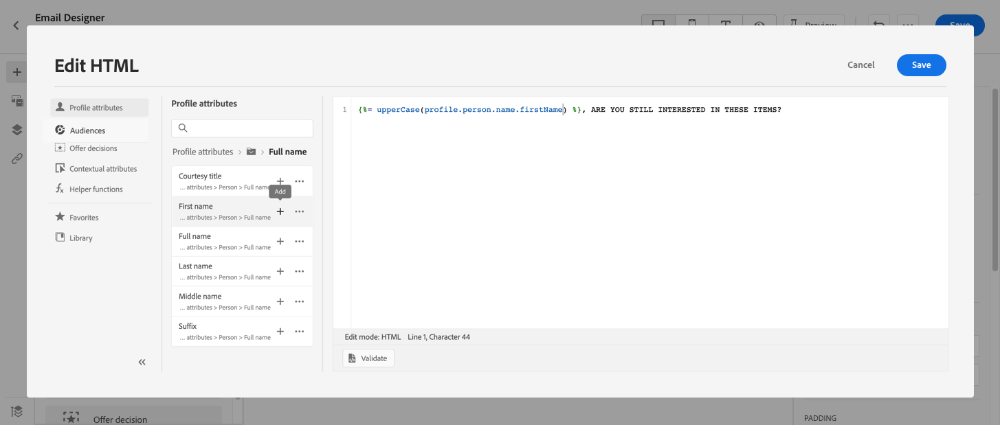

# Caso de uso de Personalization: correo electrónico de abandono del carro de compras {#personalization-use-case-helper-functions}

En este ejemplo, personalizará el cuerpo de un mensaje de correo electrónico. Este mensaje va dirigido a los clientes que han dejado artículos en el carro de compras, pero que aún no han finalizado su compra.

Utilizará estos tipos de funciones de ayuda:

* La función de cadena `upperCase`, para insertar el nombre del cliente en mayúsculas. [Más información](functions/string.md#upper).
* El asistente `each`, para enumerar los elementos que están en el carro de compras. [Más información](functions/helpers.md#each).
* El ayudante `if` para insertar una nota específica del producto si el producto relacionado está en el carro de compras. [Más información](functions/helpers.md#if-function).
<!-- **Context**: personalization based on contextual data from the journey -->

➡️ [Aprenda a utilizar las funciones de ayuda en este vídeo](#video)

Antes de empezar, asegúrese de saber cómo configurar estos elementos:

* Un evento unitario. [Más información](../event/about-events.md).
* Un recorrido que comienza con un evento. [Más información](../building-journeys/using-the-journey-designer.md).
* Un mensaje de correo electrónico en el recorrido. [Más información](../email/create-email.md)
* Cuerpo de un correo electrónico. [Más información](../email/content-from-scratch.md).

Siga estos pasos:

1. [Cree el evento inicial y el recorrido](#create-context).
1. [Crear un mensaje de correo electrónico](#configure-email).
1. [Insertar el nombre del cliente en mayúsculas](#uppercase-function).
1. [Agregar el contenido del carro de compras al correo electrónico](#each-helper).
1. [Insertar una nota específica de producto](#if-helper).
1. [Probar y publicar el recorrido](#test-and-publish).

## Paso 1: crear el evento inicial y el recorrido relacionado {#create-context}

El contenido del carro de compras es información contextual del recorrido. Por lo tanto, debe agregar un evento inicial y el correo electrónico a un recorrido antes de poder agregar información específica del carro de compras al correo electrónico.

1. Cree un evento cuyo esquema incluya la matriz `productListItems`.
1. Defina todos los campos de esta matriz como campos de carga útil para este evento.

   Obtenga más información acerca del tipo de datos de elementos de la lista de productos en [Documentación de Adobe Experience Platform](https://experienceleague.adobe.com/docs/experience-platform/xdm/data-types/product-list-item.html){target="_blank"}.

1. Cree un recorrido que comience con este evento.
1. Agregue una actividad **Correo electrónico** al recorrido.

   

## Paso 2: crear el correo electrónico{#configure-email}

1. En la actividad **Correo electrónico**, haga clic en **[!UICONTROL Editar contenido]** y luego en **[!UICONTROL Enviar correo electrónico a Designer]**.

   

1. En la paleta izquierda de la página de inicio de Designer de correo electrónico, arrastre y suelte tres componentes de estructura en el cuerpo del mensaje.

1. Arrastre y suelte un componente de contenido de HTML en cada nuevo componente de estructura.

   

## Paso 3: Insertar el nombre del cliente en mayúsculas {#uppercase-function}

1. En la página de inicio de Designer de correo electrónico, haga clic en el componente HTML donde desea agregar el nombre del cliente.
1. En la barra de herramientas contextual, haga clic en **[!UICONTROL Mostrar el código fuente]**.

   

1. En la ventana **[!UICONTROL Editar HTML]**, agregue la función de cadena `upperCase`:
   1. En el menú de la izquierda, seleccione **[!UICONTROL Funciones de ayuda]**.
   1. Utilice el campo de búsqueda para encontrar &quot;mayúsculas&quot;.
   1. En los resultados de búsqueda, agregue la función `upperCase`. Para ello, haga clic en el signo más (+) junto a `: string`.

      El editor de expresiones muestra esta expresión:

      ```handlebars
      
      ```

      

1. Elimine el marcador de posición &quot;cadena&quot; de la expresión.
1. Añada el token de nombre:
   1. En el menú de la izquierda, seleccione **[!UICONTROL Atributos de perfil]**.
   1. Seleccione **[!UICONTROL Persona]** > **[!UICONTROL Nombre completo]**.
   1. Agregue el token **[!UICONTROL First name]** a la expresión.

      El editor de expresiones muestra esta expresión:

      ```handlebars
      
      ```

      

      Obtenga más información acerca del tipo de datos de nombre de persona en [Documentación de Adobe Experience Platform](https://experienceleague.adobe.com/docs/experience-platform/xdm/data-types/person-name.html){target="_blank"}.

1. Haga clic en **[!UICONTROL Validar]** y luego en **[!UICONTROL Guardar]**.

   

1. Guarde el mensaje.

## Paso 4: Insertar la lista de elementos del carro de compras {#each-helper}

1. Vuelva a abrir el contenido del mensaje.

1. En la página de inicio de Designer de correo electrónico, haga clic en el componente de HTML donde desea enumerar el contenido del carro de compras.
1. En la barra de herramientas contextual, haga clic en **[!UICONTROL Mostrar el código fuente]**.

   

1. En la ventana **[!UICONTROL Editar HTML]**, agregue el asistente de `each`:
   1. En el menú de la izquierda, seleccione **[!UICONTROL Funciones de ayuda]**.
   1. Utilice el campo de búsqueda para encontrar &quot;cada uno&quot;.
   1. En los resultados de búsqueda, agregue el ayudante `each`.

      El editor de expresiones muestra esta expresión:

      ```handlebars
      {{#each someArray as |variable|}} {{/each}}
      ```

      

1. Agregue la matriz `productListItems` a la expresión:

   1. Elimine el marcador de posición &quot;someArray&quot; de la expresión.
   1. En el menú de la izquierda, seleccione **[!UICONTROL Atributos contextuales]**.

      **[!UICONTROL Los atributos contextuales]** solo están disponibles después de que se haya pasado el contexto de recorrido al mensaje.

   1. Seleccione **[!UICONTROL Journey Optimizer]** > **[!UICONTROL Events]** > ***[!UICONTROL event_name]*** y, a continuación, expanda el nodo **[!UICONTROL productListItems]**.

      En este ejemplo, *event_name* representa el nombre del evento.

   1. Agregue el token **[!UICONTROL Product]** a la expresión.

      El editor de expresiones muestra esta expresión:

      ```handlebars
      {{#each context.journey.events.event_ID.productListItems.product as |variable|}} {{/each}}
      ```

      En este ejemplo, *event_ID* representa el identificador del evento.

      

   1. Modifique la expresión:
      1. Elimine la cadena &quot;.product&quot;.
      1. Reemplace el marcador de posición &quot;variable&quot; por &quot;producto&quot;.

      Este ejemplo muestra la expresión modificada:

      ```handlebars
      {{#each context.journey.events.event_ID.productListItems as |product|}}
      ```

1. Pegue este código entre la etiqueta `{{#each}}` de apertura y la etiqueta `{/each}}` de cierre:

   ```html
   <table>
      <tbody>
         <tr>
            <td><b>#name</b></td>
            <td><b>#quantity</b></td>
            <td><b>$#priceTotal</b></td>
         </tr>
      </tbody>
   </table>
   ```

1. Añada los tokens de personalización para el nombre del artículo, la cantidad y el precio:

   1. Elimine el marcador de posición &quot;#name&quot; de la tabla de HTML.
   1. En los resultados de búsqueda anteriores, agregue el token **[!UICONTROL Name]** a la expresión.

   Repita estos pasos dos veces:

   * Reemplace el marcador de posición &quot;#quantity&quot; por el token **[!UICONTROL Quantity]**.
   * Reemplace el marcador de posición &quot;#priceTotal&quot; por el token **[!UICONTROL Precio total]**.

   Este ejemplo muestra la expresión modificada:

   ```handlebars
   {{#each context.journey.events.event_ID.productListItems as |product|}}
      <table>
         <tbody>
            <tr>
            <td><b>{{product.name}}</b></td>
            <td><b>{{product.quantity}}</b></td>
            <td><b>${{product.priceTotal}}</b></td>
            </tr>
         </tbody>
      </table>
   {{/each}}
   ```

1. Haga clic en **[!UICONTROL Validar]** y luego en **[!UICONTROL Guardar]**.

   

## Paso 5: Insertar una nota específica del producto {#if-helper}

1. En la página de inicio de Designer de correo electrónico, haga clic en el componente de HTML en el que desea insertar la nota.
1. En la barra de herramientas contextual, haga clic en **[!UICONTROL Mostrar el código fuente]**.

   

1. En la ventana **[!UICONTROL Editar HTML]**, agregue el asistente de `if`:
   1. En el menú de la izquierda, seleccione **[!UICONTROL Funciones de ayuda]**.
   1. Utilice el campo de búsqueda para encontrar &quot;if&quot;.
   1. En los resultados de búsqueda, agregue el ayudante `if`.

      El editor de expresiones muestra esta expresión:

      ```handlebars
       render_1
          render_2
          default_render
      
      ```

      

1. Elimine esta condición de la expresión:

   ```handlebars
    render_2
   ```

   Este ejemplo muestra la expresión modificada:

   ```handlebars
    render_1
       default_render
   
   ```

1. Añada el token del nombre del producto a la condición:
   1. Elimine el marcador de posición &quot;condition1&quot; de la expresión.
   1. En el menú de la izquierda, seleccione **[!UICONTROL Atributos contextuales]**.
   1. Seleccione **[!UICONTROL Journey Orchestration]** > **[!UICONTROL Events]** > ***[!UICONTROL event_name]*** y, a continuación, expanda el nodo **[!UICONTROL productListItems]**.

      En este ejemplo, *event_name* representa el nombre del evento.

   1. Agregue el token **[!UICONTROL Name]** a la expresión.

      El editor de expresiones muestra esta expresión:

      ```handlebars
      
         render_1
          default_render
      
      ```

      

1. Modifique la expresión:
   1. En el Editor de expresiones, especifique el nombre del producto después del token `name`.

      Use esta sintaxis, donde *product_name* representa el nombre de su producto:

      ```javascript
      = "product_name"
      ```

      En este ejemplo, el nombre del producto es &quot;Juno Jacket&quot;:

      ```handlebars
      
         render_1
          default_render
      
      ```

   1. Reemplace el marcador de posición &quot;render_1&quot; por el texto de la nota.

      Por ejemplo:

      ```handlebars
      
         Due to longer than usual lead times on the Juno Jacket, please expect item to ship two weeks after purchase.
          default_render
      
      ```

   1. Elimine el marcador de posición &quot;default_render&quot; de la expresión.
1. Haga clic en **[!UICONTROL Validar]** y luego en **[!UICONTROL Guardar]**.

   

1. Guarde el mensaje.

## Paso 6: Prueba y publicación del recorrido {#test-and-publish}

1. Active la opción **[!UICONTROL Test]** y, a continuación, haga clic en **[!UICONTROL Déclencheur de un evento]**.

   

1. En la ventana **[!UICONTROL Configuración de eventos]**, escriba los valores de entrada y haga clic en **[!UICONTROL Enviar]**.

   El modo de prueba solo funciona con perfiles de prueba.

   

   El correo electrónico se envía a la dirección del perfil de prueba.

   En este ejemplo, el correo electrónico contiene la nota sobre la chaqueta Juno porque este producto está en el carro de compras:

   

1. Compruebe que no haya ningún error y, a continuación, publique el recorrido.


## Temas relacionados {#related-topics}

### Funciones de Handlebars {#handlebars}

* [Ayudantes](functions/helpers.md)

* [Funciones de cadena](functions/string.md)

### Casos de uso {#use-case}

* [Personalization con información de perfil, contexto y oferta](personalization-use-case.md)

* [Personalization con oferta basada en decisiones](../offers/offers-e2e.md)

## Vídeo práctico{#video}

Aprenda a utilizar las funciones de ayuda.

>[!VIDEO](https://video.tv.adobe.com/v/334244?quality=12)
