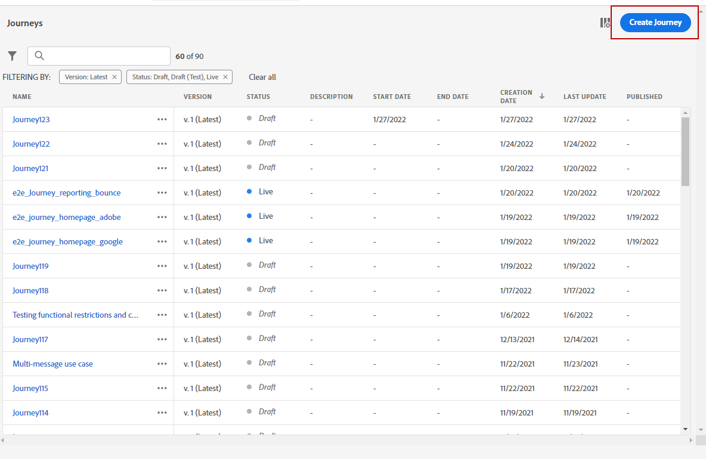
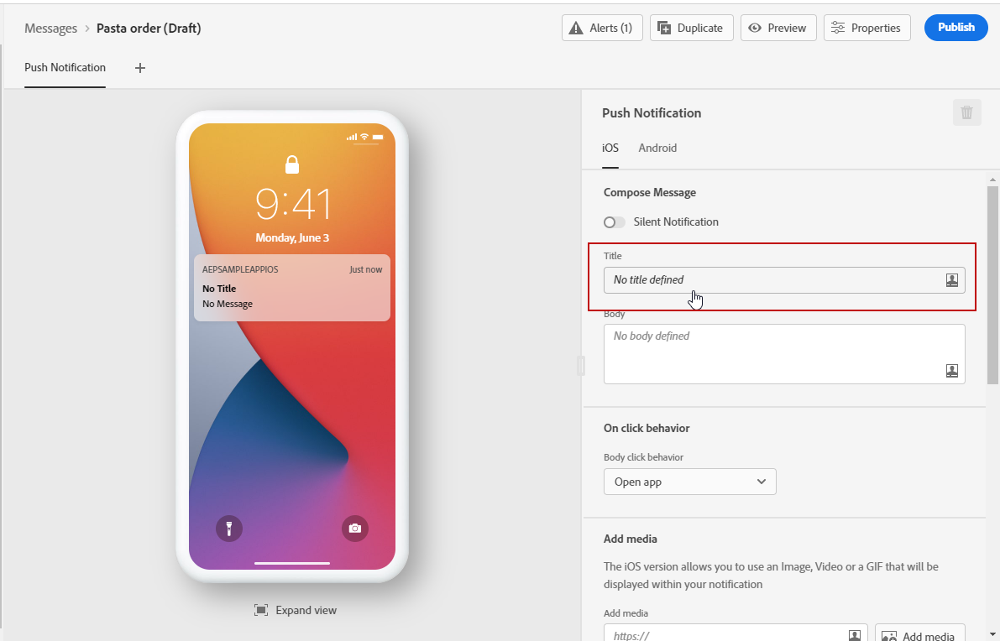
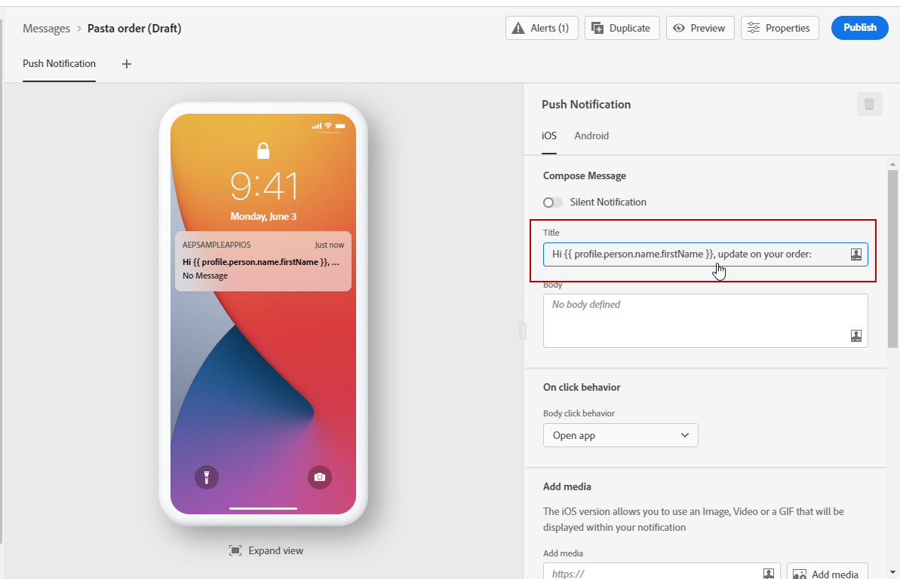
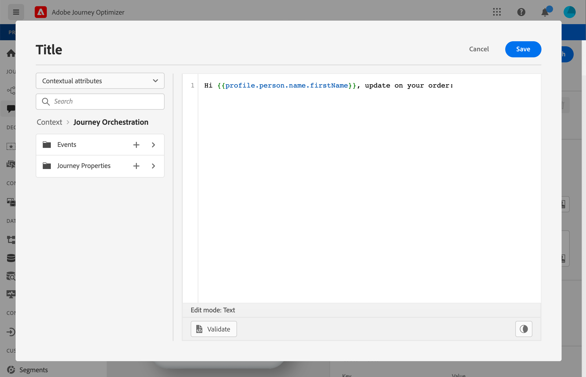
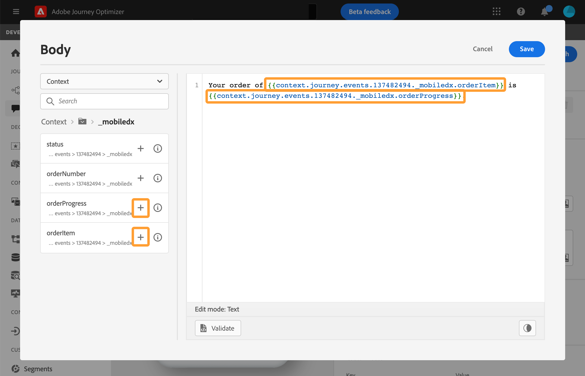
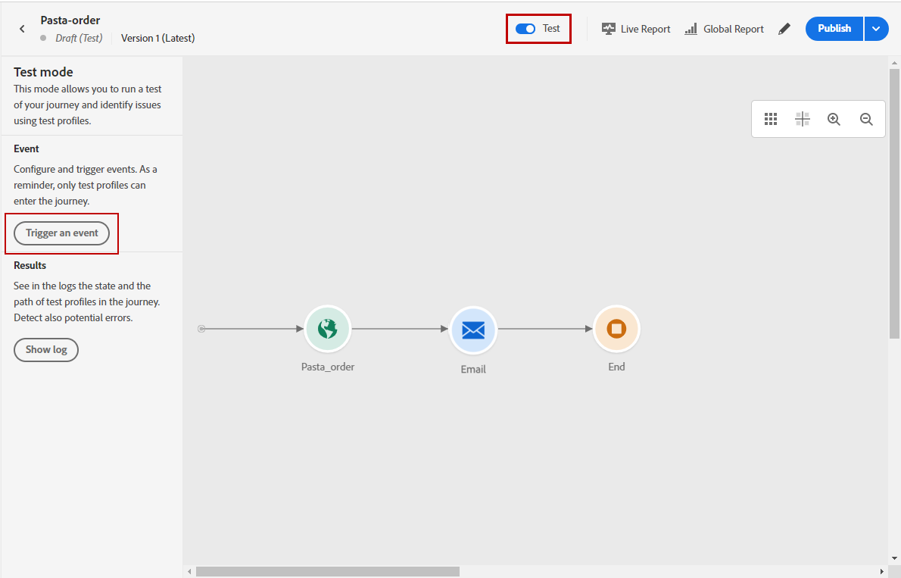
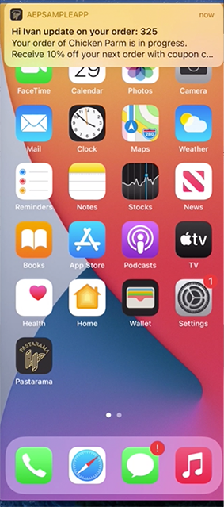

# Caso de uso de Personalization: notificación del estado del pedido {#personalization-use-case}

>[!BEGINSHADEBOX]

**En esta página:** Siga un caso de uso de estado de pedido que combine datos de perfil, decisión de oferta y recorrido contextual para personalizar una notificación push en Adobe Journey Optimizer.

>[!ENDSHADEBOX]

En este caso de uso, verá cómo utilizar varios tipos de personalización en un único mensaje de notificación push. Se utilizan tres tipos de personalización:

* **Perfil**: personalización de mensaje basada en un campo de perfil
* **Decisión de oferta**: personalización basada en variables de administración de decisiones
* **Contexto**: personalización basada en datos contextuales del recorrido

El objetivo de este ejemplo es insertar un evento en [!DNL Journey Optimizer] cada vez que se actualice un pedido de cliente. A continuación, se envía una notificación push al cliente con información sobre el pedido y una oferta personalizada.

Para este caso de uso, se necesitan los siguientes requisitos previos:

* configure un evento de pedido que incluya el número de pedido, el estado y el nombre del elemento. Consulte esta [sección](../event/about-events.md).
* crear una decisión, consulte esta [sección](../offers/offer-activities/create-offer-activities.md).

➡️ [Descubra un caso de uso similar en vídeo](#video)

## Paso 1: Creación del recorrido {#create-journey}

1. Haga clic en el menú **[!UICONTROL Recorridos]** y cree un nuevo recorrido.

   

1. Añada el evento de entrada y una actividad de acción **Push**.

   

1. Configure y diseñe su mensaje de notificación push. Consulte esta [sección](../push/create-push.md).

## Paso 2: Adición de una personalización al perfil {#add-perso}

1. En la actividad **Push**, haga clic en **Editar contenido**.

1. Haga clic en el campo **Título**.

   

1. Introduzca el asunto y añada una personalización de perfil. Utilice la barra de búsqueda para encontrar el campo de nombre del perfil. En el texto del asunto, coloque el cursor donde desee insertar el campo de personalización y haga clic en el icono **+**. Haga clic en **Guardar**.

   

## Paso 3: Adición de una personalización sobre los datos contextuales {#add-perso-contextual-data}

1. En la actividad **Push**, haga clic en **Editar contenido** y luego en el campo **Título**.

   

1. Seleccione el menú **Atributos contextuales**. Los atributos contextuales solo están disponibles si un recorrido ha pasado datos contextuales al mensaje. Haga clic en **Journey Orchestration**. Aparecerá la siguiente información contextual:

   * **Eventos**: esta categoría reagrupa todos los campos de los eventos colocados antes de la actividad de acción de canal en el recorrido.
   * **Propiedades del Recorrido**: los campos técnicos relacionados con el recorrido de un perfil determinado, por ejemplo el identificador de recorrido o los errores específicos encontrados. Obtenga más información en [Documentación de Journey Orchestration](../building-journeys/expression/journey-properties.md).

   

1. Expanda el elemento **Events** y busque el campo de número de pedido relacionado con su evento. También puede utilizar el cuadro de búsqueda. Haga clic en el icono **+** para insertar el campo de personalización en el texto del asunto. Haga clic en **Guardar**.

   

1. Ahora haga clic en el campo **Cuerpo**.

   

1. Escriba el mensaje e inserte, desde el menú **[!UICONTROL Atributos contextuales]**, el nombre del elemento de pedido y el progreso del pedido.

   

1. En el menú de la izquierda, seleccione **Decisiones de oferta** para insertar una variable de toma de decisiones. Seleccione la ubicación y haga clic en el icono **+** junto a la decisión de agregarlo al cuerpo.

   

1. Haga clic en Validar para asegurarse de que no haya errores y luego en **Guardar**.

   

## Paso 4: Prueba y publicación del recorrido {#test-publish}

1. Haga clic en el botón **Prueba** y, a continuación, haga clic en **Déclencheur de un evento**.

   

1. Introduzca los diferentes valores que desea aprobar en la prueba. El modo de prueba solo funciona con perfiles de prueba. El identificador de perfil debe corresponder a un perfil de prueba. Haga clic en **Enviar**.

   

   La notificación push se envía y se muestra en el teléfono móvil del perfil de prueba.

   

1. Compruebe que no haya ningún error y publique el recorrido.

## Vídeo práctico {#video}

El siguiente vídeo muestra un caso de uso similar que aprovecha los datos contextuales de un recorrido para personalizar un correo electrónico.

>[!VIDEO](https://video.tv.adobe.com/v/3428527?captions=spa&quality=12)

## Referencia rápida {#quick-reference}

Esta sección contiene conocimientos estructurados destinados a apoyar la interpretación, la recuperación y la respuesta a preguntas relacionadas con este tema.

Para una comprensión completa, esta información debe combinarse con la documentación de esta página. Ninguna de las fuentes pretende ser independiente; la página describe la función, mientras que esta sección proporciona contexto adicional que ayuda a desambiguar la terminología, la intención, la aplicabilidad y las restricciones.

>[!BEGINTABS]

>[!TAB Información general]

**TL;DR**

Esta página muestra un caso de uso de notificaciones push de estado de pedido que combina tres tipos de personalización (campo de perfil, decisión de oferta y datos de recorrido contextual) en un solo mensaje.

**Intenciones**

* Creación de un recorrido con un evento de pedido y una actividad de acción push
* Añadir la personalización basada en perfiles (nombre del cliente) al título push
* Añadir personalización de datos contextuales (número de pedido, nombre de elemento, progreso de pedido) desde el evento de recorrido
* Añadir personalización de la decisión de oferta al cuerpo push
* Pruebe el recorrido en el modo de prueba y publique

>[!TAB Glosario]

* **Personalización del perfil**: Personalization basado en un campo de perfil como el nombre, al que se accede a través de `profile.*` atributos. *(específico del producto)*
* **Decisión de oferta**: Personalization basado en variables de administración de decisiones; insertado desde el menú Decisiones de oferta en el editor de personalización. *(específico del producto)*
* **Personalización contextual**: Personalization basado en datos del recorrido: campos de evento (por ejemplo: número de pedido, nombre de elemento, progreso de pedido) y propiedades de recorrido (por ejemplo: ID de recorrido, errores). Solo está disponible cuando un recorrido ha pasado datos contextuales al mensaje. *(específico del producto)*
* **Propiedades del Recorrido**: campos técnicos relacionados con el recorrido de un perfil determinado, como el identificador de recorrido o los errores encontrados, accesibles en Atributos contextuales > Journey Orchestration. *(específico del producto)*

>[!TAB Terminología]

* **Nombre canónico:** personalización contextual — variantes: personalización basada en el contexto, personalización de contexto de recorrido
* **Sinónimos:** &quot;Journey Orchestration&quot; (etiqueta de interfaz de usuario en el menú Atributos contextuales) = origen de datos de recorrido contextual
* **No confunda:** La personalización del perfil (valores de campo de perfil estático, siempre disponibles) ≠ la personalización contextual (datos de propiedades y evento de recorrido, solo disponibles después de que el contexto de recorrido se haya pasado al mensaje) ≠ la personalización de decisión de oferta (variables de administración de decisiones)

>[!TAB Protecciones y limitaciones]

* Los atributos contextuales solo están disponibles en el editor de personalización si un recorrido ha pasado datos contextuales al mensaje.
* El modo de prueba solo funciona con perfiles de prueba; el identificador de perfil introducido en la configuración de evento debe corresponder a un perfil de prueba existente.

>[!TAB Preguntas más frecuentes]

**Q: ¿Qué tres tipos de personalización se combinan en este caso de uso?**

Personalización de perfil (nombre del cliente de `profile.*`), personalización de datos contextuales (número de pedido, nombre del elemento y progreso del pedido desde el evento de recorrido) y personalización de decisión de oferta (una oferta de administración de decisiones insertada en el cuerpo).

**Q: ¿De dónde provienen los atributos contextuales en el editor de personalización?**

Los atributos contextuales provienen de eventos colocados antes de la actividad de acción del canal en el recorrido y de propiedades técnicas del recorrido. Aparecen en el editor de personalización en Atributos contextuales > Journey Orchestration > Eventos (campos de evento) o Propiedades de Recorrido (metadatos de recorrido).

**Q: ¿Cuáles son los requisitos previos para este caso de uso?**

Se debe configurar un evento de pedido con campos de número de pedido, estado y nombre de artículo, y debe existir una decisión en la administración de decisiones.

**Q: ¿Cómo pruebo la notificación push en este caso de uso?**

Haga clic en el botón Test del recorrido, luego haga clic en &quot;Déclencheur de un evento&quot; e introduzca los valores de evento en la ventana Event configuration. El modo de prueba solo funciona con perfiles de prueba; el identificador de perfil debe corresponder a un perfil de prueba existente.

>[!ENDTABS]

<!-- ai-section-version: 1 | source-hash: ae5284c7 -->
