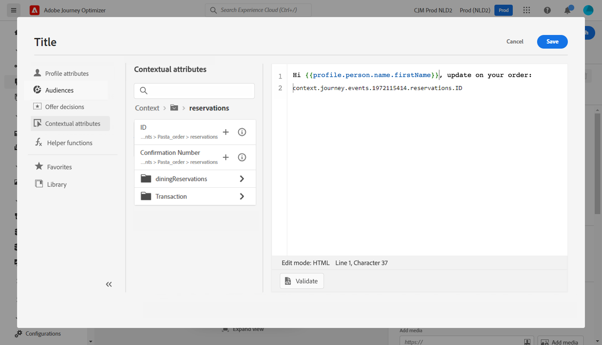

# Caso de uso de personalización: notificación del estado del pedido {#personalization-use-case}

En este caso de uso, verá cómo utilizar varios tipos de personalización en un único mensaje de notificación push. Se utilizan tres tipos de personalización:

* **Perfil**: personalización del mensaje basada en un campo de perfil
* **Decisión de oferta**: personalización basada en variables de administración de decisiones
* **Contexto**: personalización basada en datos contextuales del recorrido

El objetivo de este ejemplo es insertar un evento en [!DNL Journey Optimizer] cada vez que se actualiza un pedido de cliente. A continuación, se envía una notificación push al cliente con información sobre el pedido y una oferta personalizada.

Para este caso de uso, se necesitan los siguientes requisitos previos:

* configure un evento de pedido que incluya el número de pedido, el estado y el nombre del elemento. Consulte esta [sección](../event/about-events.md).
* crear una decisión, consulte esto [sección](../offers/offer-activities/create-offer-activities.md).

➡️ [Descubra un caso de uso similar en vídeo](#video)

## Paso 1: Creación del recorrido {#create-journey}

1. Haga clic en **[!UICONTROL Recorridos]** y cree un nuevo recorrido.

   

1. Añada el evento de entrada y un **Push** actividad de acción.

   

1. Configure y diseñe su mensaje de notificación push. Consulte esta [sección](../push/create-push.md).

## Paso 2: Adición de una personalización al perfil {#add-perso}

1. En el **Push** actividad, haga clic en **Editar contenido**.

1. Haga clic en **Título** field.

   

1. Introduzca el asunto y añada una personalización de perfil. Utilice la barra de búsqueda para encontrar el campo de nombre del perfil. En el texto del asunto, coloque el cursor donde desee insertar el campo de personalización y haga clic en **+** icono. Haga clic en **Guardar**.

   

## Paso 3: Adición de una personalización sobre los datos contextuales {#add-perso-contextual-data}

1. En el **Push** actividad, haga clic en **Editar contenido** y haga clic en **Título** field.

   

1. Seleccione el **Atributos contextuales** menú. Los atributos contextuales solo están disponibles si un recorrido ha pasado datos contextuales al mensaje. Clic **Journey Orchestration**. Aparecerá la siguiente información contextual:

   * **Eventos**: esta categoría reagrupa todos los campos de los eventos colocados antes de la actividad de acción del canal en el recorrido.
   * **Propiedades de recorrido**: los campos técnicos relacionados con el recorrido de un perfil determinado, por ejemplo el ID de recorrido o los errores específicos encontrados. Obtenga más información en [Documentación del Journey Orchestration](../building-journeys/expression/journey-properties.md).

   

1. Expanda el **Eventos** y busque el campo de número de pedido relacionado con su evento. También puede utilizar el cuadro de búsqueda. Haga clic en **+** para insertar el campo de personalización en el texto del asunto. Haga clic en **Guardar**.

   

1. Ahora haga clic en **Cuerpo** field.

   

1. Escriba el mensaje e inserte, desde el **[!UICONTROL Atributos contextuales]** menú, nombre del elemento de pedido y progreso del pedido.

   

1. En el menú de la izquierda, seleccione **Decisiones de oferta** para insertar una variable de decisión. Seleccione la ubicación y haga clic en **+** junto a la decisión de añadirlo al cuerpo.

   

1. Haga clic en Validar para asegurarse de que no hay errores y haga clic en **Guardar**.

   

## Paso 4: Prueba y publicación del recorrido {#test-publish}

1. Haga clic en **Prueba** y luego haga clic en **Déclencheur de un evento**.

   

1. Introduzca los diferentes valores que desea aprobar en la prueba. El modo de prueba solo funciona con perfiles de prueba. El identificador de perfil debe corresponder a un perfil de prueba. Haga clic en **Enviar**.

   

   La notificación push se envía y se muestra en el teléfono móvil del perfil de prueba.

   

1. Compruebe que no haya ningún error y publique el recorrido.

## Vídeo explicativo {#video}

El siguiente vídeo muestra un caso de uso similar que aprovecha los datos contextuales de un recorrido para personalizar un correo electrónico.

>[!VIDEO](https://video.tv.adobe.com/v/3425027?quality=12)

