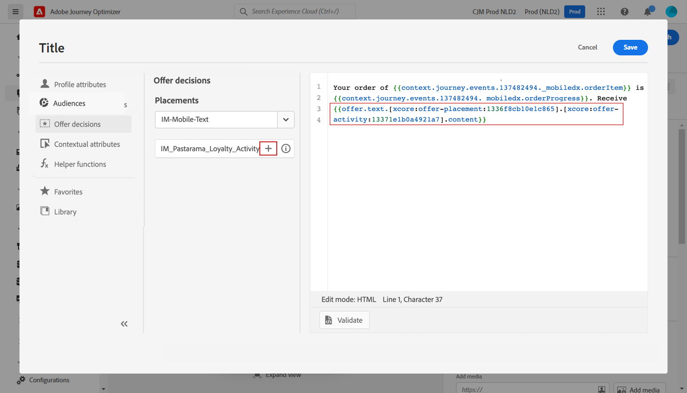

# Caso de uso de personalización: notificación del estado de pedido {#personalization-use-case}

En este caso de uso, verá cómo utilizar varios tipos de personalización en un único mensaje de notificación push. Se utilizan tres tipos de personalización:

* **Perfil**: personalización de mensajes basada en un campo de perfil
* **Decisión de oferta**: personalización basada en variables de offer decisioning
* **Contexto**: personalización basada en datos contextuales del recorrido

El objetivo de este ejemplo es impulsar un evento a [!DNL Journey Optimizer] cada vez que se actualiza un pedido de cliente. A continuación, se envía una notificación push al cliente con información sobre el pedido y una oferta personalizada.

Para este caso de uso, se necesitan los siguientes requisitos previos:

* cree y diseñe un mensaje de notificación push sin publicarlo. Consulte esta [sección](../messages/create-message.md).
* configure un evento de pedido que incluya el número de pedido, el estado y el nombre del elemento. Consulte esta [sección](../event/about-events.md).
* cree una decisión (anteriormente conocida como &quot;actividad de oferta&quot;), consulte esta [sección](../offers/offer-activities/create-offer-activities.md).

## Paso 1: Añadir personalización en el perfil {#add-perso}

1. Haga clic en el **[!UICONTROL Message]** y seleccione el mensaje.

   

1. Haga clic en el **Título** campo .

   

1. Escriba el asunto y añada la personalización del perfil. Utilice la barra de búsqueda para encontrar el campo de nombre del perfil. En el texto del asunto, coloque el cursor donde desee insertar el campo de personalización y haga clic en el **+** icono. Haga clic en **Guardar**.

   

   >[!NOTE]
   >
   >Deje el mensaje en borrador. No lo publique todavía.

## Paso 2: Creación del recorrido {#create-journey}

1. Haga clic en el **[!UICONTROL Journeys]** y cree un nuevo recorrido.

   

1. Añada el evento de entrada, un **Mensaje** y **Fin** actividad.

   

1. En el **Mensaje** seleccione el mensaje creado anteriormente. Haga clic en **Ok**.

   

   Se muestra un mensaje para informarle de que los datos del evento de entrada y las propiedades de recorrido se han pasado al mensaje.

   

   >[!NOTE]
   >
   >El mensaje aparece con un icono de advertencia. Esto se debe a que el mensaje aún no se ha publicado.

## Paso 3: Añadir personalización en datos contextuales {#add-perso-contextual-data}

1. En el **Mensaje** haga clic en la **Abrir el mensaje** icono. El mensaje se abre en una pestaña nueva.

   

1. Haga clic en el **Título** campo .

   

1. Seleccione el **Atributos contextuales** para abrir el Navegador. Los atributos contextuales solo están disponibles si un recorrido ha pasado datos contextuales al mensaje. Haga clic en **Journey Orchestration**. Aparece la siguiente información contextual:

   * **Eventos**: esta categoría reagrupa todos los campos de los eventos colocados antes del **Mensaje** actividad en el recorrido.
   * **Propiedades del recorrido**: los campos técnicos relacionados con el recorrido de un perfil determinado, por ejemplo, el ID de recorrido o los errores específicos encontrados. Obtenga más información en [documentación del Journey Orchestration](../building-journeys/expression/journey-properties.md).

   

1. Expanda el **Eventos** y busque el campo de número de pedido relacionado con el evento. También puede utilizar el cuadro de búsqueda. Haga clic en el **+** para insertar el campo personalizado en el texto del asunto. Haga clic en **Guardar**.

   

1. A continuación, haga clic en el botón **Cuerpo** campo .

   

1. Escriba el mensaje e inserte, desde el ****[!UICONTROL Contextual attributes]** , el nombre del elemento de pedido y el progreso del pedido.

   

1. En el menú de la izquierda, seleccione **Decisiones de oferta** para insertar una variable de offer decisioning. Seleccione la colocación y haga clic en el botón **+** junto a la decisión (anteriormente conocida como &quot;actividad de oferta&quot;) de añadirla al cuerpo.

   

1. Haga clic en validar para asegurarse de que no hay errores y haga clic en **Guardar**.

   

1. Ahora, publique el mensaje.

   

## Paso 4: Prueba y publicación del recorrido {#test-publish}

1. Vuelva a abrir el recorrido. Si el recorrido ya está abierto, asegúrese de actualizar la página. Ahora que el mensaje está publicado, puede ver que no hay error en el recorrido. Haga clic en el **Prueba** y haga clic en **Déclencheur de un evento**.

   

1. Introduzca los diferentes valores que se van a pasar en la prueba. El modo de prueba solo funciona con perfiles de prueba. El identificador de perfil debe corresponder a un perfil de prueba. Haga clic en **Enviar**.

   

   La notificación push se envía y se muestra en el teléfono móvil del perfil de prueba.

   

1. Compruebe que no haya error y publique el recorrido.
