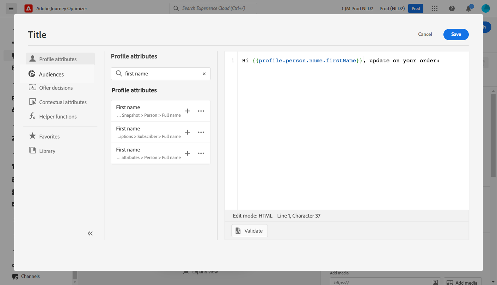

# Caso de uso personalizado {#personalization-use-case}

En este caso de uso, verá cómo utilizar varios tipos de personalización en un único mensaje de notificación push. Se utilizan tres tipos de personalización:

* **Perfil**: personalización de mensajes basada en un campo de perfil
* **Decisión** de oferta: personalización basada en variables de toma de decisiones de ofertas
* **Contexto**: personalización basada en datos contextuales del recorrido

El objetivo de este ejemplo es insertar un evento en Journey Optimizer cada vez que se actualiza un pedido de cliente. A continuación, se envía una notificación push al cliente con información sobre el pedido y una oferta personalizada.

Para este caso de uso, se necesitan los siguientes requisitos previos:

* cree y diseñe un mensaje de notificación push sin publicarlo. Consulte esta [sección](../create-message.md).
* configure un evento de pedido que incluya el número de pedido, el estado y el nombre del elemento. Consulte esta [sección](../event/about-events.md).
* cree una decisión (anteriormente conocida como &quot;actividad de oferta&quot;), consulte esta [sección](../offers/offer-activities/create-offer-activities.md).

## Paso 1: Añadir personalización en el perfil

1. Haga clic en el menú **[!UICONTROL Message]** y seleccione el mensaje.

   

1. Haga clic en el campo **Title**.

   

1. Escriba el asunto y añada la personalización del perfil. Utilice la barra de búsqueda para encontrar el campo de nombre del perfil. En el texto del asunto, coloque el cursor donde desee insertar el campo de personalización y haga clic en el icono **+**. Haga clic en **Guardar**.

   

   >[!NOTE]
   >
   >Deje el mensaje en borrador. No lo publique todavía.

## Paso 2: Creación del recorrido

1. Haga clic en el menú **[!UICONTROL Journeys]** y cree un nuevo recorrido.

   

1. Añada el evento de entrada, una actividad **Message** y una actividad **End**.

   

1. En la actividad **Message** , seleccione el mensaje creado anteriormente. Haga clic en **Ok**.

   

   Se muestra un mensaje para informarle de que los datos del evento de entrada y las propiedades de recorrido se han pasado al mensaje.

   

   >[!NOTE]
   >
   >El mensaje aparece con un icono de advertencia. Esto se debe a que el mensaje aún no se ha publicado.

## Paso 3: Añadir personalización en datos contextuales

1. En la actividad **Message** , haga clic en el icono **Open the message**. El mensaje se abre en una pestaña nueva.

   

1. Haga clic en el campo **Title**.

   

1. Seleccione la categoría **Contexto**. Este elemento solo está disponible si un recorrido ha pasado datos contextuales al mensaje. Haga clic en **Journey Orchestration**. Aparece la siguiente información contextual:

   * **Eventos**: esta categoría reagrupa todos los campos de los eventos colocados antes de la actividad  **** Mensaje en el recorrido.
   * **Propiedades** del recorrido: los campos técnicos relacionados con el recorrido de un perfil determinado, por ejemplo, el ID de recorrido o los errores específicos encontrados. Consulte la [documentación del Journey Orchestration](https://experienceleague.adobe.com/docs/journeys/using/building-advanced-conditions-journeys/syntax/journey-properties.html#building-advanced-conditions-journeys).

   

1. Expanda el elemento **Events** y busque el campo de número de pedido relacionado con el evento. También puede utilizar el cuadro de búsqueda. Haga clic en el icono **+** para insertar el campo de personalización en el texto del asunto. Haga clic en **Guardar**.

   

1. A continuación, haga clic en el campo **Body**.

   

1. Escriba el mensaje e inserte, desde la categoría **Contexto**, el nombre del elemento de pedido y el progreso del pedido.

   

1. En la lista desplegable, seleccione **Offer decision** para insertar una variable de offer decisioning. Seleccione la colocación y haga clic en el icono **+** situado junto a la decisión (anteriormente conocida como &quot;actividad de oferta&quot;) para añadirla al cuerpo.

   

1. Haga clic en validar para asegurarse de que no hay errores y haga clic en **Guardar**.

   

1. Ahora, publique el mensaje.

   

## Paso 4: Prueba y publicación del recorrido

1. Vuelva a abrir el recorrido. Si el recorrido ya está abierto, asegúrese de actualizar la página. Ahora que el mensaje está publicado, puede ver que no hay error en el recorrido. Haga clic en el botón **Test** y, a continuación, haga clic en **Déclencheur de un evento**.

   

1. Introduzca los diferentes valores que se van a pasar en la prueba. El modo de prueba solo funciona con perfiles de prueba. El identificador de perfil debe corresponder a un perfil de prueba. Haga clic en **Enviar**.

   

   La notificación push se envía y se muestra en el teléfono móvil del perfil de prueba.

   

1. Compruebe que no haya error y publique el recorrido.

