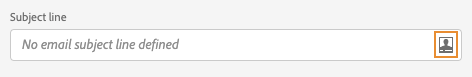

# Introducción a la personalización{#add-personalization}

Descubra las [!DNL Adobe Journey Optimizer] capacidades de personalización para adaptar sus mensajes a cada destinatario específico aprovechando los datos y la información que tiene sobre él. Puede ser su nombre, sus intereses, dónde vive, qué compró, etc.

➡️ [Obtenga información sobre cómo personalizar un mensaje en estos vídeos](#video-perso)

[!DNL Journey Optimizer] utiliza una sintaxis de personalización **en línea** sencilla basada en Handlebars, que le permite crear expresiones con contenido entre llaves dobles **{{}}**. Puede añadir varias expresiones en el mismo contenido o campo sin restricciones. Obtenga más información en [Sintaxis de personalización](personalization-syntax.md).

La personalización se basa en los datos de perfil que administra el esquema **Perfil individual de XDM** definido en Adobe Experience Platform. Para obtener más información, consulte la [Documentación del Modelo de datos de Adobe Experience Platform (XDM)](https://experienceleague.adobe.com/docs/experience-platform/xdm/home.html?lang=es).

>[!CAUTION]
>El esquema **XDM Individual Profile** es el único esquema que puede utilizar para personalizar el contenido en [!DNL Journey Optimizer].

**Ejemplos:**

* `Hello {{profile.person.name.firstName}} {{profile.person.name.lastName}}`

* `Hello {{profile.person.name.fullName}}`

Al procesar el mensaje (correo electrónico y push), Journey Optimizer reemplaza la expresión por los datos contenidos en la base de datos de Experience Cloud Platform:  `Hello {{profile.person.name.firstName}} {{profile.person.name.lastName}}` se convierte en &quot;Hello John Doe&quot;.

## Contextos de personalización{#personalization-areas}

El contenido y la visualización de los mensajes enviados por [!DNL Journey Optimizer] se pueden personalizar de varias formas diferentes.

En todos los campos con el icono del editor, puede abrir el editor de personalización (también conocido como Editor de expresiones) y definir la personalización.

### Personalización de los correos electrónicos

Al crear un correo electrónico, puede añadir una personalización en el campo **Email subject** del mensaje.

En el Diseñador de correo electrónico, puede personalizar el contenido:

* En el **mensaje**: haga clic dentro de un bloque de texto, haga clic en el icono **Personalizar** de la barra de herramientas contextual y seleccione el campo **Insertar personalización**. Para obtener más información sobre la interfaz del Diseñador de correo electrónico, consulte esta [sección](../design-emails.md).

   

* Para un **enlace**: seleccione texto o imagen dentro de un bloque de texto, haga clic en el icono **Insert link** de la barra de herramientas contextual. En la ventana , puede añadir un bloque personalizado haciendo clic en el icono **Add personalization**.

   

En ambos casos, se accede al editor de personalización.

### Personalización de las notificaciones push

También puede personalizar sus **Push notifications** en los campos siguientes:

* **Título**
* **Cuerpo**
* **Sonido personalizado**
* **Distintivos**
* **Datos personalizados**

Obtenga más información sobre la configuración de notificaciones push en [esta sección](../push-gs.md).

## Uso del Editor de expresiones

El editor de expresiones es la parte central de la personalización en [!DNL Journey Optimizer].

Está disponible en todos los contextos en los que es necesario definir la personalización como correos electrónicos, mensajes push y ofertas.

En la interfaz del editor de expresiones, se seleccionan, organizan, personalizan y validan todos los datos para crear una personalización personalizada para el contenido.

La parte izquierda de la pantalla muestra un selector de dominio que le permite seleccionar el origen de la personalización. Las fuentes disponibles son:

* **Perfil** : enumera todas las referencias asociadas al esquema de perfil que se describen en la documentación [ del Modelo de datos de ](https://experienceleague.adobe.com/docs/experience-platform/xdm/home.html)Adobe Experience Platform (XDM).
* **Pertenencia a segmentos** : enumera todos los segmentos creados en el servicio de segmentación de Adobe Experience Platform. Más información sobre segmentación disponible [aquí](https://experienceleague.adobe.com/docs/experience-platform/segmentation/home.html?lang=en).
* **Ofertas** : enumera todas las ofertas asociadas a una ubicación específica. Seleccione la ubicación e inserte las ofertas en el contenido. Para obtener una documentación completa sobre cómo administrar ofertas, consulte [esta sección](../deliver-personalized-offers.md).
* **Contexto** : cuando la  **** actividad Mensajería se utiliza en un recorrido, los campos de recorrido contextual están disponibles en este menú. Obtenga más información en [esta sección](personalization-use-case.md).
* **Funciones**  de ayuda: enumera todas las funciones de ayuda disponibles para realizar operaciones con datos, como cálculos, formato de datos o conversiones, condiciones y manipularlas en el contexto de la personalización. Obtenga más información en [esta sección](functions/functions.md).

Al seleccionarla, la referencia se añade en el editor.

>[!NOTE]
>
>El icono de información situado junto al icono &quot;+&quot; abre una información sobre herramientas que proporciona más detalles para cada variable.

En el siguiente ejemplo, el editor de expresiones permite seleccionar los perfiles que tienen su cumpleaños hoy y luego completar la personalización insertando una oferta específica correspondiente a este día.

## Vídeotutoriales{#video-perso}

Aprenda a utilizar la información de evento contextual de un recorrido para personalizar un mensaje.

>[!VIDEO](https://video.tv.adobe.com/v/334165?quality=12)

Aprenda a utilizar la información de evento contextual de un recorrido para personalizar un mensaje.

>[!VIDEO](https://video.tv.adobe.com/v/334078?quality=12)
