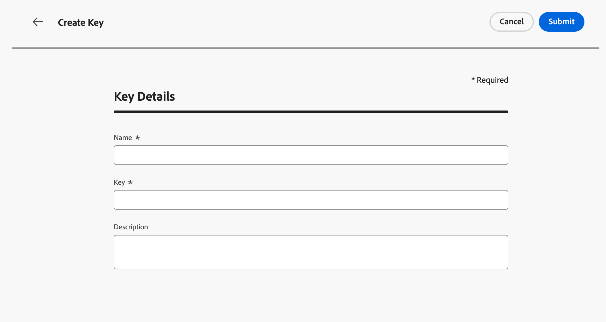
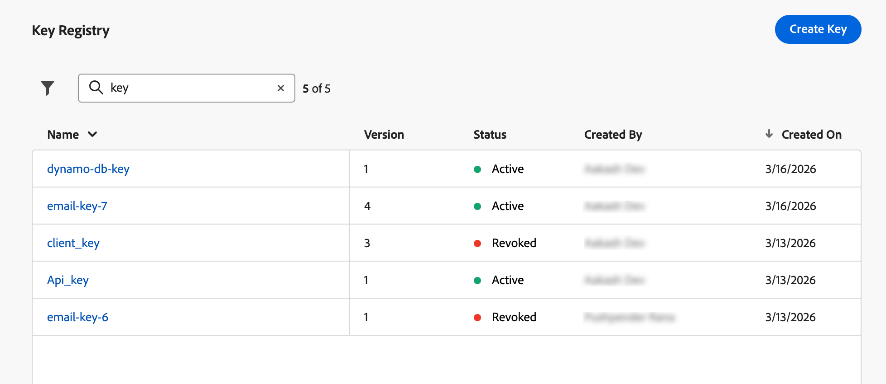

# Cifrar parámetros de URL {#url-parameter-encryption}

>[!AVAILABILITY]
>
>Esta función está disponible con disponibilidad limitada. Póngase en contacto con su representante de Adobe para obtener acceso.
>
>Actualmente, esta funcionalidad solo está disponible para el canal de correo electrónico.

## ¿Por qué utilizar el cifrado de parámetros de URL? {#why-url-parameter-encryption}

Los vínculos de seguimiento personalizados y las direcciones URL de páginas de aterrizaje suelen incluir atributos de perfil, identificadores, tokens u otros valores en la cadena de consulta. Estos parámetros suelen ser visibles como texto sin formato en el correo electrónico o SMS, y se pueden leer si alguien copia, comparte o marca el vínculo. Esto puede suponer un riesgo para la seguridad y la privacidad cuando los valores de pueden incluir información de identificación personal (PII) u otros datos confidenciales que deban proteger.

[!DNL Journey Optimizer] proporciona un asistente de cifrado en el editor de personalización para que pueda cifrar cualquier valor de expresión en el momento del procesamiento (por ejemplo, un atributo de perfil, un token o una cadena que haya creado a partir de varios campos). El cifrado siempre requiere una clave del registro de su organización.

Solo se cifran los parámetros de consulta que se eligen mediante claves que los administradores administran en un registro de nivel de zona protegida, de modo que los valores confidenciales no quedan expuestos en texto no cifrado cuando se comparte o inspecciona el vínculo.

### Funcionamiento {#how-it-works}

* **Los administradores** utilizan el registro de claves para [crear claves](#create-keys) y [administrar claves](#manage-keys) de acuerdo con las políticas de seguridad de su organización.
* **Los especialistas en marketing** insertan el asistente `Encrypt` en el editor de personalización y pasan el valor que se va a proteger más un identificador de clave activa del Registro. Para ver la sintaxis y las opciones, vea [esta sección](functions/helpers.md#url-parameter-encryption-helper).

>[!IMPORTANT]
>
>El descifrado es responsabilidad de su organización. [!DNL Journey Optimizer] cifra los valores cuando se representa el mensaje. El sitio web, la aplicación o la API deben descifrar parámetros con el mismo material criptográfico y los mismos procesos definidos, de forma coherente con el modelo de seguridad.

### Ejemplo

Una dirección URL de página de aterrizaje puede utilizar un parámetro de consulta como `token`, cuyo valor es un token de cadena (por ejemplo, una carga útil JSON con identificadores de oferta o perfil). Sin cifrado, ese token de cadena es visible como texto sin formato en el vínculo. Al ajustar ese valor con el asistente de cifrado, se sustituye la carga útil confidencial por texto cifrado en la dirección URL, mientras que el resto del vínculo se mantiene sin cambios.

## Creación de claves {#create-keys}

Antes de poder utilizar el asistente de cifrado de parámetros de URL, debe crear una clave. Para ello, siga los pasos que aparecen a continuación.

<!--
>[!IMPORTANT]
>
>To access and manage keys, you you must have the **View Key Registry** and **Manage Key Registry** permissions granted. [Learn more](../administration/high-low-permissions.md)
-->

1. Vaya a **[!UICONTROL Administración]** > **[!UICONTROL Configuraciones]**.

1. Haga clic en el botón **[!UICONTROL Administrar]** para abrir el **[!UICONTROL Registro de claves]**.

   {width="80%"}

1. Con el botón específico, cree las claves que sean necesarias para su organización.

   {width="80%"}

1. Asígneles una etiqueta clara o un identificador al que sus equipos puedan hacer referencia en el editor de personalización.

   {width="80%"}

1. Haga clic en **[!UICONTROL Enviar]** para confirmar los cambios.

Una vez creada una clave, los especialistas en marketing pueden usar el [cifrado de parámetros de URL](functions/helpers.md#url-parameter-encryption-helper) del editor de personalización para cifrar valores específicos que colocan en parámetros de consulta de URL.

## Administrar claves {#manage-keys}

Para administrar claves, siga los pasos a continuación.

1. Obtenga acceso al **[!UICONTROL Registro de claves]**. Puede ver todas las claves creadas para la zona protegida actual en una vista de lista.

   {width="100%"}

1. Haga clic en una clave con el estado **[!UICONTROL Activo]** para abrir los detalles de la clave.

   {width="80%"}

1. Haga clic en el botón **[!UICONTROL Revocar]** para deshabilitar permanentemente la clave para el nuevo cifrado.

   Una vez revocada una clave, los intentos de utilizarla en el asistente deberían fallar en el momento del procesamiento. Las entradas revocadas permanecen visibles para la auditoría; es posible que los equipos necesiten el material correspondiente para descifrar cargas útiles antiguas en sus propios sistemas.

1. Haga clic en el botón **[!UICONTROL Rotar]** para proporcionar nuevo material de clave y, al mismo tiempo, mantener un identificador de clave estable donde los recorridos y campañas ya hacen referencia a él.

   El material anterior se conserva en el Registro con un estado revocado y un motivo apropiado (por ejemplo, una marca de tiempo de rotación), y una nueva fila o versión refleja la clave activa.

   >[!NOTE]
   >
   >Solo se deben seleccionar claves activas para cifrar los nuevos valores en el editor de personalización. No utilice claves revocadas para el contenido nuevo.
