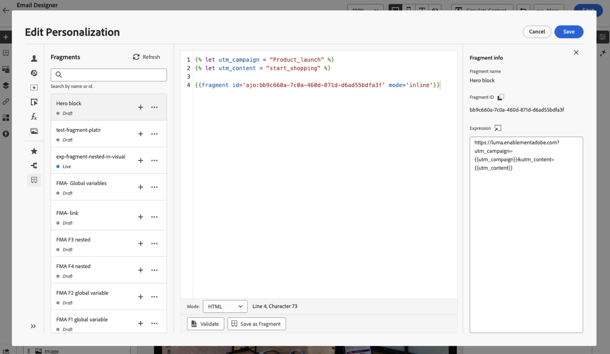

# Aprovechamiento de fragmentos de expresiones {#use-expression-fragments}

Al usar el **editor de personalización**, puede aprovechar todos los fragmentos de expresiones que se han creado o guardado en la zona protegida actual.

Un fragmento es un componente reutilizable al que se puede hacer referencia en [!DNL Journey Optimizer] campañas y recorridos. Esta funcionalidad permite generar previamente varios bloques de contenido personalizados que los usuarios de marketing pueden utilizar para ensamblar contenido rápidamente en un proceso de diseño mejorado. [Más información sobre fragmentos](../content-management/fragments.md)

➡️ [Aprenda a administrar, crear y usar fragmentos en este vídeo](../content-management/fragments.md#video-fragments)

## Usar un fragmento de expresión {#use-expression-fragment}

Para añadir fragmentos de expresión al contenido, siga los pasos a continuación.

>[!NOTE]
>
>Puede añadir hasta 30 fragmentos en una entrega determinada. Los fragmentos solo se pueden anidar hasta 1 nivel.

1. Abra [editor de personalización](personalization-build-expressions.md) y seleccione el botón **[!UICONTROL Fragmentos]** en el panel izquierdo.

   La lista muestra todos los fragmentos de expresiones que se han creado o guardado como fragmentos en la zona protegida actual. [Aprenda a crear fragmentos](../content-management/create-fragments.md)
Se ordenan por fecha de creación: los fragmentos de expresión añadidos recientemente se muestran primero en la lista.

   

   También puede actualizar esta lista.

   >[!NOTE]
   >
   >Si se han modificado o agregado fragmentos mientras edita el contenido, la lista se actualizará con los cambios más recientes.

1. Haga clic en el icono + junto a un fragmento de expresión para insertar el ID de fragmento correspondiente en el editor.

   

   >[!CAUTION]
   >
   >Puede agregar cualquier fragmento de **Borrador** o **Activo** al contenido. Sin embargo, no podrás activar tu recorrido o campaña si se está usando un fragmento con el estado **Borrador**. En el momento de la publicación del recorrido o de la campaña, los fragmentos de borrador mostrarán un error y deberá aprobarlos para poder publicarlos.

1. Una vez agregado el ID del fragmento, si abre el fragmento de expresión correspondiente y lo [edita](../content-management/manage-fragments.md#edit-fragments) desde la interfaz, los cambios se sincronizarán. Se propagan automáticamente a todos los recorridos o campañas en borrador o activos que contengan ese ID de fragmento.

1. Haga clic en el botón **[!UICONTROL Más acciones]** que está junto a un fragmento. En el menú contextual que se abre, seleccione **[!UICONTROL Ver fragmento]** para obtener más información sobre ese fragmento. El **[!UICONTROL ID de fragmento]** también se muestra y se puede copiar desde aquí.

   

1. Puede abrir el fragmento de expresión en otra ventana para editar su contenido y propiedades, ya sea mediante la opción **[!UICONTROL Abrir fragmento]** del menú contextual o desde el panel **[!UICONTROL Información de fragmento]**. [Obtenga información sobre cómo editar un fragmento](../content-management/manage-fragments.md#edit-fragments)

   

1. A continuación, puede personalizar y validar el contenido como de costumbre utilizando todas las capacidades de personalización y creación de [editor de personalización](personalization-build-expressions.md).

1. En algunos casos, solo es necesario calcular las variables, por lo que es posible que desee ocultar el contenido del fragmento de expresión. Para ello, use el atributo `render` y configúrelo en `false`. Por ejemplo:

   ```
   Hi {{profile.person.name.firstName|fragment id='ajo:fragmentId/variantId' mode ='inline' render=false}}
   ```

>[!NOTE]
>
>Si crea un fragmento de expresión que contiene varios saltos de línea y lo utiliza en el contenido [SMS](../sms/create-sms.md#sms-content) o [push](../push/design-push.md), se conservarán los saltos de línea. Por lo tanto, asegúrese de probar su mensaje [SMS](../sms/send-sms.md) o [push](../push/send-push.md) antes de enviarlo.

## Uso de variables implícitas {#implicit-variables}

Las variables implícitas mejoran la funcionalidad de fragmento existente para mejorar la eficacia en la reutilización de contenido y en los casos de uso de scripts. Los fragmentos pueden utilizar variables de entrada y crear variables de salida que se pueden utilizar en el contenido de la campaña y del recorrido.

Esta capacidad se puede utilizar, por ejemplo, para inicializar los parámetros de seguimiento de los correos electrónicos, en función de la campaña o el recorrido actual, y utilizar estos parámetros en los vínculos personalizados añadidos al contenido del correo electrónico.

Los siguientes casos de uso son posibles:

1. **Usar variables de entrada en un fragmento.**

   Cuando se utiliza un fragmento en el contenido de una acción de campaña o recorrido, tiene la capacidad de aprovechar las variables que se declararon fuera del fragmento. A continuación se muestra un ejemplo:

   

   Podemos ver arriba que la variable `utm_content` está declarada en el contenido de la campaña. Cuando se usa el fragmento **Bloque principal**, mostrará un vínculo al que se agregará el valor del parámetro `utm_content`. El resultado final es: `https://luma.enablementadobe.com?utm_campaign= Product_launch&utm_content= start_shopping`.

1. **Usar variables de salida de un fragmento.**

   Las variables calculadas o definidas dentro de un fragmento están disponibles para su uso en el contenido. En el ejemplo siguiente, un fragmento **F1** declara un conjunto de variables:

   

   En el contenido de un correo electrónico, puede tener la siguiente personalización:

   

   El fragmento F1 inicializa las siguientes variables: `utm_campaign` y `utm_content`. A continuación, se adjuntan estos parámetros al vínculo del contenido del mensaje. El resultado final es: `https://luma.enablementadobe.com?utm_campaign= Product_launch&utm_content= start_shopping`.

>[!NOTE]
>
>En tiempo de ejecución, el sistema expande lo que hay dentro de los fragmentos y, a continuación, interpreta el código de personalización de arriba a abajo. Teniendo esto en cuenta, se pueden lograr casos de uso más complejos. Por ejemplo, puede hacer que un fragmento F1 pase variables a otro fragmento F2 situado debajo. También puede hacer que un fragmento visual F1 pase variables a un fragmento de expresión anidado F2.

## Usar fragmentos de expresión dentro de bucles {#fragments-in-loops}

Cuando se utilizan fragmentos de expresión en bucles `{{#each}}`, es importante comprender cómo funciona el ámbito de variables. Los fragmentos de expresiones pueden acceder a las variables globales definidas en el contenido del mensaje, pero no pueden recibir variables específicas del bucle como parámetros.

### Patrón admitido: usar variables globales {#global-variables-in-loops}

Los fragmentos de expresiones pueden hacer referencia a variables globales que se definen fuera del fragmento, incluso cuando se llama al fragmento desde un bucle. Este es el enfoque recomendado cuando necesita utilizar fragmentos en contextos iterativos.

**Ejemplo: Usar un fragmento con variables globales dentro de un bucle**

En el contenido del mensaje, defina una variable global y utilice un fragmento que haga referencia a ella:

```handlebars


{{#each context.journey.actions.GetProducts.items as |product|}}
  <div class="product">
    <h3>{{product.name}}</h3>
    <p>Price: ${{product.price}}</p>
    {{fragment id='ajo:fragment123/variant456' mode='inline'}}
  </div>
{{/each}}
```

En el fragmento de expresión (fragmento123), puede hacer referencia a la variable `globalDiscount`:

```handlebars
<p class="discount-info">Save {{globalDiscount}}% on all items!</p>
```

Este patrón funciona porque la variable global es accesible a través del mensaje, incluso dentro de fragmentos, independientemente del contexto de bucle.

### No compatible: Pasar variables de bucle como parámetros de fragmento {#loop-variables-limitations}

No puede pasar el elemento de iteración actual (por ejemplo, `product` en el ejemplo anterior) como parámetro a un fragmento de expresión. El fragmento no puede tener acceso directo a variables con ámbito de bucle desde el bloque `{{#each}}` que lo rodea.

**Ejemplo: Lo que NO funciona**

```handlebars
{{#each context.journey.actions.GetProducts.items as |product|}}
  <!-- This will NOT work as expected -->
  {{fragment id='ajo:fragment123/variant456' mode='inline' currentProduct=product}}
{{/each}}
```

El fragmento no puede recibir `product` como parámetro y utilizarlo internamente porque no se admite el paso de parámetros para variables específicas del bucle en la implementación actual.

### Soluciones recomendadas {#fragments-in-loops-workarounds}

Cuando necesite utilizar fragmentos de expresión con datos de un bucle, tenga en cuenta los siguientes enfoques:

1. **Incluir lógica directamente en el mensaje**: en lugar de usar un fragmento para lógica específica del bucle, agregue el código de personalización directamente dentro del bloque `{{#each}}`.

   ```handlebars
   {{#each context.journey.actions.GetProducts.items as |product|}}
     <div class="product">
       <h3>{{product.name}}</h3>
       <p>Price: ${{product.price}}</p>
       {{#if product.price > 100}}
         <span class="premium-badge">Premium Product</span>
       {{/if}}
     </div>
   {{/each}}
   ```

2. **Usar fragmentos fuera de los bucles**: Si el contenido del fragmento no depende del bucle, llame al fragmento antes o después del bloque de iteración.

   ```handlebars
   {{fragment id='ajo:fragment123/variant456' mode='inline'}}
   
   {{#each context.journey.actions.GetProducts.items as |product|}}
     <div class="product">
       <h3>{{product.name}}</h3>
       <p>Price: ${{product.price}}</p>
     </div>
   {{/each}}
   ```

3. **Establecer varias variables globales**: Si necesita pasar valores diferentes a un fragmento a través de iteraciones, establezca variables globales antes de cada llamada de fragmento (aunque esto limita la flexibilidad).

>[!NOTE]
>
>Para iterar en datos contextuales y trabajar con bucles, consulte la guía completa sobre [iterar en datos contextuales](iterate-contextual-data.md), que incluye prácticas recomendadas, sugerencias para la solución de problemas y patrones avanzados.

## Personalizar campos editables {#customize-fields}

Si se han hecho editables ciertas partes de un fragmento de expresión mediante variables, puede anular sus valores predeterminados con una sintaxis específica. [Aprenda a personalizar los fragmentos](../content-management/customizable-fragments.md)

Para personalizar los campos, siga estos pasos:

1. Inserte el fragmento en su código desde el menú **[!UICONTROL Fragmentos]**.

1. Utilice el código `<fieldId>="<value>"` al final de la sintaxis para anular el valor predeterminado de la variable.

   En el ejemplo siguiente, anulamos el valor de una variable cuyo ID es &quot;sports&quot; con el valor &quot;yoga&quot;. Esto mostrará &quot;yoga&quot; en el contenido del fragmento en todas partes donde se haga referencia a la variable &quot;sport&quot;.

   

Un ejemplo que muestra cómo agregar campos editables a fragmentos de expresión y anular sus valores al crear un correo electrónico está disponible en [esta sección](../content-management/customizable-fragments.md#example).

## Romper herencia {#break-inheritance}

Al agregar un ID de fragmento al editor de personalización, se sincronizan los cambios realizados en el fragmento de expresión original.

Sin embargo, también puede pegar el contenido de un fragmento de expresión en el editor. En el menú contextual, seleccione **[!UICONTROL Pegar fragmento]** para insertar ese contenido.


En ese caso, la herencia del fragmento original se interrumpe. El contenido del fragmento se copia en el editor y los cambios ya no se sincronizan.

Se convierte en un elemento independiente que ya no está vinculado al fragmento original; puede editarlo como cualquier otro elemento del código.

