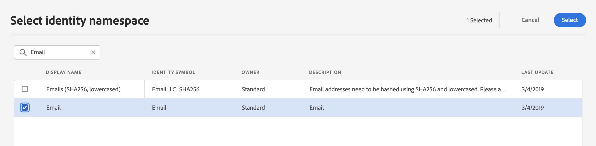
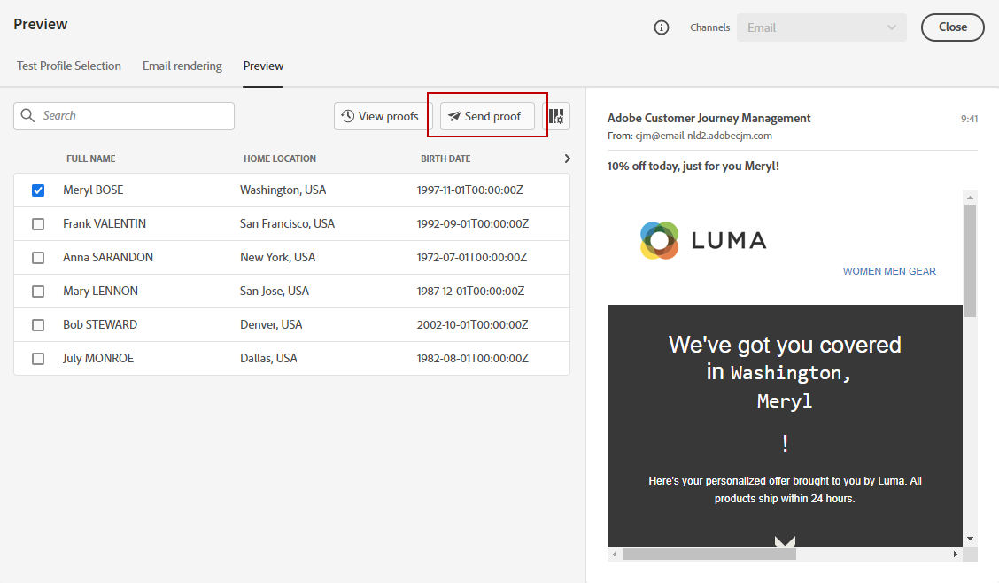

# Previsualizar y probar los mensajes{#preview-and-proof}

Una vez definido el contenido del mensaje, puede utilizar perfiles de prueba para previsualizarlo y probarlo. Si ha insertado [contenido personalizado](personalization/personalize.md), podrá comprobar cómo se muestra este contenido en el mensaje, aprovechando los datos de perfil de prueba.

Para detectar posibles errores en el contenido del correo electrónico o en la configuración de personalización, envíe pruebas a los perfiles de prueba. Se debe enviar una prueba cada vez que se realiza un cambio para validar el contenido más reciente.

>[!CAUTION]
>
>Debe tener perfiles de prueba disponibles para poder previsualizar los mensajes y enviar pruebas.
>
>Aprenda a crear perfiles de prueba en [esta página](building-journeys/creating-test-profiles.md).

Para probar el contenido del mensaje, debe:

* [seleccionar perfiles de prueba](#select-test-profiles)
* [comprobar la vista previa del mensaje](#preview-your-messages)

A continuación, podrá [enviar pruebas](#send-proofs) a sus perfiles de prueba.

Además, aproveche su cuenta **Litmus** en [!DNL Journey Optimizer] para previsualizar instantáneamente su **procesamiento de correo electrónico** en clientes de correo electrónico populares. A continuación, puede asegurarse de que el contenido del correo electrónico tenga un aspecto bueno y funcione correctamente en cada bandeja de entrada. Aprenda a desbloquear las vistas previas de correo electrónico de Litmus en [esta sección](#email-rendering)

>[!CAUTION]
>
>Al obtener una vista previa de un mensaje o enviar pruebas, solo se muestran los datos de personalización del perfil. La personalización basada en datos de contexto, como la información de evento, solo se puede probar en el contexto de un recorrido. Aprenda a probar la personalización en [este caso de uso](personalization/personalization-use-case.md).

➡️ [Obtenga información sobre cómo previsualizar, probar y publicar su correo electrónico en este vídeo](#video-preview)

## Seleccionar perfiles de prueba{#select-test-profiles}

Utilice [Test profiles](building-journeys/creating-test-profiles.md) para dirigirse a destinatarios adicionales que no coincidan con los criterios de objetivo definidos.

Para seleccionar perfiles de prueba, siga los pasos a continuación:

1. En la interfaz de mensajes o en el diseñador de correo electrónico, haga clic en el botón **[!UICONTROL Show preview]** para acceder a la selección de perfil de prueba.

   

1. Seleccione el espacio de nombres que se utilizará para identificar los perfiles de prueba haciendo clic en el icono de selección **[!UICONTROL Identity namespace]** .

   

   Obtenga más información sobre los espacios de nombres de identidad [de Adobe Experience Platform en esta sección](get-started-identity.md){target=&quot;_blank&quot;}.

   En el siguiente ejemplo, utilizaremos el espacio de nombres **Email**.

1. Utilice el campo de búsqueda para encontrar el área de nombres, selecciónela y haga clic en **[!UICONTROL Select]**

   

1. Introduzca el valor para identificar el perfil de prueba y haga clic en **[!UICONTROL Find test profile]**.

   

1. Si ha añadido personalización en el mensaje, añada otros perfiles para poder probar distintas variantes del mensaje en función de los datos del perfil. Una vez añadidos, los perfiles se muestran en los campos de selección.

   

   En función de los elementos de personalización de mensajes, esta lista muestra los datos de cada perfil de prueba en las columnas relacionadas.

## Vista previa de mensajes{#preview-your-messages}

Una vez seleccionados los [perfiles de prueba](#select-test-profiles), puede obtener una vista previa de los mensajes y comprobar el contenido.

1. Haga clic en la pestaña **[!UICONTROL Preview]** para probar el mensaje.

1. Seleccione un perfil de prueba. Puede comprobar los valores disponibles en las columnas. Utilice las flechas derecha/izquierda para examinar los datos.

   

1. Haga clic en el icono **[!UICONTROL Select data]** situado encima de la lista para añadir o quitar columnas.

   

   Puede ver campos de personalización específicos del mensaje actual al final de la lista. En este ejemplo, la ciudad del perfil, el nombre y los apellidos. Seleccione esos campos y asegúrese de que estos valores se rellenen en los perfiles de prueba.

1. En la vista previa del mensaje, los elementos personalizados se sustituyen por los datos de perfil de prueba seleccionados.

   Por ejemplo, para este mensaje, el contenido del correo electrónico y el asunto del correo electrónico están personalizados:

   

1. Seleccione otros perfiles de prueba para previsualizar el procesamiento de correo electrónico para cada variante del mensaje.

Para una vista previa de notificaciones push:

1. Cambie al canal **[!UICONTROL Push]** desde la lista desplegable **[!UICONTROL Channels]** situada en la parte superior derecha de la pantalla **[!UICONTROL Preview]**.

   

1. Siga los mismos pasos que se describen anteriormente para seleccionar un perfil de prueba y seleccione el tipo de dispositivo para obtener una vista previa del contenido: **[!UICONTROL iOS]** o **[!UICONTROL Android]**

   

1. En la vista previa push, los datos de perfil de prueba se aprovechan en el contenido del mensaje.

   Por ejemplo, para esta notificación push, el título y el cuerpo están personalizados:

   

## Envíe pruebas{#send-proofs}

Una prueba es un mensaje específico que le permite probar un mensaje antes de enviarlo a la audiencia principal. Los destinatarios de la prueba se encargan de aprobar el mensaje: renderización, contenido, configuración de personalización, configuración.

Una vez seleccionados los [perfiles de prueba](#select-test-profiles), puede enviar pruebas.

1. En la pantalla **[!UICONTROL Preview]**, haga clic en el botón **[!UICONTROL Send proof]**.

   

1. En la ventana **[!UICONTROL Send proof]** , escriba el correo electrónico del destinatario y haga clic en **[!UICONTROL Add]** para enviarlo a usted mismo o a los miembros de sus organizaciones.

   Tenga en cuenta que puede añadir hasta diez destinatarios para la entrega de prueba.

   

1. A continuación, seleccione los **Test profiles** que se utilizarán para personalizar el contenido del mensaje.

   Cada destinatario de la prueba recibe tantos mensajes como el número de perfiles de prueba seleccionados. Por ejemplo, si ha añadido cinco correos electrónicos de destinatario y ha seleccionado diez perfiles de prueba, enviará cincuenta mensajes de prueba y cada destinatario recibirá diez de ellos.

1. Puede añadir un prefijo a la línea de asunto de la prueba si es necesario. Solo caracteres alfanuméricos y caracteres especiales, por ejemplo, . - _ ( ) [ ], se permiten como prefijo a la línea de asunto.

1. Haga clic en **[!UICONTROL Send proof]**.

   

1. Vuelva a la pantalla **[!UICONTROL Preview]**, haga clic en el botón **[!UICONTROL View proofs]** para comprobar el estado.

   

Se recomienda enviar pruebas después de cada modificación al contenido del mensaje.

>[!NOTE]
>
>En la prueba enviada a los perfiles de prueba, el vínculo a la página espejo no está activo. Solo se activa en los mensajes finales.

## Procesamiento de correo electrónico{#email-rendering}

Puede aprovechar su cuenta **Litmus** en [!DNL Journey Optimizer] para previsualizar instantáneamente su **procesamiento de correo electrónico** en los clientes de correo electrónico más populares.

Para acceder a las funciones de procesamiento de correo electrónico, debe:

* Tener una cuenta de Litmus
* [Seleccionar perfiles de prueba](#select-test-profiles)

A continuación, siga los pasos a continuación:

1. En el Diseñador de correo electrónico, haga clic en el botón **[!UICONTROL Preview]** y seleccione la pestaña **[!UICONTROL Email rendering]**.

1. Haga clic en **Conecte su cuenta de Litmus** en la sección superior derecha.

   

1. Introduzca sus credenciales e inicie sesión.

   

1. Haga clic en el botón **Run test** para generar vistas previas por correo electrónico.

1. Compruebe el contenido del correo electrónico en los clientes populares de escritorio, móviles y basados en la web.

   

>[!CAUTION]
>
>Al conectar su cuenta **Litmus** con [!DNL Journey Optimizer], acepta que los mensajes de prueba se envíen a Litmus: una vez enviados, estos correos electrónicos ya no se administran mediante Adobe. Como consecuencia, la política de retención de datos de Litmus por correo electrónico se aplica a estos correos electrónicos, incluidos los datos de personalización que pueden incluirse en estos mensajes de prueba.

## Vídeo explicativo{#video-preview}

Obtenga información sobre cómo probar el procesamiento de correos electrónicos en varias bandejas de entrada, previsualizar los correos electrónicos personalizados con perfiles de prueba, enviar pruebas y publicar correos electrónicos.

>[!VIDEO](https://video.tv.adobe.com/v/334239?quality=12)
