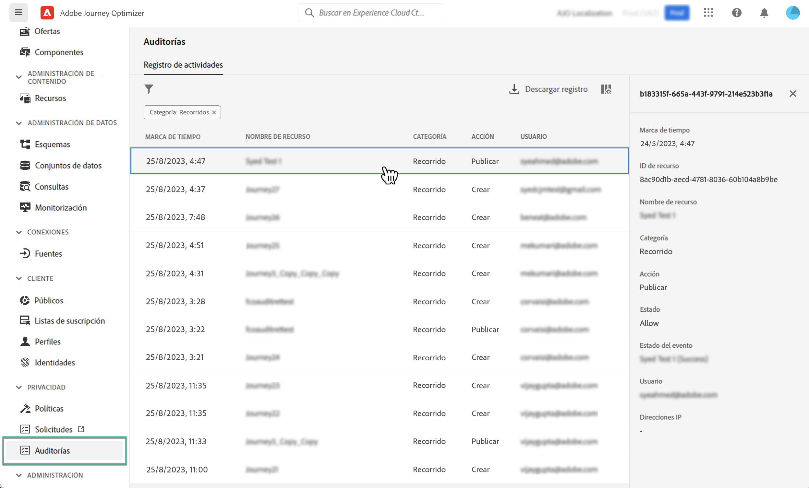

# Acciones de auditoría en recursos de Journey Optimizer {#track-changes}

## Acerca de los registros de auditoría {#audit-logs}

>[!IMPORTANT]
>
>Para ver y exportar el registro de la auditoría, debe tener **[!DNL View User Activity Log]** permiso para hacerlo. [Más información](../administration/ootb-product-profiles.md)

Con Journey Optimizer, puede identificar las acciones ejecutadas por los usuarios en el sistema en distintos servicios y funcionalidades, como recorridos, mensajes, páginas de aterrizaje, etc.

Esto le permite aumentar la visibilidad de las actividades realizadas en el sistema, solucionar problemas y ayudar a su empresa a cumplir con las regulaciones y las políticas de administración de datos corporativos..

Cada acción se registra con metadatos en “registros de auditoría” a los que se puede acceder desde Adobe Experience Platform. Para obtener más información sobre los registros de auditoría, incluido cómo verlos y administrarlos en la IU o la API, consulte [ la documentación de Adobe Experience Platform](https://experienceleague.adobe.com/docs/experience-platform/landing/governance-privacy-security/audit-logs/overview.html?lang=es).

## Tipos de eventos capturados por los registros de auditoría {#events}

La siguiente tabla indica qué acciones sobre qué recursos de Journey Optimizer se registran en los registros de auditoría.

>[!NOTE]
>
>La lista completa de acciones capturadas en los registros de auditoría está disponible en la [Documentación de Adobe Experience Platform](https://experienceleague.adobe.com/docs/experience-platform/landing/governance-privacy-security/audit-logs/overview.html?lang=es#category).

| Recurso | Acción |
|-----------|------------------|
| Campaña de AJO | Creación/eliminación/actualización/activación/detención |
| Configuración general del canal AJO | Creación/eliminación/actualización |
| Grupo de IP de AJO | Creación/eliminación/actualización |
| Página de aterrizaje de AJO | Creación/eliminación/actualización/publicación/cancelación de la publicación |
| Plantilla HTML de página de aterrizaje de AJO | Creación/eliminación/actualización |
| Ajuste preestablecido de página de aterrizaje de AJO | Creación/eliminación/actualización |
| Subdominio de página de aterrizaje de AJO | Creación/eliminación/actualización |
| Mensaje de AJO | Creación/eliminación/actualización/publicación |
| Ajuste preestablecido de mensaje de AJO | Creación/eliminación/actualización |
| Registro de PTR de AJO | Creación/eliminación/actualización |
| Plantilla de expresión guardada de AJO | Creación/eliminación/actualización |
| Credenciales de API de SMS de AJO | Creación/eliminación/actualización |
| Subdominio de AJO | Creación/eliminación/actualización |
| Lista de supresión de AJO | Creación/eliminación/descarga de CSV |
| Grupo de campos | Creación/eliminación/actualización |
|  Recorrido  | Creación/eliminación/actualización/detención/publicación |
| Acción personalizada de recorrido | Creación/eliminación/actualización |
| Fuente de datos de recorrido | Creación/eliminación/actualización |
| Evento de recorrido | Creación/eliminación/actualización |
| Regla de frecuencia de mensajes | Creación/eliminación/actualización |
| Estrategia de clasificación | Creación/eliminación/actualización |
