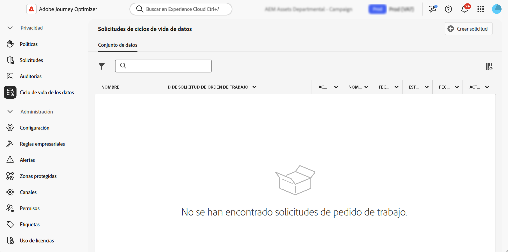

# Realizar operaciones de ciclo de vida de datos {#data-hygiene}

>[!AVAILABILITY]
>
>Las funcionalidades de ciclo de vida de los datos solo están disponibles para las organizaciones que han adquirido las ofertas sobre el **programa de protección sanitaria** y el **programa de protección de la seguridad y la privacidad**.

A medida que los datos se incorporan continuamente en Adobe Experience Platform, resulta crucial garantizar que los datos se utilicen según lo previsto, que se actualicen cuando sea necesario y que se eliminen según las políticas organizativas.

Estas tareas se pueden realizar utilizando el menú **[!UICONTROL Ciclo de vida de los datos]**, que le permite configurar y programar operaciones de ciclo de vida de datos, asegurándose de que los registros se mantengan correctamente.

## Recomendaciones {#data-hygiene-recommendations}

Al realizar operaciones de higiene de los datos (como eliminar identidades o conjuntos de datos), tenga en cuenta que los eventos de envío históricos asociados a identidades eliminadas ya no aparecen en los informes estándar ni en las consultas de lago de datos. Esto puede generar discrepancias entre el número de correos electrónicos notificados como **Entregados** y el número de correos electrónicos **Recibidos** en las bandejas de entrada de los destinatarios, especialmente para los recorridos más antiguos.

Antes de ejecutar eliminaciones a gran escala, valide y exporte los datos de envío o de creación de informes necesarios. Si es necesario realizar una reconciliación después de la higiene de los datos, coordínese con el servicio de asistencia de Adobe para acceder a los registros archivados o utilizar consultas del conjunto de datos de evento de comentarios sobre mensajes para los datos recientes.

## Más información {#data-hygiene-learn-more}

Para obtener más información sobre Privacy Service y cómo crear y administrar solicitudes de ciclo de vida de datos, consulte la siguiente documentación de Adobe Experience Platform:

* [Información general de Privacy Service](https://experienceleague.adobe.com/docs/experience-platform/privacy/home.html?lang=es)
* [Ciclo de vida de datos en Adobe Experience Platform](https://experienceleague.adobe.com/docs/experience-platform/hygiene/home.html?lang=es)
