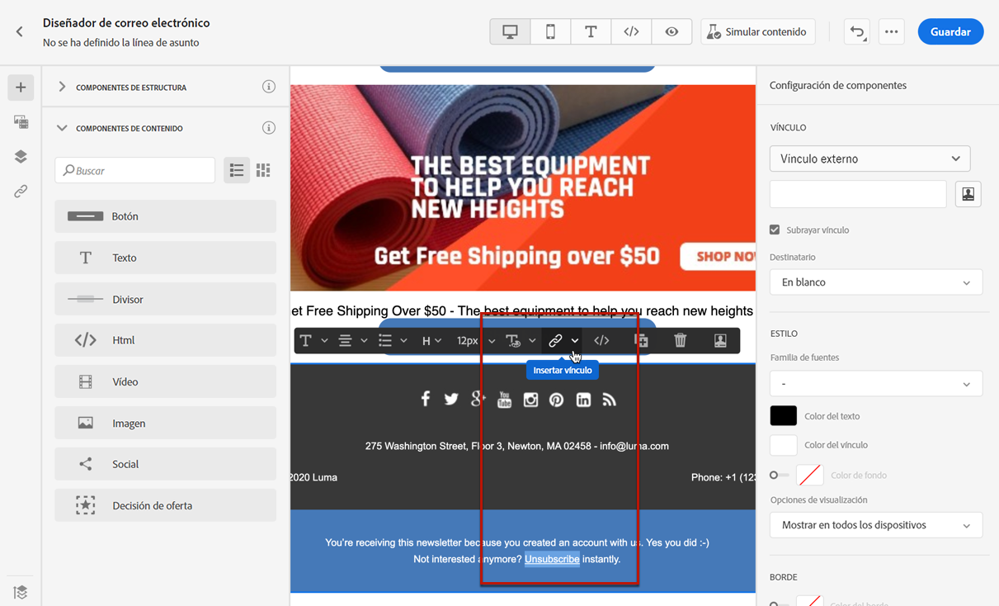
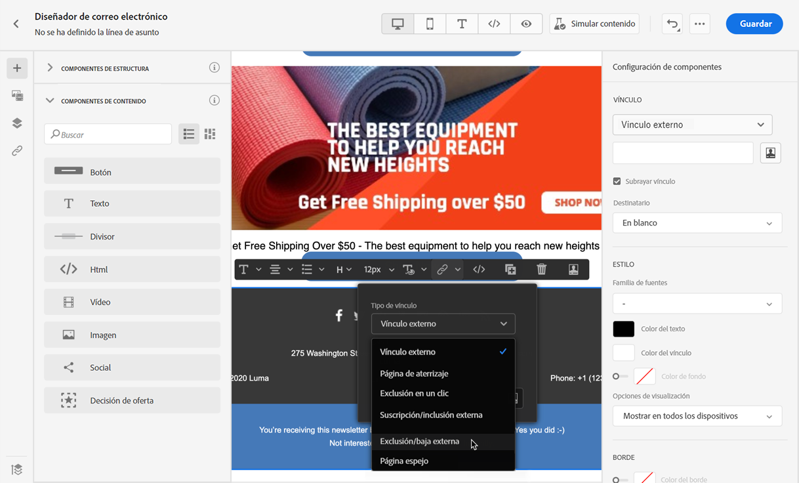
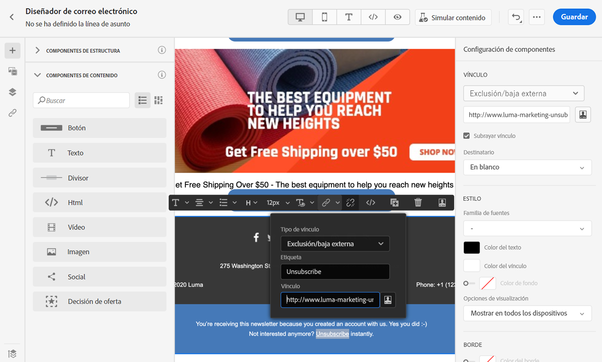
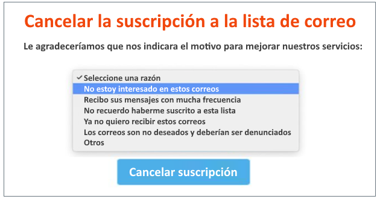
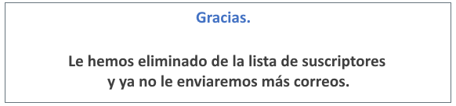
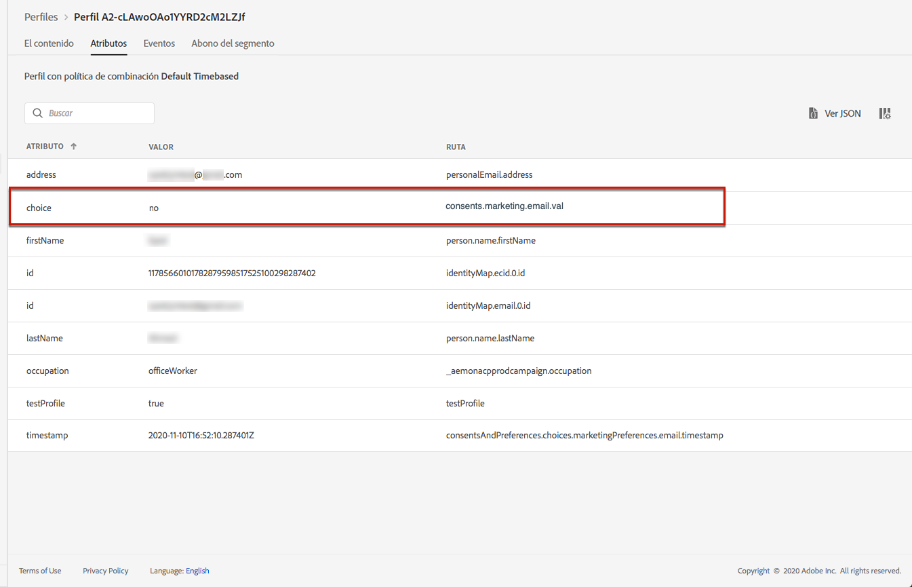
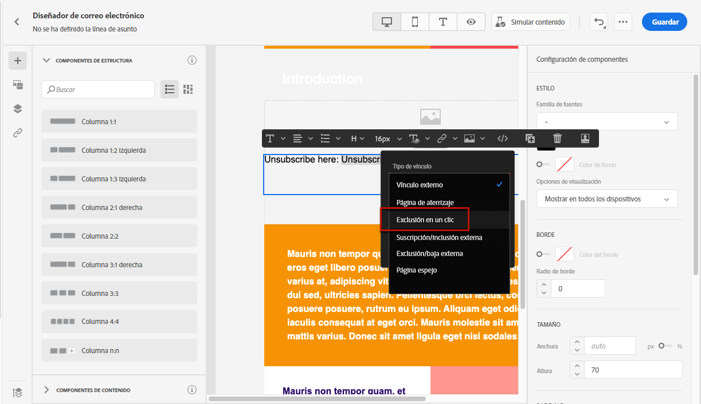
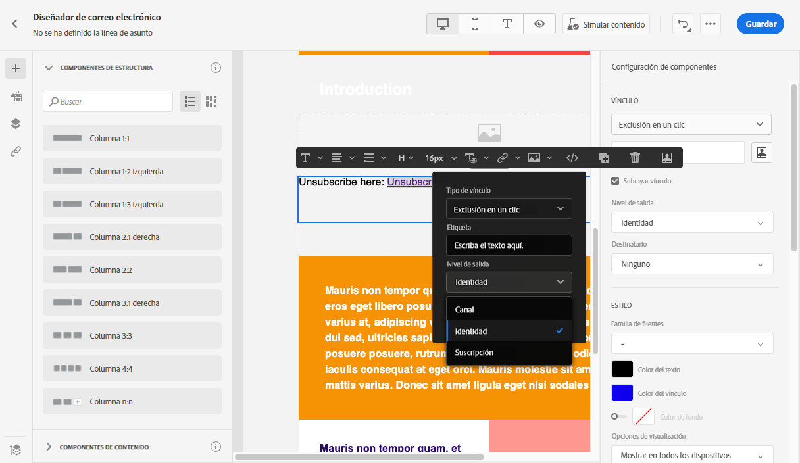
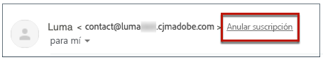

# Administración de la exclusión {#consent}

Utilice [!DNL Journey Optimizer] para hacer un seguimiento del consentimiento de los destinatarios para fines de comunicación y comprender cómo desean interactuar con su marca administrando sus preferencias y suscripciones.

Las regulaciones como el RGPD establecen que debe cumplir con requisitos específicos antes de poder utilizar la información de sujetos de datos. Además, estos deben poder modificar su consentimiento en cualquier momento.

**¿Por qué es importante?**

* El incumplimiento de estas regulaciones conlleva riesgos legales para su marca.
* Le ayuda a evitar enviar comunicaciones no solicitadas a sus destinatarios, lo que podría hacer que marquen sus mensajes como correo no deseado y dañar su reputación.

Obtenga más información sobre la administración de la privacidad y las regulaciones aplicables en la [Documentación de Experience Platform](https://experienceleague.adobe.com/docs/experience-platform/privacy/home.html?lang=es){target=&quot;_blank&quot;}.

>[!NOTE]
>
>En [!DNL Journey Optimizer], Experience Platform gestiona el consentimiento [Esquema de consentimiento](https://experienceleague.adobe.com/docs/experience-platform/xdm/field-groups/profile/consents.html?lang=es){target=&quot;_blank&quot;}. De forma predeterminada, el valor del campo de consentimiento está vacío y se trata como consentimiento para recibir sus comunicaciones. Puede modificar este valor predeterminado al incorporar uno de los posibles valores enumerados [aquí](https://experienceleague.adobe.com/docs/experience-platform/xdm/data-types/consents.html?lang=es#choice-values){target=&quot;_blank&quot;}.

## Administración de exclusión de correo electrónico {#opt-out-management}

Proporcionar a los destinatarios la capacidad de cancelar la suscripción a la recepción de comunicaciones de una marca es un requisito legal. Obtenga más información acerca de la legislación aplicable en la [Documentación de Experience Platform](https://experienceleague.adobe.com/docs/experience-platform/privacy/regulations/overview.html?lang=es#regulations){target=&quot;_blank&quot;}.

Por lo tanto, siempre debe incluir un **vínculo para cancelar la suscripción** en cada correo electrónico enviado a los destinatarios:

* Al hacer clic en este vínculo, los destinatarios se dirigen a una página de aterrizaje para confirmar la exclusión.
* Después de confirmar su elección, los datos de los perfiles se actualizarán con esta información.

>[!NOTE]
>
>Los mensajes de correo electrónico de tipo marketing deben incluir un vínculo de no participación, que no es necesario para los mensajes transaccionales. La categoría del mensaje (**[!UICONTROL Marketing]** o **[!UICONTROL Transaccional]**) se define en el nivel de [superficie de canal](../configuration/channel-surfaces.md#email-type) (es decir, ajuste preestablecido de mensaje) y durante la [creación del mensaje](../messages/get-started-content.md#create-new-message).

### Exclusión externa {#opt-out-external-lp}

Para ello, puede insertar un vínculo a una página de aterrizaje externa en un correo electrónico para permitir a los usuarios cancelar la suscripción y evitar recibir comunicaciones de su marca.

#### Agregar el vínculo &quot;Cancelar la suscripción&quot; {#add-unsubscribe-link}

Primero debe agregar el vínculo &quot;Cancelar la suscripción&quot; a un mensaje. Para realizar esto, siga los pasos a continuación:

1. Genere la página de aterrizaje de baja.

1. Alójelo en el sistema de terceros que elija.

1. [Cree un mensaje](../messages/get-started-content.md) en un recorrido.

1. Seleccione texto en el contenido e [inserte un vínculo](../design/message-tracking.md#insert-links) utilizando la barra de herramientas contextual.

   

1. Seleccione **[!UICONTROL Exclusión/baja externa]** de la lista desplegable **[!UICONTROL Tipo de vínculo]**.

   

1. En el campo de **[!UICONTROL Vínculo]**, pegue el vínculo a la página de aterrizaje de terceros.

   

1. Haga clic en **[!UICONTROL Guardar]**.

#### Implementación de una llamada de API para la exclusión {#opt-out-api}

Para que los destinatarios se excluyan cuando envíen su elección desde la página de aterrizaje, debe implementar una **Llamada de API de suscripción** mediante [Adobe Developer](https://developer.adobe.com){target=&quot;_blank&quot;} para actualizar las preferencias de los perfiles correspondientes.

Esta llamada de POST es como sigue:

Extremo: platform.adobe.io/journey/imp/consent/preferences

Parámetros de consulta:

* **params**: contiene la carga útil cifrada
* **sig**: firma
* **pid**: ID de perfil cifrado

Estos tres parámetros se incluyen en la dirección URL de la página de aterrizaje de terceros que se envía al destinatario:


Requisitos de encabezado:

* x-api-key
* x-gw-ims-org-id
* x-sandbox-name
* authorization (token de usuario de su cuenta técnica)

Cuerpo de la solicitud:

```
{
   "marketing": [
       {
            "type": "email",           
            "choice": "no",          
            "scope": "channel"       
        }
    ],
 
}
```

[!DNL Journey Optimizer] utilizará estos parámetros para actualizar la elección del perfil correspondiente a través de la llamada de la API de [Adobe Developer](https://developer.adobe.com){target=&quot;_blank&quot;}.

#### Enviar el mensaje con el vínculo &quot;Cancelar la suscripción&quot; {#send-message-unsubscribe-link}

Una vez configurado el vínculo &quot;Cancelar la suscripción&quot; a la página de aterrizaje e implementado la llamada de API, el mensaje está listo para enviarse

1. Envíe el mensaje, incluido el vínculo a través de un [recorrido](../building-journeys/journey.md).

1. Una vez recibido el mensaje, si el destinatario hace clic en el vínculo para cancelar la suscripción, se muestra la página de aterrizaje.

   

1. Si el destinatario envía el formulario (aquí, pulsando el botón **Cancelar la suscripción** en la página de aterrizaje), los datos de perfil se actualizan a través de la [llamada de la API](#opt-out-api).

1. El destinatario excluido se redirige a la pantalla de mensaje de confirmación para indicar que la exclusión se ha realizado correctamente.

   

   Como resultado, este usuario no recibirá comunicaciones de su marca a menos que se vuelva a suscribir.

1. Para comprobar que se ha actualizado la opción del perfil correspondiente, vaya a Experience Platform y acceda al perfil seleccionando un área de nombres de identidad y un valor de identidad correspondiente. Obtenga más información en la [Documentación de Adobe Experience Platform](https://experienceleague.adobe.com/docs/experience-platform/profile/ui/user-guide.html?lang=es#getting-started){target=&quot;_blank&quot;}.

   

   En la pestaña **[!UICONTROL Atributos]**, puede ver que el valor de **[!UICONTROL elección]** ha cambiado a **[!UICONTROL no]**.

### Opción de exclusión en un clic {#one-click-opt-out}

Dado que muchos clientes buscan un proceso más sencillo para cancelar la suscripción, también puede añadir un vínculo de no participación en un solo clic al contenido del correo electrónico. Este vínculo permite a los destinatarios cancelar la suscripción rápidamente a sus comunicaciones, sin que se les redirija a una página de aterrizaje en la que tengan que confirmar la exclusión, lo que acelera el proceso de cancelación de la suscripción.

Para añadir un vínculo de no participación en el correo electrónico, siga los pasos a continuación.

1. [Inserte un vínculo](../design/message-tracking.md#insert-links) y seleccione **[!UICONTROL Exclusión con un clic]** como tipo de vínculo.

   

1. Seleccione cómo desea aplicar la exclusión: en el nivel de canal, identidad o suscripción.

   

   * **[!UICONTROL Canal]**: la exclusión se aplica a mensajes futuros enviados al destinatario del perfil (es decir, la dirección de correo electrónico) para el canal actual. Si hay varios objetivos asociados a un perfil, la exclusión se aplica a todos los destinatarios (es decir, direcciones de correo electrónico) del perfil de ese canal.
   * **[!UICONTROL Identidad]**: la exclusión se aplica a los mensajes futuros enviados al destinatario específico (es decir, la dirección de correo electrónico) que se esté utilizando para el mensaje actual.
   * **[!UICONTROL Suscripción]**: la exclusión se aplica a mensajes futuros asociados a una lista de suscripción específica. Esta opción solo se puede seleccionar si el mensaje actual está asociado con una lista de suscripción.

1. Escriba la dirección URL de la página de aterrizaje a la que se redirigirá al usuario una vez cancelada la suscripción. Esta página solo está aquí para confirmar que la exclusión se ha realizado correctamente.

   >[!NOTE]
   >
   >Si ha activado la opción **Cancelar la suscripción a una lista** en el nivel de superficie de canal, esta URL también se utilizará cuando los usuarios hagan clic en el vínculo &quot;Cancelar la suscripción&quot; en el encabezado del correo electrónico. [Más información](#unsubscribe-header)

   

   Puede personalizar los vínculos. Obtenga más información sobre las URL personalizadas en [esta sección](../personalization/personalization-syntax.md).

1. Guarde los cambios.

Una vez que el mensaje se envía a través de un [recorrido](../building-journeys/journey.md), si un destinatario hace clic en el vínculo de no participación, su perfil se excluye inmediatamente.

### Vínculo &quot;Cancelar la suscripción&quot;  en el encabezado del correo electrónico {#unsubscribe-header}

>[!CONTEXTUALHELP]
>id="ajo_admin_preset_unsubscribe"
>title="Agregar vínculo &quot;Cancelar la suscripción&quot; al encabezado del correo electrónico"
>abstract="Active Cancelar la suscripción a una lista para agregar el vínculo &quot;Cancelar la suscripción&quot; al encabezado del correo electrónico. Para establecer la URL &quot;Cancelar la suscripción&quot;, inserte un vínculo de no participación de un solo clic en el contenido del correo electrónico."
>additional-url="https://experienceleague.adobe.com/docs/journey-optimizer/using/privacy/consent/opt-out.html?lang=es#one-click-opt-out" text="Opción de exclusión en un clic"

Si la [opción Cancelar la suscripción a una lista](../configuration/channel-surfaces.md#list-unsubscribe) se activa en el nivel de superficie de canal, los correos electrónicos correspondientes enviados con [!DNL Journey Optimizer] incluirán el vínculo &quot;Cancelar la suscripción&quot; en el encabezado del correo electrónico.

Por ejemplo, el vínculo &quot;Cancelar la suscripción&quot; se mostrará en Gmail de la siguiente manera:



>[!NOTE]
>
>Para mostrar el vínculo &quot;Cancelar la suscripción&quot; en el encabezado del correo electrónico, el cliente de correo electrónico de los destinatarios debe admitir esta función.

La dirección &quot;Cancelar la suscripción&quot; es la dirección predeterminada **[!UICONTROL Mailto (cancelación de suscripción)]** mostrada en la superficie de canal correspondiente. [Más información](../configuration/channel-surfaces.md#list-unsubscribe).

Para establecer la URL &quot;Cancelar la suscripción&quot; personalizada, inserte un vínculo de no participación de un solo clic en el contenido del mensaje de correo electrónico e introduzca la URL que elija. [Más información](#one-click-opt-out)

Según el cliente de correo electrónico, hacer clic en el vínculo de cancelación de suscripción del encabezado puede tener uno de los siguientes impactos:

* La solicitud de cancelar la suscripción se envía a la dirección de cancelación de suscripción predeterminada.

* El destinatario se dirige a la dirección URL de la página de aterrizaje que especificó al agregar el vínculo de no participación al mensaje.

   >[!NOTE]
   >
   >Si no agrega un vínculo de no participación de un clic al contenido del mensaje, no se mostrará ninguna página de aterrizaje.

* El perfil correspondiente se excluye inmediatamente y esta opción se actualiza en Experience Platform. Obtenga más información en la [Documentación de Experience Platform](https://experienceleague.adobe.com/docs/experience-platform/profile/ui/user-guide.html?lang=es#getting-started){target=&quot;_blank&quot;}.

## Administración de exclusiones push {#push-opt-out-management}

Los destinatarios push pueden cancelar la suscripción a través de sus propios dispositivos.

Por ejemplo, al descargar o al usar la aplicación, pueden seleccionar detener las notificaciones. Del mismo modo, pueden cambiar la configuración de notificación a través del sistema operativo móvil.

## Administración de exclusión de SMS {#sms-opt-out-management}

De acuerdo con las normas y los reglamentos del sector, todos los mensajes SMS sobre marketing deben contener una forma para que los destinatarios puedan cancelar la suscripción fácilmente. Una vez cancelada la suscripción, los perfiles se eliminan automáticamente de la audiencia de futuros mensajes de marketing.

De forma predeterminada, Adobe Journey Optimizer gestiona mensajes de respuesta estándar en inglés como STOP, UNSTOP y START para mensajes de código largo y gratuito, de acuerdo con los estándares del sector para la integración nativa como Sinch y Twilio. Estas palabras clave suelen activar una respuesta estándar automática de su proveedor de terceros (p. ej., Twilio, Sinch, etc.). Puede confirmar esto directamente con su proveedor o a través de su sitio de documentación.

No se necesita hacer nada más para garantizar que las funcionalidades de exclusión de SMS funcionen en Adobe Journey Optimizer, ya que STOP, UNSTOP y START, las respuestas de palabras clave, se reconocerán automáticamente.

Además de detener el envío con Adobe Journey Optimizer en función del estado de exclusión (para integraciones directas con Twilio o Sinch), la mayoría de los proveedores de puertas de enlace por SMS también mantienen una lista de bloqueados que garantiza que un mensaje SMS no se va a enviar a una persona que haya elegido excluirse. Si utiliza un proveedor que no sea Sinch o Twilio y envía un SMS a través de un [canal personalizado](../building-journeys/using-custom-actions.md), debe confirmarlo con su proveedor.

>[!IMPORTANT]
>
>Las campañas de mensajería de texto pueden estar sujetas a diversos requisitos legales de cumplimiento según su naturaleza, la ubicación desde la que se envían los mensajes de texto y la ubicación de los destinatarios. <br>Aunque Adobe Journey Optimizer gestionará los mensajes en códigos largos y números gratuitos, tal y como se detalla más arriba, consulte a su asesor jurídico para asegurarse de que su campaña de mensajería de texto cumpla todos los requisitos legales aplicables.

### Códigos cortos {#short-codes}

De forma predeterminada, Adobe Journey Optimizer no gestiona las palabras clave de exclusión, inclusión o ayuda para los números de código corto.

Debe asegurarse de que el código corto cumpla todas las normas y regulaciones del sector para gestionar la exclusión.

### ID de remitente alfanumérico {#alphanumeric}

Los ID de remitente alfanuméricos solo se utilizan en la mensajería unidireccional y no pueden recibir mensajes. Como resultado, STOP, START y HELP, las palabras clave de SMS de Adobe Journey Optimizer, no son aplicables a los ID de remitente alfa. Debe‧proporcionar‧otras‧instrucciones,‧como‧escribir‧al‧Equipo‧de‧Soporte,‧llamar‧a‧una‧línea‧telefónica‧de‧asistencia‧o‧enviar‧un‧mensaje‧de‧texto‧a‧otro‧número‧de‧teléfono‧o‧código‧para‧permitir‧a‧los‧usuarios‧excluirse‧de‧los‧mensajes‧enviados‧a‧través‧de‧un‧ID‧de‧remitente‧alfanumérico.

#### Vídeo {#video-sms}

Para obtener más información sobre cómo funciona la compatibilidad con palabras clave entrantes nativas (START, STOP y UNSTOP) para SMS, mire el siguiente vídeo:

>[!VIDEO](https://video.tv.adobe.com/v/344026?quality=12)
