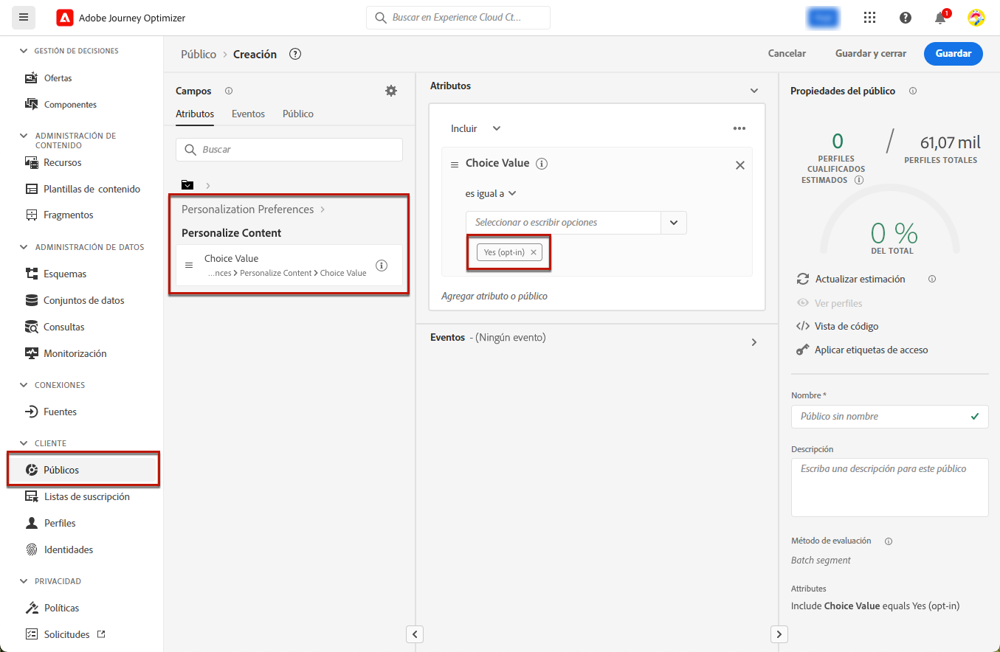
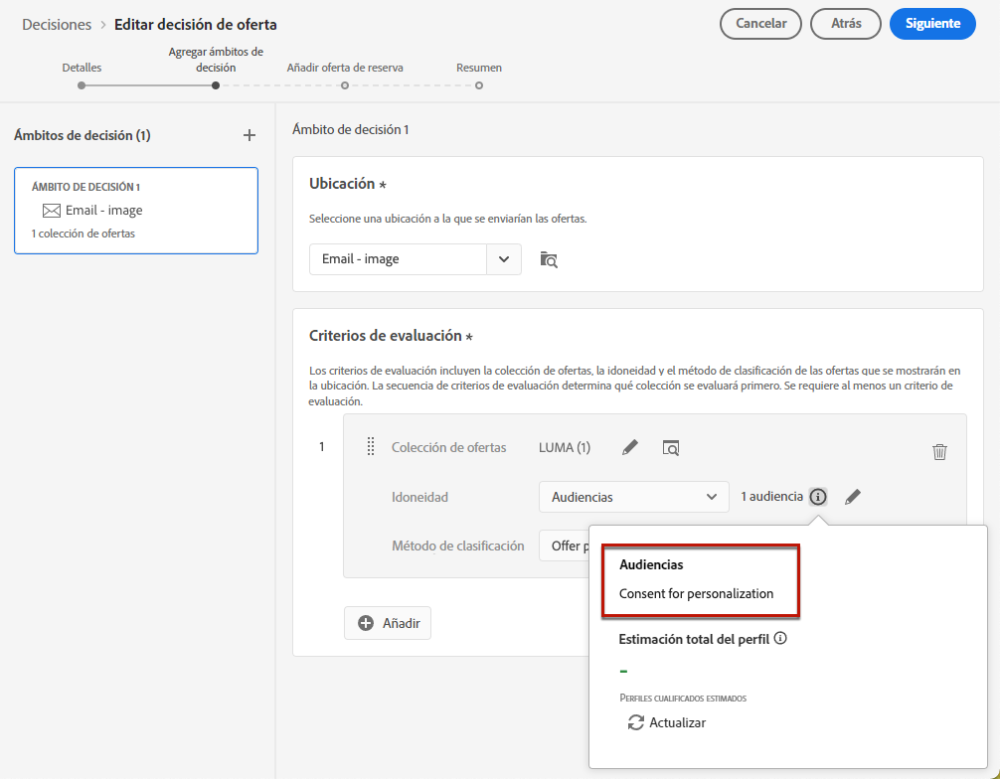
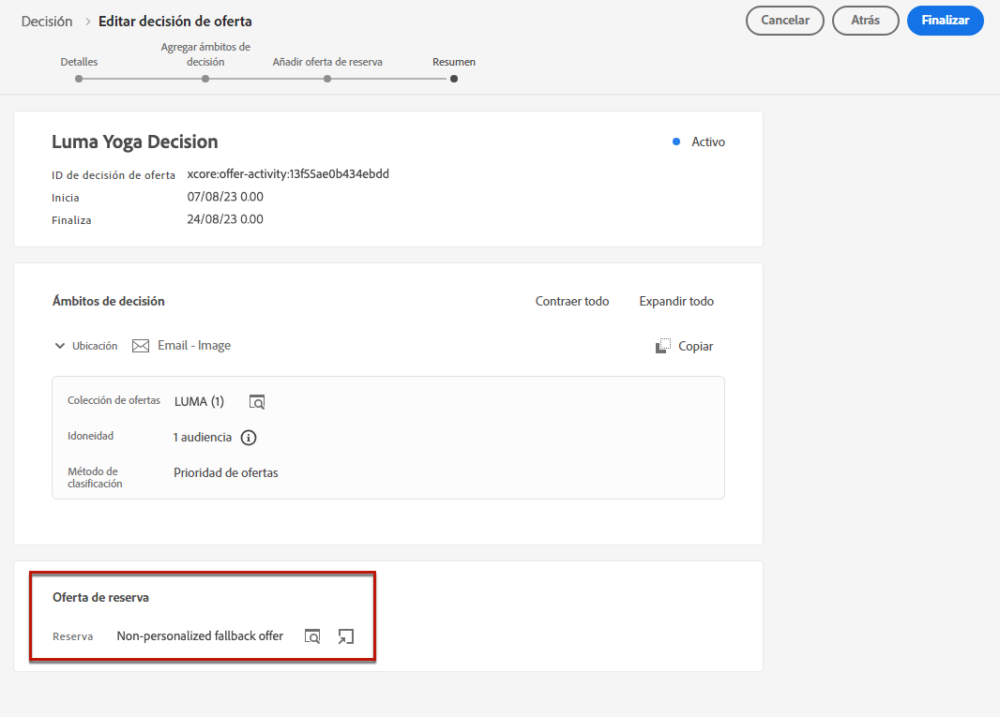
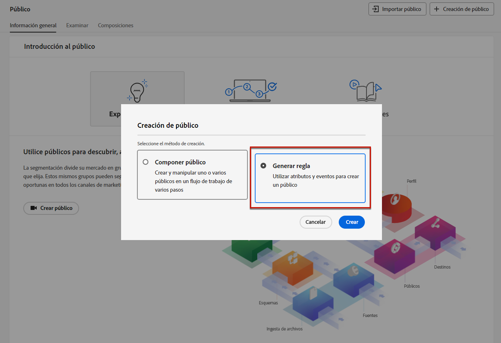
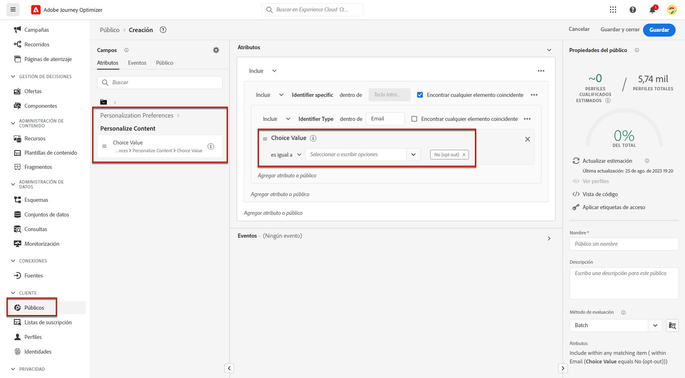
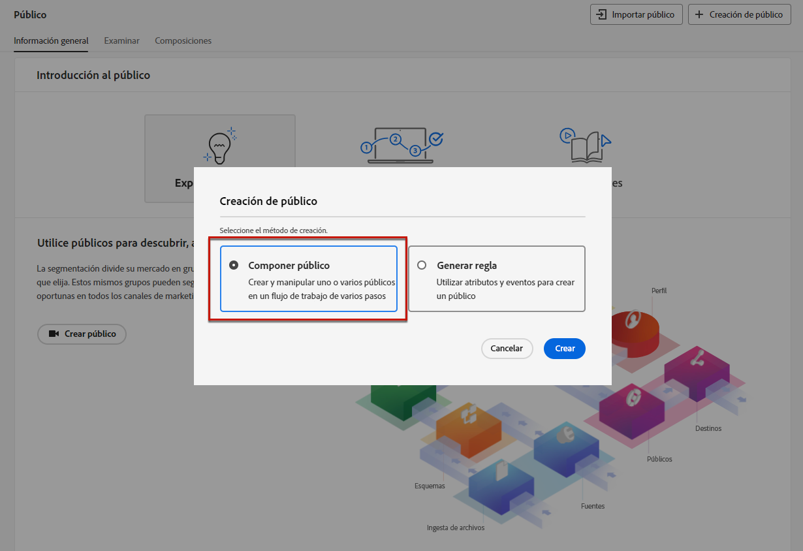
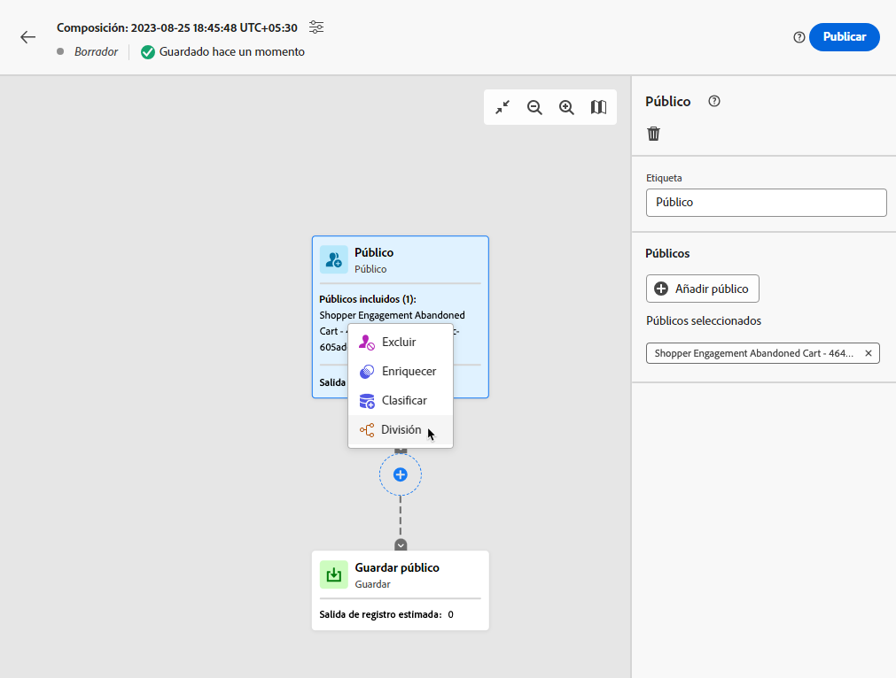
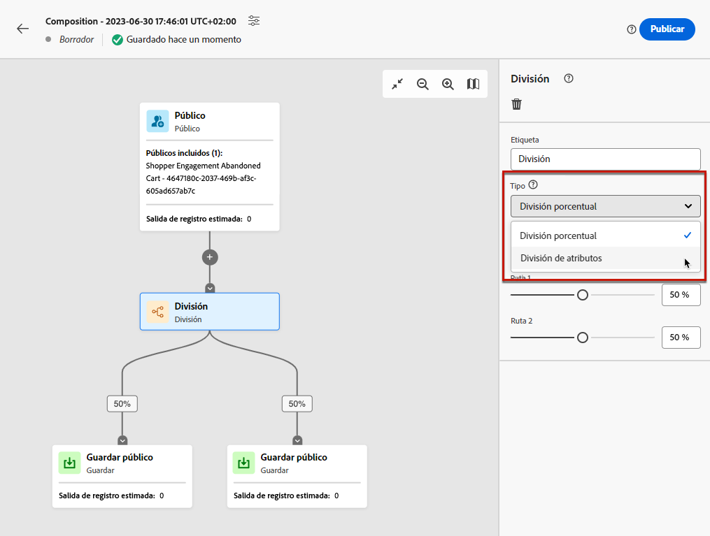
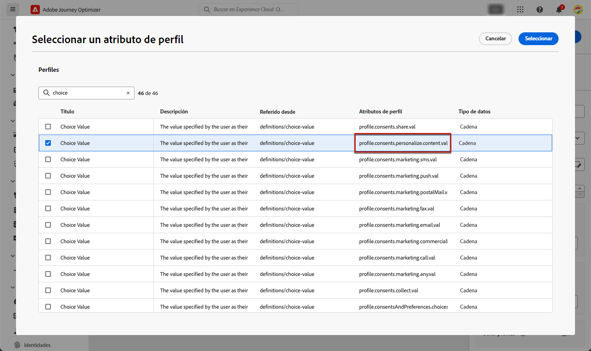
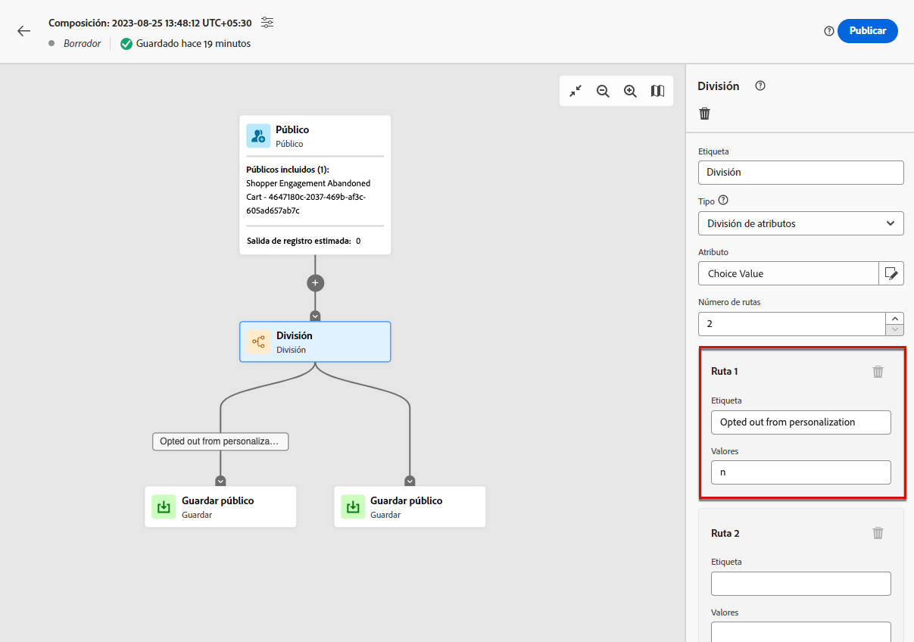

# Administración de la exclusión {#consent}

Proporcionar a los destinatarios la capacidad de cancelar la suscripción a la recepción de comunicaciones de una marca es un requisito legal, así como garantizar que se cumpla esta opción. El incumplimiento de estas regulaciones conlleva riesgos legales para su marca. Le ayuda a evitar enviar comunicaciones no solicitadas a sus destinatarios, lo que podría hacer que marquen sus mensajes como correo no deseado y dañar su reputación.

Obtenga más información acerca de la legislación aplicable en la [Documentación de Experience Platform](https://experienceleague.adobe.com/docs/experience-platform/privacy/regulations/overview.html?lang=es#regulations){target="_blank"}.

## Administración de bajas en recorridos y campañas {#opt-out-ajo}

Al enviar mensajes desde recorridos o campañas, siempre debe asegurarse de que los clientes puedan cancelar la suscripción a comunicaciones futuras. Una vez cancelada la suscripción, los perfiles se eliminan automáticamente del público de futuros mensajes de marketing.

Mientras **[!DNL Journey Optimizer]** proporciona formas de administrar la exclusión en correos electrónicos y mensajes SMS, las notificaciones push no requieren ninguna acción por su parte, ya que los destinatarios pueden cancelar la suscripción a través de sus propios dispositivos. Por ejemplo, al descargar o al usar la aplicación, pueden seleccionar detener las notificaciones. Del mismo modo, pueden cambiar la configuración de notificación a través del sistema operativo móvil.

>[!NOTE]
>
>Además, puede aprovechar la **API de REST de supresión** de Journey Optimizer para controlar los mensajes salientes mediante supresión y listas de permitidos. [Obtenga información sobre cómo trabajar con la API de REST de supresión](https://developer.adobe.com/journey-optimizer-apis/references/suppression/){target="_blank"}

Aprenda a administrar la exclusión en los mensajes de correo electrónico y SMS de Journey Optimizer en estas secciones:

<table style="table-layout:fixed"><tr style="border: 0;">
<td>

<a href="../email/email-opt-out.md"><strong>Administración de exclusión de correo electrónico</strong>

</td>
<td>

<a href="../sms/sms-opt-out.md"><strong>Administración de exclusión de SMS</strong></a>

</td>
</tr></table>

>[!NOTE]
>
>En [!DNL Journey Optimizer], el consentimiento se gestiona mediante el [Esquema de consentimiento](https://experienceleague.adobe.com/docs/experience-platform/xdm/field-groups/profile/consents.html?lang=es){target="_blank"} de Experience Platform. De forma predeterminada, el valor del campo de consentimiento está vacío y se trata como consentimiento para recibir sus comunicaciones. Puede modificar este valor predeterminado al incorporar uno de los posibles valores enumerados [aquí](https://experienceleague.adobe.com/docs/experience-platform/xdm/data-types/consents.html?lang=es#choice-values){target="_blank"}, o usar [directivas de consentimiento](../action/consent.md) para anular la lógica predeterminada.

## Implementación del consentimiento de personalización {#opt-out-personalization}

Los clientes también pueden optar por no recibir contenido personalizado. Una vez que un perfil se ha excluido de la personalización, debe asegurarse de que sus datos no se utilicen para ella y debe reemplazar cualquier contenido personalizado con una variante de reserva.

### En gestión de decisiones {#opt-out-decision-management}

Al aprovechar las ofertas, las preferencias de personalización no se implementan automáticamente en [ámbitos de decisión](../offers/offer-activities/create-offer-activities.md#add-decision-scopes) utilizado desde una solicitud de API de [Decisioning](../offers/api-reference/offer-delivery-api/decisioning-api.md) o una solicitud de API de [Edge Decisioning](../offers/api-reference/offer-delivery-api/edge-decisioning-api.md). En este caso, debe aplicar manualmente el consentimiento de personalización. Para ello, siga los pasos que aparecen a continuación.

>[!NOTE]
>
>Los ámbitos de decisión utilizados en los canales creados de [!DNL Journey Optimizer] cumplen este requisito desde el recorrido o la campaña a los que pertenecen.

1. Cree una [audiencia de Adobe Experience Platform](../audience/about-audiences.md) mediante el [servicio de segmentación](https://experienceleague.adobe.com/docs/experience-platform/segmentation/ui/overview.html?lang=es){target="_blank"} y use un atributo de perfil como **[!UICONTROL Personalizar contenido = Sí (opción de inclusión)]** para segmentar usuarios que hayan aceptado la personalización.

   

1. Al crear una [decisión](../offers/offer-activities/create-offer-activities.md), agregue un ámbito de decisión y defina una restricción de idoneidad basada en este público o para cada recopilación de criterios de evaluación que contenga ofertas personalizadas.

   

1. Crear una [oferta de reserva](../offers/offer-library/creating-fallback-offers.md) que no incluye contenido personalizado.

1. [Asignar](../offers/offer-activities/create-offer-activities.md#add-fallback) la oferta de reserva no personalizada a la decisión.

   

1. [Revisar y guardar](../offers/offer-activities/create-offer-activities.md#review) la decisión.

Si un usuario:

* ha aceptado la personalización, el ámbito de decisión determinará la mejor oferta para ese perfil.

* no ha aceptado la personalización, el perfil correspondiente no será apto para ninguna de las ofertas que se encuentren en los criterios de evaluación y, por lo tanto, recibirán la oferta de reserva no personalizada.

>[!NOTE]
>
>El consentimiento que los datos de perfil se utilicen en [modelado de datos](../offers/ranking/ai-models.md) aún no es compatible con [!DNL Journey Optimizer].

### En el editor de personalización {#opt-out-expression-editor}

El [editor de personalización](../personalization/personalization-build-expressions.md) propiamente dicho no realiza las comprobaciones de consentimiento ni su cumplimiento, ya que no participa en el envío de mensajes.

Sin embargo, el uso de etiquetas de control de acceso basadas en los derechos permite restringir qué campos se pueden utilizar para la personalización. La [previsualización del mensaje](../content-management/preview.md) y [el servicio de representación de correo electrónico](../content-management/rendering.md) enmascararán los campos identificados con información confidencial.

>[!NOTE]
>
>Obtenga más información sobre el control de acceso de nivel de objeto (OLAC) en [esta sección](../administration/object-based-access.md).

En las campañas de [!DNL Journey Optimizer], la política de consentimiento se aplica del siguiente modo:

* Puede incluir definiciones de directivas de consentimiento como parte de la creación de públicos para asegurarse de que el público seleccionado para la campaña ya haya **filtrado los perfiles que no coinciden con los criterios de consentimiento**.

* [!DNL Journey Optimizer] realizará una comprobación de consentimiento general a nivel de canal para **garantizar que los perfiles hayan elegido** recibir comunicaciones de marketing en el canal específico.

  >[!NOTE]
  >
  >El propio objeto de campaña de [!DNL Journey Optimizer] no realiza ninguna comprobación adicional de cumplimiento de la directiva de consentimiento en este momento.

Para aplicar manualmente el consentimiento de personalización en las campañas, elija una de las opciones a continuación.

### Uso del generador de reglas de segmentos

Puede usar el generador de reglas de segmentos para crear un público que contenga perfiles de exclusión.

1. Crear una [audiencia de Adobe Experience Platform](../audience/about-audiences.md) mediante el [servicio de segmentación](https://experienceleague.adobe.com/docs/experience-platform/segmentation/ui/overview.html?lang=es){target="_blank"}.

   

1. Seleccione un atributo de perfil como **[!UICONTROL Personalizar contenido = No (exclusión)]** para excluir a los usuarios que no hayan aceptado la personalización.

   

1. Haga clic en **[!UICONTROL Guardar]**.

Ahora puede utilizar este público para filtrar los perfiles que no hayan dado su consentimiento para la personalización de sus campañas.

### Uso de una actividad de división en un flujo de trabajo de composición

También puede añadir una comprobación de consentimiento de personalización a un público añadiendo una actividad de división a un flujo de trabajo de composición.

1. Cree un público con la opción **[!UICONTROL Componer público]**. [Más información sobre la creación de un flujo de trabajo de composición](../audience/get-started-audience-orchestration.md)

   

1. Añada el público inicial con el botón específico de la derecha.

1. Haga clic en el icono **+** y seleccione una actividad **[!UICONTROL División]** para crear un público dividido.

   

1. En el panel derecho, seleccione **[!UICONTROL División de atributos]** como el tipo de división.

   

1. Haga clic en el icono de lápiz situado junto al campo **[!UICONTROL Atributo]** para que aparezca la ventana **[!UICONTROL Seleccionar un atributo de perfil]**.

1. Busque el atributo de consentimiento de personalización (`profile.consents.personalize.content.val`) y selecciónelo.

   

1. **[!UICONTROL Ruta 1]** será el público no personalizado. Elija una etiqueta relevante.

1. Elija el valor apropiado de esta [lista](https://experienceleague.adobe.com/docs/experience-platform/xdm/data-types/consents.html?lang=es#choice-values){target="_blank"}.

   En este caso utilizaremos `n` para indicar que los usuarios no consienten el uso de sus datos para la personalización.

   

1. Puede crear una ruta independiente para otros valores de opción. También puede optar por eliminar las rutas restantes y activar **[!UICONTROL Otros perfiles]** para incluir todos los demás perfiles que no tengan un valor de opción de `n`.

1. Una vez finalizado, haga clic en **[!UICONTROL Guardar público]** para cada ruta y así guardar el resultado del flujo de trabajo en un nuevo público. Se guardará un público en Adobe Experience Platform para cada ruta.

1. Una vez finalizado, publique el flujo de trabajo de composición.

Ahora puede utilizar este público para filtrar los perfiles que no hayan dado su consentimiento para la personalización de sus campañas.

>[!NOTE]
>
>Tenga en cuenta que si crea un público que no haya dado su consentimiento para la personalización y luego selecciona este público en una campaña, las herramientas de personalización permanecerán disponibles. Es responsabilidad de los usuarios de marketing comprender que, si trabajan con un público que no haya dado su consentimiento para recibir personalización, no deberían utilizar las herramientas de personalización.
