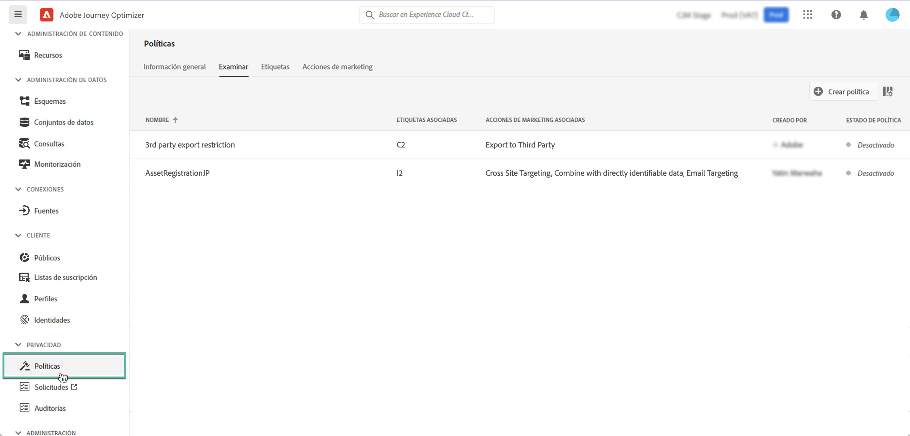

# Políticas de uso de datos {#Policies}

Con Adobe Experience Platform **Servicio de administración de datos**, puede aplicar restricciones de uso de datos mediante el uso de etiquetas, acciones de marketing y políticas.

Para ello, el servicio de control de datos le permite aplicar etiquetas de uso de datos a conjuntos de datos y campos, clasificando cada uno según las políticas de uso de datos relacionadas.

Las políticas de uso de datos son reglas que describen los tipos de acciones de marketing que se le permite realizar, o que se le restringe, en los datos de Experience Platform. Se puede acceder a ellas desde la **[!UICONTROL Policies]** para abrir el Navegador.

Para obtener más información sobre el marco de control de datos y cómo trabajar con etiquetas y políticas, consulte la documentación de Adobe Experience Platform:

* [Resumen del servicio de control de datos](https://experienceleague.adobe.com/docs/experience-platform/data-governance/home.html)
* [Información general sobre las etiquetas de uso de datos](https://experienceleague.adobe.com/docs/experience-platform/data-governance/labels/overview.html?lang=en)
* [Políticas de uso de datos](https://experienceleague.adobe.com/docs/experience-platform/data-governance/policies/overview.html)
