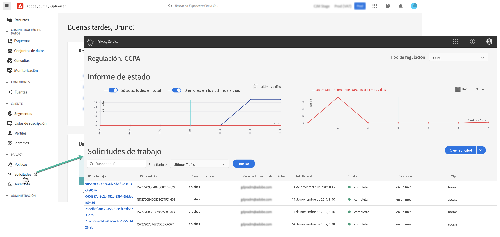

# Solicitudes de privacidad {#track-changes}

**Privacy Service** de Adobe Experience Platform proporciona una API de RESTful y una interfaz de usuario para ayudarle a administrar las solicitudes de datos de los clientes. Con Privacy Service, puede enviar solicitudes para acceder a datos personales de clientes y eliminarlos de aplicaciones de Adobe Experience Cloud, lo que facilita el cumplimiento automatizado de las regulaciones de privacidad legales y organizativas.

Las solicitudes de privacidad se pueden crear y administrar desde el menú **[!UICONTROL Solicitudes]**.



Para obtener más información sobre Privacy Service y cómo crear y administrar solicitudes de privacidad, consulte la [documentación de Adobe Experience Platform](https://experienceleague.adobe.com/docs/experience-platform/privacy/home.html?lang=es){target="_blank"}.

<!--* [Privacy Service overview](https://experienceleague.adobe.com/docs/experience-platform/privacy/home.html?lang=es)
* [Managing privacy jobs in the Privacy Service UI](https://experienceleague.adobe.com/docs/experience-platform/privacy/ui/user-guide.html?lang=es)-->

## Administración de las solicitudes de privacidad de datos individuales que puede enviar a Adobe Journey Optimizer {#data-privacy-requests}

Puede enviar solicitudes individuales para acceder a los datos de consumo y eliminarlos de Adobe Journey Optimizer de dos formas:

* A través de la **IU de Privacy Service**. [Más información](https://experienceleague.adobe.com/docs/experience-platform/privacy/ui/user-guide.html?lang=es){target="_blank"}
* A través de la **API de Privacy Service**. [Más información](https://experienceleague.adobe.com/es/docs/experience-platform/privacy/api/overview){target="_blank"}
  <!--More specific information on Privacy Service API [here](https://developer.adobe.com/experience-platform-apis/references/privacy-service/#_blank).-->

Privacy Service admite dos tipos de solicitudes: **acceso a datos** y **eliminación de datos**.

Para las **solicitudes de acceso**, especifique “**Adobe Journey Optimizer**” en la interfaz de usuario (o “**CJM**” como código de producto en la API).

Para las **solicitudes de eliminación**, además de la solicitud “**Adobe Journey Optimizer**”, también debe enviar solicitudes de eliminación a **tres servicios ascendentes** para evitar que Journey Optimizer vuelva a insertar los datos eliminados. Si no se especifican estos servicios ascendentes, la solicitud de “Adobe Journey Optimizer” permanecerá en el estado “procesando” hasta que se creen solicitudes de eliminación para los servicios ascendentes.

Los tres servicios ascendentes son los siguientes:

* Perfil (código de producto: “profileService”)
* Lago de datos de AEP (código de producto: “AdobeCloudPlatform”)
* Identidad (código de producto: “identidad”)

>[!NOTE]
>
>Esta guía solo explica cómo realizar solicitudes de privacidad para [!UICONTROL Adobe Journey Optimizer].
>
>* Si también planea realizar solicitudes de privacidad para el lago de datos de Platform, consulte esta [guía](https://experienceleague.adobe.com/es/docs/experience-platform/catalog/privacy) además de este tutorial.
>
>* Para el perfil del cliente en tiempo real, consulte esta [guía](https://experienceleague.adobe.com/es/docs/experience-platform/profile/privacy).
>* Para el servicio de identidad, consulte esta [guía](https://experienceleague.adobe.com/es/docs/experience-platform/identity/privacy).
>
>Para las solicitudes de eliminación y de acceso, debe llamar a estos sistemas individuales para asegurarse de que cada uno de ellos gestiona las solicitudes. Realizar una solicitud de privacidad a [!DNL Adobe Journey Optimizer] no quitará los datos de todos estos sistemas.

## Creación de solicitudes de acceso y de eliminación

### Requisitos previos

Para realizar solicitudes de acceso y eliminación de datos para Adobe Journey Optimizer, deberá poseer lo siguiente:

* un ID de organización de Adobe
* un identificador de identidad de la persona sobre la que desea actuar y las áreas de nombres correspondientes. Para obtener más información sobre áreas de nombres de identidad en Adobe Journey Optimizer y Experience Platform, consulte la [información general del espacio de nombres de identidad](https://experienceleague.adobe.com/es/docs/experience-platform/identity/features/namespaces).

>[!IMPORTANT]
>
>Al enviar solicitudes de privacidad, asegúrese de especificar “[!DNL '**Adobe Journey Optimizer**]” como nombre de producto de destino y **todos los espacios de nombres de identidad** (como “Correo electrónico”, “ECID” o “ID de lealtad”) asociados con los datos de perfil a los que hay que acceder o que hay que eliminar. En particular, para las solicitudes de eliminación, si no incluye explícitamente el nombre del producto y todos los espacios de nombres aplicables, los datos no se eliminan de [!DNL Adobe Journey Optimizer].

### Valores de campo requeridos en Journey Optimizer para las solicitudes de API

```json
"companyContexts":
    "namespace": imsOrgID
    "value": <Your Adobe Organization ID Value>

"users":
    "action": either access or delete

    "userIDs":
        "namespace": e.g. email, aaid, ecid, etc.
        "type": standard
        "value": <Data Subject's Identity Identifier>

"include":
    CJM (which is the Adobe product code for Adobe Journey Optimizer)
    profileService (product code for Profile)
    AdobeCloudPlatform (product code for AEP Data Lake)
    identity (product code for Identity)

"regulation":
    gdpr, ccpa, pdpa, lgpd_bra, or nzpa_nzl (which is the privacy regulation that applies to the request)
```


### Ejemplo de solicitud de acceso al RGPD:

Desde la interfaz de usuario:

{width="60%" align="center"}

A través de la API:

```json
// JSON Request
{
   "companyContexts":[
      {
         "namespace":"imsOrgID",
         "value":"745F37C35E4B776E0A49421B@AdobeOrg"
      }
   ],
   "users":[
      {
         "action":[
            "access"
         ],
         "userIDs":[
            {
               "namespace":"ecid",
               "value":"38400000-8cf0-11bd-b23e-10b96e40000d",
               "type":"standard"
            },
            {
               "namespace":"email",
               "value":"johndoe4@gmail.com",
               "type":"standard"
            }
         ]
      }
   ],
   "include":[
      "CJM"
   ],
   "regulation":"gdpr"
}
```

```json
// JSON Response
{
    "requestId": "17163122360480365RX-705",
    "totalRecords": 1,
    "jobs": [
        {
            "jobId": "e709b1f4-1796-11ef-b422-eddd0aebc40d",
            "customer": {
                "user": {
                    "key": "John Doe",
                    "action": [
                        "access"
                    ],
                    "userIDs": [
                        {
                            "namespace": "ecid",
                            "value": "38400000-8cf0-11bd-b23e-10b96e40000d",
                            "type": "standard",
                            "namespaceId": 4,
                            "isDeletedClientSide": false
                        },
                        {
                            "namespace": "email",
                            "value": "johndoe4@gmail.com",
                            "type": "standard",
                            "namespaceId": 6,
                            "isDeletedClientSide": false
                        }
                    ]
                }
            }
        }
    ]
}
```

### Ejemplo de solicitud de eliminación de RGPD:

Desde la interfaz de usuario:

{width="60%" align="center"}

A través de la API:

```json
// JSON Request
{
  "companyContexts": [
    {
      "namespace": "imsOrgID",
      "value": "745F37C35E4B776E0A49421B@AdobeOrg"
    }
  ],
  "users": [
    {
      "action": [
          "delete"
      ],
      "userIDs": [
        {
          "namespace": "ecid",
          "value": "38400000-8cf0-11bd-b23e-10b96e40000d",
          "type": "standard"
        },
                {
          "namespace": "email",
          "value": "johndoe4@gmail.com",
          "type": "standard"
        }
      ]
    }
  ],
  "include": [
    "CJM", "profileService", "AdobeCloudPlatform", "identity"
  ],
  "regulation": "gdpr"
}
```

```json
// JSON Response
{
    "requestId": "17163122360480365RX-705",
    "totalRecords": 1,
    "jobs": [
        {
            "jobId": "e709b1f4-1796-11ef-b422-eddd0aebc40d",
            "customer": {
                "user": {
                    "key": "John Doe",
                    "action": [
                        "delete"
                    ],
                    "userIDs": [
                        {
                            "namespace": "ecid",
                            "value": "38400000-8cf0-11bd-b23e-10b96e40000d",
                            "type": "standard",
                            "namespaceId": 4,
                            "isDeletedClientSide": false
                        },
                        {
                            "namespace": "email",
                            "value": "johndoe4@gmail.com",
                            "type": "standard",
                            "namespaceId": 6,
                            "isDeletedClientSide": false
                        }
                    ]
                }
            }
        }
    ]
}
```
