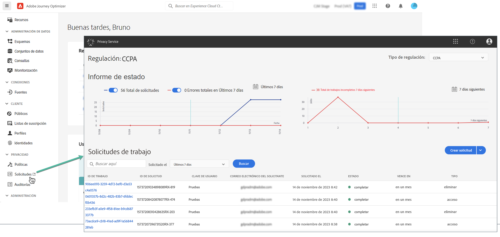

# Solicitudes de privacidad {#track-changes}

Adobe Experience Platform **Servicio de privacidad** proporciona una API de RESTful y una interfaz de usuario para ayudarle a administrar las solicitudes de datos de los clientes. Con Privacy Service, puede enviar solicitudes para acceder a datos personales de clientes y eliminarlos de aplicaciones de Adobe Experience Cloud, lo que facilita el cumplimiento automatizado de las normas de privacidad legales y organizativas.

Las solicitudes de privacidad se pueden crear y administrar desde la variable **[!UICONTROL Requests]** para abrir el Navegador.

Para obtener más información sobre el Privacy Service y cómo crear y administrar solicitudes de privacidad, consulte la documentación de Adobe Experience Platform:

* [Información general de Privacy Service](https://experienceleague.adobe.com/docs/experience-platform/privacy/home.html)
* [Administración de trabajos de privacidad en la interfaz de usuario del Privacy Service](https://experienceleague.adobe.com/docs/experience-platform/privacy/ui/user-guide.html)
