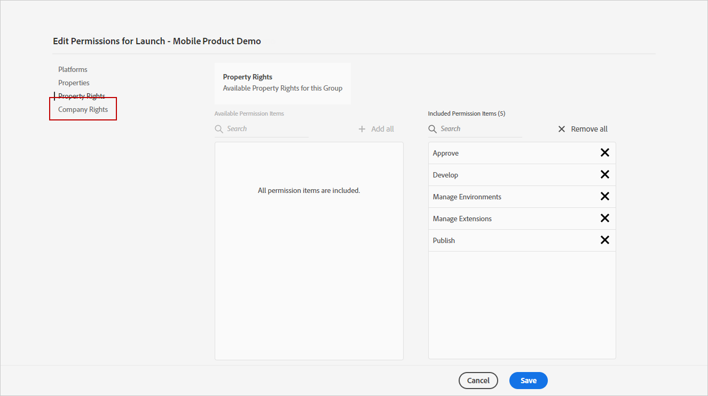

# Configurar el canal de notificaciones push {#push-notification-configuration}

[!DNL Journey Optimizer] le permite crear sus recorridos y enviar mensajes a la audiencia de destino. Antes de empezar a enviar notificaciones push con [!DNL Journey Optimizer], debe asegurarse de que las configuraciones e integraciones estén implementadas en la aplicación móvil y para las etiquetas en Adobe Experience Platform. Para comprender el flujo de datos de las notificaciones push en [!DNL Adobe Journey Optimizer] consulte [esta página](push-gs.md).

## Antes de empezar

<!--
### Check provisioning

Your Adobe Experience Platform account must be provisioned to contain following schemas and datasets for push notification data flow to function correctly:

| Schema <br>Dataset                                                                       | Group of fields                                                                                                                                                                         | Operation                                                |
| -------------------------------------------------------------------------------------- | --------------------------------------------------------------------------------------------------------------------------------------------------------------------------------------- | -------------------------------------------------------- |
| CJM Push Profile Schema <br>CJM Push Profile Dataset                                     | Push Notification Details<br>Adobe CJM ExperienceEvent - Message Profile Details<br>Adobe CJM ExperienceEvent - Message Execution Details<br>Application Details<br>Environment Details | Register Push Token                                      |
| CJM Push Tracking Experience Event Schema<br>CJM Push Tracking Experience Event Dataset | Push Notification Tracking                                                                                                                                                              | Track interactions and provide data for the reporting UI |
-->

### Configuración de permisos

Antes de crear una aplicación móvil, primero debe asegurarse de que tiene o asigna los permisos de usuario correctos para las etiquetas en Adobe Experience Platform. Obtenga más información en [Documentación de etiquetas](https://experienceleague.adobe.com/docs/experience-platform/tags/admin/user-permissions.html){target=&quot;_blank&quot;}.

>[!CAUTION]
>
>La configuración push debe realizarla un usuario experto. Según el modelo de implementación y las personas implicadas en esta implementación, es posible que tenga que asignar el conjunto completo de permisos a un único perfil de producto o compartir permisos entre el desarrollador de la aplicación y el **Adobe Journey Optimizer** administrador. Más información sobre **Etiquetas** permisos en [esta documentación](https://experienceleague.adobe.com/docs/experience-platform/tags/admin/user-permissions.html#platform-launch-permissions){target=&quot;_blank&quot;}.

<!--ou need to your have access to perform following roles :

* Manage Datastreams
* Manage Client-side Properties
* Manage App Configurations
-->

Para asignar **Propiedad** y **Empresa** , siga los pasos a continuación:

1. Acceda a la **[!DNL Admin Console]**.

1. En el **[!UICONTROL Products]** , seleccione **[!UICONTROL Adobe Experience Platform Launch]** tarjeta.

   

1. Seleccione una **[!UICONTROL Product Profile]** o cree uno nuevo con la variable **[!UICONTROL New profile]** botón. Obtenga información sobre cómo crear una nueva **[!UICONTROL New profile]** en el [Documentación de Admin Console](https://experienceleague.adobe.com/docs/experience-platform/access-control/ui/create-profile.html#ui){target=&quot;_blank&quot;}.

1. En la pestaña **[!UICONTROL Permissions]**, seleccione **[!UICONTROL Property rights]**.

   

1. Haga clic en **[!UICONTROL Add all]**. Esto agregará lo siguiente al perfil de su producto:
   * **[!UICONTROL Approve]**
   * **[!UICONTROL Develop]**
   * **[!UICONTROL Manage Environments]**
   * **[!UICONTROL Manage Extensions]**
   * **[!UICONTROL Publish]**

   Estos permisos son necesarios para instalar y publicar la extensión de Adobe Journey Optimizer y publicar la propiedad de la aplicación en el SDK de Adobe Experience Platform Mobile.

1. A continuación, seleccione **[!UICONTROL Company rights]** en el menú de la izquierda.

   

1. Añada los siguientes derechos:

   * **[!UICONTROL Manage App Configurations]**
   * **[!UICONTROL Manage Properties]**

   Estos permisos son necesarios para que el desarrollador de aplicaciones móviles configure credenciales push en **Adobe Experience Launch** y defina los ajustes preestablecidos de notificaciones push en **Adobe Journey Optimizer**.

   

1. Haga clic en **[!UICONTROL Save]**.

Para asignar **[!UICONTROL Product profile]** para los usuarios, siga los pasos a continuación:

1. Acceda a la **[!DNL Admin Console]**.

1. En el **[!UICONTROL Products]** , seleccione **[!UICONTROL Adobe Experience Platform Launch]** tarjeta.

1. Seleccione el **[!UICONTROL Product profile]** configurado anteriormente.

1. En la pestaña **[!UICONTROL Users]**, haga clic en **[!UICONTROL Add user]**.

   

1. Escriba el nombre o la dirección de correo electrónico del usuario y seleccione el usuario. A continuación, haga clic en **[!UICONTROL Save]**.

   >[!NOTE]
   >
   >Si el usuario no se ha creado anteriormente en Admin Console, consulte la [Agregar documentación de usuarios](https://helpx.adobe.com/enterprise/admin-guide.html/enterprise/using/manage-users-individually.ug.html#add-users).

   

### Configurar su aplicación

La configuración técnica implica una estrecha colaboración entre el desarrollador de la aplicación y el administrador empresarial. Antes de empezar a enviar notificaciones push con [!DNL Journey Optimizer], debe definir la configuración en [!DNL Adobe Experience Platform Data Collection] e integre su aplicación móvil con los SDK para móviles de Adobe Experience Platform.

Siga los pasos de implementación detallados en los vínculos siguientes:

* Para **Apple iOS**: Obtenga información sobre cómo registrar su aplicación con APNS en [Documentación de Apple](https://developer.apple.com/documentation/usernotifications/registering_your_app_with_apns){target=&quot;_blank&quot;}
* Para **Google Android**: Obtenga información sobre cómo configurar una aplicación cliente de Firebase Cloud Messaging en Android en [Documentación de Google](https://firebase.google.com/docs/cloud-messaging/android/client){target=&quot;_blank&quot;}

### Integración de la aplicación móvil con el SDK de Adobe Experience Platform

El SDK de Adobe Experience Platform Mobile proporciona API de integración del lado del cliente para sus móviles mediante SDK compatibles con Android y iOS. Seguir [Documentación del SDK de Adobe Experience Platform Mobile](https://aep-sdks.gitbook.io/docs/getting-started/overview){target=&quot;_blank&quot;} para configurar los SDK de Adobe Experience Platform Mobile en la aplicación.

Al final de esto, también debería haber creado y configurado una propiedad móvil en [!DNL Adobe Experience Platform Data Collection]. Generalmente creará una propiedad móvil para cada aplicación móvil que desee administrar. Obtenga información sobre cómo crear y configurar una propiedad móvil en [Documentación del SDK de Adobe Experience Platform Mobile](https://aep-sdks.gitbook.io/docs/getting-started/create-a-mobile-property){target=&quot;_blank&quot;}.


## Paso 1: Añadir las credenciales push de la aplicación en la recopilación de datos de Adobe Experience Platform {#push-credentials-launch}

Después de conceder los permisos de usuario correctos, debe agregar las credenciales push de la aplicación móvil en [!DNL Adobe Experience Platform Data Collection].

El registro de credenciales push de la aplicación móvil es necesario para autorizar al Adobe a enviar notificaciones push en su nombre. Consulte los pasos detallados a continuación:

1. De [!DNL Adobe Experience Platform Data Collection], seleccione **[!UICONTROL App Surfaces]** en el panel izquierdo.

1. Haga clic en **[!UICONTROL Create App Surfaces]** para crear una configuración nueva.

   

1. Escriba un **[!UICONTROL Name]** para la configuración.

1. De **[!UICONTROL Mobile Application Configuration]**, seleccione Sistema operativo:

   * **Para iOS**

      

      1. Introduzca la aplicación móvil **Id De Paquete** en el **[!UICONTROL App ID (iOS Bundle ID)]** campo . El ID del paquete de la aplicación se puede encontrar en la variable **General** de la segmentación principal en **XCode**.

      1. Se ha activado la función **[!UICONTROL Push Credentials]** para añadir las credenciales.

      1. Arrastre y suelte el archivo .p8 Apple Push Notification Authentication Key. Esta clave se puede adquirir desde la **Certificados**, **Identificadores** y **Perfiles** página.

      1. Proporcione la variable **ID de clave**. Es una cadena de 10 caracteres asignada durante la creación de la clave de autenticación p8. Se encuentra en **Claves** en **Certificados**, **Identificadores** y **Perfiles** página.

      1. Proporcione la variable **ID del equipo**. Este es un valor de cadena que se puede encontrar en la pestaña Membership .
   * **Para Android**

      

      1. Proporcione la variable **[!UICONTROL App ID (Android package name)]**: normalmente, el nombre del paquete es el id de la aplicación en su `build.gradle` archivo.

      1. Se ha activado la función **[!UICONTROL Push Credentials]** para añadir las credenciales.

      1. Arrastre y suelte las credenciales push de FCM. Para obtener más información sobre cómo obtener las credenciales push, consulte [Documentación de Google](https://firebase.google.com/docs/admin/setup#initialize-sdk){target=&quot;_blank&quot;}.


1. Haga clic en **[!UICONTROL Save]** para crear la configuración de la aplicación.

<!--
## Step 2: Set up a mobile property in Adobe Experience Platform Launch {#launch-property}

Setting up a mobile property allows the mobile app developer or marketer to configure the mobile SDKs attributes such as Session Timeouts, the [!DNL Adobe Experience Platform] sandbox to be targeted and the **[!UICONTROL Adobe Experience Platform Datasets]** to be used for mobile SDK to send data to.

For further details and procedures on how to set up a **[!UICONTROL Platform Launch property]**, refer to the steps detailed in [Adobe Experience Platform Mobile SDK documentation](https://aep-sdks.gitbook.io/docs/getting-started/create-a-mobile-property#create-a-mobile-property).


To get the SDKs needed for push notification to work you will need the following SDK extensions, for both Android and iOS:

* **[!UICONTROL Mobile Core]** (installed automatically)
* **[!UICONTROL Profile]** (installed automatically)
* **[!UICONTROL Adobe Experience Platform Edge]**
* **[!UICONTROL Adobe Experience Platform Assurance]**, optional but recommended to debug the mobile implementation.

Learn more about [!DNL Adobe Experience Platform Launch] extensions in [Adobe Experience Platform Launch documentation](https://experienceleague.adobe.com/docs/launch-learn/implementing-in-mobile-android-apps-with-launch/configure-launch/launch-add-extensions.html).
-->

## Paso 2: Configurar la extensión de Adobe Journey Optimizer en la propiedad móvil

La variable **Extensión de Adobe Journey Optimizer** para los SDK de Adobe Experience Platform Mobile , alimenta las notificaciones push para sus aplicaciones móviles y le ayuda a recopilar tokens push de usuario y a administrar la medición de interacciones con los servicios de Adobe Experience Platform.

Obtenga información sobre cómo configurar la extensión de Journey Optimizer en [Documentación del SDK de Adobe Experience Platform Mobile](https://aep-sdks.gitbook.io/docs/using-mobile-extensions/adobe-journey-optimizer){target=&quot;_blank&quot;}.


<!-- 
**[!UICONTROL Edge configuration]** is used by **[!UICONTROL Edge]** extension to send custom data from mobile device to [!DNL Adobe Experience Platform]. 
To configure [!DNL Adobe Experience Platform], you must provide the **[!UICONTROL Sandbox]** name and **[!UICONTROL Event Dataset]**.

For further details and procedures on how to create **[!UICONTROL Edge configuration]**, refer to the steps detailed in [Adobe Experience Platform Mobile SDK documentation](https://aep-sdks.gitbook.io/docs/getting-started/configure-datastreams).

1. From [!DNL Adobe Experience Platform Launch], select the **[!UICONTROL Edge Configurations]** tab and click **[!UICONTROL Edge Configurations]**.
    
1. Select **[!UICONTROL New Edge Configuration]** to add a new **[!UICONTROL Edge Configuration]**.
1. Enter a **[!UICONTROL Name]** and click **[!UICONTROL Save]**

1. Click the **[!UICONTROL Adobe Experience Platform]** toggle to enable it.

1. Fill in the **[!UICONTROL Sandbox]**, **[!UICONTROL Event dataset]** and **[!UICONTROL Profile Dataset]** fields. Then, click **[!UICONTROL Save]**.
    
    


1. From [!DNL Adobe Experience Platform Launch], ensure that **[!UICONTROL Client Side]** is selected in the drop-down menu.

1. select the **[!UICONTROL Properties]** tab and click **[!UICONTROL New Property]**.

    

1. Enter a **[!UICONTROL Name]** for your new property.

1. Select **[!UICONTROL Mobile]** as **[!UICONTROL Platform]**.

    

1. Click **[!UICONTROL Save]** to create your new property.

To configure **[!UICONTROL Adobe Experience Platform Edge Extension]** to send custom data from mobile devices to [!DNL Adobe Experience Platform].

1. Select your previously created property and select the **[!UICONTROL Extensions]** tab to view the extensions for this property.

    

1. Click **[!UICONTROL Configure]** under the **[!UICONTROL Adobe Experience Platform Edge]** Network' extension.

1. From the **[!UICONTROL Edge Configuration]** drop-down list, select the **[!UICONTROL Edge Configuration]** created in the previous steps. For more information on **[!UICONTROL Edge Configuration]**, refer to this [section](#edge-configuration).

1. Click **[!UICONTROL Save]**.

To configure **[!UICONTROL Adobe Experience Platform Messaging]** extension to send push profile and push interactions to the correct datasets, follow the same steps as above. Use **[!UICONTROL Sandbox]**, **[!UICONTROL Event dataset]** and **[!UICONTROL Profile Dataset]** created in the [Adobe Experience Platform setup](#edge-configuration).
-->

<!--
## Step 4: Publish the Property {#publish-property}

You now need to publish the property to integrate your configuration and to use it in the mobile app. 

To publish your property, refer to the steps detailed in [Adobe Experience Platform Mobile SDK documentation](https://aep-sdks.gitbook.io/docs/getting-started/create-a-mobile-property#publish-the-configuration)

## Step 5: Configure the ProfileDataSource {#configure-profiledatasource}

To configure the `ProfileDataSource`, use the `ProfileDCInletURL` from [!DNL Adobe Experience Platform] setup and add the following in the mobile app:

```
    MobileCore.updateConfiguration(
    mutableMapOf("messaging.dccs" to <ProfileDCSInletURL>)
```

-->

## Paso 3: Probar la aplicación móvil con un evento {#mobile-app-test}

Después de configurar la aplicación móvil en Adobe Experience Platform y en [!DNL Adobe Experience Platform Data Collection], ahora puede probarlo antes de enviar notificaciones push a sus perfiles. En este caso de uso, crearemos un recorrido para dirigirnos a nuestra aplicación móvil y estableceremos un evento que déclencheur la notificación push.

<!--
You can use a test mobile app for this use case. For more on this, refer to this [page](https://wiki.corp.adobe.com/pages/viewpage.action?spaceKey=CJM&title=Details+of+setting+the+mobile+test+app) (internal use only).
-->

Para que este recorrido funcione, debe crear un esquema XDM. Para obtener más información, consulte [Documentación XDM](https://experienceleague.adobe.com/docs/experience-platform/xdm/schema/composition.html#schemas-and-data-ingestion){target=&quot;_blank&quot;}.

1. En el menú de la izquierda, vaya a **[!UICONTROL Schemas]**.

1. Haga clic en **[!UICONTROL Create schema]** a continuación, seleccione **[!UICONTROL XDM ExperienceEvent]**.

   

1. Seleccione **[!UICONTROL Create a new field group]**.

1. Escriba un **[!UICONTROL Display Name]** y **[!UICONTROL Description]**. Haga clic en **[!UICONTROL Add field groups]** cuando termine. Para obtener más información sobre cómo crear grupos de campos, consulte [Documentación del sistema XDM](https://experienceleague.adobe.com/docs/experience-platform/xdm/tutorials/create-schema-ui.html?lang=es){target=&quot;_blank&quot;}.


   

1. En el lado izquierdo, seleccione el esquema . En el panel derecho, introduzca el nombre del esquema y la descripción. Active este esquema para **[!UICONTROL Profile]**.

   


1. En el lado izquierdo, seleccione el grupo de campos y, a continuación, haga clic en el icono + para crear un nuevo campo. En el **[!UICONTROL Field groups properties]**, en el lado derecho, escriba un **[!UICONTROL Field name]**, **[!UICONTROL Display name]** y seleccione **[!UICONTROL String]** como **[!UICONTROL Type]**.

   

1. Marque **[!UICONTROL Required]** y haga clic en **[!UICONTROL Apply]**.

1. Haga clic en **[!UICONTROL Save]**. El esquema se ha creado y se puede utilizar en un evento.

A continuación, debe configurar un evento.

1. En el menú de la izquierda de la página principal, en ADMINISTRACIÓN, seleccione **[!UICONTROL Configurations]**. El clic **[!UICONTROL Manage]** en el **[!UICONTROL Events]** para crear el nuevo evento.

1. Haga clic en **[!UICONTROL Create Event]**, el panel de configuración de eventos se abre en el lado derecho de la pantalla.

   

1. Introduzca el nombre del evento. También puede agregar una descripción.

1. En el campo **[!UICONTROL Event ID type]**, seleccione **[!UICONTROL Rule Based]**.

1. En el **[!UICONTROL Parameters]**, seleccione el esquema creado anteriormente.

   

1. En la lista de campos, compruebe que el campo creado en el grupo de campos de esquema está seleccionado.

   

1. Haga clic en **[!UICONTROL Edit]** en el **[!UICONTROL Event ID condition]** campo . Arrastre y suelte el campo añadido anteriormente para definir la condición que utilizará el sistema para identificar los eventos que van a almacenar en déclencheur el recorrido.

   

1. Escriba la sintaxis que debe utilizar para almacenar en déclencheur las notificaciones push en la aplicación de prueba, en este ejemplo **confirmación del pedido**.

   

1. Select **[!UICONTROL ECID]** como su **[!UICONTROL Namespace]**.

1. Haga clic en **[!UICONTROL Ok]** y luego en **[!UICONTROL Save]**.

El evento se ha creado y ahora se puede utilizar en un recorrido.

1. En el menú de la izquierda, haga clic en **[!UICONTROL Journeys]**.

1. Haga clic en **[!UICONTROL Create Journey]** para crear un nuevo recorrido.

1. Edite las propiedades del recorrido en el panel de configuración que se muestra en el lado derecho. Obtenga más información en esta [sección](building-journeys/journey-gs.md#change-properties).

1. Comience por arrastrar y soltar el evento creado en los pasos anteriores desde el **[!UICONTROL Events]** lista desplegable.

   

1. En el **[!UICONTROL Actions]** desplegable, arrastre y suelte una **[!UICONTROL Message]** a su recorrido.

1. Seleccione un mensaje creado anteriormente. Para obtener más información sobre cómo crear notificaciones push, consulte esta [página](create-message.md).

1. Arrastre y suelte una **[!UICONTROL End]** a su recorrido.

1. Haga clic en el **[!UICONTROL Test]** alterne para iniciar la prueba de las notificaciones push y haga clic en **[!UICONTROL Trigger an event]**.

   

1. Introduzca su ECID en la **[!UICONTROL Key]** campo y escriba **confirmación del pedido** en el segundo campo.

   

1. Haga clic en **[!UICONTROL Send]**.

El evento se activará y recibirá la notificación push en la aplicación móvil.

## Paso 4: Crear un ajuste preestablecido de mensaje para push{#message-preset}

Una vez que la aplicación móvil se haya configurado en [!DNL Adobe Experience Platform Data Collection], debe crear un ajuste preestablecido de mensaje para poder enviar notificaciones push desde **[!DNL Journey Optimizer]**.

Obtenga información sobre cómo crear y configurar un ajuste preestablecido de mensaje en [esta sección](configuration/message-presets.md).

Ya está listo para enviar notificaciones push con Journey Optimizer.

* Aprenda a crear un mensaje push en [esta página](create-push.md).
* Obtenga información sobre cómo enviar un mensaje en un recorrido de [esta sección](building-journeys/journeys-message.md).
