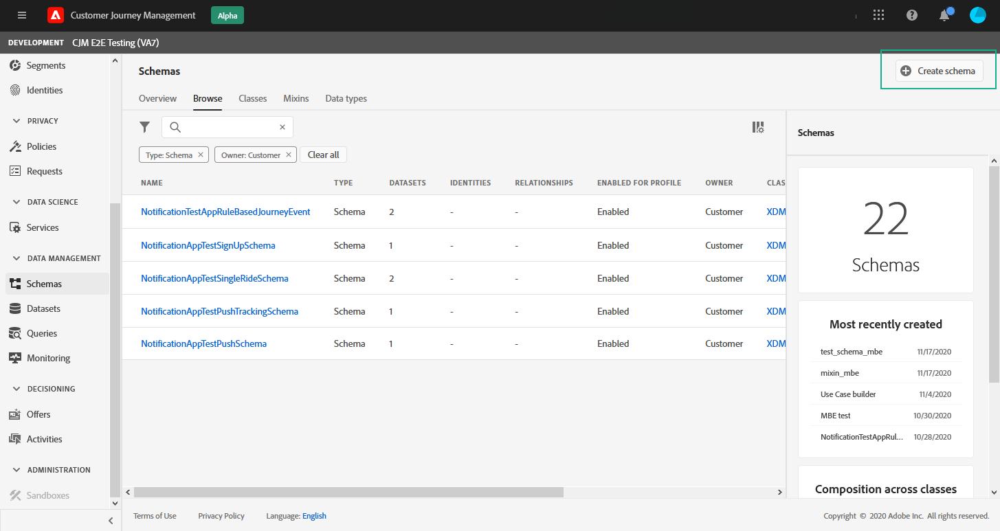

# Configuración de notificaciones push {#push-notification-configuration}


## Introducción a la configuración push {#gs-push}

Antes de empezar a enviar notificaciones push con [!DNL Journey Optimizer], debe definir la configuración en [!DNL Adobe Experience Platform] y [!DNL Adobe Experience Platform Launch].

## Configuración de Adobe Experience Platform {#platform-settings}

Para configurar la aplicación móvil en [!DNL Adobe Experience Platform Launch], siga estos pasos:

1. [Asignación de derechos de propiedad y compañía](#push-rights)
1. [Añada las credenciales push de la aplicación móvil en el Platform launch](#push-credentials-launch).
1. [Cree la ](#edge-configuration) configuración de Edge que utilizará la  **[!UICONTROL Edge]** extensión para enviar datos personalizados desde dispositivos móviles a  [!DNL Adobe Experience Platform].
1. [Configure una propiedad](#launch-property) de Platform launch.
1. [Publique la propiedad](#publish-property).
1. [Configure ProfileDataSource](#configure-profiledatasource).

### Paso 1: Asignar derechos de propiedad y compañía {#push-rights}

Antes de crear una aplicación móvil, primero debe asegurarse de tener o asignar los permisos de usuario correctos.

Para obtener más información sobre la administración de usuarios con [!DNL Adobe Experience Platform Launch], consulte [Documentación del Platform launch](https://experienceleague.adobe.com/docs/launch/using/admin/user-permissions.html#experience-cloud-permissions).

Para asignar derechos de propiedad y compañía:

1. Acceda a [!DNL Admin Console].

1. En la pestaña **[!UICONTROL Products]**, seleccione la tarjeta **[!UICONTROL Adobe Experience Platform Launch]** .

   

1. Seleccione un **[!UICONTROL Product Profile]** existente o cree uno nuevo con el botón **[!UICONTROL New profile]**. Para obtener más información sobre cómo crear un **[!UICONTROL New profile]** nuevo, consulte la [Documentación de la consola de administración](https://experienceleague.adobe.com/docs/experience-platform/access-control/ui/create-profile.html#ui).

1. En la pestaña **[!UICONTROL Permissions]**, seleccione **[!UICONTROL Property rights]**.

   

1. Haga clic en **[!UICONTROL Add all]**. Esto agregará los siguientes derechos a su perfil de producto:
   * **[!UICONTROL Approve]**
   * **[!UICONTROL Develop]**
   * **[!UICONTROL Manage Environments]**
   * **[!UICONTROL Manage Extensions]**
   * **[!UICONTROL Publish]**

   

1. A continuación, seleccione **[!UICONTROL Company rights]** en el menú de la izquierda.

   

1. Añada los siguientes derechos:

   * **[!UICONTROL Manage App Configurations]**
   * **[!UICONTROL Manage Properties]**

   

1. Haga clic en **[!UICONTROL Save]**.

Para asignar esta **[!UICONTROL Product profile]** a los usuarios:

1. En [!DNL Admin Console], en la pestaña **[!UICONTROL Products]**, seleccione la tarjeta **[!UICONTROL Adobe Experience Platform Launch]** .

1. Seleccione el **[!UICONTROL Product profile]** configurado anteriormente.

1. En la pestaña **[!UICONTROL Users]**, haga clic en **[!UICONTROL Add user]**.

   

1. Escriba el nombre o la dirección de correo electrónico del usuario y seleccione el usuario. A continuación, haga clic en **[!UICONTROL Save]**.

   >[!NOTE]
   >
   >Si el usuario no se ha creado anteriormente en Admin Console, consulte la [documentación de Agregar usuarios](https://helpx.adobe.com/enterprise/admin-guide.html/enterprise/using/manage-users-individually.ug.html#add-users).

   


Ahora tiene los permisos de usuario correctos para crear y configurar una aplicación móvil en [!DNL Adobe Experience Platform Launch].

### Paso 2: Agregue las credenciales push de la aplicación móvil en el Platform launch {#push-credentials-launch}

>[!NOTE]
>
> Para añadir credenciales push en [!DNL Adobe Experience Platform Launch], el propietario de la aplicación móvil debe recuperarlas de APNS/FCM.

1. En [!DNL Adobe Experience Platform Launch], asegúrese de que **[!UICONTROL Client Side]** está seleccionado en el menú desplegable.

1. Seleccione la pestaña **[!UICONTROL App Configurations]** en el panel izquierdo y haga clic en **[!UICONTROL App Configuration]** para crear una nueva configuración.

1. Introduzca un **[!UICONTROL Name]** para la configuración.

1. En el menú desplegable **[!UICONTROL Messaging Service Type]**, seleccione el **[!UICONTROL Messaging service type]** que se utilizará para estas credenciales. Aquí, seleccionamos **[!UICONTROL Apple Push Notification Service]** ya que estamos trabajando con iOS.

1. Introduzca la aplicación móvil **[!UICONTROL Bundle Id]** en el campo **[!UICONTROL App ID (iOS Bundle ID)]** si utiliza el servicio de notificaciones push de Apple o en el campo **[!UICONTROL App ID (Android package name)]** si utiliza Firebase Cloud Messaging.

   

1. Arrastre y suelte el archivo de clave .p8 o el archivo de clave privada .json en el campo **[!UICONTROL Push Credentials]**.

1. Introduzca **[!UICONTROL Key Id]** y **[!UICONTROL Team Id]** si utiliza el servicio de notificaciones push de Apple.

1. Haga clic en **[!UICONTROL Save]** para crear la configuración de la aplicación.

### Paso 3: Crear configuración de Edge {#edge-configuration}

**[!UICONTROL Edge configuration]** se utiliza en  **[!UICONTROL Edge]** extension para enviar datos personalizados desde dispositivos móviles a  [!DNL Adobe Experience Platform].
Para configurar [!DNL Adobe Experience Platform], debe proporcionar el nombre **[!UICONTROL Sandbox]** y **[!UICONTROL Event Dataset]**.

1. En [!DNL Adobe Experience Platform Launch], seleccione la pestaña **[!UICONTROL Edge Configurations]** y haga clic en **[!UICONTROL Edge Configurations]**.

1. Seleccione **[!UICONTROL New Edge Configuration]** para agregar un **[!UICONTROL Edge Configuration]** nuevo.
1. Introduzca un **[!UICONTROL Name]** y haga clic en **[!UICONTROL Save]**

1. Haga clic en el botón **[!UICONTROL Adobe Experience Platform]** para habilitarlo.

1. Rellene los campos **[!UICONTROL Sandbox]**, **[!UICONTROL Event dataset]** y **[!UICONTROL Profile Dataset]** . A continuación, haga clic en **[!UICONTROL Save]**.

   

### Paso 4: Configurar una propiedad de Platform launch {#launch-property}

La configuración de una propiedad [!DNL Adobe Experience Platform Launch] permite que el desarrollador de aplicaciones móviles o el especialista en marketing configuren atributos de SDK móviles, como Tiempos de espera de sesión, el [!DNL Adobe Experience Platform] simulador de pruebas objetivo y el **[!UICONTROL Adobe Experience Platform Datasets]** que se utilizará para que el SDK móvil envíe datos a .

1. En [!DNL Adobe Experience Platform Launch], asegúrese de que **[!UICONTROL Client Side]** está seleccionado en el menú desplegable.

1. seleccione la pestaña **[!UICONTROL Properties]** y haga clic en **[!UICONTROL New Property]**.

   

1. Introduzca un **[!UICONTROL Name]** para la nueva propiedad.

1. Seleccione **[!UICONTROL Mobile]** como **[!UICONTROL Platform]**.

   

1. Haga clic en **[!UICONTROL Save]** para crear la nueva propiedad.

Para que los SDK necesarios para que funcione la notificación push, necesitará las siguientes extensiones de SDK, tanto para Android como para iOS:

* **[!UICONTROL Mobile Core]** (instalado automáticamente)
* **[!UICONTROL Profile]** (instalado automáticamente)
* **[!UICONTROL Adobe Experience Platform Edge]**
* **[!UICONTROL Adobe Experience Platform Assurance]**, opcional pero recomendado para depurar la implementación móvil.

Para obtener más información sobre las [!DNL Adobe Experience Platform Launch] extensiones, consulte [Documentación del Platform launch](https://experienceleague.adobe.com/docs/launch-learn/implementing-in-mobile-android-apps-with-launch/configure-launch/launch-add-extensions.html).

Para configurar **[!UICONTROL Adobe Experience Platform Edge Extension]** para que envíe datos personalizados desde dispositivos móviles a [!DNL Adobe Experience Platform].

1. Seleccione la propiedad creada anteriormente y seleccione la pestaña **[!UICONTROL Extensions]** para ver las extensiones de esta propiedad.

   

1. Haga clic **[!UICONTROL Configure]** en la extensión **[!UICONTROL Adobe Experience Platform Edge]** Network&quot;.

1. En la lista desplegable **[!UICONTROL Edge Configuration]** , seleccione el **[!UICONTROL Edge Configuration]** creado en los pasos anteriores. Para obtener más información sobre **[!UICONTROL Edge Configuration]**, consulte esta [sección](#edge-configuration).

1. Haga clic en **[!UICONTROL Save]**.

Para configurar la extensión **[!UICONTROL Adobe Experience Platform Messaging]** para enviar el perfil push y las interacciones push a los conjuntos de datos correctos, siga los mismos pasos que se describen arriba. Utilice **[!UICONTROL Sandbox]**, **[!UICONTROL Event dataset]** y **[!UICONTROL  Profile Dataset]** creados en la [configuración de Adobe Experience Platform](#edge-configuration).

### Paso 5: Publicar la propiedad {#publish-property}

Ahora debe publicar la propiedad para integrar la configuración y utilizarla en la aplicación móvil.
Para publicar su propiedad, consulte los pasos detallados en [Documentación del SDK de Adobe Experience Platform Mobile](https://aep-sdks.gitbook.io/docs/getting-started/create-a-mobile-property#publish-the-configuration)

### Paso 6: Configurar ProfileDataSource {#configure-profiledatasource}

Para configurar `ProfileDataSource`, utilice la configuración `ProfileDCInletURL` de [!DNL Adobe Experience Platform] y añada lo siguiente en la aplicación móvil:

```
    MobileCore.updateConfiguration(
    mutableMapOf("messaging.dccs" to <ProfileDCSInletURL>)
```

<!--
## Test your mobile app with custom action {#mobile-app-test}

After configuring your mobile app in both Adobe Experience Platform and Adobe Launch, you can now test it before sending push notifications to your profiles. In this use case, we will create a journey to target our mobile app and set a custom action which will trigger the push notification.

You can use a test mobile app for this use case. For more on this, refer to this [page](https://wiki.corp.adobe.com/pages/viewpage.action?spaceKey=CJM&title=Details+of+setting+the+mobile+test+app) (internal use only).

For this journey to work, you need to create an XDM schema. For more information, refer to [XDM documentation](https://experienceleague.adobe.com/docs/experience-platform/xdm/schema/composition.html?lang=en#schemas-and-data-ingestion).

1. In the left menu, click **[!UICONTROL Data]** then **[!UICONTROL Schemas]** under **[!UICONTROL Data management]** to create your XDM schema.

    

1. Click **[!UICONTROL Create schema]** then select **[!UICONTROL XDM Experience event]**.

    

1. In the right pane, enter the name of your schema and description. Enable this schema for **[!UICONTROL Profile]**.

1. In the left pane, click **[!UICONTROL Add]** under **[!UICONTROL Mixins]** and select  **[!UICONTROL Create a new Mixin]**. For more information on how to create mixin, refer to [XDM System documentation](https://experienceleague.adobe.com/docs/experience-platform/xdm/api/create-mixin.html?lang=en#api).

    

1. Enter a **[!UICONTROL Display Name]** and a **[!UICONTROL Description]**. Click **[!UICONTROL Add mixin]** when done.

    

1. In the **[!UICONTROL Field properties]** window, add a **[!UICONTROL Field name]**, **[!UICONTROL Display name]** and select **[!UICONTROL String]** as **[!UICONTROL Type]**.

    

1. Check **[!UICONTROL Required]** and click **[!UICONTROL Apply]**.

1. Click **[!UICONTROL Save]**. Your schema is now created and can be used in an **[!UICONTROL Event schema]**.

You then need to set up an **[!UICONTROL Event schema]** where you will set the custom action which you will need to enter in your mobile app to trigger your push notification.

1. From the left menu of the home page, click the **[!UICONTROL Admin]** icon, then click **[!UICONTROL Manage]** from the **[!UICONTROL Events]** card to create your new **[!UICONTROL Event schema]**.

1. Click **[!UICONTROL Add]**, the event configuration pane opens on the right side of the screen.

    

1. Enter the name of your event. You can also add a description.

1. In the **[!UICONTROL Event ID type]** field, select **[!UICONTROL Rule Based]**.

1. In the **[!UICONTROL Parameters]**, select your previously created XDM event.

    

1. Click **[!UICONTROL Edit]** in the **[!UICONTROL Event ID condition]** field.

1. Drag and your previously added mixin to define the condition that will be used by the system to identify the events that will trigger your journey.

    

1. Type in the syntax that you will need to use to trigger your push notification in your test app, in this example **order confirmation**.

    

1. Select **[!UICONTROL ECID]** as your **[!UICONTROL Namespace]**.

1. Click **[!UICONTROL Ok]** then **[!UICONTROL Save]**.

Your **[!UICONTROL Event schema]** is now created and can now be used in a journey.

1. In the left menu from [!DNL Journey Optimizer] homepage, click **[!UICONTROL Journeys]**.

1. Click **[!UICONTROL Create]** to create a new journey.

    

1. Edit the journey's properties in the configuration pane displayed on the right side. Learn more in this [section](building-journeys/journey-gs.md#change-properties).

1. Start by drag and dropping the **[!UICONTROL Event schema]** created in the previous steps from the **[!UICONTROL Events]** drop-down.

    

1. From the **[!UICONTROL Actions]** drop-down, drag and drop a **[!UICONTROL Message]** activity to your journey.

1. Select a previously created message. For more information on how to create push notifications, refer to this [page](create-message.md).

1. Drag and drop an **[!UICONTROL End]** activity to your journey.

1. Activate **[!UICONTROL Test]** to your journey to start testing your push notifications and click **[!UICONTROL Trigger an event]**.

    

1. Enter your ECID in the **[!UICONTROL Key]** field then your event that will trigger the push notification in our case **order confirmation**.

    

1. Click **[!UICONTROL Send]**.

Your event will be triggered and you will receive your push notification to your mobile app.


-->
