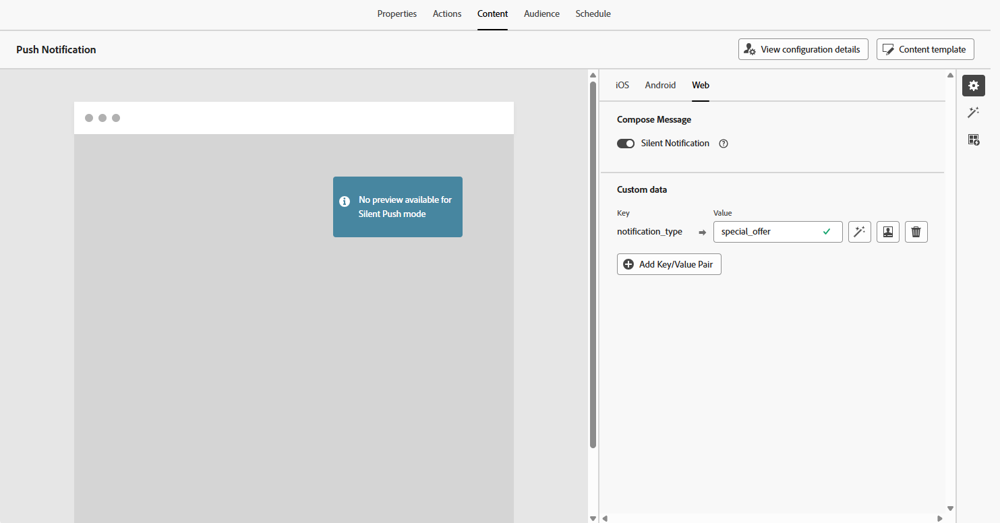

# Diseño de una notificación push web {#design-push-notification}

>[!AVAILABILITY]
>
>Actualmente, las notificaciones push web en Journey Optimizer no admiten la función **Notificación silenciosa**, pero estarán disponibles más adelante.

Después de crear la campaña o el recorrido de notificaciones push para web, puede continuar diseñando su contenido y estructura según sus necesidades. Tenga en cuenta que antes de enviar cualquier notificación push web, es necesario configurar primero este canal dentro de su [configuración de canal](push-configuration-web.md).

<!--
## Send a silent notification {#silent-notification}

A silent push notification (also called a background notification) is a hidden message sent to your web application without alerting the user.

To enable a silent notification, enable the **[!UICONTROL Silent Notification]** option. When this option is used, the notification is delivered directly to the application, and no alert, banner, or sound is shown to the user.

Use the **Custom Data** section to include additional information in the form of key-value pairs. 

-->

## Título y cuerpo {#push-title-body}

Para redactar el mensaje, haga clic en los campos **[!UICONTROL Título]** y **[!UICONTROL Cuerpo]**. Use el editor de personalización para definir contenido, [personalizar datos](../personalization/personalize.md) y agregar [contenido dinámico](../personalization/get-started-dynamic-content.md).

Haga clic en **[!UICONTROL Editar texto con el asistente de IA]** para generar fácilmente su contenido con el asistente de IA de Journey Optimizer.

## Comportamiento al hacer clic {#on-click-behavior}

Utilice el campo **[!UICONTROL Comportamiento al hacer clic en el cuerpo]** para definir un vínculo profundo que determina qué sucede cuando un usuario hace clic en el cuerpo de la notificación. Esto le permite enviar a los usuarios directamente a una página o sección específica de la aplicación web.

## Añadir medios {#add-media-push}

Escriba la URL de medios en el campo **[!UICONTROL Agregar medios]**. También puede incluir tokens de personalización en la dirección URL para personalizar el contenido de cada usuario.

Haga clic en  para generar medios rápidamente con el asistente de IA de Journey Optimizer.

## Añadir botones {#add-buttons-push}

Para que las notificaciones push web sean interactivas, agregue botones al contenido.

Tenga en cuenta que los botones solo están visibles cuando el dispositivo está desbloqueado. Si la pantalla está bloqueada, solo se mostrarán **[!UICONTROL Title]** y **[!UICONTROL Message]**.

Utilice la opción **[!UICONTROL Agregar botón]** para definir la etiqueta de cada botón y la acción asociada, como se detalla a continuación:

* **[!UICONTROL Vínculo profundo]**: Redirija a los usuarios a una vista, sección o ficha específica dentro de la aplicación. Introduzca la URL de vinculación profunda en el campo asociado.

* **[!UICONTROL URL web]**: redirige a los usuarios a una página web externa. Introduzca la dirección URL en el campo asociado.

## Datos personalizados {#custom-data}

En la sección **[!UICONTROL Datos personalizados]**, puede agregar pares de clave-valor personalizados a la carga útil de notificación. La aplicación web puede utilizar estos valores para almacenar en déclencheur acciones específicas o personalizar la experiencia del usuario. Para obtener más información sobre cómo configurar notificaciones push en Adobe Experience Platform, consulte [esta sección](push-gs.md)

