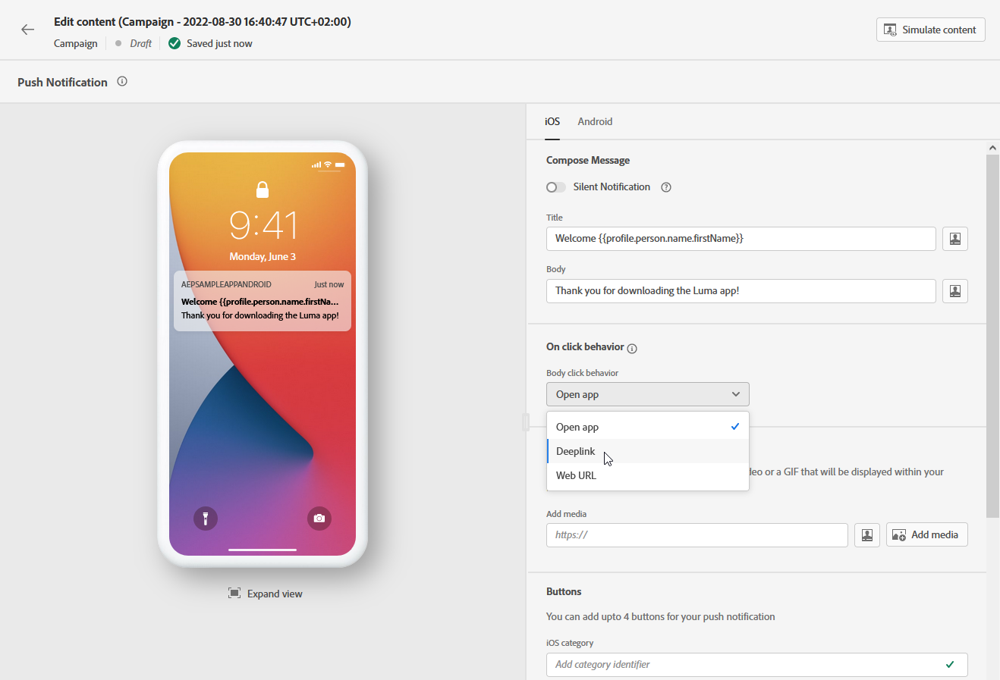

# Diseño de una notificación push {#design-push-notification}

Una vez creada una notificación push, puede diseñar su contenido para plataformas iOS, Android y web. Esta página le guía a través del proceso de composición del mensaje, configuración del comportamiento al hacer clic, adición de medios y botones, y configuración de opciones avanzadas para crear atractivas notificaciones push que resuenen con su audiencia.

## Título y cuerpo {#push-title-body}

>[!CONTEXTUALHELP]
>id="ajo-message-push-compose"
>title="Personalice la notificación push."
>abstract="Para redactar el mensaje, introduzca el contenido en los campos **Título** y **Cuerpo**. Para incluir tókenes de personalización, abra el cuadro de diálogo de personalización."

Para redactar el mensaje, haga clic en los campos **[!UICONTROL Título]** y **[!UICONTROL Cuerpo]**. Utilice el editor de personalización para definir contenido, personalizar datos y añadir contenido dinámico. Obtenga más información acerca de la [personalización](../personalization/personalize.md) y el [contenido dinámico](../personalization/get-started-dynamic-content.md) en el editor de personalización.

Utilice la sección de vista previa del dispositivo para visualizar cómo se muestra la notificación push en iOS, Android y Web.

Acelere la creación de contenido con el Asistente de IA y genere un texto de notificación push atractivo con el [Asistente de IA para la generación de texto](../content-management/generative-text.md) o cree notificaciones push completas con el [Asistente de IA para la generación de contenido completo](../content-management/generative-full-content.md).

## Comportamiento al hacer clic {#on-click-behavior}

>[!CONTEXTUALHELP]
>id="ajo-message-push-onclick"
>title="Acerca del comportamiento al hacer clic"
>abstract="Seleccione el comportamiento cuando un destinatario haga clic en el cuerpo de la notificación push."

Configure la acción que se produce cuando los destinatarios tocan el cuerpo de la notificación push. Elija entre las siguientes opciones:

* **[!UICONTROL Abrir aplicación]**: inicia la aplicación asociada con la notificación. La aplicación está especificada en su [configuración de canal](../configuration/channel-surfaces.md) (es decir, ajuste preestablecido de mensaje).
* **[!UICONTROL Vínculo profundo]**: Dirige a los usuarios a contenido específico dentro de la aplicación, como una vista, una sección de página o una pestaña en particular. Introduzca la URL de vinculación profunda en el campo proporcionado.
* **[!UICONTROL URL web]**: Dirige a los usuarios a una página web externa. Introduzca la dirección URL de destino en el campo proporcionado.

## Añadir medios {#add-media-push}

>[!CONTEXTUALHELP]
>id="ajo-message-push-media"
>title="Adición de medios a la notificación push"
>abstract="Puede añadir una imagen, un vídeo o un GIF que se muestran en la notificación."

Mejore la notificación push añadiendo medios visuales. Los tipos de medios y los métodos de implementación disponibles varían según el sistema operativo, como se detalla en las pestañas siguientes.

>[!BEGINTABS]

>[!TAB Android]

Para Android, solo puede añadir un icono de imagen y una imagen para notificaciones expandidas.

Puede añadir medios mediante cualquiera de los siguientes métodos:

* Botón **[!UICONTROL Agregar medios]**: selecciona un recurso de [Adobe Experience Manager Assets](../integrations/assets.md) o accede al Asistente de IA para generar [imágenes atractivas](../content-management/generative-image.md) para notificaciones push.

* **[!UICONTROL Agregar campo de medios]**: escriba la URL de medios directamente. Puede incluir tokens de personalización en la dirección URL.

Una vez añadidos, los contenidos se muestran a la derecha del cuerpo de la notificación.

>[!NOTE]
>
>Al incluir archivos adjuntos de medios en la carga de notificaciones push (como imágenes de campos de datos personalizados como `adb_media`), la aplicación móvil debe implementar la administración específica del lado del cliente para que las imágenes se representen en los dispositivos. Su aplicación debe implementar [flujo de trabajo automático de seguimiento y visualización](https://developer.adobe.com/client-sdks/edge/adobe-journey-optimizer/push-notification/android/automatic-display-and-tracking/){target="_blank"} para gestionar los archivos adjuntos de imagen de la carga útil.

>[!TAB iOS]

En iOS, puede agregar una imagen, un vídeo o una GIF para que se muestren en la notificación.

Puede añadir medios mediante cualquiera de los siguientes métodos:

* Botón **[!UICONTROL Agregar medios]**: seleccione un recurso de **[!DNL Adobe Experience Manager Assets]**. Más información acerca del uso de **[!DNL Adobe Experience Manager Assets]** en [esta página](../integrations/assets.md).

* **[!UICONTROL Agregar campo de medios]**: escriba la URL de medios directamente. Puede incluir tokens de personalización en la dirección URL.

Una vez añadidos, los contenidos se muestran a la derecha del cuerpo de la notificación.

>[!NOTE]
>
>Al incluir archivos adjuntos de medios en la carga de notificaciones push (como imágenes de campos de datos personalizados como `adb_media`), la aplicación móvil debe implementar la administración específica del lado del cliente para que las imágenes se representen en los dispositivos. Su aplicación debe implementar una [extensión de servicio de notificaciones](https://developer.apple.com/documentation/usernotifications/modifying_content_in_newly_delivered_notifications){target="_blank"} para descargar y procesar contenido multimedia de la carga. Además, la opción **[!UICONTROL Agregar indicador de contenido mutable]** debe estar habilitada en la sección [Opciones avanzadas](#advanced-options-push).

>[!TAB Web]

Escriba la URL de medios en el campo **[!UICONTROL Agregar medios]**. También puede incluir tokens de personalización en la dirección URL para personalizar el contenido de cada usuario.

Haga clic en  para generar medios rápidamente con el asistente de IA de Journey Optimizer.

>[!ENDTABS]

## Añadir botones {#add-buttons-push}

>[!CONTEXTUALHELP]
>id="ajo-message-push-buttons"
>title="Añada botones para que los usuarios interactúen con la notificación push."
>abstract="En esta sección, añada botones de llamada a la acción al mensaje. Para Apple iOS, especifique un identificador de categoría de notificación. Para Google Android, puede incluir texto personalizado y destinos para cada botón."

Cree una notificación procesable añadiendo botones al contenido push. Examine las pestañas siguientes en función de su sistema operativo.

Si la pantalla del dispositivo está bloqueada, no se muestran estos botones: solo entonces están visibles el **Título** y el **Mensaje** de la notificación. Si su dispositivo está desbloqueado, los destinatarios verán los botones.

>[!BEGINTABS]

>[!TAB Android]

Para Android, puede añadir hasta tres botones.

1. Use el **[!UICONTROL botón Agregar]** para definir la configuración: la etiqueta y la acción asociada. Las acciones posibles son las mismas que para el [comportamiento al hacer clic](#on-click-behavior).

   

1. Utilice el icono **[!UICONTROL Expandir vista]** debajo de la imagen de vista previa central para obtener una vista previa de los botones personalizados.

>[!TAB iOS]

Para iOS, se especifica un identificador de categoría de notificación. Las categorías de notificación deben preconfigurarse en la aplicación de iOS, que define los botones que se muestran y las acciones que se realizan. Consulte la [documentación de Apple](https://developer.apple.com/documentation/usernotifications/declaring_your_actionable_notification_types) para obtener más información.

>[!TAB Web]

Utilice la opción **[!UICONTROL Agregar botón]** para definir la etiqueta de cada botón y la acción asociada, como se detalla a continuación:

* **[!UICONTROL Vínculo profundo]**: Redirija a los usuarios a una vista, sección o ficha específica dentro de la aplicación. Introduzca la URL de vinculación profunda en el campo asociado.

* **[!UICONTROL URL web]**: redirige a los usuarios a una página web externa. Introduzca la dirección URL en el campo asociado.

>[!ENDTABS]

## Enviar una notificación silenciosa {#silent-notification}

>[!CONTEXTUALHELP]
>id="ajo_message_push_silent_notification"
>title="Acerca de la notificación silenciosa"
>abstract="Envíe notificaciones sin molestar al usuario; las notificaciones no se muestran en el centro de notificaciones ni en la barra de notificaciones."

>[!AVAILABILITY]
>
>Las notificaciones push web en Journey Optimizer no admiten la función **Notificación silenciosa**.

Una notificación push silenciosa (o notificación en segundo plano) es una instrucción oculta que se envía a la aplicación. Se utiliza, por ejemplo, para notificar a la aplicación la disponibilidad de contenido nuevo o iniciar una descarga en segundo plano.

Seleccione la opción **[!UICONTROL Notificación silenciosa]** para notificar a la aplicación de forma silenciosa: en este caso, la notificación se transfiere directamente a la aplicación. No se muestra ninguna alerta en la pantalla del dispositivo.

Utilice la sección **[!UICONTROL Datos personalizados]** para agregar pares clave-valor.

## Datos personalizados {#custom-data}

>[!CONTEXTUALHELP]
>id="ajo-message-push-custom"
>title="Configure los datos personalizados para la notificación push."
>abstract="Añada variables personalizadas a la carga útil, según la configuración de su aplicación móvil."

En la sección **[!UICONTROL Datos personalizados]**, puede agregar variables personalizadas a la carga, según la configuración de su aplicación móvil. Para obtener más información sobre cómo configurar notificaciones push en Adobe Experience Platform, consulte [esta sección](push-gs.md)

## Personalización con Experience Decisioning {#decisioning-push}

Puede personalizar y optimizar el contenido de sus notificaciones push con **Experience Decisioning**. Esta capacidad le permite utilizar puntuaciones de prioridad, fórmulas o modelos de IA para seleccionar y mostrar dinámicamente el mejor contenido a sus clientes.

Para obtener más información sobre cómo crear y usar directivas de decisión en las notificaciones push, consulte [esta sección](../experience-decisioning/create-decision.md).

## Opciones avanzadas {#advanced-options-push}

>[!CONTEXTUALHELP]
>id="ajo-message-push-advanced"
>title="Configure las Opciones avanzadas para su notificación push."
>abstract="Esta sección le permite mejorar la personalización de su notificación push."

Puede configurar **[!UICONTROL opciones avanzadas]** para la notificación push. Los parámetros disponibles se enumeran a continuación:

| Parámetro | Descripción |
|---------|---------|
| **[!UICONTROL Contraíble]** (iOS/Android) | Un mensaje contraíble es un mensaje que puede reemplazarse por uno nuevo si ha quedado obsoleto. Algunos casos de uso comunes de los mensajes contraíbles son los mensajes que se utilizan para indicar a una aplicación móvil que sincronice los datos del servidor. Un ejemplo sería una aplicación deportiva que actualice a los usuarios con la puntuación más reciente. Solo es relevante el mensaje más reciente. Por otro lado, con los mensajes no contraíbles, cada mensaje es importante para la aplicación del cliente y debe entregarse. |
| **[!UICONTROL Sonido personalizado]** (iOS/Android) | Sonido que el terminal móvil debe reproducir cuando reciba la notificación. El sonido debe incluirse en la aplicación. |
| **[!UICONTROL Insignias]** (iOS/Android) | Un distintivo se utiliza para mostrar directamente en el icono de la aplicación la cantidad de información nueva no leída.  El valor del distintivo desaparecerá en cuanto el usuario abra o lea el nuevo contenido de la aplicación. Cuando se recibe una notificación en un dispositivo, puede actualizar o añadir un valor de distintivo para la aplicación relacionada. Por ejemplo, si almacena el número de artículos no leídos de sus clientes, puede aprovechar la personalización para enviar el valor de distintivo de artículos no leídos únicos a cada cliente. Para obtener más personalización, consulte [esta sección](../personalization/personalize.md). |
| **[!UICONTROL Grupo de notificación]** (solo iOS) | Asocie un grupo de notificación a la notificación push. A partir de iOS 12, los grupos de notificación le permiten consolidar subprocesos de mensajes y temas de notificación en identificadores de subprocesos. Por ejemplo: una marca puede enviar notificaciones de marketing con un ID de grupo, mientras que las notificaciones de tipo más operativas se mantienen con uno o más ID diferentes. Para ilustrar esto, puede tener grupos de notificación groupID: 123 &quot;echa un vistazo a la nueva colección de primavera de suéters&quot; y groupID: 456 &quot;tu paquete se entregó&quot;. En este ejemplo, todas las notificaciones de envío se agrupan en el ID de grupo: 456. |
| **[!UICONTROL Canal de notificación]** (solo Android) | Asocie un canal de notificación a la notificación push. A partir de Android 8.0 (nivel de API 26), todas las notificaciones deben asignarse a un canal para que se muestren. Para obtener más información, consulte la [documentación para desarrolladores de Android](https://developer.android.com/guide/topics/ui/notifiers/notifications#ManageChannels). |
| **[!UICONTROL Agregar indicador de disponibilidad de contenido]** (solo iOS) | Envía el indicador de contenido disponible en la carga push para garantizar que la aplicación se activa en cuanto recibe la notificación push, lo que significa que la aplicación puede acceder a los datos de carga.  Esto funciona incluso si la aplicación se está ejecutando en segundo plano y sin necesidad de interacción del usuario (por ejemplo, tocando la notificación push). Sin embargo, esto no se aplica si la aplicación no se está ejecutando. Para obtener más información, consulte la [documentación para desarrolladores de Apple](https://developer.apple.com/library/content/documentation/NetworkingInternet/Conceptual/RemoteNotificationsPG/CreatingtheNotificationPayload.html). |
| **[!UICONTROL Agregar indicador de contenido mutable]** (solo iOS) | Envía el indicador de contenido mutable en la carga útil push y permite que el contenido de las notificaciones push se modifique con una extensión de aplicación de servicio de notificaciones proporcionada en iOS SDK. Para obtener más información, consulte la [documentación para desarrolladores de Apple](https://developer.apple.com/library/content/documentation/NetworkingInternet/Conceptual/RemoteNotificationsPG/ModifyingNotifications.html). Puede aprovechar las extensiones de su aplicación móvil para modificar aún más el contenido o la presentación de las notificaciones push entrantes enviadas desde [!DNL Journey Optimizer]. Por ejemplo, los usuarios pueden aprovechar esta opción para descifrar datos, cambiar el texto del cuerpo o del título de una notificación, añadir un identificador de subproceso a una notificación, etc. **Importante**: este indicador debe habilitarse al incluir archivos adjuntos multimedia (imágenes, vídeos) a través de campos de carga útil (como `adb_media`) para que se representen en dispositivos iOS. La aplicación también debe implementar una extensión de servicio de notificaciones para descargar y procesar el contenido multimedia de la carga. |
| **[!UICONTROL Agregar caducidad push]** (solo iOS) | Elija la **Fecha y hora** de su caducidad push. En iOS, la caducidad de las notificaciones se aplica como una parada obligatoria, lo que significa que cualquier mensaje que llegue al servicio de notificaciones push de Apple (APNS) después de su hora de caducidad no se entrega, lo que garantiza que los clientes nunca reciban notificaciones obsoletas o irrelevantes. Para obtener más información, consulte la [documentación para desarrolladores de Apple](https://developer.apple.com/documentation/usernotifications/sending-notification-requests-to-apns). |
| **[!UICONTROL Visibilidad de notificación]** (solo Android) | Define la visibilidad de la notificación push.  <b>Privado</b> mostrará la notificación en todas las pantallas bloqueadas, pero ocultará la información confidencial o privada en pantallas bloqueadas seguras.  <b>Público</b> mostrará la notificación en su totalidad en todas las pantallas bloqueadas.  <b>Secreto</b> no revelará ninguna parte de la notificación en una pantalla de bloqueo segura.  Para obtener más información, consulte la [documentación para desarrolladores de Android](https://developer.android.com/reference/android/app/Notification). |
| **[!UICONTROL Prioridad de notificación]** (solo Android) | Define la importancia de la notificación push de baja a máxima. Esto determina la intrusión que tendrá la notificación push cuando se envíe. Para obtener más información, consulte la [documentación para desarrolladores de Android](https://developer.android.com/guide/topics/ui/notifiers/notifications#importance) |
| **[!UICONTROL Prioridad de envío]** (solo Android) | Establece una prioridad alta o normal para las notificaciones push. Para obtener más información sobre la prioridad de los mensajes, consulte la [documentación para desarrolladores de Google](https://firebase.google.com/docs/cloud-messaging/concept-options#setting-the-priority-of-a-message). |
| **[!UICONTROL Tiempo de vida]** (solo Android) | Establezca el número de segundos después de los cuales caducará el mensaje. En Android, la caducidad se trata como una ventana de entrega: Firebase Cloud Messaging (FCM) convierte la hora de caducidad en un valor de tiempo de vida (TTL) que comienza cuando se recibe el mensaje, lo que significa que las campañas no entregadas se pueden enviar más tarde de lo esperado o incluso fuera del periodo de tiempo deseado. Para obtener más información, consulte la [documentación para desarrolladores de Android](https://firebase.google.com/docs/cloud-messaging/concept-options#ttl). |
