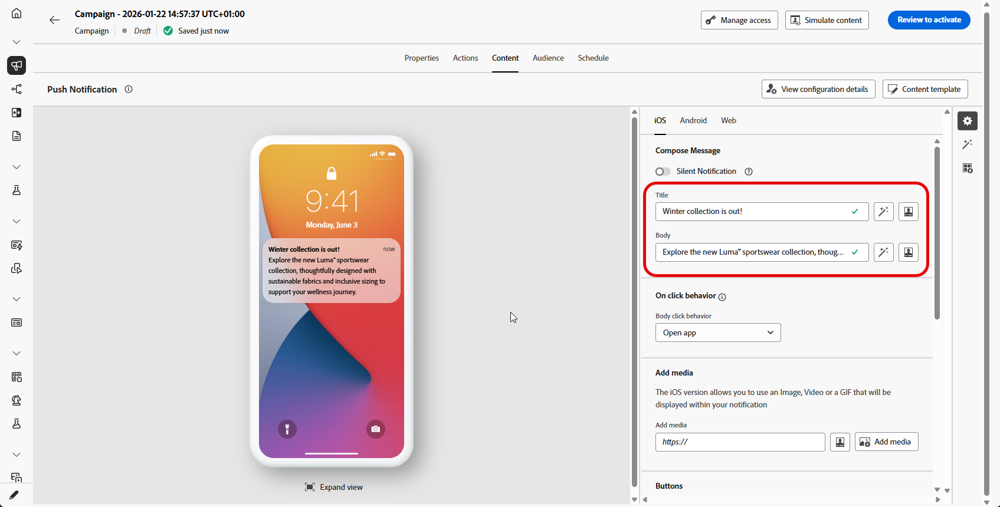
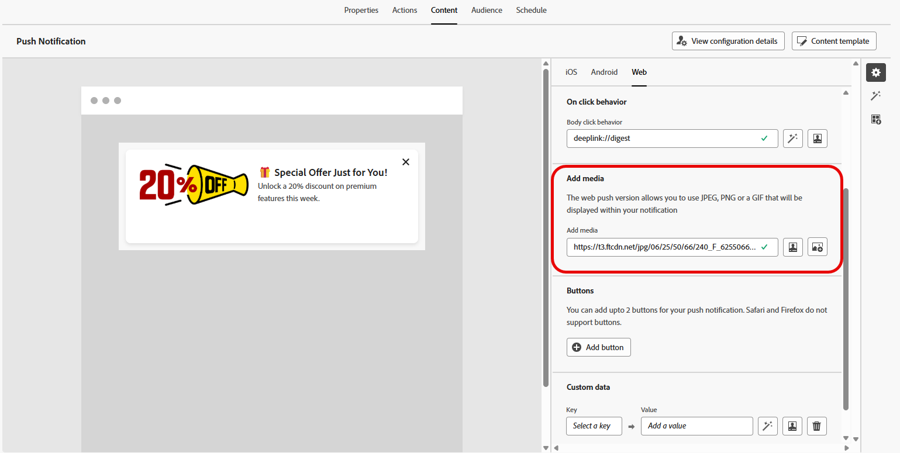

# Design a push notification {#design-push-notification}

Once you have created a push notification, you can design its content for iOS, Android, and Web platforms. This page guides you through composing your message, configuring on-click behavior, adding media and buttons, and setting advanced options to create engaging push notifications that resonate with your audience.

## Título y cuerpo {#push-title-body}

>[!CONTEXTUALHELP]
>id="ajo-message-push-compose"
>title="Personalice la notificación push."
>abstract="Para redactar el mensaje, introduzca el contenido en los campos **Título** y **Cuerpo**. Para incluir tókenes de personalización, abra el cuadro de diálogo de personalización."

To compose your message, click the **[!UICONTROL Title]** and **[!UICONTROL Body]** fields. Use the personalization editor to define content, personalize data and add dynamic content. Learn more about [personalization](../personalization/personalize.md) and [dynamic content](../personalization/get-started-dynamic-content.md) in the personalization editor.

Use the device preview section to visualize how the push notification displays on iOS, Android, and Web.

Accelerate your content creation with AI Assistant and generate compelling push notification text with [AI Assistant for text generation](../content-management/generative-text.md) or create complete push notifications with [AI Assistant for full content generation](../content-management/generative-full-content.md).

## Comportamiento al hacer clic {#on-click-behavior}

>[!CONTEXTUALHELP]
>id="ajo-message-push-onclick"
>title="Acerca del comportamiento al hacer clic"
>abstract="Seleccione el comportamiento cuando un destinatario haga clic en el cuerpo de la notificación push."

Configure the action that occurs when recipients tap the body of your push notification. Elija entre las siguientes opciones:

* **[!UICONTROL Open app]**: Launches the application associated with the notification. The app is specified in your [channel configuration](../configuration/channel-surfaces.md) (i.e. message preset).
* **[!UICONTROL Deeplink]**: Directs users to specific content within your app, such as a particular view, page section, or tab. Enter the deeplink URL in the provided field.
* **[!UICONTROL Web URL]**: Directs users to an external webpage. Introduzca la dirección URL de destino en el campo proporcionado.

  >[!NOTE]
  >
  >Si la notificación push contiene una dirección URL configurada como vínculo universal en iOS, la notificación push abrirá la aplicación asociada si está instalada, independientemente de la acción **[!UICONTROL URL web]** que haya elegido. Para forzar la apertura de un explorador, utilice un dominio no configurado para los vínculos universales o quite el registro de vínculos universales para el dominio.
  >Para obtener más información sobre cómo administra Adobe SDK los vínculos profundos y universales, consulte la [documentación de Adobe Experience Platform Mobile SDK](https://developer.adobe.com/client-sdks/documentation/adobe-journey-optimizer/push-notifications){target="_blank"}.

## Añadir medios {#add-media-push}

>[!CONTEXTUALHELP]
>id="ajo-message-push-media"
>title="Adición de medios a la notificación push"
>abstract="Puede añadir una imagen, un vídeo o un GIF que se muestran en la notificación."

Mejore la notificación push añadiendo medios visuales. Los tipos de medios y los métodos de implementación disponibles varían según el sistema operativo, como se detalla en las pestañas siguientes.

>[!BEGINTABS]

>[!TAB Android]

Para Android, solo puede añadir un icono de imagen y una imagen para notificaciones expandidas.

Puede añadir medios mediante cualquiera de los siguientes métodos:

* Botón **[!UICONTROL Agregar medios]**: selecciona un recurso de [Adobe Experience Manager Assets](../integrations/assets.md) o accede al Asistente de IA para generar [imágenes atractivas](../content-management/generative-image.md) para notificaciones push.

* **[!UICONTROL Agregar campo de medios]**: escriba la URL de medios directamente. Puede incluir tokens de personalización en la dirección URL.

Una vez añadidos, los contenidos se muestran a la derecha del cuerpo de la notificación.

>[!NOTE]
>
>Al incluir archivos adjuntos de medios en la carga de notificaciones push (como imágenes de campos de datos personalizados como `adb_media`), la aplicación móvil debe implementar la administración específica del lado del cliente para que las imágenes se representen en los dispositivos. Su aplicación debe implementar [flujo de trabajo automático de seguimiento y visualización](https://developer.adobe.com/client-sdks/edge/adobe-journey-optimizer/push-notification/android/automatic-display-and-tracking){target="_blank"} para gestionar los archivos adjuntos de imagen de la carga útil.

>[!TAB iOS]

En iOS, puede agregar una imagen, un vídeo o una GIF para que se muestren en la notificación.

Puede añadir medios mediante cualquiera de los siguientes métodos:

* Botón **[!UICONTROL Agregar medios]**: seleccione un recurso de **[!DNL Adobe Experience Manager Assets]**. Más información acerca del uso de **[!DNL Adobe Experience Manager Assets]** en [esta página](../integrations/assets.md).

* **[!UICONTROL Agregar campo de medios]**: escriba la URL de medios directamente. Puede incluir tokens de personalización en la dirección URL.

Una vez añadidos, los contenidos se muestran a la derecha del cuerpo de la notificación.

>[!NOTE]
>
>Al incluir archivos adjuntos de medios en la carga de notificaciones push (como imágenes de campos de datos personalizados como `adb_media`), la aplicación móvil debe implementar la administración específica del lado del cliente para que las imágenes se representen en los dispositivos. Su aplicación debe implementar una [extensión de servicio de notificaciones](https://developer.apple.com/documentation/usernotifications/modifying_content_in_newly_delivered_notifications){target="_blank"} para descargar y procesar contenido multimedia de la carga. Además, la opción **[!UICONTROL Agregar indicador de contenido mutable]** debe estar habilitada en la sección [Opciones avanzadas](#advanced-options-push).

>[!TAB Web]

Escriba la URL de medios en el campo **[!UICONTROL Agregar medios]**. You can also include personalization tokens in the URL to customize the content for each user.

Click  to quickly generate media using the Journey Optimizer AI Assistant.

>[!ENDTABS]

## Añadir botones {#add-buttons-push}

>[!CONTEXTUALHELP]
>id="ajo-message-push-buttons"
>title="Añada botones para que los usuarios interactúen con la notificación push."
>abstract="En esta sección, añada botones de llamada a la acción al mensaje. Para Apple iOS, especifique un identificador de categoría de notificación. Para Google Android, puede incluir texto personalizado y destinos para cada botón."

Create an actionable notification by adding buttons to your push content. Browse the tabs below based on your operating system.

If the device screen is locked, these buttons are not displayed: only then the **Title** and the **Message** of the notification are visible. If their device is unlocked, recipients will see the buttons.

>[!BEGINTABS]

>[!TAB Android]

For Android, you can add up to three buttons.

1. Use the **[!UICONTROL Add button]** to define settings: the label and associated action. Possible actions are the same as for [on-click behavior](#on-click-behavior).

   

1. Use the **[!UICONTROL Expand view]** icon under the central preview image to preview your personalized buttons.

>[!TAB iOS]

For iOS, a notification category identifier is specified. Notification categories need to be preconfigured in the iOS app which will define the buttons to be displayed and actions taken. See the [Apple documentation](https://developer.apple.com/documentation/usernotifications/declaring_your_actionable_notification_types) for more details.

>[!TAB Web]

Use the **[!UICONTROL Add Button]** option to define each button&#39;s label and associated action, as detailed below:

* **[!UICONTROL Deeplink]**: Redirect users to a specific view, section, or tab within your app. Enter the deeplink URL in the associated field.

* **[!UICONTROL Web URL]**: Redirect users to an external webpage. Enter the URL in the associated field.

>[!ENDTABS]

## Enviar una notificación silenciosa {#silent-notification}

>[!CONTEXTUALHELP]
>id="ajo_message_push_silent_notification"
>title="Acerca de la notificación silenciosa"
>abstract="Envíe notificaciones sin molestar al usuario; las notificaciones no se muestran en el centro de notificaciones ni en la barra de notificaciones."

>[!AVAILABILITY]
>
>Web push notifications in Journey Optimizer do not support the **Silent Notification** feature.

A silent push notification (or background notification) is a hidden instruction that is delivered to the application. It is used for example to notify your application about the availability of new content or initiate a download in the background.

Select the **[!UICONTROL Silent Notification]** option to silently notify the application: in this case, the notification is transferred directly to the application. No alert is displayed on the device screen.

Use the **[!UICONTROL Custom data]** section to add key-value pairs.

## Datos personalizados {#custom-data}

>[!CONTEXTUALHELP]
>id="ajo-message-push-custom"
>title="Configure los datos personalizados para la notificación push."
>abstract="Añada variables personalizadas a la carga útil, según la configuración de su aplicación móvil."

In the **[!UICONTROL Custom data]** section, you can add custom variables to the payload, depending on your mobile application configuration. Para obtener más información sobre cómo configurar notificaciones push en Adobe Experience Platform, consulte [esta sección](push-gs.md)

## Personalización con decisiones {#decisioning-push}

Puede personalizar y optimizar el contenido de sus notificaciones push con **Decisioning**. Esta capacidad le permite utilizar puntuaciones de prioridad, fórmulas o modelos de IA para seleccionar y mostrar dinámicamente el mejor contenido a sus clientes.

Para obtener más información sobre cómo crear y usar directivas de decisión en las notificaciones push, consulte [esta sección](../experience-decisioning/create-decision.md).

## Opciones avanzadas {#advanced-options-push}

>[!CONTEXTUALHELP]
>id="ajo-message-push-advanced"
>title="Configure las Opciones avanzadas para su notificación push."
>abstract="Esta sección le permite mejorar la personalización de su notificación push."

Puede configurar **[!UICONTROL opciones avanzadas]** para la notificación push. Los parámetros disponibles se enumeran a continuación:

| Parámetro | Descripción |
|---------|---------|
| **[!UICONTROL Contraíble]** (iOS/Android) | Un mensaje contraíble es un mensaje que puede reemplazarse por uno nuevo si ha quedado obsoleto. Algunos casos de uso comunes de los mensajes contraíbles son los mensajes que se utilizan para indicar a una aplicación móvil que sincronice los datos del servidor. Un ejemplo sería una aplicación deportiva que actualice a los usuarios con la puntuación más reciente. Solo es relevante el mensaje más reciente. Por otro lado, con los mensajes no contraíbles, cada mensaje es importante para la aplicación del cliente y debe entregarse. |
| **[!UICONTROL Sonido personalizado]** (iOS/Android) | Sonido que el terminal móvil debe reproducir cuando reciba la notificación. El sonido debe incluirse en la aplicación. |
| **[!UICONTROL Insignias]** (iOS/Android) | Un distintivo se utiliza para mostrar directamente en el icono de la aplicación la cantidad de información nueva no leída.  El valor del distintivo desaparecerá en cuanto el usuario abra o lea el nuevo contenido de la aplicación. Cuando se recibe una notificación en un dispositivo, puede actualizar o añadir un valor de distintivo para la aplicación relacionada. Por ejemplo, si almacena el número de artículos no leídos de sus clientes, puede aprovechar la personalización para enviar el valor de distintivo de artículos no leídos únicos a cada cliente. Para obtener más personalización, consulte [esta sección](../personalization/personalize.md). |
| **[!UICONTROL Grupo de notificación]** (solo iOS) | Asocie un grupo de notificación a la notificación push. A partir de iOS 12, los grupos de notificación le permiten consolidar subprocesos de mensajes y temas de notificación en identificadores de subprocesos. Por ejemplo, una marca podría enviar notificaciones de marketing con un ID de grupo, mientras que las notificaciones de tipo más operativas se mantendrían con uno o más ID diferentes. Para ilustrar esto, puede tener grupos de notificación groupID: 123 &quot;echa un vistazo a la nueva colección de primavera de suéters&quot; e groupID: 456 &quot;tu paquete se entregó&quot;. En este ejemplo, todas las notificaciones de envío se agrupan en el ID de grupo: 456. |
| **[!UICONTROL Notification channel]** (Android only) | Associate a notification channel to the push notification. Starting in Android 8.0 (API level 26), all notifications must be assigned to a channel in order to display. For more on this, refer to the [Android developer documentation](https://developer.android.com/guide/topics/ui/notifiers/notifications#ManageChannels). |
| **[!UICONTROL Add content-availability flag]** (iOS only) | Sends the content available flag in the push payload to ensure that the app is woken up as soon as it receives the push notification, meaning that the app will be able to access the payload data.  This works even if the app is running in the background and without needing any user interaction (e.g. tapping on Push notification). However, this does not apply if the app is not running. Para obtener más información, consulte la [documentación para desarrolladores de Apple](https://developer.apple.com/library/content/documentation/NetworkingInternet/Conceptual/RemoteNotificationsPG/CreatingtheNotificationPayload.html). |
| **[!UICONTROL Add mutable-content flag]** (iOS only) | Sends the mutable-content flag in the push payload and will allow the push notification content to be modified by a notification service application extension provided in iOS SDK. Para obtener más información, consulte la [documentación para desarrolladores de Apple](https://developer.apple.com/library/content/documentation/NetworkingInternet/Conceptual/RemoteNotificationsPG/ModifyingNotifications.html). You can then leverage your mobile app extensions to further modify the content or presentation of arriving push notifications sent from [!DNL Journey Optimizer]. For example, users can leverage this option to decrypt data, change the body or title text of a notification, add a thread identifier to a notification etc. **Important**: This flag must be enabled when including media attachments (images, videos) via payload fields (such as `adb_media`) for them to render on iOS devices. Your app must also implement a Notification Service Extension to download and process the media content from the payload. |
| **[!UICONTROL Add Push expiration]** (iOS only) | Choose the **Date and Time** of your Push expiration. On iOS, notification expiration is enforced as a hard stop, meaning any message that reaches Apple Push Notification Service (APNS) after its expiration time is not delivered, ensuring customers never receive outdated or irrelevant notifications. Para obtener más información, consulte la [documentación para desarrolladores de Apple](https://developer.apple.com/documentation/usernotifications/sending-notification-requests-to-apns). |
| **[!UICONTROL Notification visibility]** (Android only) | Defines the push notification&#39;s visibility.  <b>Private</b> will show the notification on all lockscreens, but conceal sensitive or private information on secure lockscreens.  <b>Public</b> will show the notification in its entirety on all lockscreens.  <b>Secret</b> will not reveal any part of the notification on a secure lockscreen.  For more on this, refer the [Android developer documentation](https://developer.android.com/reference/android/app/Notification). |
| **[!UICONTROL Notification priority]** (Android only) | Defines the push notification&#39;s importance from Low to Max. This determines how &quot;intrusive&quot; the push notification will be when it is delivered. For more on this, refer to the [Android developer documentation](https://developer.android.com/guide/topics/ui/notifiers/notifications#importance) |
| **[!UICONTROL Delivery priority]** (Android only) | Sets up a high or normal priority for your push notifications. Para obtener más información sobre la prioridad de los mensajes, consulte la [documentación para desarrolladores de Google](https://firebase.google.com/docs/cloud-messaging/concept-options#setting-the-priority-of-a-message). |
| **[!UICONTROL Time to live]** (Android only) | Set the number of seconds after which your message will expire. On Android, expiration is treated as a delivery window: Firebase Cloud Messaging (FCM) converts the expiration time into a time-to-live (TTL) value starting when the message is received, which means undelivered campaigns may be sent later than expected or even outside the desired timeframe. For more on this, refer the [Android developer documentation](https://firebase.google.com/docs/cloud-messaging/concept-options#ttl). |
