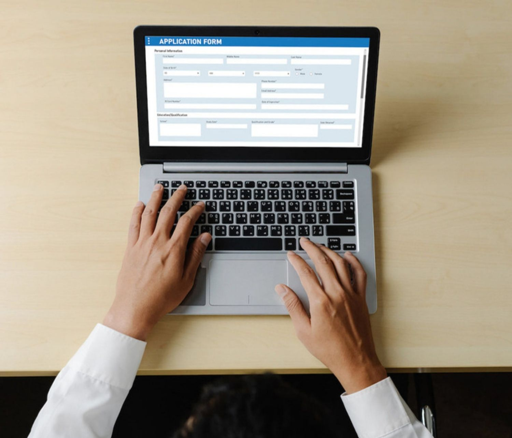
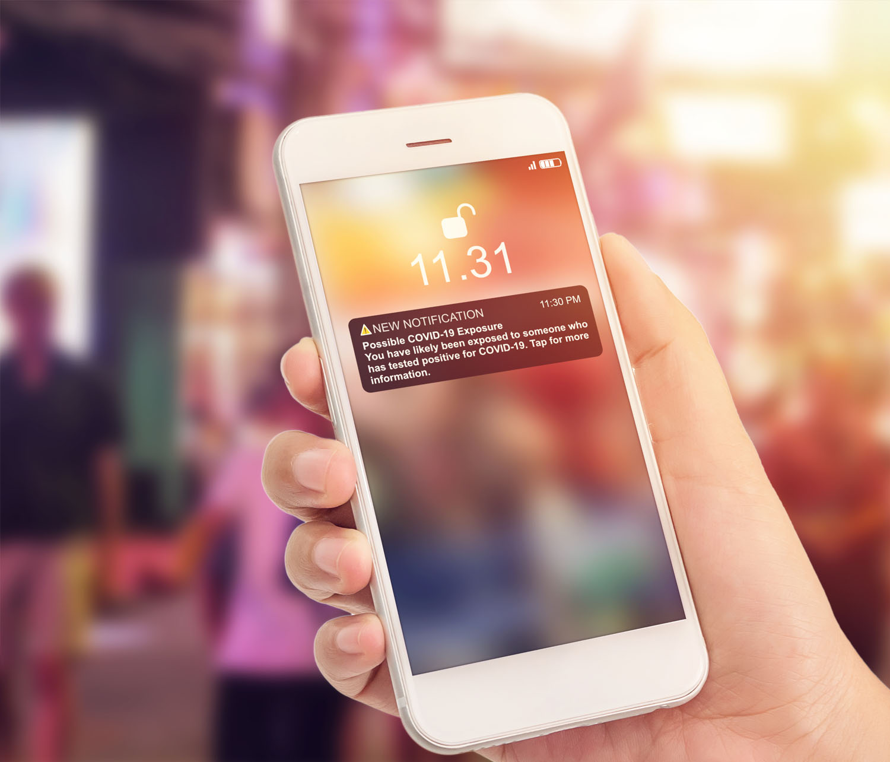

# Introducción a las notificaciones push {#gs-push-notification}

>[!BEGINSHADEBOX]

**En esta página:** Empiece a usar las notificaciones push en Adobe Journey Optimizer para llegar a los usuarios de su aplicación móvil y a los visitantes web a través de recorridos y campañas.

>[!ENDSHADEBOX]

>[!IMPORTANT]
>
>Si es la primera vez que crea una notificación push, asegúrese de que el canal push esté configurado. [Más información](push-gs.md).

Las notificaciones push le ayudan a llegar a sus usuarios de aplicaciones móviles en cualquier momento, especialmente cuando no utilizan activamente su aplicación ni exploran su sitio web. Las notificaciones push pueden ayudarle a lograr una variedad de casos de uso, como proporcionar actualizaciones sobre el servicio, solicitar al usuario que realice una acción, avisar al usuario de una nueva oferta, etc. Las plataformas de dispositivos exigen que los usuarios den su inclusión antes de que puedan recibir o ver las notificaciones. La inclusión del usuario puede recibirse tan pronto como se inicie la aplicación por primera vez después de la instalación, o en una sesión o flujo de trabajo posterior, según corresponda.

[!DNL Journey Optimizer] admite notificaciones push y le ayuda a enviar notificaciones muy relevantes a tasas de rendimiento líderes en el sector. Las notificaciones push pueden incluir personalización y contexto basado en Recorridos para aprovechar la información de datos que su marca tiene con Adobe Experience Cloud.

Se pueden crear notificaciones push:

* En un **Recorrido**: una vez que haya añadido una actividad Push en el recorrido y haya definido la configuración básica, utilice el panel derecho **[!UICONTROL Acciones: Push]** para crear el contenido de las notificaciones push. [Obtenga información sobre cómo crear un recorrido](../building-journeys/journey-gs.md)

* En una **Campaña**: una vez creada una campaña, seleccione Notificaciones push como acción y defina la configuración básica. Aprenda a crear [una campaña de acción](../campaigns/campaign-action.md#action-campaign-action) | [una campaña desencadenada por API](../campaigns/api-triggered-campaigns.md) | [una campaña orquestada](../orchestrated/create-orchestrated-campaign.md#create)

Utilice las pestañas dedicadas para definir la configuración de las notificaciones push para plataformas **iOS**, **Android** y **Web**.

>[!NOTE]
>
>Mientras **[!DNL Journey Optimizer]** proporciona formas de administrar la exclusión en correos electrónicos y mensajes SMS, las notificaciones push no requieren ninguna acción por su parte, ya que los destinatarios pueden cancelar la suscripción a través de sus propios dispositivos. Por ejemplo, al descargar o al usar la aplicación, pueden seleccionar detener las notificaciones. Del mismo modo, pueden cambiar la configuración de notificación a través del sistema operativo móvil o de los ajustes del navegador web. Para comprobar el estado de consentimiento push de un perfil en el visor de perfiles de AEP, consulte [Comprobar el estado de exclusión push](../privacy/opt-out.md#push-opt-out-status).

<table style="table-layout:fixed"><tr style="border: 0;">
<td>

<a href="create-push.md"><strong>Crear una notificación push</strong>

</td>
<td>

<a href="design-push.md"><strong>Diseño de la notificación push</strong></a>

</td>
<td>

<a href="send-push.md"><strong>Enviar la notificación push</strong></a>

</td>
<td>

<a href="push-gs.md"><strong>Configuración de notificaciones push</strong></a>

</td>
</tr></table>
