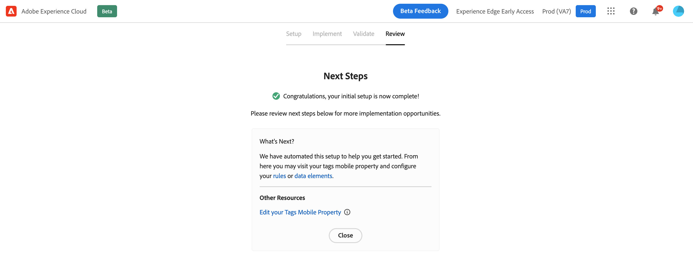

# Flujo de trabajo de inicio rápido de incorporación al dispositivo móvil {#mobile-wf}

El nuevo **flujo de trabajo de inicio rápido de la incorporación móvil** es una nueva característica del producto que permite configurar rápidamente Adobe Experience Platform Mobile SDK, empezar a recopilar y validar datos de eventos móviles y enviar notificaciones push con [!DNL Journey Optimizer].

Todos los clientes pueden acceder a esta funcionalidad a través de la página de inicio de **[!DNL Adobe Experience Platform Data Collection]** como Beta público.

## Introducción{#gs-mobile-wf}

Este nuevo flujo de trabajo automatiza la configuración de la recopilación de datos al reducir el número total de clics y acelerar la configuración móvil de Journey Optimizer. Este flujo de trabajo de inicio rápido le llevará por cuatro sencillos pasos para [configurar](##setup-mobile-wf), [implementar](#implement-mobile-wf), [validar](#valid-mobile-wf) y [revisar](#review-mobile-wf) su configuración móvil.

Para acceder al nuevo flujo de trabajo de inicio rápido de la incorporación a dispositivos móviles, vaya a **[!DNL Data Collection]** desde el conmutador de soluciones. A continuación, seleccione la tarjeta **[!DNL Start Collecting Mobile Data]** en la página de inicio.

A continuación se muestran algunas funciones adicionales:

* Flujo de trabajo de cuatro pasos e interfaz de usuario sencillos.
* Proporciona una configuración básica para empezar a recopilar datos de eventos móviles mediante [Adobe Experience Platform Mobile SDK](https://developer.adobe.com/client-sdks/documentation/){target="_blank"} en minutos.
* Capacidad para probar y validar un evento push móvil básico con [Adobe Experience Platform Assurance](https://experienceleague.adobe.com/docs/experience-platform/assurance/home.html?lang=es){target="_blank"}.
* Crea y configura automáticamente todos los recursos de recopilación de datos y Journey Optimizer necesarios.
* En la guía del producto y la información sobre herramientas.
* Proporciona una transición natural para una implementación más avanzada si es necesario.

## Configuración {#setup-mobile-wf}

El primer paso de este flujo de trabajo crea y configura automáticamente todos los recursos de recopilación de datos y Journey Optimizer necesarios, como propiedades móviles, extensiones móviles, extensión de Journey Optimizer, reglas, elementos de datos, etc.

Después de aceptar los Términos y condiciones de Beta, escriba el nombre de su aplicación móvil y haga clic en **[!DNL Next]**.

Proporcione información para las plataformas iOS y Android, incluido su ID de aplicación y las claves de autenticación o archivo de clave.

## Implementación{#implement-mobile-wf}

El siguiente paso proporciona instrucciones paso a paso para instalar el código en la aplicación móvil.

## Validación{#valid-mobile-wf}

Revise y compruebe la implementación para validarla. Puede enviar una notificación push de prueba.

## Revisión {#review-mobile-wf}

La configuración automatizada ha finalizado. Ahora puede visitar la propiedad móvil de la etiqueta, configurar las reglas o el elemento de datos y empezar a enviar notificaciones push con Adobe Journey Optimizer.

**Temas relacionados**

* [Introducción a las notificaciones push](../../rp_landing_pages/push-landing-page.md)
* [Flujo y componentes de datos de notificaciones push](push-gs.md)
* [Configuración del canal push](push-configuration.md)
* [Informe de notificaciones push](../reports/journey-global-report-cja-push.md#push-global)
* [Creación de una notificación push](create-push.md)
