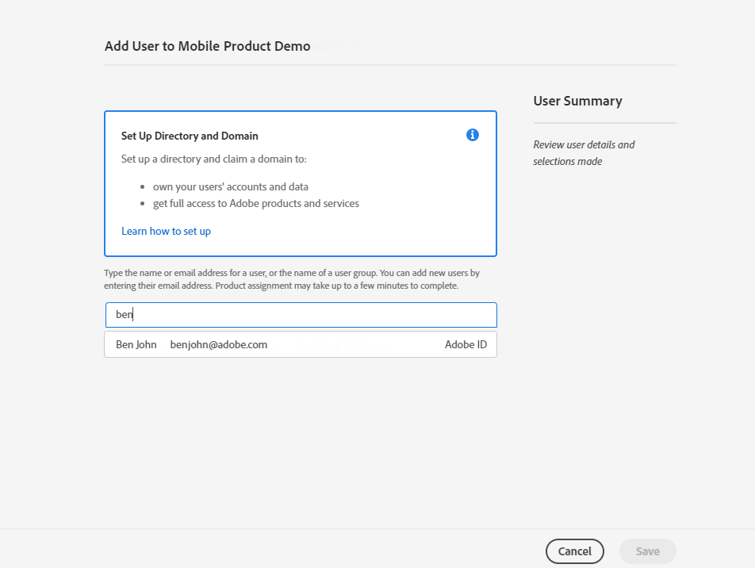

# Configuración de canal de notificaciones push web {#push-notification-configuration}

[!DNL Journey Optimizer] le permite crear sus recorridos y enviar mensajes al público destinatario. Antes de empezar a enviar notificaciones push web con [!DNL Journey Optimizer], debe asegurarse de que las configuraciones y las integraciones estén implementadas en Adobe Experience Platform. Para comprender el flujo de datos de notificaciones push en [!DNL Adobe Journey Optimizer], consulte [esta página](push-gs.md).

>[!AVAILABILITY]
>
>El nuevo **flujo de trabajo de inicio rápido de la incorporación móvil** ya está disponible. Utilice esta nueva función de producto para configurar rápidamente Mobile SDK para que empiece a recopilar y validar datos de eventos móviles y para enviar notificaciones push móviles. Se puede acceder a esta funcionalidad a través de la página de inicio de la recopilación de datos como una versión beta pública. [Más información](mobile-onboarding-wf.md)
>

## Antes de empezar {#start-push}

### Configuración de permisos {#setup-permissions}

Antes de crear una aplicación móvil, primero debe asegurarse de que tiene o asigna los permisos de usuario correctos para las etiquetas en Adobe Experience Platform. Obtenga más información en [Documentación de etiquetas](https://experienceleague.adobe.com/docs/experience-platform/tags/admin/user-permissions.html){target="_blank"}.

>[!CAUTION]
>
>La configuración push la debe realizar un usuario experto. Según el modelo de implementación y las personas involucradas en esta implementación, es posible que deba asignar el conjunto completo de permisos a un único perfil de producto o compartir permisos entre el desarrollador de la aplicación y el administrador de **Adobe Journey Optimizer**. Obtenga más información acerca de los permisos de **Etiquetas** en [esta documentación](https://experienceleague.adobe.com/docs/experience-platform/tags/admin/user-permissions.html){target="_blank"}.

<!--ou need to your have access to perform following roles :

* Manage Datastreams
* Manage Client-side Properties
* Manage App Configurations
-->

Para asignar los derechos de **Property** y **Company**, siga los pasos a continuación:

1. Obtener acceso a **[!DNL Admin Console]**.

1. En la ficha **[!UICONTROL Productos]**, seleccione la tarjeta **[!UICONTROL Recopilación de datos de Adobe Experience Platform]**.

   

1. Seleccione un **[!UICONTROL perfil de producto]** existente o cree uno nuevo con el botón **[!UICONTROL Nuevo perfil]**. Aprenda a crear un nuevo **[!UICONTROL nuevo perfil]** en la [documentación de Admin Console](https://experienceleague.adobe.com/docs/experience-platform/access-control/ui/create-profile.html#ui){target="_blank"}.

1. En la ficha **[!UICONTROL Permisos]**, seleccione **[!UICONTROL Derechos de propiedad]**.

   

1. Haga clic en **[!UICONTROL Agregar todo]**. Esto añadirá el siguiente derecho a su perfil de producto:
   * **[!UICONTROL Aprobar]**
   * **[!UICONTROL Desarrollar]**
   * **[!UICONTROL Administrar entornos]**
   * **[!UICONTROL Administrar extensiones]**
   * **[!UICONTROL Publicar]**

   Estos permisos son necesarios para instalar y publicar la extensión de Adobe Journey Optimizer y publicar la propiedad de la aplicación en Adobe Experience Platform Mobile SDK.

1. A continuación, seleccione **[!UICONTROL Derechos de compañía]** en el menú de la izquierda.

   

1. Añada los siguientes derechos:

   * **[!UICONTROL Administrar configuraciones de aplicación]**
   * **[!UICONTROL Administrar propiedades]**

   Estos permisos son necesarios para que el desarrollador de aplicaciones móviles configure las credenciales push en **Recopilación de datos de Adobe Experience Platform** y defina las configuraciones de canal de notificaciones push (es decir, ajustes preestablecidos de mensaje) en **Adobe Journey Optimizer**.

   

1. Haga clic en **[!UICONTROL Guardar]**.

Para asignar este **[!UICONTROL perfil de producto]** a los usuarios, siga los pasos a continuación:

1. Obtener acceso a **[!DNL Admin Console]**.

1. En la ficha **[!UICONTROL Productos]**, seleccione la tarjeta **[!UICONTROL Recopilación de datos de Adobe Experience Platform]**.

1. Seleccione el **[!UICONTROL perfil de producto]** configurado anteriormente.

1. En la pestaña **[!UICONTROL Usuarios]**, haga clic en **[!UICONTROL Añadir usuario]**.

   

1. Escriba el nombre o la dirección de correo electrónico del usuario y seleccione el usuario. A continuación, haga clic en **[!UICONTROL Guardar]**.

   >[!NOTE]
   >
   >Si el usuario no se creó anteriormente en Admin Console, consulte la [Documentación para agregar usuarios](https://helpx.adobe.com/enterprise/admin-guide.html/enterprise/using/manage-users-individually.ug.html#add-users).

   

### Compruebe sus conjuntos de datos {#push-datasets}

Los siguientes esquemas y conjuntos de datos están disponibles con el canal de notificaciones push:

| Conjunto de datos   del esquema | Grupo de campos | Operación |
| -------------------------------------------------------------------------------------- | --------------------------------------------------------------------------------------------------------------------------------------------------------------------------------------- | -------------------------------------------------------- |
| Conjunto de datos del perfil push de CJM  Esquema del perfil push de CJM | Detalles de notificaciones push Adobe CJM ExperienceEvent - Detalles del perfil de mensaje Adobe CJM ExperienceEvent - Detalles de ejecución de mensajes Detalles de la aplicación Detalles del entorno | Registrar token push |
| Esquema de evento de experiencia de seguimiento push de CJM  Conjunto de datos de evento de experiencia de seguimiento push de CJM | Seguimiento de notificaciones push | Rastree interacciones y proporcione datos para la interfaz de usuario de informes |

>[!NOTE]
>
>Cuando se incorporan eventos de seguimiento push en el conjunto de datos de evento de experiencia de seguimiento push de CJM, pueden producirse algunos errores, aunque los datos se incorporen parcialmente correctamente. Esto puede ocurrir si algunos campos de la asignación no existen en eventos entrantes: el sistema registra advertencias, pero no impide la ingesta de partes válidas de los datos. Estas advertencias aparecen en el estado del lote como &quot;fallido&quot;, pero reflejan el éxito de la ingesta parcial.
>
>Para ver la lista completa de campos y atributos para cada esquema, consulte el [diccionario del esquema de Journey Optimizer](https://experienceleague.adobe.com/tools/ajo-schemas/schema-dictionary.html?lang=es){target="_blank"}.

### Configuración de la propiedad pushNotification {#push-property}

Para habilitar **notificaciones push web**, primero debe asegurarse de que la propiedad [pushNotifications](https://experienceleague.adobe.com/en/docs/experience-platform/collection/js/commands/configure/pushnotifications) esté configurada correctamente en Web SDK. Esta propiedad controla cómo la aplicación web gestiona las notificaciones push.

Además, necesita generar claves VAPID, necesarias para configurar [sus credenciales push de la aplicación](#push-credentials-launch) en Journey Optimizer.

## Paso 1: Añadir las credenciales push de la aplicación en Journey Optimizer {#push-credentials-launch}

Después de conceder los permisos de usuario correctos, ahora debe agregar las credenciales push de la aplicación móvil en Journey Optimizer.

Se requiere el registro de credenciales push de aplicaciones móviles para autorizar a Adobe a enviar notificaciones push en su nombre. Consulte los pasos detallados a continuación:

1. Acceda al menú **[!UICONTROL Canales]** > **[!UICONTROL Configuración push]** > **[!UICONTROL Credenciales push]**.

1. Haga clic en **[!UICONTROL Crear credencial push]**.

1. En el menú desplegable **[!UICONTROL Plataforma]**, seleccione **[!UICONTROL Web]**.

   

1. Proporcione el **[!UICONTROL ID de aplicación]**.

1. Escriba su **[!UICONTROL clave pública VAPID]** y **[!UICONTROL clave privada]**.

1. Haga clic en **[!UICONTROL Enviar]** para crear la configuración de la aplicación.

## Paso 2: Crear una configuración de canal para push{#message-preset}

Una vez creadas las credenciales de inserción, debe crear una configuración para poder enviar notificaciones push desde **[!DNL Journey Optimizer]**.

1. Acceda al menú **[!UICONTROL Canales]** > **[!UICONTROL Configuración general]** > **[!UICONTROL Configuraciones de canal]** y luego haga clic en **[!UICONTROL Crear configuración de canal]**.

   

1. Introduzca un nombre y una descripción (opcional) para la configuración.

   >[!NOTE]
   >
   > Los nombres deben comenzar por una letra (A-Z). Solo puede contener caracteres alfanuméricos. También puede utilizar caracteres de guion bajo `_`, punto `.` y guion `-`.

1. Para asignar etiquetas de uso de datos principales o personalizadas a la configuración, puedes seleccionar **[!UICONTROL Administrar acceso]**. [Obtenga más información acerca del Control de acceso de nivel de objeto (OLAC)](../administration/object-based-access.md).

1. Seleccione el canal **Push**.

   

1. Seleccione **[!UICONTROL Acciones de marketing]** para asociar directivas de consentimiento a los mensajes que usan esta configuración. Todas las políticas de consentimiento asociadas con la acción de marketing se aprovechan para respetar las preferencias de los clientes. [Más información](../action/consent.md#surface-marketing-actions)

1. Elija su **[!UICONTROL plataforma]**: Android, iOS o web.

1. Seleccione el mismo **[!UICONTROL ID de aplicación]** que para la [credencial push](#push-credentials-launch) configurada anteriormente.

1. Guarde los cambios.

Ahora puede seleccionar la configuración al crear las notificaciones push.

## Paso 3: Configurar la propiedad sendPushSubscription {#sendPushSubscription-property}

Una vez configuradas las credenciales de inserción y la configuración de canal, debe implementar [el comando sendPushSubscription](https://experienceleague.adobe.com/en/docs/experience-platform/collection/js/commands/sendpushsubscription) en la aplicación web. Este comando registra las suscripciones push de los usuarios con Adobe Experience Platform, lo que permite al sistema rastrear qué usuarios se han suscrito para recibir notificaciones push y mantener su estado de suscripción. Este registro es esencial para que Journey Optimizer envíe notificaciones push dirigidas a sus usuarios.

## Paso 4: Prueba de la aplicación móvil con un evento {#mobile-app-test}

Después de completar la configuración de web push en Adobe Experience Platform y [!DNL Adobe Experience Platform Data Collection], puede probar la implementación antes de enviar notificaciones web push a sus perfiles. Las pruebas garantizan que las suscripciones se registren correctamente y que las notificaciones se envíen correctamente a los exploradores de los usuarios.

Para obtener instrucciones detalladas sobre la creación de un recorrido de prueba con eventos para validar la configuración de notificaciones push web, consulte la [documentación de configuración de notificaciones push de aplicaciones móviles](push-configuration.md), que proporciona un flujo de trabajo de prueba completo aplicable tanto a canales push móviles como web.
