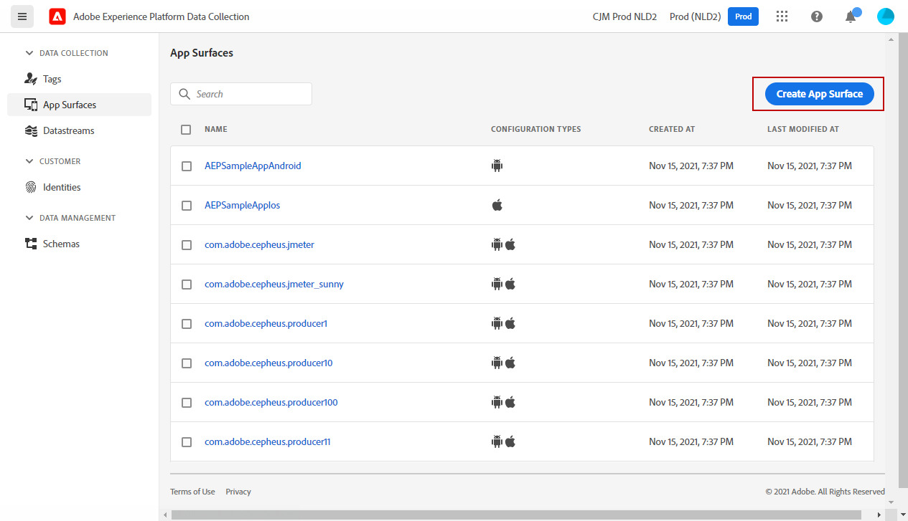

# Configurar el canal de notificaciones push {#push-notification-configuration}

[!DNL Journey Optimizer] le permite crear sus recorridos y enviar mensajes al público destinatario. Antes de empezar a enviar notificaciones push con [!DNL Journey Optimizer], debe asegurarse de que las configuraciones y las integraciones estén implementadas en la aplicación móvil y para las etiquetas en Adobe Experience Platform. Para comprender el flujo de datos de notificaciones push en [!DNL Adobe Journey Optimizer] consulte [esta página](push-gs.md).

>[!AVAILABILITY]
>
>El nuevo **flujo de trabajo de inicio rápido de incorporación móvil** ya está disponible. Utilice esta nueva función de producto para configurar rápidamente el SDK móvil para empezar a recopilar y validar datos de eventos móviles, así como para enviar notificaciones push móviles. Se puede acceder a esta funcionalidad a través de la página de inicio de la recopilación de datos como una versión beta pública. [Más información](mobile-onboarding-wf.md)
>


## Antes de empezar {#before-starting}

<!--
### Check provisioning

Your Adobe Experience Platform account must be provisioned to contain following schemas and datasets for push notification data flow to function correctly:

| Schema <br>Dataset                                                                       | Group of fields                                                                                                                                                                         | Operation                                                |
| -------------------------------------------------------------------------------------- | --------------------------------------------------------------------------------------------------------------------------------------------------------------------------------------- | -------------------------------------------------------- |
| CJM Push Profile Schema <br>CJM Push Profile Dataset                                     | Push Notification Details<br>Adobe CJM ExperienceEvent - Message Profile Details<br>Adobe CJM ExperienceEvent - Message Execution Details<br>Application Details<br>Environment Details | Register Push Token                                      |
| CJM Push Tracking Experience Event Schema<br>CJM Push Tracking Experience Event Dataset | Push Notification Tracking                                                                                                                                                              | Track interactions and provide data for the reporting UI |
-->

### Configuración de permisos {#setup-permissions}

Antes de crear una aplicación móvil, primero debe asegurarse de que tiene o asigna los permisos de usuario correctos para las etiquetas en Adobe Experience Platform. Obtenga más información en [Documentación de etiquetas](https://experienceleague.adobe.com/docs/experience-platform/tags/admin/user-permissions.html){target="_blank"}.

>[!CAUTION]
>
>La configuración push la debe realizar un usuario experto. Según el modelo de implementación y las personas involucradas en esta implementación, es posible que tenga que asignar el conjunto completo de permisos a un único perfil de producto o compartir permisos entre el desarrollador de aplicaciones y **Adobe Journey Optimizer** administrador. Más información sobre **Etiquetas** permisos en [esta documentación](https://experienceleague.adobe.com/docs/experience-platform/tags/admin/user-permissions.html){target="_blank"}.

<!--ou need to your have access to perform following roles :

* Manage Datastreams
* Manage Client-side Properties
* Manage App Configurations
-->

Para asignar **Propiedad** y **Compañía** derechos, siga los pasos a continuación:

1. Acceda a la **[!DNL Admin Console]**.

1. Desde el **[!UICONTROL Productos]** , seleccione la pestaña **[!UICONTROL Recopilación de datos de Adobe Experience Platform]** Tarjeta de.

   

1. Seleccionar un existente **[!UICONTROL Perfil del producto]** o cree uno nuevo con la variable **[!UICONTROL Nuevo perfil]** botón. Obtenga información sobre cómo crear un nuevo **[!UICONTROL Nuevo perfil]** en el [Documentación de Admin Console](https://experienceleague.adobe.com/docs/experience-platform/access-control/ui/create-profile.html#ui){target="_blank"}.

1. Desde el **[!UICONTROL Permisos]** pestaña, seleccione **[!UICONTROL Derechos de propiedad]**.

   

1. Clic **[!UICONTROL Añadir todo]**. Esto añadirá el siguiente derecho a su perfil de producto:
   * **[!UICONTROL Aprobar]**
   * **[!UICONTROL Desarrollar]**
   * **[!UICONTROL Administrar entornos]**
   * **[!UICONTROL Administración de extensiones]**
   * **[!UICONTROL Publish]**

   Estos permisos son necesarios para instalar y publicar la extensión de Adobe Journey Optimizer y publicar la propiedad de la aplicación en el SDK de Adobe Experience Platform Mobile.

1. A continuación, seleccione **[!UICONTROL Derechos de compañía]** en el menú de la izquierda.

   

1. Añada los siguientes derechos:

   * **[!UICONTROL Administrar configuraciones de aplicación]**
   * **[!UICONTROL Administrar propiedades]**

   Estos permisos son necesarios para que el desarrollador de aplicaciones móviles pueda configurar las credenciales push en **Recopilación de datos de Adobe Experience Platform** y defina las superficies de canal de notificaciones push (es decir, los ajustes preestablecidos de mensaje) en **Adobe Journey Optimizer**.

   

1. Haga clic en **[!UICONTROL Guardar]**.

Para asignar esto **[!UICONTROL Perfil del producto]** para los usuarios de, siga los pasos a continuación:

1. Acceda a la **[!DNL Admin Console]**.

1. Desde el **[!UICONTROL Productos]** , seleccione la pestaña **[!UICONTROL Recopilación de datos de Adobe Experience Platform]** Tarjeta de.

1. Seleccione el configurado anteriormente **[!UICONTROL Perfil del producto]**.

1. Desde el **[!UICONTROL Usuarios]** pestaña, haga clic en **[!UICONTROL Agregar usuario]**.

   

1. Escriba el nombre o la dirección de correo electrónico del usuario y seleccione el usuario. A continuación, haga clic en **[!UICONTROL Guardar]**.

   >[!NOTE]
   >
   >Si el usuario no se ha creado anteriormente en Admin Console, consulte la [Documentación de Adición de usuarios](https://helpx.adobe.com/enterprise/admin-guide.html/enterprise/using/manage-users-individually.ug.html#add-users).

   

### Configurar su aplicación {#configure-app}

La configuración técnica implica una estrecha colaboración entre el desarrollador de la aplicación y el administrador empresarial. Antes de empezar a enviar notificaciones push con [!DNL Journey Optimizer], debe definir la configuración en [!DNL Adobe Experience Platform Data Collection] e integre su aplicación móvil con los SDK para móviles de Adobe Experience Platform.

Siga los pasos de implementación detallados en los vínculos siguientes:

* Para **Apple iOS**: Obtenga información sobre cómo registrar la aplicación con APNS en [Documentación de Apple](https://developer.apple.com/documentation/usernotifications/registering_your_app_with_apns){target="_blank"}
* Para **Google Android**: Obtenga información sobre cómo configurar una aplicación cliente de Firebase Cloud Messaging en Android en [Documentación de Google](https://firebase.google.com/docs/cloud-messaging/android/client){target="_blank"}

### Integración de la aplicación móvil con el SDK de Adobe Experience Platform {#integrate-mobile-app}

El SDK de Adobe Experience Platform Mobile proporciona API de integración del lado del cliente para sus móviles a través de SDK compatibles con Android y iOS. Seguir [Documentación del SDK de Adobe Experience Platform Mobile](https://developer.adobe.com/client-sdks/documentation/getting-started/){target="_blank"} para configurar los SDK de Adobe Experience Platform Mobile en la aplicación.

Al final de esto, también debería haber creado y configurado una propiedad móvil en [!DNL Adobe Experience Platform Data Collection]. Normalmente, creará una propiedad móvil para cada aplicación móvil que desee administrar. Obtenga información sobre cómo crear y configurar una propiedad móvil en [Documentación del SDK de Adobe Experience Platform Mobile](https://developer.adobe.com/client-sdks/documentation/getting-started/create-a-mobile-property/){target="_blank"}.


## Paso 1: Añadir las credenciales push de la aplicación en la recopilación de datos de Adobe Experience Platform {#push-credentials-launch}

Después de conceder los permisos de usuario correctos, ahora debe agregar las credenciales push de la aplicación móvil en [!DNL Adobe Experience Platform Data Collection].

Se requiere el registro de credenciales push de la aplicación móvil para autorizar al Adobe a enviar notificaciones push en su nombre. Consulte los pasos detallados a continuación:

1. Desde [!DNL Adobe Experience Platform Data Collection], seleccione la **[!UICONTROL Superficies de aplicación]** en el panel izquierdo.

1. Clic **[!UICONTROL Crear superficie de aplicación]** para crear una nueva configuración.

   

1. Introduzca una **[!UICONTROL Nombre]** para la configuración.

1. Desde **[!UICONTROL Configuración de aplicaciones móviles]**, seleccione el Sistema operativo:

   * **Para iOS**

     

      1. Introduzca la aplicación móvil **ID de paquete** en el **[!UICONTROL ID de aplicación (ID de paquete de iOS)]** field. El ID del paquete de aplicaciones se encuentra en **General** pestaña del objetivo principal en **XCode**.

      1. Se ha encendido la **[!UICONTROL Credenciales push]** para añadir sus credenciales.

      1. Arrastre y suelte su archivo .p8 de clave de autenticación de notificaciones push de Apple. Esta clave se puede adquirir desde el **Certificados**, **Identificadores** y **Perfiles** página.

      1. Proporcione el **ID de clave**. Es una cadena de 10 caracteres asignada durante la creación de la clave de autenticación p8. Se encuentra en **Claves** pestaña en **Certificados**, **Identificadores** y **Perfiles** página.

      1. Proporcione el **Identificador de equipo**. Es un valor de cadena que se puede encontrar en la pestaña Pertenencia.

   * **Para Android**

     

      1. Proporcione el **[!UICONTROL ID de aplicación (nombre del paquete de Android)]**: normalmente, el nombre del paquete es el id de la aplicación en su `build.gradle` archivo.

      1. Se ha encendido la **[!UICONTROL Credenciales push]** para añadir sus credenciales.

      1. Arrastre y suelte las credenciales push de FCM. Para obtener más información sobre cómo obtener las credenciales push, consulte [Documentación de Google](https://firebase.google.com/docs/admin/setup#initialize-sdk){target="_blank"}.


1. Clic **[!UICONTROL Guardar]** para crear la configuración de la aplicación.

<!--
## Step 2: Set up a mobile property in Adobe Experience Platform Launch {#launch-property}

Setting up a mobile property allows the mobile app developer or marketer to configure the mobile SDKs attributes such as Session Timeouts, the [!DNL Adobe Experience Platform] sandbox to be targeted and the **[!UICONTROL Adobe Experience Platform Datasets]** to be used for mobile SDK to send data to.

For further details and procedures on how to set up a **[!UICONTROL Platform Launch property]**, refer to the steps detailed in [Adobe Experience Platform Mobile SDK documentation](https://aep-sdks.gitbook.io/docs/getting-started/create-a-mobile-property#create-a-mobile-property).


To get the SDKs needed for push notification to work you will need the following SDK extensions, for both Android and iOS:

* **[!UICONTROL Mobile Core]** (installed automatically)
* **[!UICONTROL Profile]** (installed automatically)
* **[!UICONTROL Adobe Experience Platform Edge]**
* **[!UICONTROL Adobe Experience Platform Assurance]**, optional but recommended to debug the mobile implementation.

Learn more about [!DNL Adobe Experience Platform Launch] extensions in [Adobe Experience Platform Launch documentation](https://experienceleague.adobe.com/docs/launch-learn/implementing-in-mobile-android-apps-with-launch/configure-launch/launch-add-extensions.html).
-->

## Paso 2: Configuración de la extensión de Adobe Journey Optimizer en la propiedad móvil {#configure-journey-optimizer-extension}

El **Extensión de Adobe Journey Optimizer** para los SDK de Adobe Experience Platform Mobile alimenta las notificaciones push de sus aplicaciones móviles y le ayuda a recopilar tokens push de usuario y a gestionar la medición de interacciones con los servicios de Adobe Experience Platform.

Obtenga información sobre cómo configurar la extensión de Journey Optimizer en [Documentación del SDK de Adobe Experience Platform Mobile](https://developer.adobe.com/client-sdks/documentation/adobe-journey-optimizer/){target="_blank"}.


<!-- 
**[!UICONTROL Edge configuration]** is used by **[!UICONTROL Edge]** extension to send custom data from mobile device to [!DNL Adobe Experience Platform]. 
To configure [!DNL Adobe Experience Platform], you must provide the **[!UICONTROL Sandbox]** name and **[!UICONTROL Event Dataset]**.

1. From [!DNL Adobe Experience Platform Launch], select the **[!UICONTROL Edge Configurations]** tab and click **[!UICONTROL Edge Configurations]**.
    
1. Select **[!UICONTROL New Edge Configuration]** to add a new **[!UICONTROL Edge Configuration]**.
1. Enter a **[!UICONTROL Name]** and click **[!UICONTROL Save]**

1. Click the **[!UICONTROL Adobe Experience Platform]** toggle to enable it.

1. Fill in the **[!UICONTROL Sandbox]**, **[!UICONTROL Event dataset]** and **[!UICONTROL Profile Dataset]** fields. Then, click **[!UICONTROL Save]**.
    
    


1. From [!DNL Adobe Experience Platform Launch], ensure that **[!UICONTROL Client Side]** is selected in the drop-down menu.

1. select the **[!UICONTROL Properties]** tab and click **[!UICONTROL New Property]**.

    

1. Enter a **[!UICONTROL Name]** for your new property.

1. Select **[!UICONTROL Mobile]** as **[!UICONTROL Platform]**.

    

1. Click **[!UICONTROL Save]** to create your new property.

To configure **[!UICONTROL Adobe Experience Platform Edge Extension]** to send custom data from mobile devices to [!DNL Adobe Experience Platform].

1. Select your previously created property and select the **[!UICONTROL Extensions]** tab to view the extensions for this property.

    

1. Click **[!UICONTROL Configure]** under the **[!UICONTROL Adobe Experience Platform Edge]** Network' extension.

1. From the **[!UICONTROL Edge Configuration]** drop-down list, select the **[!UICONTROL Edge Configuration]** created in the previous steps. For more information on **[!UICONTROL Edge Configuration]**, refer to this [section](#edge-configuration).

1. Click **[!UICONTROL Save]**.

To configure **[!UICONTROL Adobe Experience Platform Messaging]** extension to send push profile and push interactions to the correct datasets, follow the same steps as above. Use **[!UICONTROL Sandbox]**, **[!UICONTROL Event dataset]** and **[!UICONTROL Profile Dataset]** created in the [Adobe Experience Platform setup](#edge-configuration).
-->

<!--
## Step 4: Publish the Property {#publish-property}

You now need to publish the property to integrate your configuration and to use it in the mobile app. 

To publish your property, refer to the steps detailed in [Adobe Experience Platform Mobile SDK documentation](https://aep-sdks.gitbook.io/docs/getting-started/create-a-mobile-property#publish-the-configuration)

## Step 5: Configure the ProfileDataSource {#configure-profiledatasource}

To configure the `ProfileDataSource`, use the `ProfileDCInletURL` from [!DNL Adobe Experience Platform] setup and add the following in the mobile app:

```
    MobileCore.updateConfiguration(
    mutableMapOf("messaging.dccs" to <ProfileDCSInletURL>)
```

-->

## Paso 3: Prueba de la aplicación móvil con un evento {#mobile-app-test}

Después de configurar la aplicación móvil en Adobe Experience Platform y en [!DNL Adobe Experience Platform Data Collection]Ahora puede probarlo antes de enviar notificaciones push a sus perfiles. En este caso de uso, creamos un recorrido para dirigirlo a nuestra aplicación móvil y establecemos un evento que almacene en déclencheur la notificación push.

<!--
You can use a test mobile app for this use case. For more on this, refer to this [page](https://wiki.corp.adobe.com/pages/viewpage.action?spaceKey=CJM&title=Details+of+setting+the+mobile+test+app) (internal use only).
-->

Para que este recorrido funcione, debe crear un esquema XDM. Para obtener más información, consulte [Documentación de XDM](https://experienceleague.adobe.com/docs/experience-platform/xdm/schema/composition.html#schemas-and-data-ingestion){target="_blank"}.

1. En la sección del menú DATA MANAGEMENT, haga clic en **[!UICONTROL Esquemas]**.
   
1. Clic **[!UICONTROL Crear esquema]**, en la parte superior derecha, seleccione **[!UICONTROL Evento de experiencia]** y haga clic en **Siguiente**.
   
1. Introduzca un nombre y una descripción para el esquema y haga clic en **Finalizar**.
   
1. En el **Grupos de campos** , a la izquierda, haga clic en **Añadir** y seleccione **[!UICONTROL Crear un nuevo grupo de campos]**.

1. Introduzca una **[!UICONTROL Nombre para mostrar]** y una **[!UICONTROL Descripción]**. Clic **[!UICONTROL Adición de grupos de campos]** cuando termine. Para obtener más información sobre cómo crear grupos de campos, consulte [Documentación del sistema XDM](https://experienceleague.adobe.com/docs/experience-platform/xdm/tutorials/create-schema-ui.html?lang=es){target="_blank"}.


   

1. En el lado izquierdo, seleccione el esquema. En el panel derecho, habilite este esquema para **[!UICONTROL Perfil]**.

   


1. En el lado izquierdo, seleccione el grupo de campos y, a continuación, haga clic en el icono + para crear un nuevo campo. En el **[!UICONTROL Propiedades de grupos de campos]**, en el lado derecho, escriba **[!UICONTROL Nombre de campo]**, **[!UICONTROL Nombre para mostrar]** y seleccione **[!UICONTROL Cadena]** as **[!UICONTROL Tipo]**.

   

1. Marque **[!UICONTROL Requerido]** y haga clic en **[!UICONTROL Aplicar]**.

1. Haga clic en **[!UICONTROL Guardar]**. El esquema se creará y se podrá utilizar en un evento.

A continuación, debe configurar un evento.

1. En el menú de la izquierda de la página principal, en ADMINISTRACIÓN, seleccione **[!UICONTROL Configuraciones]**. El clic **[!UICONTROL Administrar]** en el **[!UICONTROL Eventos]** para crear su nuevo evento.

1. Clic **[!UICONTROL Crear evento]**, el panel de configuración de evento se abre en el lado derecho de la pantalla.

   

1. Introduzca el nombre del evento. También puede añadir una descripción.

1. En el **[!UICONTROL Tipo de ID de evento]** , seleccione **[!UICONTROL Basado en reglas]**.

1. En el **[!UICONTROL Parámetros]**, seleccione el esquema creado anteriormente.

   

1. En la lista de campos, compruebe que el campo creado en el grupo de campos de esquema esté seleccionado.

   

1. Clic **[!UICONTROL Editar]** en el **[!UICONTROL Condición de ID de evento]** field. Arrastre y suelte el campo agregado anteriormente para definir la condición que utilizará el sistema para identificar los eventos que almacenan en déclencheur el recorrido.

   

1. Escriba la sintaxis que tendrá que utilizar para almacenar en déclencheur la notificación push en la aplicación de prueba, en este ejemplo **confirmación de pedido**.

   

1. Seleccionar **[!UICONTROL ECID]** como su **[!UICONTROL Área de nombres]**.

1. Clic **[!UICONTROL Ok]** entonces **[!UICONTROL Guardar]**.

El evento se habrá creado y podrá utilizarlo en un recorrido.

1. En el menú izquierdo, haga clic en **[!UICONTROL Recorridos]**.

1. Clic **[!UICONTROL Crear Recorrido]** para crear un nuevo recorrido.

1. Edite las propiedades del recorrido en el panel de configuración que se muestra en el lado derecho. Obtenga más información en esta [sección](../building-journeys/journey-gs.md#change-properties).

1. Comience arrastrando y soltando el evento creado en los pasos anteriores desde el **[!UICONTROL Eventos]** menú desplegable.

   

1. Desde el **[!UICONTROL Acciones]** desplegable, arrastre y suelte un **[!UICONTROL Push]** actividad a su recorrido.

1. Configure la notificación push. Para obtener más información sobre cómo crear notificaciones push, consulte esta [página](create-push.md).

1. Haga clic en **[!UICONTROL Prueba]** para comenzar a probar las notificaciones push, haga clic en **[!UICONTROL Déclencheur de un evento]**.

   

1. Introduzca su ECID en la **[!UICONTROL Clave]** y luego escriba **confirmación de pedido** en el segundo campo.

   

1. Haga clic en **[!UICONTROL Enviar]**.

Se activará el evento y recibirá una notificación push a su aplicación móvil.

## Paso 4: Crear una superficie de canal para push{#message-preset}

Una vez configurada la aplicación móvil en en, [!DNL Adobe Experience Platform Data Collection], debe crear una superficie desde la que poder enviar notificaciones push **[!DNL Journey Optimizer]**.

Obtenga información sobre cómo crear y configurar una superficie de canal en [esta sección](../configuration/channel-surfaces.md).

Ya está listo para enviar notificaciones push con Journey Optimizer.

* Obtenga información sobre cómo crear un mensaje push en [esta página](create-push.md).
* Aprenda a añadir un mensaje a un recorrido en [esta sección](../building-journeys/journeys-message.md).
