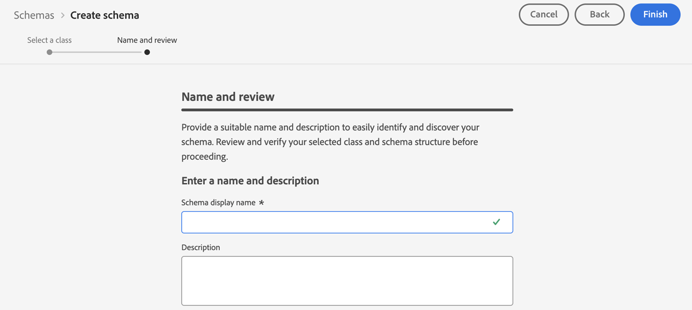

# Configurar el canal de notificaciones push {#push-notification-configuration}

[!DNL Journey Optimizer] le permite crear sus recorridos y enviar mensajes al público destinatario. Antes de empezar a enviar notificaciones push con [!DNL Journey Optimizer], debe asegurarse de que las configuraciones y las integraciones estén implementadas en la aplicación móvil y para las etiquetas en Adobe Experience Platform. Para comprender el flujo de datos de notificaciones push en [!DNL Adobe Journey Optimizer], consulte [esta página](push-gs.md).

>[!AVAILABILITY]
>
>El nuevo **flujo de trabajo de inicio rápido de la incorporación móvil** ya está disponible. Utilice esta nueva función de producto para configurar rápidamente Mobile SDK para que empiece a recopilar y validar datos de eventos móviles y para enviar notificaciones push móviles. Se puede acceder a esta funcionalidad a través de la página de inicio de la recopilación de datos como una versión beta pública. [Más información](mobile-onboarding-wf.md)
>

## Antes de empezar {#start-push}

### Configuración de permisos {#setup-permissions}

Antes de crear una aplicación móvil, primero debe asegurarse de que tiene o asigna los permisos de usuario correctos para las etiquetas en Adobe Experience Platform. Obtenga más información en [Documentación de etiquetas](https://experienceleague.adobe.com/docs/experience-platform/tags/admin/user-permissions.html){target="_blank"}.

>[!CAUTION]
>
>La configuración push la debe realizar un usuario experto. Según el modelo de implementación y las personas involucradas en esta implementación, es posible que deba asignar el conjunto completo de permisos a un único perfil de producto o compartir permisos entre el desarrollador de la aplicación y el administrador de **Adobe Journey Optimizer**. Obtenga más información acerca de los permisos de **Etiquetas** en [esta documentación](https://experienceleague.adobe.com/docs/experience-platform/tags/admin/user-permissions.html){target="_blank"}.

<!--ou need to your have access to perform following roles :

* Manage Datastreams
* Manage Client-side Properties
* Manage App Configurations
-->

Para asignar los derechos de **Property** y **Company**, siga los pasos a continuación:

1. Obtener acceso a **[!DNL Admin Console]**.

1. En la ficha **[!UICONTROL Productos]**, seleccione la tarjeta **[!UICONTROL Recopilación de datos de Adobe Experience Platform]**.

   

1. Seleccione un **[!UICONTROL perfil de producto]** existente o cree uno nuevo con el botón **[!UICONTROL Nuevo perfil]**. Aprenda a crear un nuevo **[!UICONTROL nuevo perfil]** en la [documentación de Admin Console](https://experienceleague.adobe.com/docs/experience-platform/access-control/ui/create-profile.html#ui){target="_blank"}.

1. En la ficha **[!UICONTROL Permisos]**, seleccione **[!UICONTROL Derechos de propiedad]**.

   

1. Haga clic en **[!UICONTROL Agregar todo]**. Esto añadirá el siguiente derecho a su perfil de producto:
   * **[!UICONTROL Aprobar]**
   * **[!UICONTROL Desarrollar]**
   * **[!UICONTROL Administrar entornos]**
   * **[!UICONTROL Administrar extensiones]**
   * **[!UICONTROL Publicar]**

   Estos permisos son necesarios para instalar y publicar la extensión de Adobe Journey Optimizer y publicar la propiedad de la aplicación en Adobe Experience Platform Mobile SDK.

1. A continuación, seleccione **[!UICONTROL Derechos de compañía]** en el menú de la izquierda.

   

1. Añada los siguientes derechos:

   * **[!UICONTROL Administrar configuraciones de aplicación]**
   * **[!UICONTROL Administrar propiedades]**

   Estos permisos son necesarios para que el desarrollador de aplicaciones móviles configure las credenciales push en **Recopilación de datos de Adobe Experience Platform** y defina las configuraciones de canal de notificaciones push (es decir, ajustes preestablecidos de mensaje) en **Adobe Journey Optimizer**.

   

1. Haga clic en **[!UICONTROL Guardar]**.

Para asignar este **[!UICONTROL perfil de producto]** a los usuarios, siga los pasos a continuación:

1. Obtener acceso a **[!DNL Admin Console]**.

1. En la ficha **[!UICONTROL Productos]**, seleccione la tarjeta **[!UICONTROL Recopilación de datos de Adobe Experience Platform]**.

1. Seleccione el **[!UICONTROL perfil de producto]** configurado anteriormente.

1. En la pestaña **[!UICONTROL Usuarios]**, haga clic en **[!UICONTROL Añadir usuario]**.

   

1. Escriba el nombre o la dirección de correo electrónico del usuario y seleccione el usuario. A continuación, haga clic en **[!UICONTROL Guardar]**.

   >[!NOTE]
   >
   >Si el usuario no se creó anteriormente en Admin Console, consulte la [Documentación para agregar usuarios](https://helpx.adobe.com/enterprise/admin-guide.html/enterprise/using/manage-users-individually.ug.html#add-users).

   


### Compruebe sus conjuntos de datos {#push-datasets}

Los siguientes esquemas y conjuntos de datos están disponibles con el canal de notificaciones push:

| Conjunto de datos <br> del esquema | Grupo de campos | Operación |
| -------------------------------------------------------------------------------------- | --------------------------------------------------------------------------------------------------------------------------------------------------------------------------------------- | -------------------------------------------------------- |
| Conjunto de datos del perfil push de CJM <br>Esquema del perfil push de CJM | Detalles de notificaciones push<br>Adobe CJM ExperienceEvent - Detalles del perfil de mensaje<br>Adobe CJM ExperienceEvent - Detalles de ejecución de mensajes<br>Detalles de la aplicación<br>Detalles del entorno | Registrar token push |
| Esquema de evento de experiencia de seguimiento push de CJM <br>Conjunto de datos de evento de experiencia de seguimiento push de CJM | Seguimiento de notificaciones push | Rastree interacciones y proporcione datos para la interfaz de usuario de informes |


>[!NOTE]
>
>Cuando se incorporan eventos de seguimiento push en el conjunto de datos de evento de experiencia de seguimiento push de CJM, pueden producirse algunos errores, aunque los datos se incorporen parcialmente correctamente. Esto puede ocurrir si algunos campos de la asignación no existen en eventos entrantes: el sistema registra advertencias, pero no impide la ingesta de partes válidas de los datos. Estas advertencias aparecen en el estado del lote como &quot;fallido&quot;, pero reflejan el éxito de la ingesta parcial.
>
>Para ver la lista completa de campos y atributos para cada esquema, consulte el [diccionario del esquema de Journey Optimizer](https://experienceleague.adobe.com/tools/ajo-schemas/schema-dictionary.html?lang=es){target="_blank"}.


### Configurar su aplicación {#configure-app}

La configuración técnica implica una estrecha colaboración entre el desarrollador de la aplicación y el administrador empresarial. Antes de empezar a enviar notificaciones push con [!DNL Journey Optimizer], debe crear credenciales push, una configuración de canal push en Adobe Journey Optimizer e integrar su aplicación móvil con los SDK de Adobe Experience Platform Mobile.

Siga los pasos de implementación detallados en los vínculos siguientes:

* Para **Apple iOS**: Aprenda a registrar su aplicación con APNS en [Documentación de Apple](https://developer.apple.com/documentation/usernotifications/registering_your_app_with_apns){target="_blank"}
* Para **Google Android**: Aprenda a configurar una aplicación cliente de Firebase Cloud Messaging en Android en [Documentación de Google](https://firebase.google.com/docs/cloud-messaging/android/client){target="_blank"}

### Integración de la aplicación móvil con Adobe Experience Platform SDK {#integrate-mobile-app}

El SDK de Adobe Experience Platform Mobile proporciona API de integración del lado del cliente para sus móviles a través de SDK compatibles con Android y iOS. Siga la [documentación de Adobe Experience Platform Mobile SDK](https://developer.adobe.com/client-sdks/documentation/getting-started/){target="_blank"} para configurar los SDK de Adobe Experience Platform Mobile en su aplicación.

Al final de esto, también debería haber creado y configurado una propiedad móvil en [!DNL Adobe Experience Platform Data Collection]. Normalmente, creará una propiedad móvil para cada aplicación móvil que desee administrar. Aprenda a crear y configurar una propiedad móvil en [Documentación de Adobe Experience Platform Mobile SDK](https://developer.adobe.com/client-sdks/documentation/getting-started/create-a-mobile-property/){target="_blank"}.


## Paso 1: Añadir las credenciales push de la aplicación en Journey Optimizer {#push-credentials-launch}

Después de conceder los permisos de usuario correctos, ahora debe agregar las credenciales push de la aplicación móvil en Journey Optimizer.

Se requiere el registro de credenciales push de aplicaciones móviles para autorizar a Adobe a enviar notificaciones push en su nombre. Consulte los pasos detallados a continuación:

1. Acceda al menú **[!UICONTROL Canales]** > **[!UICONTROL Configuración push]** > **[!UICONTROL Credenciales push]**.

1. Haga clic en **[!UICONTROL Crear credencial push]**.

1. En el menú desplegable **[!UICONTROL Plataforma]**, seleccione el Sistema operativo:

   * **Para iOS**

     

      1. Escriba la aplicación móvil **[!UICONTROL ID de aplicación]**.

      1. Habilite la opción **[!UICONTROL Aplicar a todas las zonas protegidas]** para que estas credenciales push estén disponibles en todas las zonas protegidas. Si una zona protegida específica tiene sus propias credenciales para el mismo par de plataforma e ID de aplicación, esas credenciales específicas de la zona protegida tendrán prioridad.

      1. Se ha activado el botón **[!UICONTROL Introducir credenciales de inserción manualmente]** para agregar sus credenciales.

      1. Arrastre y suelte su archivo .p8 de clave de autenticación de notificaciones push de Apple. Esta clave se puede adquirir desde la página **Certificados**, **Identificadores** y **Perfiles**.

      1. Proporcione la **ID de clave**. Es una cadena de 10 caracteres asignada durante la creación de la clave de autenticación p8. Se encuentra en la ficha **Claves** de la página **Certificados**, **Identificadores** y **Perfiles**.

      1. Proporcione el **ID de equipo**. Es un valor de cadena que se puede encontrar en la pestaña Pertenencia.

   * **Para Android**

     

      1. Proporcione el **[!UICONTROL ID de aplicación]**, normalmente el nombre del paquete es el ID de aplicación que hay en su archivo `build.gradle`.

      1. Habilite la opción **[!UICONTROL Aplicar a todas las zonas protegidas]** para que estas credenciales push estén disponibles en todas las zonas protegidas. Si una zona protegida específica tiene sus propias credenciales para el mismo par de plataforma e ID de aplicación, esas credenciales específicas de la zona protegida tendrán prioridad.

      1. Se ha activado el botón **[!UICONTROL Introducir credenciales de inserción manualmente]** para agregar sus credenciales.

      1. Arrastre y suelte las credenciales push de FCM. Para obtener más información sobre cómo obtener las credenciales push, consulte [Documentación de Google](https://firebase.google.com/docs/admin/setup#initialize-sdk){target="_blank"}.


1. Haga clic en **[!UICONTROL Enviar]** para crear la configuración de la aplicación.

<!--
## Step 2: Set up a mobile property in Adobe Experience Platform Launch {#launch-property}

Setting up a mobile property allows the mobile app developer or marketer to configure the mobile SDKs attributes such as Session Timeouts, the [!DNL Adobe Experience Platform] sandbox to be targeted and the **[!UICONTROL Adobe Experience Platform Datasets]** to be used for mobile SDK to send data to.

For further details and procedures on how to set up a **[!UICONTROL Platform Launch property]**, refer to the steps detailed in [Adobe Experience Platform Mobile SDK documentation](https://aep-sdks.gitbook.io/docs/getting-started/create-a-mobile-property#create-a-mobile-property).


To get the SDKs needed for push notification to work you will need the following SDK extensions, for both Android and iOS:

* **[!UICONTROL Mobile Core]** (installed automatically)
* **[!UICONTROL Profile]** (installed automatically)
* **[!UICONTROL Adobe Experience Platform Edge]**
* **[!UICONTROL Adobe Experience Platform Assurance]**, optional but recommended to debug the mobile implementation.

Learn more about [!DNL Adobe Experience Platform Launch] extensions in [Adobe Experience Platform Launch documentation](https://experienceleague.adobe.com/docs/launch-learn/implementing-in-mobile-android-apps-with-launch/configure-launch/launch-add-extensions.html).
-->

## Paso 2: Crear una configuración de canal para push{#message-preset}

Una vez creadas las credenciales de inserción, debe crear una configuración para poder enviar notificaciones push desde **[!DNL Journey Optimizer]**.

1. Acceda al menú **[!UICONTROL Canales]** > **[!UICONTROL Configuración general]** > **[!UICONTROL Configuraciones de canal]** y luego haga clic en **[!UICONTROL Crear configuración de canal]**.

   

1. Introduzca un nombre y una descripción (opcional) para la configuración.

   >[!NOTE]
   >
   > Los nombres deben comenzar por una letra (A-Z). Solo puede contener caracteres alfanuméricos. También puede utilizar caracteres de guion bajo `_`, punto `.` y guion `-`.


1. Para asignar etiquetas de uso de datos principales o personalizadas a la configuración, puedes seleccionar **[!UICONTROL Administrar acceso]**. [Obtenga más información acerca del Control de acceso de nivel de objeto (OLAC)](../administration/object-based-access.md).

1. Seleccione el canal **Push**.

   

1. Seleccione **[!UICONTROL Acciones de marketing]** para asociar directivas de consentimiento a los mensajes que usan esta configuración. Todas las políticas de consentimiento asociadas con la acción de marketing se aprovechan para respetar las preferencias de los clientes. [Más información](../action/consent.md#surface-marketing-actions)

1. Elige tu **[!UICONTROL Plataforma]**.

1. Seleccione el mismo **[!UICONTROL ID de aplicación]** que para la [credencial push](#push-credentials-launch) configurada anteriormente.

1. Guarde los cambios.

Ahora puede seleccionar la configuración al crear las notificaciones push.

## Paso 3: Configuración de la extensión de Adobe Journey Optimizer en su propiedad móvil {#configure-journey-optimizer-extension}

La **extensión de Adobe Journey Optimizer** para los SDK de Adobe Experience Platform Mobile envía notificaciones push a sus aplicaciones móviles, le ayuda a recopilar tokens push de usuario y administra la medición de interacciones con los servicios de Adobe Experience Platform.

Obtenga información sobre cómo configurar la extensión de Journey Optimizer en [Documentación de Adobe Experience Platform Mobile SDK](https://developer.adobe.com/client-sdks/documentation/adobe-journey-optimizer/){target="_blank"}.


<!-- 
**[!UICONTROL Edge configuration]** is used by **[!UICONTROL Edge]** extension to send custom data from mobile device to [!DNL Adobe Experience Platform]. 
To configure [!DNL Adobe Experience Platform], you must provide the **[!UICONTROL Sandbox]** name and **[!UICONTROL Event Dataset]**.

1. From [!DNL Adobe Experience Platform Launch], select the **[!UICONTROL Edge Configurations]** tab and click **[!UICONTROL Edge Configurations]**.
    
1. Select **[!UICONTROL New Edge Configuration]** to add a new **[!UICONTROL Edge Configuration]**.
1. Enter a **[!UICONTROL Name]** and click **[!UICONTROL Save]**

1. Click the **[!UICONTROL Adobe Experience Platform]** toggle to enable it.

1. Fill in the **[!UICONTROL Sandbox]**, **[!UICONTROL Event dataset]** and **[!UICONTROL Profile Dataset]** fields. Then, click **[!UICONTROL Save]**.
    
    


1. From [!DNL Adobe Experience Platform Launch], ensure that **[!UICONTROL Client Side]** is selected in the drop-down menu.

1. select the **[!UICONTROL Properties]** tab and click **[!UICONTROL New Property]**.

    

1. Enter a **[!UICONTROL Name]** for your new property.

1. Select **[!UICONTROL Mobile]** as **[!UICONTROL Platform]**.

    

1. Click **[!UICONTROL Save]** to create your new property.

To configure **[!UICONTROL Adobe Experience Platform Edge Extension]** to send custom data from mobile devices to [!DNL Adobe Experience Platform].

1. Select your previously created property and select the **[!UICONTROL Extensions]** tab to view the extensions for this property.

    

1. Click **[!UICONTROL Configure]** under the **[!UICONTROL Adobe Experience Platform Edge]** Network' extension.

1. From the **[!UICONTROL Edge Configuration]** drop-down list, select the **[!UICONTROL Edge Configuration]** created in the previous steps. For more information on **[!UICONTROL Edge Configuration]**, refer to this [section](#edge-configuration).

1. Click **[!UICONTROL Save]**.

To configure **[!UICONTROL Adobe Experience Platform Messaging]** extension to send push profile and push interactions to the correct datasets, follow the same steps as above. Use **[!UICONTROL Sandbox]**, **[!UICONTROL Event dataset]** and **[!UICONTROL Profile Dataset]** created in the [Adobe Experience Platform setup](#edge-configuration).
-->

<!--
## Step 4: Publish the Property {#publish-property}

You now need to publish the property to integrate your configuration and to use it in the mobile app. 

To publish your property, refer to the steps detailed in [Adobe Experience Platform Mobile SDK documentation](https://aep-sdks.gitbook.io/docs/getting-started/create-a-mobile-property#publish-the-configuration)

## Step 5: Configure the ProfileDataSource {#configure-profiledatasource}

To configure the `ProfileDataSource`, use the `ProfileDCInletURL` from [!DNL Adobe Experience Platform] setup and add the following in the mobile app:

```
    MobileCore.updateConfiguration(
    mutableMapOf("messaging.dccs" to <ProfileDCSInletURL>)
```

-->

## Paso 4: Prueba de la aplicación móvil con un evento {#mobile-app-test}

Después de configurar la aplicación móvil en Adobe Experience Platform y en [!DNL Adobe Experience Platform Data Collection], puede probarla antes de enviar notificaciones push a los perfiles. En este caso de uso, creamos un recorrido para dirigirlo a nuestra aplicación móvil y establecemos un evento que almacene en déclencheur la notificación push.

<!--
You can use a test mobile app for this use case. For more on this, refer to this [page](https://wiki.corp.adobe.com/pages/viewpage.action?spaceKey=CJM&title=Details+of+setting+the+mobile+test+app) (internal use only).
-->

Para que este recorrido funcione, debe crear un esquema XDM. Para obtener más información, consulte [Documentación de XDM](https://experienceleague.adobe.com/docs/experience-platform/xdm/schema/composition.html#schemas-and-data-ingestion){target="_blank"}.

1. En la sección de menú ADMINISTRACIÓN DE DATOS, haga clic en **[!UICONTROL Esquemas]**.
   
1. Haga clic en **[!UICONTROL Crear esquema]**, en la esquina superior derecha, seleccione **[!UICONTROL Evento de experiencia]** y haga clic en **Siguiente**.
   
1. Escriba un nombre y una descripción para el esquema y haga clic en **Finalizar**.
   
1. En la sección **Grupos de campos**, a la izquierda, haga clic en **Agregar** y seleccione **[!UICONTROL Crear un nuevo grupo de campos]**.

1. Escriba **[!UICONTROL Nombre para mostrar]** y **[!UICONTROL Descripción]**. Haga clic en **[!UICONTROL Agregar grupos de campos]** cuando haya terminado. Para obtener más información sobre cómo crear grupos de campos, consulte [Documentación del sistema XDM](https://experienceleague.adobe.com/docs/experience-platform/xdm/tutorials/create-schema-ui.html?lang=es){target="_blank"}.


   

1. En el lado izquierdo, seleccione el esquema. En el panel derecho, habilite este esquema para **[!UICONTROL Perfil]**.

   


1. En el lado izquierdo, seleccione el grupo de campos y, a continuación, haga clic en el icono + para crear un nuevo campo. En las propiedades de **[!UICONTROL Grupos de campos]**, en el lado derecho, escriba un **[!UICONTROL Nombre de campo]**, **[!UICONTROL Nombre para mostrar]** y seleccione **[!UICONTROL Cadena]** como **[!UICONTROL Tipo]**.

   

1. Marque **[!UICONTROL Obligatorio]** y haga clic en **[!UICONTROL Aplicar]**.

1. Haga clic en **[!UICONTROL Guardar]**. El esquema se creará y se podrá utilizar en un evento.

A continuación, debe configurar un evento.

1. En el menú de la izquierda de la página principal, en ADMINISTRACIÓN, seleccione **[!UICONTROL Configuraciones]**. Haz clic en **[!UICONTROL Administrar]** en la sección **[!UICONTROL Eventos]** para crear tu nuevo evento.

1. Haga clic en **[!UICONTROL Crear evento]**, el panel de configuración de evento se abrirá a la derecha de la pantalla.

   

1. Introduzca el nombre del evento. También puede añadir una descripción.

1. En el campo **[!UICONTROL Tipo de ID de evento]**, seleccione **[!UICONTROL Basado en reglas]**.

1. En **[!UICONTROL Parameters]**, seleccione el esquema creado anteriormente.

   

1. En la lista de campos, compruebe que el campo creado en el grupo de campos de esquema esté seleccionado.

   

1. Haga clic en **[!UICONTROL Editar]** en el campo **[!UICONTROL Condición de ID de evento]**. Arrastre y suelte el campo agregado anteriormente para definir la condición que utilizará el sistema para identificar los eventos que almacenan en déclencheur el recorrido.

   

1. Escriba la sintaxis que tendrá que usar para almacenar en déclencheur la notificación push en la aplicación de prueba, en este ejemplo **confirmación de pedido**.

   

1. Seleccione **[!UICONTROL ECID]** como su **[!UICONTROL Área de nombres]**.

1. Haz clic en **[!UICONTROL Aceptar]** y luego en **[!UICONTROL Guardar]**.

El evento se habrá creado y podrá utilizarlo en un recorrido.

1. En el menú de la izquierda, haga clic en **[!UICONTROL Recorridos]**.

1. Haga clic en **[!UICONTROL Crear Recorrido]** para crear un recorrido nuevo.

1. Edite las propiedades del recorrido en el panel de configuración que se muestra en el lado derecho. Obtenga más información en esta [sección](../building-journeys/journey-properties.md).

1. Comience arrastrando y soltando el evento creado en los pasos anteriores desde la lista desplegable **[!UICONTROL Eventos]**.

   

1. En el menú desplegable **[!UICONTROL Acciones]**, arrastre y suelte una actividad **[!UICONTROL Push]** en el recorrido.

1. Configure la notificación push. Para obtener más información sobre cómo crear notificaciones push, consulte esta [página](create-push.md).

1. Haga clic en el botón de alternancia **[!UICONTROL Test]** para comenzar a probar las notificaciones push y haga clic en **[!UICONTROL Déclencheur de un evento]**.

   

1. Escriba su ECID en el campo **[!UICONTROL Clave]** y luego escriba **confirmación de pedido** en el segundo campo.

   

1. Haga clic en **[!UICONTROL Enviar]**.

Se activará el evento y recibirá una notificación push a su aplicación móvil.

