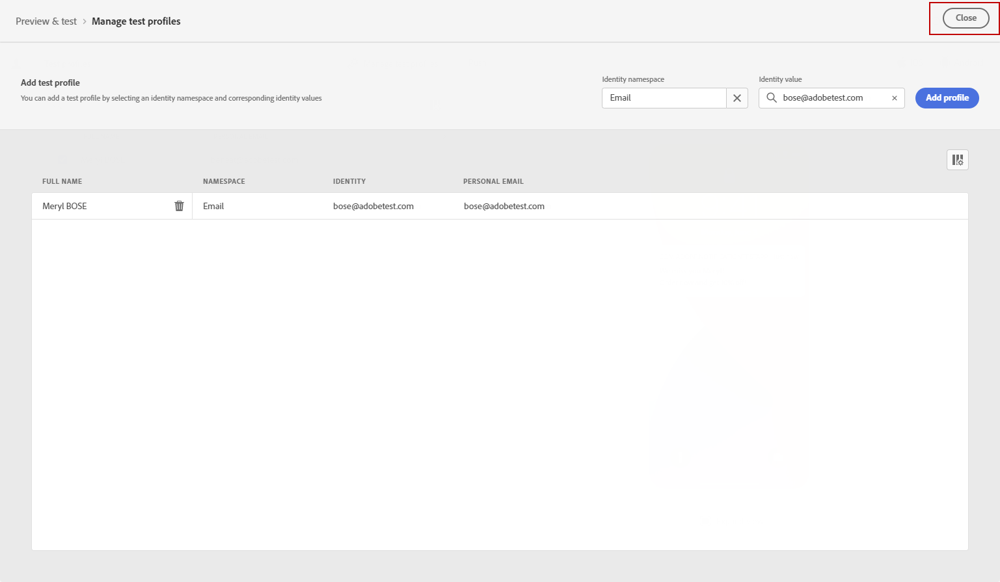

# Enviar la notificación push {#send-push}

## Vista previa de la notificación push {#preview-push}

Una vez definido el contenido del mensaje, puede utilizar perfiles de prueba para previsualizarlo y probarlo. Si insertó contenido personalizado, puede comprobar cómo se muestra este contenido en el mensaje, aprovechando los datos de perfil de prueba.

1. Haga clic en **[!UICONTROL Simulate content]**.

1. Haga clic en **[!UICONTROL Manage test profiles]** para agregar un perfil de prueba.

1. Busque el perfil de prueba con la variable **[!UICONTROL Identity namespace]** y **[!UICONTROL Identity value]** campos. A continuación, haga clic en **[!UICONTROL Add profile]**.

   

1. Siga los mismos pasos que se describen anteriormente para seleccionar un perfil de prueba, y

   

1. En la vista previa push, los datos de perfil de prueba se aprovechan en el contenido del mensaje.

   Seleccione el tipo de dispositivo para previsualizar el contenido: **[!UICONTROL iOS]** o **[!UICONTROL Android]**.

   

## Validación de la notificación push {#push-validate}

>[!NOTE]
>
> Para mejorar la capacidad de envío, siempre debe utilizar los números de teléfono en los formatos admitidos por el proveedor. Por ejemplo, Twilio y Sinch solo admiten números de teléfono en formato E.164.

También debe comprobar las alertas en la sección superior del editor.  Algunas de ellas son simples advertencias, pero otras pueden impedir que utilice el mensaje. Pueden producirse dos tipos de alertas:

* **Advertencias** consulte recomendaciones y prácticas recomendadas.

* **Errores** evite probar o activar el recorrido siempre que no se resuelvan, como:

   * **[!UICONTROL The push version of the message is empty]**: este error se muestra cuando falta el cuerpo o el título de la notificación push. Aprenda a definir el contenido de las notificaciones push en [esta sección](create-push.md).

   * **[!UICONTROL Surface doesn't exist]**: no puede utilizar el mensaje si la superficie seleccionada se elimina después de la creación del mensaje. Si se produce este error, seleccione otra superficie en el mensaje **[!UICONTROL Properties]**. Obtenga más información sobre las superficies de canal en [esta sección](../configuration/channel-surfaces.md).

   * **[!UICONTROL Push iOS/Android payload has exceeded limit of 4KB]**: el tamaño de la notificación push no puede superar los 4 KB. Para respetar este límite, intente reducir el uso de imágenes o emojis. Aprenda a administrar el contenido de las notificaciones push en [esta sección](../push/create-push.md).

Cuando la notificación push esté lista, complete la configuración de [recorrido](../building-journeys/journey-gs.md) o [campaign](../campaigns/create-campaign.md) para enviarlo.
