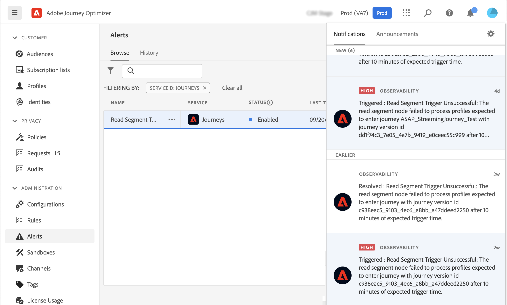

# Introducción a las alertas {#alerts}

Journey Optimizer aprovecha las funciones de alerta de Adobe Experience Platform. Esto le permite acceder a las alertas del sistema a través de la interfaz de usuario. Puede ver las alertas disponibles y suscribirse a ellas. Cuando se alcanza un determinado conjunto de condiciones en sus operaciones (por ejemplo, un problema potencial cuando el sistema supera un umbral), los mensajes de alerta se envían a cualquier usuario de su organización que se haya suscrito a ellos. Estos mensajes se pueden repetir durante un intervalo de tiempo predefinido hasta que se haya resuelto la alerta.

Obtenga más información sobre las alertas en Adobe Experience Platform [documentación](https://experienceleague.adobe.com/docs/experience-platform/observability/alerts/overview.html?lang=es).
Para obtener información sobre cómo suscribirse a las alertas y configurarlas, consulte esta [página](https://experienceleague.adobe.com/docs/experience-platform/observability/alerts/ui.html).

En el menú de la izquierda, debajo de **Administración**, haga clic en **Alertas**.

<!--A pre-configured alert for Journey Optimizer is available. This alert will warn you if a read segment node has not processed any profile during the defined time frame.

-->

Si se produce este comportamiento inesperado, se envía una notificación de alerta a los suscriptores de la alerta por correo electrónico, en la esquina superior derecha de la interfaz.

<!---->

When [visualización de reglas de alerta en la interfaz de usuario de Adobe Experience Platform](https://experienceleague.adobe.com/docs/experience-platform/observability/alerts/ui.html), puede suscribirse a cada regla individualmente. Al suscribirse a alertas mediante [Notificaciones de eventos de E/S](https://experienceleague.adobe.com/docs/experience-platform/observability/alerts/subscribe.html)sin embargo, las reglas de alerta están organizadas en diferentes paquetes de suscripción.

<!--The I/O event subscription name corresponding to the Read segment alert is: "Journey read segment Delays, Failures and Errors".

>[!WARNING]
>
>These alerts apply only to live journeys. Alerts will not be triggered for journeys in test mode.-->
