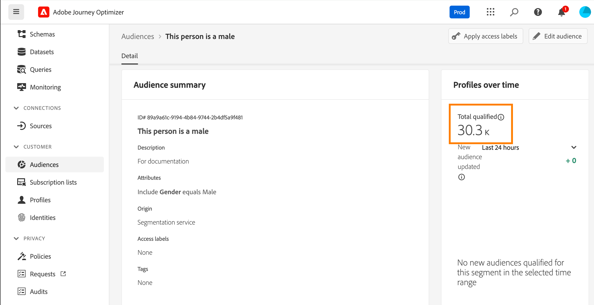

# Acceso y suscripción a alertas del sistema {#alerts}

Al crear sus recorridos y campañas, utilice el botón **Alerts** para comprobar y resolver los errores antes de ejecutarlos o publicarlos. Aprenda a solucionar problemas de sus recorridos en [esta página](../building-journeys/troubleshooting.md). Aprenda a revisar sus campañas en [esta página](../campaigns/review-activate-campaign.md).

También puede suscribirse a las alertas del sistema de Adobe Journey Optimizer, tal y como se detalla en esta página.

## Alertas de acceso y suscripción {#alerting-capabilities}

Cuando se produce un error, puede recibir alertas del sistema en el centro de notificaciones de Journey Optimizer (alertas en la aplicación) o un correo electrónico.

Desde el menú **Alertas**, puede ver las alertas disponibles y suscribirse a ellas. Cuando se alcanza un determinado conjunto de condiciones en las operaciones (como un problema potencial cuando el sistema incumple un umbral), los mensajes de alerta se envían a cualquier usuario de la organización que se haya suscrito a ellos.

<!--These messages can repeat over a pre-defined time interval until the alert has been resolved.-->

Obtenga más información acerca de las alertas en Adobe Experience Platform en [Documentación de Adobe Experience Platform](https://experienceleague.adobe.com/docs/experience-platform/observability/alerts/overview.html?lang=es){target="_blank"}.

En el menú de la izquierda, debajo de **Administración**, haga clic en **Alertas**. Hay dos alertas preconfiguradas para Journey Optimizer disponibles: la alerta [Error en acción personalizada de Recorrido](#alert-custom-actions) y la alerta [Error al leer Déclencheur de audiencia](#alert-read-audiences). Estas alertas se detallan a continuación.

Puede suscribirse a cada alerta individualmente desde la interfaz de usuario, seleccionando la opción **Suscribirse** en el panel **Alertas**. Utilice el mismo método para cancelar la suscripción.

También puede suscribirse a las alertas mediante [notificaciones de eventos de E/S](https://experienceleague.adobe.com/docs/experience-platform/observability/alerts/subscribe.html?lang=es){target="_blank"}. Las reglas de alerta se organizan en diferentes paquetes de suscripción. A continuación, se detallan las suscripciones a eventos correspondientes a las alertas de Journey Optimizer específicas.

Si se produce un comportamiento inesperado, se envía una notificación de alerta a los suscriptores. En función de las preferencias del usuario, las alertas se envían por correo electrónico o directamente en el centro de notificaciones de Journey Optimizer, en la esquina superior derecha de la interfaz de usuario. De forma predeterminada, solo están habilitadas las alertas en la aplicación. Para habilitar las alertas por correo electrónico, consulte [Documentación de Adobe Experience Platform](https://experienceleague.adobe.com/docs/experience-platform/observability/alerts/ui.html?lang=es#enable-email-alerts){target="_blank"}.

Cuando se resuelve una alerta, los suscriptores reciben una notificación &quot;Resuelto&quot;.

>[!CAUTION]
>
>Las alertas específicas de Adobe Journey Optimizer solo se aplican a **recorridos activos**. Las alertas no se activan para los recorridos en el modo de prueba.

## Error de acción personalizada de recorrido {#alert-custom-actions}

Esta alerta le advierte si falla una acción personalizada. Consideramos que hay un error en el que ha habido más del 1 % de errores en una acción personalizada específica en los últimos 5 minutos. Esto se evalúa cada 30 segundos.

Las alertas de acciones personalizadas se resuelven cuando, en los últimos 5 minutos:

* no se ha producido ningún error en esa acción personalizada (o errores por debajo del umbral del 1 %),

* o bien, ningún perfil ha alcanzado esa acción personalizada.

El nombre de suscripción de evento de E/S correspondiente a la alerta de acción personalizada es **Error de acción personalizada de Recorrido**.

## Error al leer Déclencheur de audiencia {#alert-read-audiences}

Esta alerta le advierte si una actividad **Leer audiencia** no ha procesado ningún perfil 10 minutos después de la hora programada de ejecución. Este error puede deberse a problemas técnicos o a que la audiencia está vacía. Si este error se debe a problemas técnicos, tenga en cuenta que aún pueden producirse reintentos, según el tipo de problema (p. ej.: si la creación del trabajo de exportación ha fallado, lo volveremos a intentar cada 10 minutos durante 1 h como máximo).

Las alertas de las actividades **Leer audiencia** solo se aplican a los recorridos recurrentes. Se omiten las actividades de **Leer audiencia** en recorridos activos que tienen una programación para ejecutarse **Una vez** o **Lo antes posible**.

Las alertas de **Leer audiencia** se resuelven cuando un perfil entra en el nodo **Leer audiencia**.

El nombre de suscripción de evento de E/S correspondiente a la alerta **Leer Déclencheur de audiencias erróneo** es **Recorrido de retrasos, errores y errores de lectura de audiencia**.

## Resolución de problemas {#alert-troubleshooting}

Para solucionar problemas de las alertas de **Leer audiencia**, compruebe su recuento de audiencias en la interfaz de Experience Platform.

Para solucionar problemas de **alertas de acción personalizada**:

* Compruebe la acción personalizada mediante el modo de prueba en otro recorrido:

  

* Consulte el informe de recorridos para ver los motivos de error al realizar la acción.

  

* Compruebe los stepEvents de recorrido para buscar más información sobre &quot;failureReason&quot;.

* Compruebe la configuración de la acción personalizada y compruebe que la autenticación sigue siendo correcta. Realice una comprobación manual con Postman, por ejemplo.
