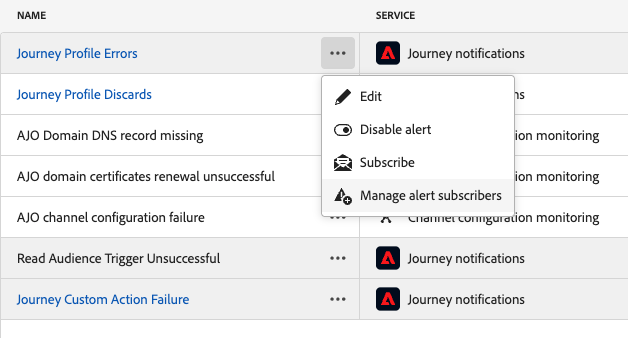
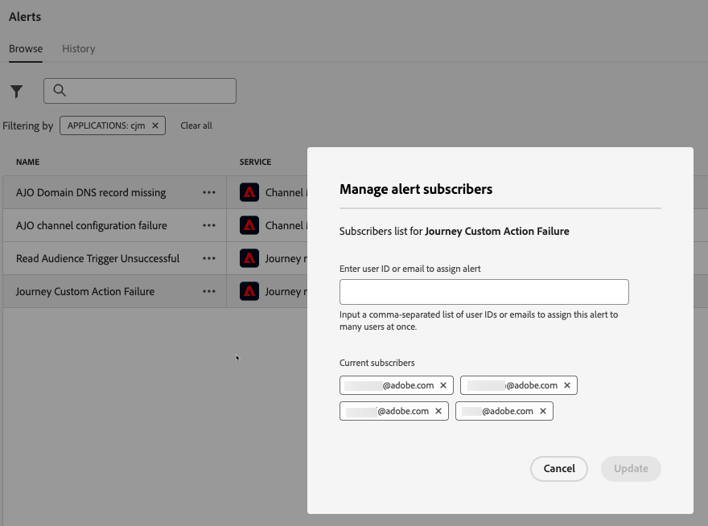

# Acceso y suscripción a alertas del sistema {#alerts}

## Información general

Las alertas son notificaciones automatizadas que le ayudan a supervisar y solucionar problemas en Adobe Journey Optimizer. Permiten conocer en tiempo real los posibles problemas de los recorridos, las campañas y las configuraciones de canal, lo que permite tomar medidas correctivas antes de que las experiencias de los clientes se vean afectadas.

Adobe Journey Optimizer proporciona dos tipos de alertas:

* **Alertas de validación en lienzo**: al crear recorridos y campañas, use el botón **Alertas** del lienzo para identificar y resolver los errores de configuración antes de publicar. Aprenda a [solucionar problemas de sus recorridos](../building-journeys/troubleshooting.md) y a revisar sus campañas: [Campañas de acción](../campaigns/review-activate-campaign.md) | [Campañas activadas por API](../campaigns/review-activate-api-triggered-campaign.md) | [Campañas organizadas](../orchestrated/start-monitor-campaigns.md).

* **Alertas de supervisión del sistema** (detalladas en esta página): Reciba notificaciones dinámicas cuando se superen los umbrales operativos o se detecten problemas en las configuraciones de canales y recorridos activos, y cuando se produzcan eventos importantes del ciclo vital de la campaña (activación, entrega, detención y errores relacionados). Las alertas del sistema supervisan métricas como tasas de error, descartes de perfil y problemas de envío de correo electrónico, además de esos eventos de campaña.

**Ventajas principales de las alertas del sistema:**

* Detección proactiva de problemas antes del impacto en el cliente
* Supervisión automatizada del rendimiento y el estado del recorrido
* Advertencia temprana de problemas de envío de correo electrónico
* Menor tiempo para identificar y resolver problemas operativos

Las alertas del sistema están disponibles en el menú **[!UICONTROL Alertas]** en **[!UICONTROL Administración]**. Adobe Experience Platform proporciona varias reglas de alerta predefinidas que puede habilitar, incluidas las alertas específicas de [!DNL Adobe Journey Optimizer] para recorridos y configuraciones de canal.

## Requisitos previos

Antes de trabajar con alertas:

* **Permisos**: Necesita permisos específicos para ver y administrar alertas. Ver [permisos requeridos en Adobe Experience Platform](https://experienceleague.adobe.com/docs/experience-platform/observability/alerts/overview.html#permissions){target="_blank"}.

* **Reconocimiento de zona protegida**: Las suscripciones de alerta son específicas de la zona protegida. Al suscribirse a las alertas, solo se aplican a la zona protegida actual. Cuando se restablece una zona protegida, también se restablecen todas las suscripciones de alerta.

* **Preferencias de notificación**: configure la forma en que recibe las alertas (correo electrónico o en la aplicación) en sus [Preferencias de Adobe Experience Cloud](../start/user-interface.md#in-product-uc).

## Alertas disponibles {#available-alerts}

Journey Optimizer proporciona reglas de alerta preconfiguradas que supervisan aspectos específicos de sus recorridos, campañas y configuraciones de canal. No es necesario que cree estas alertas: están disponibles de forma predeterminada y se pueden activar mediante suscripción.

**Para tener acceso a la lista de alertas:**

Vaya a **[!UICONTROL Administración]** > **[!UICONTROL Alertas]** en el menú de la izquierda. La pestaña **Examinar** muestra todas las alertas preconfiguradas disponibles para Journey Optimizer.

{width=60%}

Examine las pestañas siguientes para revisar las alertas de configuración de recorridos, campañas y canales. Seleccione un nombre de alerta en una ficha para expandir su descripción completa.

>[!BEGINTABS]

>[!TAB alertas de Recorrido]

En esta pestaña se muestran todas las notificaciones de recorrido disponibles en la interfaz de usuario. Seleccione un nombre de alerta para ampliar su descripción y guía completas.

>[!CAUTION]
>
>Las alertas específicas de Adobe Journey Optimizer solo se aplican a **recorridos activos**. Las alertas no se activan para los recorridos en el modo de prueba.

+++ Error al leer el déclencheur de audiencia

Esta alerta le advierte si una actividad **Leer audiencia** no ha procesado ningún perfil 10 minutos después de la hora programada de ejecución. Este error puede deberse a problemas técnicos o a que la audiencia está vacía. Si este error se debe a problemas técnicos, tenga en cuenta que aún pueden producirse reintentos, según el tipo de problema (p. ej.: si la creación del trabajo de exportación ha fallado, lo volveremos a intentar cada 10 minutos durante 1 h como máximo).

Las alertas de las actividades **Leer audiencia** solo se aplican a los recorridos recurrentes. Se omiten las actividades de **Leer audiencia** en recorridos activos que tienen una programación para ejecutarse **Una vez** o **Lo antes posible**.

Las alertas de **Leer audiencia** se resuelven cuando un perfil entra en el nodo **Leer audiencia** o después de 1 hora.

El nombre de suscripción de evento de E/S correspondiente a la alerta **Leer Déclencheur de audiencias erróneo** es **Recorrido de retrasos, errores y errores de lectura de audiencia**.

Para solucionar problemas de las alertas de **Leer audiencia**, compruebe su recuento de público en la interfaz de Experience Platform.

➡️ [Configurar audiencia de lectura](../building-journeys/read-audience.md)

➡️ [Definir y usar audiencias](../audience/about-audiences.md)

+++

+++ Tasa de descarte de perfil excedida

Esta alerta le advierte si la proporción de descartes de perfiles respecto a los perfiles introducidos durante los últimos 5 minutos ha superado el umbral. El umbral predeterminado está establecido en 20 %, pero puede definir uno personalizado.

Haga clic en el nombre de la alerta para comprobar sus detalles y configuración.

Existen varias razones por las que se puede descartar un perfil, lo que informará al método de resolución de problemas. A continuación se enumeran algunas razones comunes:

* Perfil descartado en la entrada porque ya está activo en ese recorrido unitario. Para resolver esto, asegúrese de que el perfil tenga tiempo suficiente para salir del recorrido antes de que llegue el siguiente evento para ese perfil.
* La identidad no se define para el perfil o el área de nombres que utiliza el recorrido de audiencia de lectura no se utiliza en ese perfil. Para resolver esto, asegúrese de que el área de nombres de la recorrido coincida con el área de nombres de identidad utilizado por los perfiles.
* Se ha superado la tasa de rendimiento de eventos. Para resolver esto, asegúrese de que los eventos que llegan al sistema no superan estos límites.

➡️ [Solucionar problemas de recorrido](../building-journeys/troubleshooting.md)

➡️ [Definir un umbral de alerta personalizado](#custom-threshold)

+++

+++ Tasa de error de acción personalizada excedida

Esta alerta le advierte si la proporción de errores de acción personalizada respecto a llamadas HTTP correctas durante los últimos 5 minutos ha superado el umbral. El umbral predeterminado está establecido en 20 %, pero puede definir uno personalizado.

>[!NOTE]
>
>Esta alerta reemplaza la alerta **Error de acción personalizada de Recorrido** anterior.

Haga clic en el nombre de la alerta para comprobar sus detalles y configuración.

Los errores de acciones personalizadas pueden ocurrir por varios motivos. Para solucionar estos errores, puede:

* Compruebe la acción personalizada mediante el modo de prueba en otro recorrido.
* Consulte el informe de recorridos para ver los motivos de error al realizar la acción.
* Compruebe los stepEvents de recorrido para buscar más información sobre &quot;failureReason&quot;.
* Compruebe que la acción personalizada esté configurada correctamente y valide que la autenticación sigue siendo válida. Realice una comprobación manual con Postman, por ejemplo.
* Compruebe que el punto de conexión sea accesible y que la acción personalizada pueda llegar a él a través del comprobador de conectividad de acción personalizada.
* Compruebe las credenciales de autenticación, la conectividad a Internet, etc.

➡️ [Validar en modo de prueba](../building-journeys/testing-the-journey.md)

➡️ [Inspeccionar el informe en vivo de recorrido](../reports/journey-live-report.md)

➡️ [Configurar acciones personalizadas](../action/about-custom-action-configuration.md)

➡️ [Definir un umbral de alerta personalizado](#custom-threshold)

+++

+++ Tasa de error de perfil excedida

Esta alerta le advierte si la proporción de perfiles en error respecto a los perfiles introducidos durante los últimos 5 minutos ha superado el umbral. El umbral predeterminado está establecido en 20 %, pero puede definir uno personalizado.

Haga clic en el nombre de la alerta para comprobar sus detalles y configuración.

Para solucionar errores de perfil, puede consultar los datos en eventos de paso para comprender dónde y por qué falló el perfil en la recorrido.

➡️ [Trabajar con eventos de paso de recorrido](../reports/journey-step-events-overview.md)

➡️ [Inspeccionar el informe en vivo de recorrido](../reports/journey-live-report.md)

➡️ [Definir un umbral de alerta personalizado](#custom-threshold)

+++

+++ Recorrido publicado

Esta alerta le avisa cuando un profesional ha publicado un recorrido en el lienzo del recorrido.

Se trata de una alerta informativa que le ayuda a realizar un seguimiento de los eventos del ciclo vital de recorrido en su organización. No hay criterios de resolución, ya que se trata de una notificación única.

➡️ [Publicar un recorrido](../building-journeys/publish-journey.md)

➡️ [Validar en modo de prueba](../building-journeys/testing-the-journey.md)

+++

+++ Recorrido finalizado

Esta alerta le avisa cuando ha finalizado un recorrido. La definición de &quot;terminado&quot; varía según el tipo de recorrido.

Esta es una alerta informativa que le ayuda a realizar un seguimiento de la finalización del recorrido. No hay criterios de resolución, ya que se trata de una notificación única.

➡️ [Comprenda cuándo ha finalizado un recorrido](../building-journeys/end-journey.md#journey-finished-definition)

+++

+++ Límite de acción personalizado activado

Esta alerta le avisa cuando se ha activado el límite de una acción personalizada. El límite se utiliza para limitar el número de llamadas enviadas a un extremo externo para evitar saturar el extremo.

Haga clic en el nombre de la alerta para comprobar sus detalles y configuración.

Cuando se activa el límite, significa que se ha alcanzado el número máximo de llamadas de API en el período de tiempo definido y que se están restringiendo o poniendo en cola más llamadas.

Esta alerta se resuelve cuando el límite ya no está activo o cuando ningún perfil alcanza la acción personalizada durante el período de evaluación.

Para solucionar problemas de límite:

* Revise la configuración de límite de la acción personalizada para asegurarse de que los límites sean adecuados para su caso de uso.
* Compruebe si el volumen de llamadas de API es mayor de lo esperado y considere la posibilidad de ajustar el diseño del recorrido o la configuración del límite.
* Supervise el extremo externo para asegurarse de que puede gestionar la carga esperada.

➡️ [Configurar límite de acción personalizado](../action/about-custom-action-configuration.md#custom-action-enhancements-best-practices)

+++

>[!TAB Alertas de campaña]

Las alertas del sistema le avisan cuando se producen eventos importantes de ciclo vital o de envío en las campañas **Acción** y **Activadas por API**. Seleccione un nombre de alerta a continuación para expandir su descripción.

+++ Campaña activada

Le notifica cuando una campaña se ha **activado** correctamente (publicación/activación completada).

➡️ [Revisar y activar una campaña de acción](../campaigns/review-activate-campaign.md)

➡️ [Revisar y activar una campaña activada por API](../campaigns/review-activate-api-triggered-campaign.md)

+++

+++ Error de activación de campaña

Le notifica cuando **activación** de una campaña **falla**. Utilice esta alerta para detectar problemas técnicos o de configuración de forma temprana y reintente o corrija la campaña antes de que los clientes se vean afectados.

➡️ [Revisar y activar una campaña de acción](../campaigns/review-activate-campaign.md)

➡️ [Revisar y activar una campaña activada por API](../campaigns/review-activate-api-triggered-campaign.md)

➡️ [Revisar los requisitos previos y la configuración de la campaña](../campaigns/get-started-with-campaigns.md)

+++

+++ Campaña detenida

Le avisa cuando una campaña se ha **detenido** correctamente (por ejemplo, después de una detención manual o cuando la ejecución se completa según el flujo de trabajo).

➡️ [Comprenda el estado de la campaña](../campaigns/manage-campaigns.md#statuses)

➡️ [Detener una campaña de acción](../campaigns/manage-campaigns.md#stop)

+++

+++ Error al detener la campaña

Le notifica cuando una operación **stop** **falla**. Investigue el estado de la campaña y los errores que se muestren en la interfaz de usuario antes de volver a intentarlo.

➡️ [Comprenda el estado de la campaña](../campaigns/manage-campaigns.md#statuses)

➡️ [Interpretar indicadores de error](../campaigns/manage-campaigns.md#error-indicators)

➡️ [Detener una campaña de acción](../campaigns/manage-campaigns.md#stop)

+++

+++ Envío de campaña iniciado

Le avisa cuando **se ha iniciado la entrega de mensajes** para una campaña **3} (la ejecución ha pasado a la fase de entrega).**

➡️ [Revisar el informe de campaña (CJA)](../reports/campaign-global-report-cja.md)

➡️ [Administrar campañas](../campaigns/manage-campaigns.md)

+++

+++ Envío de campaña completado

Le notifica cuando **la entrega de mensajes** para una campaña se ha **completado** correctamente.

➡️ [Revisar el informe de campaña (CJA)](../reports/campaign-global-report-cja.md)

➡️ [Administrar campañas](../campaigns/manage-campaigns.md)

+++

+++ Error de envío de campaña

Le notifica cuando **falla la entrega de mensajes** para una campaña **3}.** Revise los informes de campaña, los registros de ejecución y la configuración de canal para solucionar los problemas.

➡️ [Revisar el informe de campaña (CJA)](../reports/campaign-global-report-cja.md)

➡️ [Interpretar indicadores de error](../campaigns/manage-campaigns.md#error-indicators)

➡️ [Configurar envío de canal](../configuration/channel-surfaces.md)

+++

>[!TAB Alertas de configuración de canal]

En esta pestaña se muestran las alertas de monitorización de configuración de canal disponibles en la interfaz de usuario. Seleccione un nombre de alerta para ampliar los pasos y notas de corrección.

+++ Falta el registro DNS del dominio de AJO

Esta alerta le notifica cuando faltan o no se han configurado correctamente los registros DNS críticos (NS o CNAME) necesarios para la correcta configuración de la entrega. Sin estos registros, la capacidad de envío del correo electrónico puede verse comprometida.

>[!NOTE]
>
>* Los registros NS son esenciales para la delegación completa de subdominios a Adobe. [Más información](../configuration/about-subdomain-delegation.md#full-subdomain-delegation)
>
>* Los registros CNAME admiten la configuración del subdominio CNAME. [Más información](../configuration/about-subdomain-delegation.md#cname-subdomain-setup)

La alerta **Falta el registro DNS del dominio de AJO** cuando el sistema detecta que los registros NS o CNAME necesarios están ausentes o no coinciden con los estándares de configuración.

1. Haga clic en la alerta para que se le dirija al [subdominio](../configuration/delegate-subdomain.md) afectado en la interfaz [!DNL Journey Optimizer].

   <!--For guidance on editing delegated subdomains, see [this section](../configuration/delegate-subdomain.md).-->

1. Corrija la configuración de DNS estableciendo los registros correctamente y [vuelva a enviar la delegación del subdominio](../configuration/delegate-subdomain.md#submit-subdomain).

   >[!NOTE]
   >
   >Asegúrese de que todos los registros se hayan creado correctamente en la solución de alojamiento de dominios antes de continuar.

1. Si no está seguro de los valores correctos, puede crear un nuevo subdominio en [!DNL Journey Optimizer] con el mismo nombre que el subdominio afectado. [Aprenda a configurar un nuevo subdominio](../configuration/delegate-subdomain.md#set-up-subdomain)

Si los cambios no resuelven el problema, la misma alerta se activará de nuevo al día siguiente.

<!--The I/O event subscription name corresponding to this alert is xx. > Do we need to mention this?-->

+++

+++ Error de configuración de canal de AJO

>[!IMPORTANT]
>
>Esta alerta solo se aplica a las configuraciones de canal **email** que usan el tipo de delegación [subdominio personalizado](../configuration/delegate-custom-subdomain.md). <!--Other channel types (such as SMS, push, or in-app) are not covered by this alert.-->

Esta alerta se activa en caso de que la auditoría del sistema detecte problemas de configuración de canales de correo electrónico. Estos problemas pueden incluir configuraciones de canal mal configuradas, configuración de DNS no válida, problema de lista de supresión, incoherencia de IP o cualquier otro error que pueda afectar a la entrega de correo electrónico.

Si recibe una alerta de este tipo, los pasos de resolución se enumeran a continuación.

1. Haga clic en la alerta para que se le dirija a la [configuración del canal de correo electrónico](../email/get-started-email-config.md) afectada en la interfaz [!DNL Journey Optimizer].

   Para obtener instrucciones sobre cómo editar configuraciones de canal, consulte [esta sección](../configuration/channel-surfaces.md#edit-channel-surface).

1. Revise los detalles de configuración y los mensajes de error proporcionados. Las razones comunes de error incluyen:

   * Error de validación de SPF
   * Error de validación de DKIM
   * Error de validación de registro MX
   * Registros DNS no válidos

   >[!NOTE]
   >
   >Los posibles motivos del error de configuración se enumeran en [esta sección](../configuration/channel-surfaces.md).

1. Resuelva el problema:

   * Actualice la configuración del canal según sea necesario.
   * Es posible que tenga que corregir problemas específicos de DNS mencionados en la alerta.

   >[!NOTE]
   >
   >Como un solo dominio se puede asociar con varias configuraciones de canal, la resolución de problemas de DNS para una configuración de canal puede corregir automáticamente los problemas relacionados en varias configuraciones.

Si el cambio no resuelve el problema, la misma alerta se activará de nuevo al día siguiente.

Cuando resuelva problemas de configuración de correo electrónico, tenga en cuenta las prácticas recomendadas que se enumeran a continuación:

* Actuar con rapidez: solucione los errores de configuración en cuanto se detecten para evitar interrupciones en la entrega de correos electrónicos.
* Comprobar todas las configuraciones: si la alerta indica varias configuraciones de correo electrónico afectadas, revise y corrija cada una de ellas.

+++

+++ renovación incorrecta de certificados de dominio de AJO

>[!IMPORTANT]
>
>Esta alerta solo se aplica a las configuraciones de canal que utilizan el tipo de delegación [subdominio personalizado](../configuration/delegate-custom-subdomain.md).

Esta alerta le notifica cuando un certificado de dominio de seguimiento o recurso de un subdominio de delegación personalizado caduca en un plazo de 30 días o ya ha caducado. Sin certificados válidos, la capacidad de entrega de correo electrónico y el seguimiento de vínculos pueden verse afectados.

>[!NOTE]
>
>La comprobación se ejecuta **semanalmente**.

Si se activa esta alerta, siga los pasos a continuación para investigar y resolver el problema.

1. Haga clic en la alerta para abrir el [subdominio](../configuration/delegate-subdomain.md) afectado en [!DNL Journey Optimizer].

1. Revise los detalles para ver si es necesaria la renovación del certificado.

   * Si la fecha de caducidad es futura, planifique la corrección: la alerta puede proporcionar hasta 30 días de advertencia.
   * Si el certificado ya ha caducado, realice una acción inmediata.
   * Si el problema no se resuelve, la misma alerta se vuelve a activar la semana siguiente.

1. En su solución de alojamiento DNS, compruebe que todos los registros necesarios para la delegación de subdominios siguen coincidiendo con los valores mostrados en [!DNL Journey Optimizer], incluidos los registros utilizados para la validación SSL.

+++

>[!ENDTABS]

>[!NOTE]
>
>Para obtener alertas de otros servicios de Adobe Experience Platform (ingesta de datos, resolución de identidades, segmentación, etc.), consulte la [documentación de reglas de alerta estándar](https://experienceleague.adobe.com/docs/experience-platform/observability/alerts/rules.html){target="_blank"}.

## Suscribirse a alertas {#subscribe-alerts}

Las suscripciones de alerta determinan qué usuarios reciben notificaciones cuando se cumplen condiciones específicas (como umbrales de tasa de error que se superan o problemas de configuración detectados). Solo los usuarios suscritos reciben notificaciones de alerta para las alertas seleccionadas.

### Funcionamiento de las notificaciones de alerta

**Ciclo de vida de la alerta:**

1. **Activación**: La alerta déclencheur cuando se cumple su condición específica (por ejemplo, la tasa de error supera el 20%)
2. **Notificación**: todos los usuarios suscritos reciben notificaciones a través de los canales configurados
3. **Supervisión**: la alerta continúa supervisando la condición a intervalos regulares
4. **Resolución**: cuando se resuelve la condición, los suscriptores reciben una notificación &quot;Resuelta&quot;

**Envío de notificación:**

* **Canales de envío**: las alertas se envían por correo electrónico o a través de notificaciones desde la aplicación en el centro de notificaciones de Journey Optimizer (icono de campana en la esquina superior derecha). Configure sus canales de envío preferidos en [Preferencias de Adobe Experience Cloud](../start/user-interface.md#in-product-uc).

* **Tipos de alerta**: Journey Optimizer proporciona alertas únicas (eventos informativos como &quot;recorrido publicado&quot;) y repetidas (umbrales de supervisión). Las alertas repetidas siguen evaluando y notificando hasta que se resuelva la condición.

* **Resolución automática**: Para evitar que la fatiga de notificaciones fluctúe en los valores, las alertas se resuelven automáticamente después de 1 hora, incluso si la condición persiste. Esto evita notificaciones continuas cuando las métricas giran alrededor de los valores de umbral.

**Método de suscripción alternativo:**

Para integraciones avanzadas, puede suscribirse a través de Eventos de E/S para enviar alertas a sistemas externos. Consulte la [documentación de Adobe Experience Platform](https://experienceleague.adobe.com/docs/experience-platform/observability/alerts/subscribe.html){target="_blank"}.

### Métodos de suscripción

Puede suscribirse a las alertas de varias formas:

* **[Suscripción global (zona protegida)](#subscribe-alerts)**: Reciba notificaciones de todos los recorridos o campañas que coincidan en la **zona protegida actual**. Utilice esta opción cuando desee una cobertura amplia.
* **[Suscripción específica de Recorrido](#subscribe-alerts)**: Para las alertas de recorrido admitidas, limite las notificaciones a **un recorrido** a la vez desde el inventario de recorrido.
* **Suscripción específica de la campaña**: Actualmente, las alertas del ciclo vital de la campaña solo se pueden suscribir en el nivel de espacio aislado.

>[!BEGINTABS]

>[!TAB suscripción global]

Las suscripciones globales le permiten recibir alertas de todos los recorridos y campañas de la zona protegida actual.

**Para suscribirse a una alerta:**

1. Vaya a **[!UICONTROL Administración]** > **[!UICONTROL Alertas]** en el menú de la izquierda.

1. En la ficha **[!UICONTROL Examinar]**, busque la alerta que desee supervisar.

1. Haga clic en **[!UICONTROL Suscribirse]** para obtener la alerta deseada.

   {width=80%}

**Para cancelar la suscripción:**

Haga clic en **[!UICONTROL Cancelar la suscripción]** junto a la alerta.

>[!IMPORTANT]
>
>Las suscripciones de alerta son específicas de la zona protegida. Debe suscribirse a las alertas por separado en cada zona protegida en la que desee recibir notificaciones.

**Método de suscripción alternativo:**

También puede suscribirse a través de [notificaciones de eventos de E/S](https://experienceleague.adobe.com/docs/experience-platform/observability/alerts/subscribe.html){target="_blank"}, lo que permite la integración con sistemas externos. Los nombres de las suscripciones de E/S de alertas de recorrido se indican en la [ficha Alertas de Recorrido](#available-alerts) en **Alertas disponibles**, según corresponda. Las alertas del ciclo vital de Campaign siguen el mismo modelo de suscripción de Platform; consulte esa documentación para la integración programática.

>[!TAB suscripción específica del Recorrido]

Las suscripciones específicas a recorridos le permiten supervisar recorridos individuales de alta prioridad sin recibir alertas de todos los recorridos de su organización.

**Para suscribirse a las alertas de un recorrido específico:**

1. Vaya al inventario de recorrido.

1. Haga clic en el menú **⋯** (más acciones) del recorrido que desee supervisar.

1. Seleccione **[!UICONTROL Suscribirse a alertas]**.

   {width=75%}

1. Seleccione las alertas que desee activar entre las opciones disponibles:
   * [Tasa de descartes de perfil superada](#available-alerts)
   * [Tasa de errores de acción personalizada superada](#available-alerts)
   * [Tasa de errores de perfil superada](#available-alerts)
   * [Recorrido publicado](#available-alerts)
   * [Recorrido finalizado](#available-alerts)
   * [Límite de acción personalizado activado](#available-alerts)

1. Haz clic en **[!UICONTROL Guardar]** para confirmar tus suscripciones.

**Para cancelar la suscripción:**

Abra el mismo cuadro de diálogo, deseleccione las alertas y haga clic en **[!UICONTROL Guardar]**.

>[!NOTE]
>
>La alerta [Leer Déclencheur de audiencias no se ha realizado correctamente](#available-alerts) solo está disponible a través de una suscripción global, no de una suscripción por recorrido.

>[!ENDTABS]

<!--
Campaign-specific subscriptions apply to the [campaign lifecycle alerts](#available-alerts). They let you monitor individual high-priority campaigns without receiving the same alert for every campaign in the sandbox.

**To subscribe to campaign lifecycle alerts for a specific campaign:**

1. Go to the **[!UICONTROL Campaigns]** inventory and open the tab for your campaign type (**[!UICONTROL Action]** or **[!UICONTROL API triggered]**).

1. Click the **⋯** (more actions) menu for the campaign you want to monitor.

1. Select **[!UICONTROL Subscribe to alerts]**.

1. Select the campaign lifecycle alert(s) you want from the available options (see [Campaign alerts](#available-alerts)).

1. Click **[!UICONTROL Save]** to confirm your subscriptions.

**To unsubscribe:**

Open the same dialog, deselect the alert(s), and click **[!UICONTROL Save]**.

You can combine **sandbox-level** subscription (from the Alerts **[!UICONTROL Browse]** tab) with **campaign-specific** subscriptions. Use sandbox-level coverage for everything in the sandbox, and add per-campaign subscriptions only for campaigns you want to track separately.
-->

<!--To enable email alerting, refer to [Adobe Experience Platform documentation](https://experienceleague.adobe.com/docs/experience-platform/observability/alerts/ui.html#enable-email-alerts){target="_blank"}.-->

## Administración de alertas {#manage-alerts}

### Editar una alerta

Puede comprobar los detalles de una alerta haciendo clic en su línea. Los canales de nombre, estado y notificación se muestran en el panel izquierdo.
Para las alertas de Recorrido, usa el botón **[!UICONTROL Más acciones]** para editarlas. A continuación, puede definir un [umbral personalizado](#custom-threshold) para estas alertas.

{width=60%}

### Definición de un umbral personalizado {#custom-threshold}

Puede establecer umbrales para [Recorrido alerts](#available-alerts). El umbral de alertas por encima del valor predeterminado es del 20 %.

Para cambiar el umbral:

1. Vaya a la pantalla **Alertas**
1. Haga clic en el botón **[!UICONTROL Más acciones]** de la alerta para actualizar
1. Introduzca el nuevo umbral y confirme. El nuevo umbral se aplica a **todos** los recorridos

{width=60%}

>[!CAUTION]
>
>Los niveles de umbral son globales en todos los recorridos y no se pueden modificar individualmente por recorrido.

### Desactivación de una alerta

De forma predeterminada, todas las alertas están habilitadas. Para deshabilitar una alerta, seleccione la opción **[!UICONTROL Deshabilitar alerta]**: todos los suscriptores de esta alerta dejarán de recibir las notificaciones relacionadas.

### Estados de alerta

Los posibles estados de alerta se enumeran a continuación:

* **[!UICONTROL Habilitada]**: la alerta está habilitada y actualmente supervisa la condición de déclencheur.
* **[!UICONTROL Deshabilitada]**: la alerta está deshabilitada y actualmente no supervisa la condición de déclencheur. No recibirá notificaciones para esta alerta.
* **[!UICONTROL Activada]**: actualmente se cumple la condición de déclencheur de la alerta.

### Ver y actualizar suscriptores {#manage-subscribers}

Seleccione **[!UICONTROL Administrar suscriptores de alertas]** para ver la lista de usuarios que se suscribieron a la alerta.

{width=80%}

Para agregar a más suscriptores, escribe su correo electrónico separados por una coma y selecciona **[!UICONTROL Actualizar]**.

Para quitar suscriptores, elimina su dirección de correo electrónico de los suscriptores actuales y selecciona **[!UICONTROL Actualizar]**.

## Temas relacionados {#additional-resources-alerts}

**administración de Recorridos y campañas:**

* [Solucionar problemas de recorridos](../building-journeys/troubleshooting.md): identifique y resuelva problemas y errores comunes de recorridos
* [recorridos de prueba y publicación](../building-journeys/publish-journey.md): valide la configuración de recorrido antes de publicar
* [Revisar y activar campañas de acción](../campaigns/review-activate-campaign.md): validación previa a la publicación para campañas programadas y únicas
* [Revisar y activar campañas activadas por API](../campaigns/review-activate-api-triggered-campaign.md): validación para campañas activadas por API
* [Monitorizar campañas orquestadas](../orchestrated/start-monitor-campaigns.md): haga un seguimiento y administre la ejecución de campañas orquestadas

**Marco de alertas:**

* [Información general sobre alertas de Adobe Experience Platform](https://experienceleague.adobe.com/docs/experience-platform/observability/alerts/overview.html?lang=es){target="_blank"}: Descripción del marco de alertas
* [Administrar alertas en la interfaz de usuario](https://experienceleague.adobe.com/docs/experience-platform/observability/alerts/ui.html){target="_blank"}: ver, suscribirse y administrar alertas
* [Suscribirse a alertas mediante eventos de E/S](https://experienceleague.adobe.com/docs/experience-platform/observability/alerts/subscribe.html){target="_blank"} - Opciones de integración avanzadas
* [Reglas de alerta estándar](https://experienceleague.adobe.com/docs/experience-platform/observability/alerts/rules.html){target="_blank"}: lista completa de alertas de plataforma disponibles
