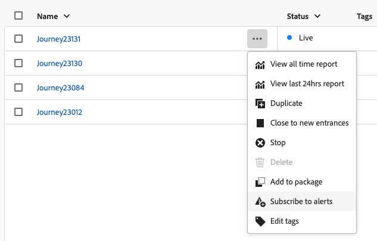

# Acceso y suscripción a alertas del sistema {#alerts}

Al crear sus recorridos y campañas, utilice el botón **Alerts** para comprobar y resolver los errores antes de ejecutarlos o publicarlos.

* Aprenda a solucionar problemas de sus recorridos en [esta página](../building-journeys/troubleshooting.md)

* Aprenda a revisar sus campañas en [esta página](../campaigns/review-activate-campaign.md)

Además de estas, cuando se alcanza un determinado conjunto de condiciones, se pueden enviar mensajes de alerta a cualquier usuario de la organización que se haya suscrito a ellas. Estas alertas están disponibles en el menú **[!UICONTROL Alertas]** dedicado. Adobe Experience Platform proporciona varias reglas de alerta predefinidas que puede habilitar para su organización. Además, puede suscribirse a las alertas del sistema específicas de [!DNL Adobe Journey Optimizer], tal como se detalla en esta página.

>[!NOTE]
>
>Obtenga más información acerca de las alertas en Adobe Experience Platform en [Documentación de Adobe Experience Platform](https://experienceleague.adobe.com/docs/experience-platform/observability/alerts/overview.html?lang=es){target="_blank"}.

En el menú de la izquierda, debajo de **[!UICONTROL Administración]**, haga clic en **[!UICONTROL Alertas]**. Hay varias alertas preconfiguradas para Journey Optimizer disponibles en la pestaña **Examinar**.

* Alertas específicas de los recorridos:

   * la alerta [Error de acción personalizada de Recorrido](#alert-custom-actions)
   * la alerta [Leer Déclencheur de audiencia no se ha realizado correctamente](#alert-read-audiences)
   * la alerta [Tasa de descarte de perfil superada](#alert-discard-rate)
   * la alerta [Tasa de error de acción personalizada superada](#alert-custom-action-error-rate)
   * la alerta [Tasa de error de perfil superada](#alert-profile-error-rate)

* Alertas específicas de la configuración del canal:

   * falta la alerta [AJO Domain DNS record](#alert-dns-record-missing)
   * la alerta [error de configuración de canal de AJO](#alert-channel-config-failure)
     <!--* the [AJO domain certificates renewal unsuccessful](#alert-certificates-renewal) alert-->

## Suscribirse a alertas {#subscribe-alerts}

Si se produce un comportamiento inesperado o se alcanza un determinado conjunto de condiciones en las operaciones (como un problema potencial cuando el sistema incumple un umbral), las notificaciones de alerta se envían a cualquier usuario de la organización que se haya suscrito a ellas.

Puede suscribirse a cada alerta individualmente desde la interfaz de usuario, ya sea globalmente desde el menú **[!UICONTROL Alertas]** (consulte [Suscripción global](#global-subscription)) o unitaria para un recorrido específico (consulte [Suscripción unitaria](#unitary-subscription)).

En función de las preferencias del suscriptor, las alertas se envían por correo electrónico o directamente en el centro de notificaciones de Journey Optimizer, en la esquina superior derecha de la interfaz de usuario (notificaciones en la aplicación). Seleccione cómo desea recibir estas alertas en las [!DNL Adobe Experience Cloud] **[!UICONTROL Preferencias]**. [Más información](../start/user-interface.md#in-product-alerts)

Cuando se resuelve una alerta, los suscriptores reciben una notificación &quot;Resuelto&quot;.

### Suscripción global {#global-subscription}

Para suscribirse o cancelar la suscripción a una alerta para todos los recorridos y campañas, siga estos pasos:

1. Vaya al panel **[!UICONTROL Alertas]** del menú de la izquierda y seleccione la opción **[!UICONTROL Suscribirse]** para la alerta a la que desea suscribirse.

   {width=80%}

   >[!NOTE]
   >
   >La suscripción solo se aplica a una zona protegida específica. Debe suscribirse a las alertas de cada zona protegida individualmente.

1. Use el mismo método para **[!UICONTROL cancelar la suscripción]**.

También puede suscribirse mediante [notificaciones de eventos de E/S](https://experienceleague.adobe.com/docs/experience-platform/observability/alerts/subscribe.html?lang=es){target="_blank"}. Las reglas de alerta se organizan en diferentes paquetes de suscripción. Las suscripciones a eventos correspondientes a las alertas de Journey Optimizer específicas se detallan [debajo de](#journey-alerts).

### Suscripción unitaria {#unitary-subscription}

Para suscribirse o cancelar la suscripción a una alerta de un recorrido específico, siga estos pasos:

1. Vaya al inventario de recorridos y seleccione la opción **[!UICONTROL Suscribirse a alertas]** para un recorrido específico.

   {width=75%}

1. Seleccione las alertas. Las siguientes alertas están disponibles: [Tasa de descarte de perfil superada](#alert-discard-rate), [Tasa de error de acción personalizada superada](#alert-custom-action-error-rate) y [Tasa de error de perfil superada](#alert-profile-error-rate).

1. Para cancelar la suscripción a una alerta, anule su selección en la misma pantalla.

1. Haga clic en **[!UICONTROL Guardar]** para confirmar.

<!--To enable email alerting, refer to [Adobe Experience Platform documentation](https://experienceleague.adobe.com/docs/experience-platform/observability/alerts/ui.html?lang=es#enable-email-alerts){target="_blank"}.-->

## alertas de recorrido {#journey-alerts}

A continuación se enumeran todas las notificaciones de recorrido disponibles en la interfaz de usuario de.

>[!CAUTION]
>
>Las alertas específicas de Adobe Journey Optimizer solo se aplican a **recorridos activos**. Las alertas no se activan para los recorridos en el modo de prueba.

### Error al leer Déclencheur de audiencia {#alert-read-audiences}

Esta alerta le advierte si una actividad **Leer audiencia** no ha procesado ningún perfil 10 minutos después de la hora programada de ejecución. Este error puede deberse a problemas técnicos o a que la audiencia está vacía. Si este error se debe a problemas técnicos, tenga en cuenta que aún pueden producirse reintentos, según el tipo de problema (p. ej.: si la creación del trabajo de exportación ha fallado, lo volveremos a intentar cada 10 minutos durante 1 h como máximo).

Las alertas de las actividades **Leer audiencia** solo se aplican a los recorridos recurrentes. Se omiten las actividades de **Leer audiencia** en recorridos activos que tienen una programación para ejecutarse **Una vez** o **Lo antes posible**.

Las alertas de **Leer audiencia** se resuelven cuando un perfil entra en el nodo **Leer audiencia**.

El nombre de suscripción de evento de E/S correspondiente a la alerta **Leer Déclencheur de audiencias erróneo** es **Recorrido de retrasos, errores y errores de lectura de audiencia**.

Para solucionar problemas de las alertas de **Leer audiencia**, compruebe su recuento de audiencias en la interfaz de Experience Platform.

### Error de acción personalizada de recorrido {#alert-custom-actions}

Esta alerta le advierte si falla una acción personalizada. Consideramos que hay un error en el que ha habido más del 1 % de errores en una acción personalizada específica en los últimos 5 minutos. Esto se evalúa cada 30 segundos.

Haga clic en el nombre de la alerta para comprobar sus detalles y configuración.

<!--
-->

Las alertas de acciones personalizadas se resuelven cuando, en los últimos 5 minutos:

* no se ha producido ningún error en esa acción personalizada (o errores por debajo del umbral del 1 %),

* o bien, ningún perfil ha alcanzado esa acción personalizada.

El nombre de suscripción de evento de E/S correspondiente a la alerta de acción personalizada es **Error de acción personalizada de Recorrido**.

Para solucionar problemas de **alertas de acción personalizada**:

* Comprueba tu acción personalizada usando [modo de prueba](../building-journeys/testing-the-journey.md) en otro recorrido.

* Consulte su [informe de recorridos](../reports/journey-live-report.md) para ver los motivos de error al realizar la acción.

* Compruebe los stepEvents de recorrido para buscar más información sobre &quot;failureReason&quot;.

* Compruebe la configuración de la acción personalizada y compruebe que la autenticación sigue siendo válida. Realice una comprobación manual con Postman, por ejemplo.

### Tasa de descartes de perfil superada {#alert-discard-rate}

Esta alerta le advierte si la proporción de descartes de perfiles respecto a los perfiles introducidos durante los últimos 5 minutos ha superado el umbral. El umbral predeterminado es 20%, pero puede [definir un umbral personalizado](#custom-threshold).

Haga clic en el nombre de la alerta para comprobar sus detalles y configuración.

Existen varias razones por las que se puede descartar un perfil, lo que informará al método de resolución de problemas. A continuación se enumeran algunas razones comunes:

* Perfil descartado en la entrada porque ya está activo en ese recorrido unitario. Para resolver esto, asegúrese de que el perfil tenga tiempo suficiente para salir del recorrido antes de que llegue el siguiente evento para ese perfil.
* La identidad no se define para el perfil o el área de nombres que utiliza el recorrido de audiencia de lectura no se utiliza en ese perfil. Para resolver esto, asegúrese de que el área de nombres de la recorrido coincida con el área de nombres de identidad utilizado por los perfiles.
* Se ha superado la tasa de rendimiento de eventos. Para resolver esto, asegúrese de que los eventos que llegan al sistema no superan estos límites.

### Tasa de errores de acción personalizada superada {#alert-custom-action-error-rate}

Esta alerta le advierte si la proporción de errores de acción personalizada respecto a llamadas HTTP correctas durante los últimos 5 minutos ha superado el umbral. El umbral predeterminado es 20%, pero puede [definir un umbral personalizado](#custom-threshold).

Los errores de acciones personalizadas pueden ocurrir por varios motivos. Para solucionar estos errores, puede:

* Compruebe que la acción personalizada está configurada correctamente
* Compruebe que el extremo sea accesible y que la acción personalizada pueda llegar a él a través del comprobador de conectividad de acción personalizada
* Compruebe las credenciales de autenticación, la conectividad a Internet, etc.

### Tasa de errores de perfil superada {#alert-profile-error-rate}

Esta alerta le advierte si la proporción de errores de acción personalizada respecto a llamadas HTTP correctas durante los últimos 5 minutos ha superado el umbral. El umbral predeterminado es 20%, pero puede [definir un umbral personalizado](#custom-threshold).

Haga clic en el nombre de la alerta para comprobar sus detalles y configuración.

Para solucionar errores de perfil, puede consultar los datos en eventos de paso para comprender dónde y por qué falló el perfil en la recorrido.

## Alertas de configuración {#configuration-alerts}

A continuación, se enumeran las alertas de monitorización de configuración de canal disponibles en la interfaz de usuario.

### Falta el registro DNS del dominio de AJO {#alert-dns-record-missing}

Esta alerta le notifica cuando faltan o no se han configurado correctamente los registros DNS críticos (NS o CNAME) necesarios para la correcta configuración de la entrega. Sin estos registros, la capacidad de envío del correo electrónico puede verse comprometida.

>[!NOTE]
>
>* Los registros NS son esenciales para la delegación completa de subdominios a Adobe. [Más información](../configuration/about-subdomain-delegation.md#full-subdomain-delegation)
>
>* Los registros CNAME admiten la configuración del subdominio CNAME. [Más información](../configuration/about-subdomain-delegation.md#cname-subdomain-setup)

La alerta **Falta el registro DNS del dominio de AJO** cuando el sistema detecta que los registros NS o CNAME necesarios están ausentes o no coinciden con los estándares de configuración.

1. Haga clic en la alerta para que se le dirija al [subdominio](../configuration/delegate-subdomain.md) afectado en la interfaz [!DNL Journey Optimizer].

   <!--For guidance on editing delegated subdomains, see [this section](../configuration/delegate-subdomain.md).-->

1. Corrija la configuración de DNS estableciendo los registros correctamente y [vuelva a enviar la delegación del subdominio](../configuration/delegate-subdomain.md#submit-subdomain).

   >[!NOTE]
   >
   >Asegúrese de que todos los registros se hayan creado correctamente en la solución de alojamiento de dominios antes de continuar.

1. Si no está seguro de los valores correctos, puede crear un nuevo subdominio en [!DNL Journey Optimizer] con el mismo nombre que el subdominio afectado. [Aprenda a configurar un nuevo subdominio](../configuration/delegate-subdomain.md#set-up-subdomain)

Si los cambios no resuelven el problema, la misma alerta se activará de nuevo al día siguiente.

<!--The I/O event subscription name corresponding to this alert is xx. > Do we need to mention this?-->

### Error de configuración de canal de AJO {#alert-channel-config-failure}

>[!IMPORTANT]
>
>Esta alerta solo se aplica a las configuraciones de canal **email** que usan el tipo de delegación [subdominio personalizado](../configuration/delegate-custom-subdomain.md). <!--Other channel types (such as SMS, push, or in-app) are not covered by this alert.-->

Esta alerta se activa en caso de que la auditoría del sistema detecte problemas de configuración de canales de correo electrónico. Estos problemas pueden incluir configuraciones de canal mal configuradas, configuración de DNS no válida, problema de lista de supresión, incoherencia de IP o cualquier otro error que pueda afectar a la entrega de correo electrónico.

Si recibe una alerta de este tipo, los pasos de resolución se enumeran a continuación:

1. Haga clic en la alerta para que se le dirija a la [configuración del canal de correo electrónico](../email/get-started-email-config.md) afectada en la interfaz [!DNL Journey Optimizer].

   Para obtener instrucciones sobre cómo editar configuraciones de canal, consulte [esta sección](../configuration/channel-surfaces.md#edit-channel-surface).

1. Revise los detalles de configuración y los mensajes de error proporcionados. Las razones comunes de error incluyen:

   * Error de validación de SPF
   * Error de validación de DKIM
   * Error de validación de registro MX
   * Registros DNS no válidos

   >[!NOTE]
   >
   >Los posibles motivos del error de configuración se enumeran en [esta sección](../configuration/channel-surfaces.md).

1. Resuelva el problema:

   * Actualice la configuración del canal según sea necesario.
   * Es posible que tenga que corregir problemas específicos de DNS mencionados en la alerta.

   >[!NOTE]
   >
   >Como un solo dominio se puede asociar con varias configuraciones de canal, la resolución de problemas de DNS para una configuración de canal puede corregir automáticamente los problemas relacionados en varias configuraciones.

Si el cambio no resuelve el problema, la misma alerta se activará de nuevo al día siguiente.

Cuando resuelva problemas de configuración de correo electrónico, tenga en cuenta las prácticas recomendadas que se enumeran a continuación:

* Actuar con rapidez: solucione los errores de configuración en cuanto se detecten para evitar interrupciones en la entrega de correos electrónicos.
* Comprobar todas las configuraciones: si la alerta indica varias configuraciones de correo electrónico afectadas, revise y corrija cada una de ellas.

<!--### AJO domain certificates renewal unsuccessful {#alert-certificates-renewal}

This alert warns you if a domain certificate (CDN, tracking URL) renewal failed for a specific Journey Optimizer subdomain.-->

## Administración de alertas {#manage-alerts}

### Editar una alerta

Puede comprobar los detalles de una alerta haciendo clic en su línea. Los canales de nombre, estado y notificación se muestran en el panel izquierdo.
Para las alertas de Recorrido, usa el botón **[!UICONTROL Más acciones]** para editarlas. A continuación, puede definir un [umbral personalizado](#custom-threshold) para estas alertas.

{width=60%}

#### Definición de un umbral personalizado {#custom-threshold}

Puede establecer umbrales para [Recorrido alerts](#journey-alerts). El umbral de alertas por encima del valor predeterminado es del 20 %.

Para cambiar el umbral:

1. Vaya a la pantalla **Alertas**
1. Haga clic en el botón **[!UICONTROL Más acciones]** de la alerta para actualizar
1. Introduzca el nuevo umbral y confirme. El nuevo umbral se aplica a **todos** los recorridos

{width=60%}

>[!CAUTION]
>
>Los niveles de umbral son globales en todos los recorridos y no se pueden modificar individualmente por recorrido.

### Desactivación de una alerta

De forma predeterminada, todas las alertas están habilitadas. Para deshabilitar una alerta, seleccione la opción **[!UICONTROL Deshabilitar alerta]**: todos los suscriptores de esta alerta dejarán de recibir las notificaciones relacionadas.

### Estados de alerta

Los posibles estados de alerta se enumeran a continuación:

* **[!UICONTROL Habilitada]**: la alerta está habilitada y actualmente supervisa la condición de déclencheur.
* **[!UICONTROL Deshabilitada]**: la alerta está deshabilitada y actualmente no supervisa la condición de déclencheur. No recibirá notificaciones para esta alerta.
* **[!UICONTROL Activada]**: actualmente se cumple la condición de déclencheur de la alerta.

### Ver y actualizar suscriptores {#manage-subscribers}

Seleccione **[!UICONTROL Administrar suscriptores de alertas]** para ver la lista de usuarios que se suscribieron a la alerta.

{width=80%}

Para agregar a más suscriptores, escribe su correo electrónico separados por una coma y selecciona **[!UICONTROL Actualizar]**.

Para quitar suscriptores, elimina su dirección de correo electrónico de los suscriptores actuales y selecciona **[!UICONTROL Actualizar]**.

## Recursos adicionales {#additional-resources-alerts}

* Aprenda a solucionar problemas de sus recorridos en [esta página](../building-journeys/troubleshooting.md).
* Aprenda a revisar sus campañas en [esta página](../campaigns/review-activate-campaign.md).