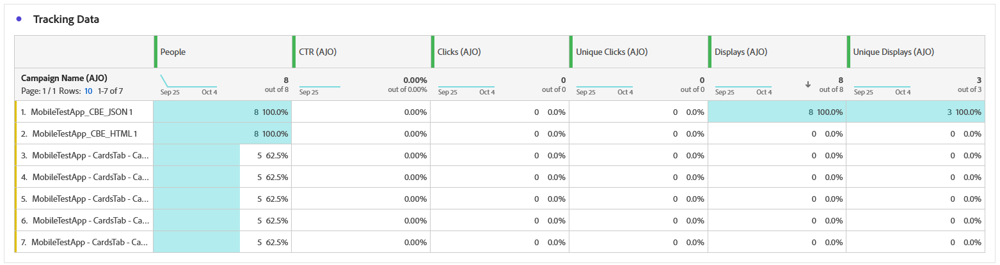
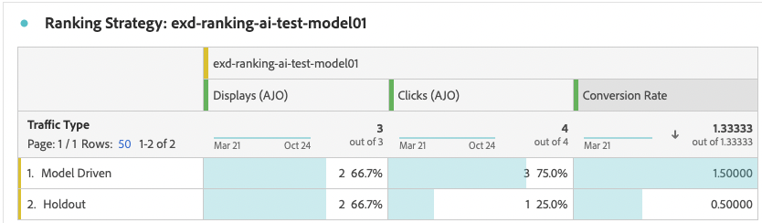

# Informe de campaña basado en código {#campaign-global-report-cja-code}

>[!BEGINSHADEBOX]

Puede acceder a su informe de campaña basado en código haciendo clic en el botón **[!UICONTROL Informes]** de su campaña y seleccionando **[!UICONTROL Ver informe de todo el tiempo]**. [Más información](report-gs-cja.md)

>[!ENDSHADEBOX]

## Mostrar y hacer clic {#impressions-code}

Los gráficos **[!UICONTROL Display &amp; Click]** presentan un análisis detallado de la participación de sus perfiles con sus experiencias basadas en código, lo que ofrece información valiosa sobre cómo los perfiles interactúan con su contenido.

+++ Más información sobre las métricas de impresión y clics

* **[!UICONTROL Clics únicos]**: Número de perfiles que hicieron clic en un contenido de sus experiencias.

* **[!UICONTROL Clics]**: Número de veces que se hizo clic en un contenido en sus experiencias.

* **[!UICONTROL Pantallas]**: Número de veces que se abrió la experiencia.

* **[!UICONTROL Visualizaciones únicas]**: Número de veces que se abrió la experiencia, no se tienen en cuenta las interacciones múltiples de un perfil.

+++

## Datos de seguimiento {#track-data-code}

La tabla **[!UICONTROL Datos de seguimiento]** ofrece una instantánea detallada de la actividad del perfil vinculada a sus experiencias basadas en código, lo que proporciona información esencial sobre la participación y la eficacia de las experiencias.

+++ Más información sobre el Seguimiento de métricas de datos

* **[!UICONTROL Personas]**: Número de perfiles de usuario que se califican como perfiles de destino para sus experiencias.

* **[!UICONTROL Tasa de clics (CTR)]**: Porcentaje de usuarios que interactuaron con sus experiencias.

* **[!UICONTROL Clics]**: Número de veces que se hizo clic en un contenido en sus experiencias.

* **[!UICONTROL Clics únicos]**: Número de perfiles que hicieron clic en un contenido de sus experiencias.

* **[!UICONTROL Pantallas]**: Número de veces que se abrió su experiencia.

* **[!UICONTROL Visualizaciones únicas]**: Número de veces que se abrió su experiencia, no se tienen en cuenta las interacciones múltiples de un perfil.

+++

## Etiquetas de vínculos rastreados {#track-link-code}

La tabla **[!UICONTROL Etiquetas de vínculos rastreados]** ofrece una descripción general completa de las etiquetas de vínculos dentro de las experiencias basadas en código, destacando las que generan el mayor tráfico de visitantes. Esta función le permite identificar y priorizar los vínculos más populares.

+++ Obtenga más información acerca de las métricas de etiquetas de vínculos rastreados

* **[!UICONTROL Clics únicos]**: Número de perfiles que hicieron clic en un contenido de sus experiencias basadas en código.

* **[!UICONTROL Clics]**: Número de veces que se hizo clic en un contenido en sus experiencias basadas en código.

* **[!UICONTROL Pantallas]**: Número de veces que se abrió la experiencia.

* **[!UICONTROL Visualizaciones únicas]**: Número de veces que se abrió la experiencia, no se tienen en cuenta las interacciones múltiples de un perfil.

+++

## Informes de decisiones {#decisioning-reporting}

### KPI de decisión {#decisioning-kpis}

Los KPI de **toma de decisiones** proporcionan información clave sobre la participación de los visitantes en sus experiencias, incluidas métricas como las siguientes:

* **[!UICONTROL Elementos totales]**: número total de elementos individuales que formaban parte de una experiencia personalizada o de un proceso de toma de decisiones dentro de un período especificado.

* **[!UICONTROL Total de visualizaciones]**:

* **[!UICONTROL Clics totales]**: número total de veces que los usuarios hicieron clic en elementos, vínculos, productos u otros elementos interactivos durante un período de tiempo especificado.

* **[!UICONTROL Tasa de reserva]**: porcentaje de instancias en las que no se calificó ninguna estrategia de selección, lo que da como resultado la visualización de una opción genérica o menos específica.

### Canal de participación {#engagement-funnel}

La tabla **[!UICONTROL Canal de participación]** supervisa el rendimiento de las experiencias personalizadas mediante la evaluación de la eficacia con que cada fase del canal impulsa las interacciones del usuario.

* **[!UICONTROL Pantallas]**: número total de veces que se mostraron o presentaron experiencias personalizadas a los usuarios en varios puntos de contacto.

* **[!UICONTROL Clics]**: número total de veces que los usuarios hicieron clic en experiencias personalizadas que se les mostraron.

### Elementos de decisión principales por tasa de clics {#top-decision}

La tabla **[!UICONTROL Elementos de decisión principales por CTR]** resalta el rendimiento de los elementos individuales en función de su tasa de clics. Esta métrica ayuda a evaluar qué elementos son más efectivos para atraer usuarios e impulsar interacciones.

* **[!UICONTROL Tasa de clics (CTR)]**: porcentaje de usuarios que hacen clic en un vínculo, un anuncio o una recomendación en comparación con el número de veces que se mostraron.

### Canal de participación por estrategia de selección {#engagement-funnel-selection}

La tabla **[!UICONTROL Embudo de participación por estrategia de selección]** le ayuda a supervisar y analizar la eficacia con que las distintas estrategias de selección atraen a usuarios con experiencias personalizadas.

* **[!UICONTROL Pantallas]**: número total de veces que se mostraron o presentaron experiencias personalizadas a los usuarios en varios puntos de contacto.

* **[!UICONTROL Clics]**: número total de veces que los usuarios hicieron clic en experiencias personalizadas que se les mostraron.

### Rendimiento de elementos de decisión {#decision-items-performance}

La tabla **[!UICONTROL Rendimiento de elementos de decisión]** evalúa el rendimiento de cada elemento para atraer usuarios e impulsar acciones deseadas, como compras, clics u otras respuestas.

* **[!UICONTROL Pantallas]**: número total de veces que se mostraron o presentaron experiencias personalizadas a los usuarios en varios puntos de contacto.

* **[!UICONTROL Clics]**: número total de veces que los usuarios hicieron clic en experiencias personalizadas que se les mostraron.

### Estrategia de clasificación {#ranking-strategy}

>[!NOTE]
>
>La tabla **[!UICONTROL Estrategia de clasificación]** solo estará disponible cuando se incorpore un [modelo de IA](../experience-decisioning/ranking/ai-models.md) a la campaña. <!--[Learn more](../experience-decisioning/ranking/ranking-formulas.md)-->

La tabla **[!UICONTROL Estrategia de clasificación]** proporciona perspectivas sobre el rendimiento de los modelos de clasificación impulsados por IA dentro de experiencias personalizadas que comparan dos tipos de tráfico:

* **Impulsado por modelo**: los usuarios reciben contenido clasificado por el modelo de IA, optimizado para relevancia y participación.

* **Holdout**: los usuarios reciben contenido servido aleatoriamente durante la fase de exploración del modelo.

Las métricas clave mostradas incluyen:

* **[!UICONTROL Pantallas]**: número total de veces que se mostraron o presentaron experiencias personalizadas a los usuarios en varios puntos de contacto.

* **[!UICONTROL Clics]**: número total de veces que los usuarios hicieron clic en experiencias personalizadas que se les mostraron.

* **[!UICONTROL Tasa de conversión]**: porcentaje de visualizaciones que dieron como resultado acciones del usuario (por ejemplo, clics), que indican el éxito del modelo en la participación de usuarios.

>[!NOTE]
>
>Actualmente, el informe [Medición de alza](../experience-decisioning/ranking/auto-optimization-model.md#lift) solo está disponible para el modelo de IA de [Optimización personalizada](../experience-decisioning/ranking/personalized-optimization-model.md). Si necesita informes de medición de alza, utilice el modelo de optimización personalizada en su lugar.

### Tasa de conversión para tráfico Holdout y conducido por modelo {#conversion-rate}

>[!NOTE]
>
>El gráfico **[!UICONTROL Tasa de conversión para tráfico controlado por modelo y en espera]** solo estará disponible cuando se incorpore un [modelo de IA](../experience-decisioning/ranking/ai-models.md) a la campaña. <!--[Learn more](../experience-decisioning/ranking/ranking-formulas.md)-->

El gráfico **[!UICONTROL Tasa de conversión para tráfico controlado por modelo y en espera]** muestra la tasa de conversión a lo largo del tiempo para dos tipos de tráfico:

* **Impulsado por modelo**: los usuarios reciben contenido clasificado por el modelo de IA, optimizado para relevancia y participación.

* **Holdout**: los usuarios reciben contenido servido aleatoriamente durante la fase de exploración del modelo.

>[!CAUTION]
>
>Cuando se usa un modelo de IA incorporado en una [fórmula de clasificación](../experience-decisioning/ranking/ranking-formulas.md), los datos no se reflejan en el informe de tasa de conversión.
