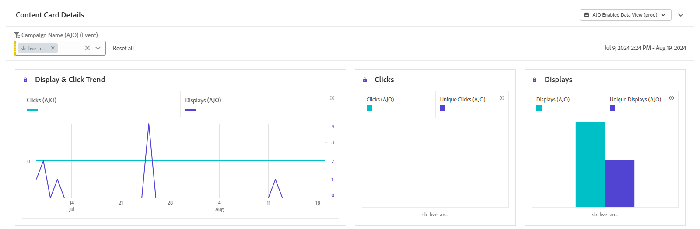

# Informe de campaña de tarjeta de contenido {#campaign-global-report-cja-content}

>[!BEGINSHADEBOX]

Puede acceder a su informe de campaña de la tarjeta de contenido haciendo clic en el botón **[!UICONTROL Informes]** de su campaña y después seleccionando **[!UICONTROL Ver informe de todo el tiempo]**. [Más información](report-gs-cja.md)

>[!ENDSHADEBOX]

## Tendencia de visualización y clics {#display-click}

Los gráficos de **[!UICONTROL tendencias de visualización y clics]** le ayudan a comprender el alcance general del mensaje y la cantidad de perfiles únicos que interactúan con él.

+++ Más información sobre las métricas de visualización y clics

* **[!UICONTROL Clics]**: Número de veces que se hizo clic en un contenido en la tarjeta de contenido.

* **[!UICONTROL Pantallas]**: Número de veces que se abrió el mensaje.

* **[!UICONTROL Visualizaciones únicas]**: Número de veces que se abrió el mensaje, no se tienen en cuenta las interacciones múltiples de un perfil.

+++

## Datos de seguimiento {#tracking-data}

La tabla **[!UICONTROL Datos de seguimiento]** ofrece una instantánea detallada de la actividad del perfil vinculada a sus tarjetas de contenido, lo que proporciona información esencial sobre la participación y la eficacia de las tarjetas de contenido.

+++ Más información sobre el Seguimiento de métricas de datos

* **[!UICONTROL Personas]**: Número de perfiles de usuario que se califican como perfiles de destino para sus tarjetas de contenido.

* **[!UICONTROL Tasa de clics (CTR)]**: porcentaje de usuarios que interactuaron con la tarjeta de contenido.

* **[!UICONTROL Clics]**: Número de veces que se hizo clic en un contenido de su tarjeta de contenido.

* **[!UICONTROL Clics únicos]**: Número de perfiles que hicieron clic en un contenido de su tarjeta de contenido.

* **[!UICONTROL Pantallas]**: Número de veces que se abrió el mensaje.

* **[!UICONTROL Visualizaciones únicas]**: Número de veces que se abrió el mensaje, no se tienen en cuenta las interacciones múltiples de un perfil.

+++

## Etiquetas rastreadas {#tracked-labels}

La tabla **[!UICONTROL Etiquetas rastreadas]** ofrece una visión general de las etiquetas de vínculo dentro de las tarjetas de contenido, destacando las que generan el mayor tráfico de visitantes. Esta función le permite identificar y priorizar los vínculos más populares.

+++ Más información sobre las Métricas de etiquetas rastreadas

* **[!UICONTROL Clics únicos]**: Número de perfiles que hicieron clic en un contenido de sus tarjetas de contenido.

* **[!UICONTROL Clics]**: Número de veces que se hizo clic en un contenido en sus tarjetas de contenido.

* **[!UICONTROL Pantallas]**: Número de veces que se abrió el mensaje.

* **[!UICONTROL Visualizaciones únicas]**: Número de veces que se abrió el mensaje, no se tienen en cuenta las interacciones múltiples de un perfil.

+++
