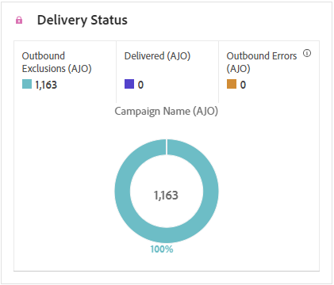

# Informe de campaña de correo directo {#campaign-global-report-cja-direct}

>[!BEGINSHADEBOX]

Puede acceder a su informe de campaña de correo postal haciendo clic en el botón **[!UICONTROL Informes]** de su campaña y después seleccionando **[!UICONTROL Ver informe de todo el tiempo]**. [Más información](report-gs-cja.md)

>[!ENDSHADEBOX]

## Estadísticas de envío {#sending-statistics-directmail}

La tabla **[!UICONTROL Estadísticas de envío]** proporciona un resumen completo de los datos esenciales relacionados con sus campañas de correo postal. Detalla métricas clave como el tamaño de la audiencia objetivo y la cantidad de correo postal entregado correctamente, lo que ofrece valiosas perspectivas sobre la eficacia y el alcance de sus mensajes de correo postal.

+++ Más información sobre el envío de métricas de estadísticas

* **[!UICONTROL Personas]**: Número de perfiles de usuario que se califican como perfiles de destino para sus mensajes.

* **[!UICONTROL Destinatarios]**: Número total de mensajes de correo postal procesados durante el proceso de envío.

* **[!UICONTROL Envíos]**: Número total de envíos para sus mensajes de correo postal.

* **[!UICONTROL Entregado]**: número de mensajes de correo directo enviados correctamente en relación con el número total de mensajes enviados.

* **[!UICONTROL Errores salientes]**: Número total de errores que se produjeron durante el proceso de envío para evitar que se enviara a los perfiles.

* **[!UICONTROL Exclusiones salientes]**: número de perfiles que han sido excluidos por Adobe Journey Optimizer.

+++

## Estado del envío {#delivery-status-directmail}

El gráfico **[!UICONTROL Estado de entrega]** proporciona una vista completa de los datos relacionados con los mensajes de correo postal enviados en su campaña, y ofrece detalles sobre métricas clave como errores y envíos. Esto permite un análisis detallado del proceso de envío de mensajes de correo postal, lo que proporciona información valiosa sobre la eficacia y el rendimiento de sus campañas.

+++ Más información sobre las Métricas de estado de entrega

* **[!UICONTROL Entregado]**: número de mensajes de correo postal enviados correctamente en relación con el número total de mensajes de correo postal enviados.

* **[!UICONTROL Errores salientes]**: Número total de errores que se produjeron durante un proceso de envío que impidió que los mensajes de correo postal se enviaran a los perfiles.

* **[!UICONTROL Exclusiones salientes]**: número de perfiles que han sido excluidos por Adobe Journey Optimizer.

+++

## Motivos de error {#error-reasons-directmail}

La tabla **[!UICONTROL Motivos del error]** le permite identificar los errores específicos que se produjeron durante el proceso de envío de los mensajes de correo postal, lo que facilita un análisis exhaustivo de los problemas encontrados.

## Motivos excluidos {#exclude-reasons-directmail}

La tabla **[!UICONTROL Razones de exclusión]** muestra visualmente los diversos factores que llevaron a la exclusión de perfiles de usuarios de la audiencia de destino, lo que les impidió recibir sus mensajes de correo postal.

Consulte [esta página](exclusion-list.md) para obtener una lista completa de motivos de exclusión.
