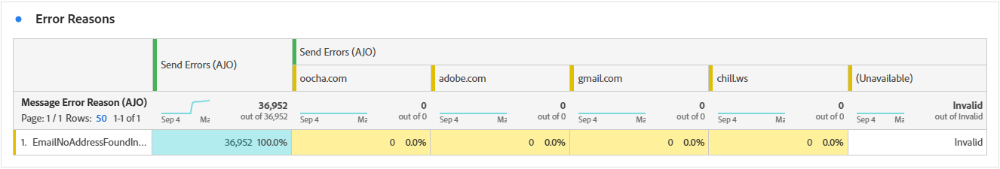

# Informe de campaña de correo electrónico {#campaign-global-report-cja-email}

>[!INFO]
>
>Desde que Apple introdujo nuevas funciones de protección de la privacidad para su aplicación de correo nativa, incluida la protección de privacidad de correo, los remitentes ya no pueden utilizar píxeles de seguimiento para recopilar datos en perfiles que hayan habilitado la protección de privacidad de correo de Apple. Por lo tanto, la capacidad de Adobe Journey Optimizer para rastrear las aperturas de correo electrónico mediante los píxeles de seguimiento puede verse afectada.
> [Más información](https://experienceleaguecommunities.adobe.com/t5/adobe-campaign-classic-blogs/the-impact-of-apple-ios-privacy-changes-on-email-marketing-and/ba-p/699780) sobre el impacto de los cambios de privacidad de Apple iOS en el marketing por correo electrónico.
> 
> Recomendamos centrarse en los clics y las métricas de conversión en lugar de en las tasas de apertura para obtener perspectivas más precisas.

>[!BEGINSHADEBOX]

Puede acceder a su informe de campaña de correo electrónico haciendo clic en el botón **[!UICONTROL Informes]** de su campaña y seleccionando **[!UICONTROL Ver informe de todo el tiempo]**. [Más información](report-gs-cja.md)

>[!ENDSHADEBOX]

## KPI de correo electrónico

Los indicadores clave de rendimiento (KPI) **[!UICONTROL Correo electrónico]** proporcionan un panel centrado de métricas únicas y agregadas que reflejan el rendimiento y los niveles de participación de sus campañas de correo electrónico.

+++ Más información acerca de las métricas de KPI de correo electrónico

* **[!UICONTROL Tasa de clics únicos]**: Porcentaje de perfiles únicos que hicieron clic en al menos un vínculo del correo electrónico, en relación con la cantidad de correos electrónicos enviados únicos.

* **[!UICONTROL Tasa de clics abiertos (CTOR)]**: porcentaje de perfiles que interactuaron con el mensaje.

* **[!UICONTROL Tasa de apertura única]**: Porcentaje de perfiles únicos que abrieron el correo electrónico al menos una vez, en relación con la cantidad de correos electrónicos enviados únicos.

* **[!UICONTROL Tasa de salida hacia otro sitio única]**: Porcentaje de perfiles únicos cuyo correo electrónico se rebotó al menos una vez, según el número total de envíos únicos.

* **[!UICONTROL Entregado]**: número de correos electrónicos enviados correctamente en relación con el número total de mensajes enviados.

* **[!UICONTROL Único entregado]**: Número de perfiles únicos que recibieron correctamente al menos un mensaje.

* **[!UICONTROL Aperturas estimadas]**: Estimación del total de aperturas por correo electrónico que contabilizan tanto las aperturas directas por perfiles como las aperturas automatizadas activadas por servidores de correo. Esta métrica ajusta las aperturas activadas por los servidores de correo para el análisis de privacidad o seguridad aplicando una tasa de apertura calculada a partir de los destinatarios que abrieron manualmente el correo electrónico a aquellos cuyos correos electrónicos solo abrieron los servidores de correo.

* **[!UICONTROL Aperturas estimadas únicas]**: estimación del número de destinatarios de correo electrónico únicos que probablemente abrieron el correo electrónico. Esta métrica tiene como objetivo proporcionar un recuento más preciso de la participación individual activada por los servidores de correo para el análisis de privacidad o seguridad mediante la aplicación de una tasa de apertura única calculada a partir de perfiles únicos que abrieron manualmente el correo electrónico a aquellos cuyos correos electrónicos solo los abrieron los servidores de correo.

* **[!UICONTROL Clics]**: Número total de veces que se hizo clic en cualquier vínculo del mensaje, incluidos varios clics realizados por el mismo perfil.

* **[!UICONTROL Clics únicos]**: Número de perfiles únicos que hicieron clic en un contenido del mensaje.

+++

## Canal de clic único

El gráfico de **[!UICONTROL Clic en canal]** presenta un análisis detallado de cómo los perfiles interactúan con el contenido del correo electrónico, lo que ofrece información valiosa sobre cada fase de interacción, desde la entrega hasta los clics, lo que le ayuda a comprender la eficacia con que sus mensajes impulsan la participación del usuario.

+++ Más información sobre las Métricas de canal de clics

* **[!UICONTROL Únicos segmentados]**: Número de perfiles únicos segmentados durante el proceso de envío.

* **[!UICONTROL Envíos únicos]**: Número de perfiles únicos para los que se intentó enviar al menos un correo electrónico.

* **[!UICONTROL Único entregado]**: Número de perfiles únicos que recibieron correctamente al menos un mensaje.

* **[!UICONTROL Aperturas estimadas únicas]**: estimación del número de destinatarios de correo electrónico únicos que probablemente abrieron el correo electrónico. Esta métrica tiene como objetivo proporcionar un recuento más preciso de la participación individual activada por los servidores de correo para el análisis de privacidad o seguridad mediante la aplicación de una tasa de apertura única calculada a partir de perfiles únicos que abrieron manualmente el correo electrónico a aquellos cuyos correos electrónicos solo los abrieron los servidores de correo.

* **[!UICONTROL Clics únicos]**: Número de perfiles únicos que hicieron clic en un contenido del mensaje.

+++

## Estado de envío único

El gráfico **[!UICONTROL Estado de entrega]** proporciona una vista completa de los datos relacionados con los correos electrónicos enviados en la campaña, y ofrece detalles sobre métricas clave como envíos y devoluciones. Esto permite un análisis detallado del proceso de envío de correo electrónico, lo que proporciona información valiosa sobre la eficacia y el rendimiento de las campañas.

+++ Más información sobre las Métricas de estado de entrega

* **[!UICONTROL Errores de envío únicos]**: Número de perfiles únicos que experimentaron al menos un error de envío durante el proceso saliente.

* **[!UICONTROL Único entregado]**: Número de perfiles únicos que recibieron correctamente al menos un mensaje.

* **[!UICONTROL Exclusiones de envío únicas]**: número de perfiles únicos excluidos de la recepción de mensajes debido a reglas predefinidas o criterios de audiencia.

* **[!UICONTROL Rechazos únicos]**: Número de perfiles únicos para los que al menos un mensaje se rebotó durante el proceso de envío.

+++

## Tendencia de envíos frente a clics {#delivered-click}

El gráfico **[!UICONTROL Tendencia de entrega frente a clic]** presenta un análisis detallado de la participación de sus perfiles con sus correos electrónicos, lo que ofrece información valiosa sobre cómo los perfiles interactúan con su contenido. El gráfico utiliza dos ejes para mostrar los correos electrónicos enviados y los clics uno al lado del otro, lo que facilita la detección de patrones o cambios inusuales en la participación en comparación con la cantidad de correos electrónicos enviados.

+++ Más información sobre las métricas de tendencias de Entrega frente a Clic

* **[!UICONTROL Entregado]**: Número de correos electrónicos enviados correctamente, en relación con el número total de correos electrónicos enviados.

* **[!UICONTROL Clics]**: Número de veces que se hizo clic en un contenido en sus correos electrónicos.

+++

## Estadísticas de envío únicas {#unique-sending-statistics-email}

La tabla **[!UICONTROL Estadísticas de envío únicas]** presenta una descripción detallada de las métricas de rendimiento de correo electrónico únicas en sus campañas. Se centra en perfiles individuales, como los que se han dirigido, entregado, rechazado o excluido de forma exclusiva, lo que proporciona una perspectiva más profunda de cómo los correos electrónicos llegan a la audiencia y entran en contacto con ella.

+++ Más información sobre las métricas de Estadísticas de envío únicas

* **[!UICONTROL Únicos segmentados]**: Número de perfiles únicos segmentados durante el proceso de envío.

* **[!UICONTROL Envíos únicos]**: Número de perfiles únicos para los que se intentó enviar al menos un correo electrónico.

* **[!UICONTROL Entrega única]**: Número de perfiles únicos que recibieron correctamente al menos un correo electrónico.

* **[!UICONTROL devoluciones únicas]**: número de perfiles únicos para los que al menos un correo electrónico resultó en una devolución.

* **[!UICONTROL Tasa de salida hacia otro sitio única]**: Porcentaje de perfiles únicos cuyo correo electrónico se rebotó al menos una vez, según el número total de envíos únicos.

* **[!UICONTROL Errores de envío únicos]**: Número de perfiles únicos que encontraron al menos un error de envío durante el proceso saliente.

* **[!UICONTROL Exclusiones de envío únicas]**: número de perfiles únicos excluidos de la recepción de mensajes debido a reglas de elegibilidad, segmentación de audiencia o estado del perfil.

+++

## Estadísticas de seguimiento únicas {#unique-tracking-statistics-email}

La tabla **[!UICONTROL Estadísticas de seguimiento únicas]** proporciona una vista enfocada de la participación a nivel de perfil con los correos electrónicos de la campaña. Destaca métricas únicas que ofrecen perspectivas valiosas sobre cómo los perfiles individuales interactúan con el contenido del correo electrónico en las fases clave de la participación.

+++ Más información sobre las Métricas de estadísticas de seguimiento

* **[!UICONTROL Tasa de clics únicos (CTR)]**: Porcentaje de perfiles únicos que hicieron clic en al menos un vínculo del correo electrónico, en relación con la cantidad de correos electrónicos enviados únicos.

* **[!UICONTROL Tasa de clics únicos (CTOR)]**: Porcentaje de perfiles únicos que hicieron clic en un vínculo después de abrir el correo electrónico, según las aperturas únicas.

* **[!UICONTROL Tasa de apertura única]**: Porcentaje de perfiles únicos que abrieron el correo electrónico al menos una vez, en relación con la cantidad de correos electrónicos enviados únicos.

* **[!UICONTROL Clics únicos]**: Número de perfiles únicos que hicieron clic en al menos un fragmento de contenido del correo electrónico.

* **[!UICONTROL Aperturas estimadas únicas de correo electrónico]**: estimación del número de destinatarios de correo electrónico únicos que probablemente abrieron el correo electrónico. Esta métrica tiene como objetivo proporcionar un recuento más preciso de la participación individual activada por los servidores de correo para el análisis de privacidad o seguridad mediante la aplicación de una tasa de apertura única calculada a partir de perfiles únicos que abrieron manualmente el correo electrónico a aquellos cuyos correos electrónicos solo los abrieron los servidores de correo.

* **[!UICONTROL Cancelaciones de suscripción de correo electrónico único]**: número de perfiles únicos que hicieron clic en el vínculo de cancelación de suscripción en sus correos electrónicos o en la página de aterrizaje asociada.

+++

## Estadísticas de envío {#sending-statistics-email}

La tabla **[!UICONTROL Estadísticas de envío]** proporciona un resumen completo de los datos esenciales relacionados con los correos electrónicos de sus campañas. Detalla métricas clave como las interacciones con los correos electrónicos y la cantidad de correos electrónicos enviados correctamente, lo que ofrece perspectivas valiosas sobre la eficacia y el alcance de los correos electrónicos y las campañas.

+++ Más información sobre el envío de métricas de estadísticas

* **[!UICONTROL Destinatarios]**: Número total de correos electrónicos procesados durante el proceso de envío.

* **[!UICONTROL Envíos]**: Número total de envíos del correo electrónico.

* **[!UICONTROL Entregado]**: Número total de correos electrónicos enviados correctamente, en relación con el número total de mensajes enviados.

* **[!UICONTROL Devoluciones]**: Total de errores acumulados durante el proceso de envío y el procesamiento automático de devoluciones en relación con el número total de mensajes enviados.

* **[!UICONTROL Tasa de salida hacia otro sitio]**: Porcentaje de correos electrónicos que tuvieron como resultado una salida hacia otro sitio, en relación con la cantidad total de correos electrónicos enviados.

* **[!UICONTROL Errores de envío]**: Número total de errores que se produjeron durante el proceso de envío para evitar que se enviara a los perfiles.

* **[!UICONTROL Enviar exclusiones]**: Número total de perfiles que Adobe Journey Optimizer ha excluido.

+++

## Estadísticas de seguimiento {#tracking-statistics-email}

La tabla **[!UICONTROL Correo electrónico: estadísticas de seguimiento]** ofrece una cuenta detallada de la actividad del perfil relacionada con los correos electrónicos incluidos en la campaña. Esto incluye métricas sobre aperturas, clics y otros indicadores de participación relevantes, lo que ofrece una vista completa de cómo los perfiles interactúan con el contenido del correo electrónico.

+++ Más información sobre las Métricas de estadísticas de seguimiento

* **[!UICONTROL Tasa de clics (CTR)]**: porcentaje de usuarios que interactuaron con el correo electrónico.

* **[!UICONTROL Tasa de apertura de clics (CTOR)]**: Número de veces que se abrió el correo electrónico.

* **[!UICONTROL Aperturas estimadas por correo electrónico]**: Estimación del total de aperturas por correo electrónico que corresponden tanto a aperturas directas por perfiles como a aperturas automatizadas activadas por servidores de correo. Esta métrica ajusta las aperturas activadas por los servidores de correo para el análisis de privacidad o seguridad aplicando una tasa de apertura calculada a partir de los destinatarios que abrieron manualmente el correo electrónico a aquellos cuyos correos electrónicos solo abrieron los servidores de correo.

* **[!UICONTROL Clics]**: Número de veces que se hizo clic en un contenido en sus correos electrónicos.

* **[!UICONTROL Quejas por correo no deseado]**: Número de veces que un mensaje se declaró como correo no deseado.

* **[!UICONTROL Cancelaciones de suscripción]**: número de clics en el vínculo de cancelación de suscripción o en la página de aterrizaje asociada.

+++

## Dominios de correo electrónico {#email-domains}

La tabla **[!UICONTROL Dominios de correo electrónico]** ofrece un desglose detallado de los mensajes de correo electrónico clasificados por dominio, lo que proporciona una amplia perspectiva de las métricas de rendimiento de sus campañas de correo electrónico. Este análisis completo le permite comprender el comportamiento de los distintos dominios en respuesta al contenido del correo electrónico.

+++ Más información sobre las métricas Dominios de correo electrónico

* **[!UICONTROL Entrega única]**: Número de perfiles únicos que recibieron correctamente al menos un correo electrónico.

* **[!UICONTROL Aperturas estimadas por correo electrónico]**: Estimación del total de aperturas por correo electrónico que corresponden tanto a aperturas directas por perfiles como a aperturas automatizadas activadas por servidores de correo. Esta métrica ajusta las aperturas activadas por los servidores de correo para el análisis de privacidad o seguridad aplicando una tasa de apertura calculada a partir de los destinatarios que abrieron manualmente el correo electrónico a aquellos cuyos correos electrónicos solo abrieron los servidores de correo.

* **[!UICONTROL Clics únicos]**: Número de perfiles únicos que hicieron clic en al menos un fragmento de contenido del correo electrónico.

* **[!UICONTROL devoluciones únicas]**: número de perfiles únicos para los que al menos un correo electrónico resultó en una devolución.

* **[!UICONTROL Errores de envío únicos]**: Número de perfiles únicos que encontraron al menos un error de envío durante el proceso saliente.

* **[!UICONTROL Exclusiones de envío únicas]**: número de perfiles únicos excluidos de la recepción de mensajes debido a reglas de elegibilidad, segmentación de audiencia o estado del perfil.

+++

## Etiquetas de vínculos rastreados {#track-link-label}

La tabla **[!UICONTROL Etiquetas de vínculos rastreados]** ofrece una descripción general completa de las etiquetas de vínculos de los mensajes de correo electrónico, en la que se destacan las que generan el mayor tráfico de visitantes. Esta función le permite identificar y priorizar los vínculos más populares.

+++ Obtenga más información acerca de las métricas de etiquetas de vínculos rastreados

* **[!UICONTROL Clics únicos]**: Número de perfiles que hicieron clic en un contenido de un correo electrónico.

* **[!UICONTROL Clics]**: Número de veces que se hizo clic en un contenido en sus correos electrónicos.

+++

## URL de vínculos rastreados {#track-link-url}

La tabla **[!UICONTROL URL de vínculos rastreados]** proporciona una visión general de las direcciones URL del correo electrónico que atraen el tráfico de visitantes más alto. Esto le permite identificar y priorizar los vínculos más populares, lo que mejora su comprensión de la participación del perfil con contenido específico en los correos electrónicos.

+++ Obtenga más información acerca de las métricas de URL de vínculos rastreados

* **[!UICONTROL Clics únicos]**: Número de perfiles que hicieron clic en un contenido de un correo electrónico.

* **[!UICONTROL Clics]**: Número de veces que se hizo clic en un contenido en sus correos electrónicos.

+++

## Asuntos de correo electrónico {#email-subjects}

La tabla **[!UICONTROL Temas de correo electrónico]** presenta una descripción general detallada de los temas de correo electrónico que han atraído el mayor tráfico de visitantes. Este recurso ofrece información valiosa sobre la dinámica de participación de la audiencia.

+++ Más información sobre las métricas de Temas de correo electrónico

* **[!UICONTROL Tasa de apertura única]**: Porcentaje de perfiles únicos que abrieron el correo electrónico al menos una vez, en relación con la cantidad de correos electrónicos enviados únicos.

* **[!UICONTROL Aperturas estimadas únicas de correo electrónico]**: estimación del número de destinatarios de correo electrónico únicos que probablemente abrieron el correo electrónico. Esta métrica tiene como objetivo proporcionar un recuento más preciso de la participación individual activada por los servidores de correo para el análisis de privacidad o seguridad mediante la aplicación de una tasa de apertura única calculada a partir de perfiles únicos que abrieron manualmente el correo electrónico a aquellos cuyos correos electrónicos solo los abrieron los servidores de correo.

* **[!UICONTROL Tasa de apertura]**: porcentaje de aperturas de correo electrónico en relación con la cantidad total de correos electrónicos enviados, incluidas las aperturas múltiples realizadas por el mismo perfil.

* **[!UICONTROL Aperturas estimadas por correo electrónico]**: Estimación del total de aperturas por correo electrónico que corresponden tanto a aperturas directas por perfiles como a aperturas automatizadas activadas por servidores de correo. Esta métrica ajusta las aperturas activadas por los servidores de correo para el análisis de privacidad o seguridad aplicando una tasa de apertura calculada a partir de los destinatarios que abrieron manualmente el correo electrónico a aquellos cuyos correos electrónicos solo abrieron los servidores de correo.

+++

## Motivos excluidos {#excluded-reasons}

La tabla **[!UICONTROL Razones de exclusión]** presenta una vista completa de los diferentes factores que tuvieron como resultado la exclusión de perfiles de usuario de la audiencia de destino, lo que resultó en que el mensaje no se recibiera.

Consulte [esta página](exclusion-list.md) para obtener una lista completa de motivos de exclusión.

## Motivos de rechazo {#bounce-reasons-email}

La tabla **[!UICONTROL Razones de rechazo]** compila los datos disponibles relacionados con los mensajes rechazados, y proporciona información detallada sobre las razones específicas detrás de los rechazos de correo electrónico.

Para obtener más información sobre las devoluciones, consulte la página [Lista de supresión](../reports/suppression-list.md).

## Motivos de error {#error-reasons-email}

La tabla **[!UICONTROL Motivos del error]** ofrece visibilidad de los errores específicos que se produjeron durante el proceso de envío y proporciona información valiosa sobre la naturaleza y la incidencia de los errores.
