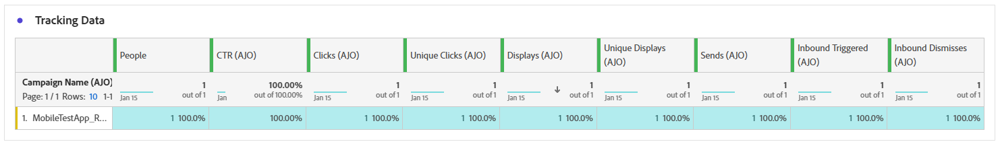

# Informe de campaña in-app {#campaign-global-report-cja-inapp}

>[!IMPORTANT]
>
>Antes de poder informar sobre tus campañas y recorridos en la aplicación, asegúrate de seguir los requisitos previos de informes proporcionados en [esta página](../in-app/inapp-configuration.md#experiment-prerequisites).

>[!BEGINSHADEBOX]

Para acceder al informe de campaña en la aplicación, haga clic en el botón **[!UICONTROL Informes]** de la campaña y, a continuación, seleccione **[!UICONTROL Ver informe de todo el tiempo]**. [Más información](report-gs-cja.md)

>[!ENDSHADEBOX]

## Tendencia de visualización y clics {#impression-click-trend}

El gráfico **[!UICONTROL Tendencia de impresión y clics]** presenta un análisis detallado de la participación de sus perfiles con los mensajes en la aplicación, lo que ofrece información valiosa sobre cómo los perfiles interactúan con el contenido.

+++ Más información sobre las métricas de tendencias de impresión y clics

* **[!UICONTROL Clics]**: Número de veces que se hizo clic en un contenido en los mensajes en la aplicación.

* **[!UICONTROL Pantallas]**: Número de veces que se abrió el mensaje.

+++

## Clics {#clicks-inapp}

El gráfico **[!UICONTROL Clics]** muestra las métricas de clics en la aplicación, ilustrando tanto la cantidad total de clics en el contenido como el número de perfiles únicos que hicieron clic en el contenido.

+++ Más información sobre las métricas de Clics

* **[!UICONTROL Clics únicos]**: Número de perfiles que hicieron clic en un contenido de sus mensajes en la aplicación

* **[!UICONTROL Clics]**: Número de veces que se hizo clic en un contenido en los mensajes en la aplicación.

+++

## Mostrar {#display-inapp}

El gráfico **[!UICONTROL Muestra]** le ayuda a comprender el alcance general del mensaje y la cantidad de perfiles únicos que interactúan con él.

+++ Más información sobre las Métricas de visualización

* **[!UICONTROL Pantallas]**: Número de veces que se abrió el mensaje.

* **[!UICONTROL Visualizaciones únicas]**: Número de veces que se abrió el mensaje, no se tienen en cuenta las interacciones múltiples de un perfil.

+++

## Datos de seguimiento {#tracking-data-inapp}

La tabla **[!UICONTROL Datos de seguimiento]** ofrece una instantánea detallada de la actividad del perfil vinculada a los mensajes en la aplicación, lo que proporciona información esencial sobre la participación y la eficacia de los mensajes en la aplicación.

+++ Más información sobre el Seguimiento de métricas de datos

* **[!UICONTROL Personas]**: Número de perfiles de usuario que cumplen los requisitos como perfiles de destino para los mensajes en la aplicación.

* **[!UICONTROL Tasa de clics (CTR)]**: porcentaje de usuarios que interactuaron con los mensajes en la aplicación.

* **[!UICONTROL Tasa de clics abiertos (CTOR)]**: Número de veces que se abrieron los mensajes en la aplicación.

* **[!UICONTROL Clics]**: Número de veces que se hizo clic en un contenido en los mensajes en la aplicación.

* **[!UICONTROL Clics únicos]**: Número de perfiles que hicieron clic en un contenido de sus mensajes en la aplicación.

* **[!UICONTROL Pantallas]**: Número de veces que se abrió el mensaje.

* **[!UICONTROL Visualizaciones únicas]**: Número de veces que se abrió el mensaje, no se tienen en cuenta las interacciones múltiples de un perfil.

* **[!UICONTROL Envíos]**: Número total de envíos para sus mensajes en la aplicación.

* **[!UICONTROL Activado entrante]**: Número de veces que un mensaje en la aplicación se activó mediante una interacción de usuario o un evento predefinido.

* **[!UICONTROL Descartes entrantes]**: Cantidad de veces que los usuarios descartaron el mensaje en la aplicación sin interactuar con él.

+++

## Etiquetas de vínculos rastreados {#track-link-label-inapp}

La tabla **[!UICONTROL Etiquetas de vínculos rastreados]** ofrece una descripción general completa de las etiquetas de vínculos de los mensajes en la aplicación, en la que se destacan las que generan el mayor tráfico de visitantes. Esta función le permite identificar y priorizar los vínculos más populares.

+++ Obtenga más información acerca de las métricas de etiquetas de vínculos rastreados

* **[!UICONTROL Clics únicos]**: Número de perfiles que hicieron clic en un contenido de sus mensajes en la aplicación.

* **[!UICONTROL Clics]**: Número de veces que se hizo clic en un contenido en los mensajes en la aplicación.

* **[!UICONTROL Pantallas]**: Número de veces que se abrió el mensaje.

* **[!UICONTROL Visualizaciones únicas]**: Número de veces que se abrió el mensaje, no se tienen en cuenta las interacciones múltiples de un perfil.

+++

## URL de vínculos rastreados {#track-link-url-inapp}

La tabla **[!UICONTROL URL de vínculos rastreados]** proporciona una visión general de las URL de los mensajes en la aplicación que atraen el mayor tráfico de visitantes. Esto le permite identificar y priorizar los vínculos más populares, lo que le permite comprender mejor la participación del perfil con contenido específico en los mensajes en la aplicación.

+++ Obtenga más información acerca de las métricas de URL de vínculos rastreados

* **[!UICONTROL Clics únicos]**: Número de perfiles que hicieron clic en un contenido de sus mensajes en la aplicación.

* **[!UICONTROL Clics]**: Número de veces que se hizo clic en un contenido en los mensajes en la aplicación.

+++
