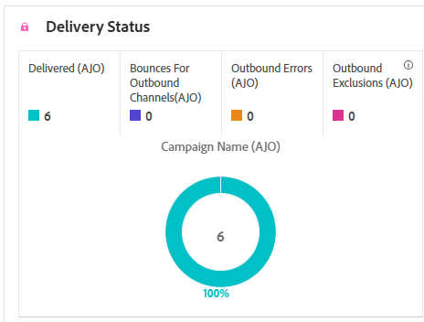

# Informe de campaña de SMS {#campaign-global-report-cja-sms}

>[!BEGINSHADEBOX]

**En esta página:** Aprenda a leer el informe de campaña de SMS en Adobe Journey Optimizer para analizar las tendencias de entrega y clics, el estado de entrega, los vínculos rastreados, los mensajes entrantes y las razones de rechazo, error y exclusión de sus mensajes SMS.

>[!ENDSHADEBOX]

>[!BEGINSHADEBOX]

Puede acceder a su informe de campaña de SMS haciendo clic en el botón **[!UICONTROL Informes]** de su campaña y seleccionando **[!UICONTROL Ver informe de todo el tiempo]**. [Más información](report-gs-cja.md)

>[!ENDSHADEBOX]

## Tendencia de envíos frente a clics {#delivered-click-sms}

El gráfico **[!UICONTROL Tendencia de entrega frente a clic]** presenta un análisis detallado de la participación de sus perfiles con sus correos electrónicos, lo que ofrece información valiosa sobre cómo los perfiles interactúan con su contenido.

+++ Más información sobre las métricas de tendencias de Entrega frente a Clic

* **[!UICONTROL Entregado]**: número de mensajes SMS enviados correctamente en relación con el número total de mensajes SMS.

* **[!UICONTROL Clics]**: Número de veces que se hizo clic en un contenido en sus mensajes SMS.

+++

## Estado del envío {#delivery-status-sms}

La tabla **[!UICONTROL Estado de entrega]** ofrece una cuenta detallada de la actividad de perfil relacionada con sus campañas de SMS. Esto incluye métricas sobre mensajes enviados, clics y otros indicadores de participación relevantes, lo que ofrece una vista completa de cómo los perfiles interactúan con el contenido del SMS.

+++ Más información sobre las Métricas de estado de entrega

* **[!UICONTROL Entregado]**: número de mensajes SMS enviados correctamente en relación con el número total de mensajes SMS.

* **[!UICONTROL Devoluciones]**: Total de errores acumulados durante el proceso de envío y el procesamiento automático de devoluciones en relación con el número total de mensajes SMS enviados.

* **[!UICONTROL Enviar errores]**: Número total de errores que impidieron que se enviara a los perfiles.

* **[!UICONTROL Enviar exclusiones]**: Número de perfiles que han sido excluidos por Adobe Journey Optimizer.

+++

## Información general de Campaign {#campaign-global}

La tabla **[!UICONTROL Información general de campaña]** sirve como un panel para el rendimiento de los SMS en su campaña. Resume los perfiles objetivo, las métricas de clics y clics (incluidos los clics estimados que excluyen el tráfico de interacción tanto humano como no humano) y los resultados de entrega, como devoluciones, errores de envío y exclusiones.

+++ Obtenga más información sobre las métricas de información general de Campaign

* **[!UICONTROL Personas]**: Número de perfiles de usuario que se califican como perfiles de destino para sus mensajes.

* **[!UICONTROL Tasa de clics]**: Porcentaje de usuarios que interactuaron con el mensaje.

* **[!UICONTROL Clics]**: Número de veces que se hizo clic en un contenido del mensaje.

* **[!UICONTROL Clics únicos]**: Número de perfiles únicos que hicieron clic en al menos un fragmento de contenido del mensaje móvil.

* **[!UICONTROL Clics estimados]**: Número de veces que se hizo clic en un contenido en su mensaje, excluido el tráfico de bots identificados y de interacciones no humanas (NHI).

* **[!UICONTROL Entregado]**: número de correos electrónicos enviados correctamente en relación con el número total de mensajes enviados.

* **[!UICONTROL Devoluciones]**: Número total de errores acumulados durante el proceso de envío y procesamiento automático de devoluciones en relación con el número total de mensajes enviados.

* **[!UICONTROL Errores de envío]**: Número total de errores que se produjeron durante el proceso de envío para evitar que se enviara a los perfiles.

* **[!UICONTROL Enviar exclusiones]**: número de perfiles que han sido excluidos por Adobe Journey Optimizer. [Más información sobre cómo se cuentan las exclusiones](exclusion-list.md#exclusion-list).

+++

## Etiquetas rastreadas {#track-label-sms}

La tabla **[!UICONTROL Etiquetas rastreadas]** ofrece una visión general de las etiquetas de vínculo dentro de los mensajes SMS, destacando las que generan el mayor tráfico de visitantes. Esta función le permite identificar y priorizar los vínculos más populares.

+++ Obtenga más información acerca de las métricas de etiquetas de vínculos rastreados

* **[!UICONTROL Clics]**: Número de veces que se hizo clic en un contenido en sus mensajes SMS.

* **[!UICONTROL Clics estimados]**: Número de veces que se hizo clic en un contenido en su mensaje, excluido el tráfico de bots identificados y de interacciones no humanas (NHI).

* **[!UICONTROL Clics únicos]**: Número de perfiles únicos que hicieron clic en al menos un fragmento de contenido del mensaje móvil.

+++

## URL de vínculos rastreados {#track-link-url-sms}

La tabla **[!UICONTROL URL de vínculos rastreados]** proporciona una visión general de las URL de los mensajes SMS que atraen el tráfico de visitantes más alto. Esto le permite identificar y priorizar los vínculos más populares, lo que mejora su comprensión de la participación del perfil con contenido específico en los mensajes SMS.

+++ Obtenga más información acerca de las métricas de URL de vínculos rastreados

* **[!UICONTROL Clics]**: Número de veces que se hizo clic en un contenido en sus mensajes SMS.

* **[!UICONTROL Clics estimados]**: Número de veces que se hizo clic en un contenido en su mensaje, excluido el tráfico de bots identificados y de interacciones no humanas (NHI).

* **[!UICONTROL Clics únicos]**: Número de perfiles únicos que hicieron clic en al menos un fragmento de contenido del mensaje móvil.

* **[!UICONTROL Pantallas]**: Número de veces que se abrió el mensaje.

* **[!UICONTROL Visualizaciones únicas]**: Número de veces que se abrió el mensaje, no se tienen en cuenta las interacciones múltiples de un perfil.

+++

## Mensaje entrante SMS {#sms-inbound}

La tabla **[!UICONTROL mensaje entrante SMS]** presenta una descripción general detallada de los mensajes SMS que han atraído el mayor tráfico de visitantes. Este recurso ofrece información valiosa sobre la dinámica de participación de la audiencia.

+++ Más información sobre las métricas de mensajes entrantes de SMS

* **[!UICONTROL Personas]**: Número de perfiles de usuario que cumplen los requisitos como perfiles de destino para sus mensajes SMS.

+++

## Tipo de mensaje SMS {#sms-message-type}

La tabla **[!UICONTROL Tipo de mensaje SMS]** presenta una descripción general detallada de qué tipo de mensaje SMS ha atraído el tráfico de visitantes más alto. Este recurso ofrece información valiosa sobre la dinámica de participación de la audiencia.

+++ Más información sobre las métricas de tipo Mensaje SMS

* **[!UICONTROL Personas]**: Número de perfiles de usuario que cumplen los requisitos como perfiles de destino para sus mensajes SMS.

+++

## Proveedores de SMS {#sms-providers}

La tabla **[!UICONTROL proveedores de SMS]** presenta una descripción general detallada de los proveedores de SMS que han atraído el tráfico de visitantes más alto. Este recurso ofrece información valiosa sobre la dinámica de participación de la audiencia.

+++ Más información sobre las métricas de proveedores de SMS

* **[!UICONTROL Personas]**: Número de perfiles de usuario que cumplen los requisitos como perfiles de destino para sus mensajes SMS.

+++

## Motivos de rechazo {#bounce-reasons-sms}

La tabla **[!UICONTROL Razones de rechazos]** proporciona una visión general completa de los datos relacionados con los mensajes SMS rechazados, lo que proporciona información valiosa sobre las razones específicas detrás de las instancias de rechazos de mensajes SMS.

## Motivos de error {#error-reasons-sms}

La tabla **[!UICONTROL Motivos del error]** le permite identificar los errores específicos que se produjeron durante el proceso de envío de sus mensajes SMS, lo que facilita un análisis exhaustivo de los problemas encontrados.

## Motivos excluidos {#excluded-reasons-sms}

La tabla **[!UICONTROL Razones de exclusión]** muestra visualmente los diversos factores que llevaron a la exclusión de perfiles de usuarios de la audiencia de destino, lo que les impidió recibir sus mensajes SMS.

Consulte [esta página](exclusion-list.md) para obtener una lista completa de motivos de exclusión.
